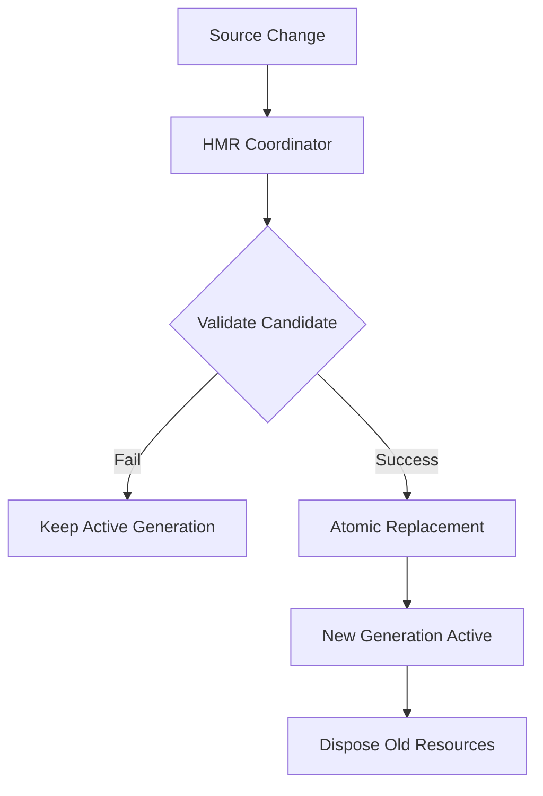
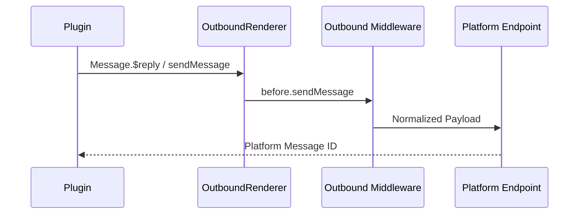

[中文版](/wiki/cubic/plugin-runtime)

::: warning Generated reference snapshot
[Original Cubic page](https://www.cubic.dev/wikis/zhinjs/zhin?page=page-plugin-runtime) · captured 2026-09-23 · [source commit](https://github.com/zhinjs/zhin/commit/368db14caa4aa91311fb090f07bd792fe4b22fe7). This AI-generated page has not been verified against the current code. Use the [Zhin documentation](/en/getting-started/) for current behavior and [see known corrections](/en/wiki/).
:::

::: danger Known correction
Code capabilities use named directories with fixed `index.ts` entries: `commands/**/index.ts` and one-level `handlers/<name>/index.ts`. The file-style examples in the snapshot are not discovered. See [Convention Directories](/en/authoring/conventions).
:::

::: details Relevant source files

The following files were used as context for generating this wiki page:

- [packages/toolkit/create-zhin/template/skills/plugin-develop/SKILL.md](https://github.com/zhinjs/zhin/blob/368db14caa4aa91311fb090f07bd792fe4b22fe7/packages/toolkit/create-zhin/template/skills/plugin-develop/SKILL.md)
- [CLAUDE.md](https://github.com/zhinjs/zhin/blob/368db14caa4aa91311fb090f07bd792fe4b22fe7/CLAUDE.md)
- [AGENTS.md](https://github.com/zhinjs/zhin/blob/368db14caa4aa91311fb090f07bd792fe4b22fe7/AGENTS.md)
- [basic/cli/src/commands/new.ts](https://github.com/zhinjs/zhin/blob/368db14caa4aa91311fb090f07bd792fe4b22fe7/basic/cli/src/commands/new.ts)
- [packages/toolkit/create-zhin/src/workspace.ts](https://github.com/zhinjs/zhin/blob/368db14caa4aa91311fb090f07bd792fe4b22fe7/packages/toolkit/create-zhin/src/workspace.ts)
- [packages/toolkit/create-zhin/template/skills/plugin-quality/SKILL.md](https://github.com/zhinjs/zhin/blob/368db14caa4aa91311fb090f07bd792fe4b22fe7/packages/toolkit/create-zhin/template/skills/plugin-quality/SKILL.md)
- [README.md](https://github.com/zhinjs/zhin/blob/368db14caa4aa91311fb090f07bd792fe4b22fe7/README.md)
- [packages/im/runtime/tests/console-feature-hmr.test.ts](https://github.com/zhinjs/zhin/blob/368db14caa4aa91311fb090f07bd792fe4b22fe7/packages/im/runtime/tests/console-feature-hmr.test.ts)
:::

# Plugin Runtime & Conventions

The Zhin.js Plugin Runtime is the execution environment and structural standard for extending the framework. It enforces a "convention over configuration" approach where capabilities are discovered via specific directory structures rather than imperative registration. The sole entry path for the application is `zhin runtime start`, which assembles the IM core, agents, and console hosts based on these conventions.

Sources: [CLAUDE.md:77-80](https://github.com/zhinjs/zhin/blob/368db14caa4aa91311fb090f07bd792fe4b22fe7/CLAUDE.md#L77-L80), [AGENTS.md:61-66](https://github.com/zhinjs/zhin/blob/368db14caa4aa91311fb090f07bd792fe4b22fe7/AGENTS.md#L61-L66)

## Core Architecture

The runtime operates on a Generation-based system for Hot Module Replacement (HMR). A "Generation" represents a stable snapshot of the plugin tree; when code changes occur, the runtime prepares a new generation off-path and publishes it atomically. If a candidate generation fails validation, the active generation continues to serve traffic.


The HMR process atomically replaces artifacts like Pages and Layouts without restarting the entire system unless required.
Sources: [README.md:126-130](https://github.com/zhinjs/zhin/blob/368db14caa4aa91311fb090f07bd792fe4b22fe7/README.md#L126-L130), [packages/im/runtime/tests/console-feature-hmr.test.ts:31-60](https://github.com/zhinjs/zhin/blob/368db14caa4aa91311fb090f07bd792fe4b22fe7/packages/im/runtime/tests/console-feature-hmr.test.ts#L31-L60)

## Plugin Manifest and Entry

Every plugin must be a valid NPM package containing a `zhin` manifest in its `package.json`. The `plugin.ts` file serves as the assembly point and must default-export a `definePlugin()` definition.

### Manifest Configuration (`package.json`)

| Field | Description | Requirement |
|-------|-------------|-------------|
| `zhin.protocol` | Version of the plugin protocol (currently 1) | Required |
| `zhin.type` | The type of package (`plugin` or `feature`) | Required |
| `zhin.entry` | Path to the entry file (usually `./plugin.ts`) | Required |
| `zhin.features` | List of Feature dependencies required by the plugin | Optional |
| `zhin.plugins` | List of child plugin or adapter instances | Optional |

Sources: [basic/cli/src/commands/new.ts:246-254](https://github.com/zhinjs/zhin/blob/368db14caa4aa91311fb090f07bd792fe4b22fe7/basic/cli/src/commands/new.ts#L246-L254), [packages/toolkit/create-zhin/src/workspace.ts:109-122](https://github.com/zhinjs/zhin/blob/368db14caa4aa91311fb090f07bd792fe4b22fe7/packages/toolkit/create-zhin/src/workspace.ts#L109-L122)

### Entry Point Definition (`plugin.ts`)

The `definePlugin` function initializes the plugin scope. It provides access to the `context`, which includes configuration, resources (Dependency Injection), and the lifecycle manager.

```typescript
import { definePlugin } from 'zhin.js';

export default definePlugin({
  name: 'my-plugin',
  metadata: { displayName: 'My Plugin' },
  setup(context) {
    // Provide resources
    context.resources.provide(myToken, value);
    // Register cleanup
    context.lifecycle.add(() => cleanup());
  },
});
```
Sources: [CLAUDE.md:82-93](https://github.com/zhinjs/zhin/blob/368db14caa4aa91311fb090f07bd792fe4b22fe7/CLAUDE.md#L82-L93), [basic/cli/src/commands/new.ts:333-352](https://github.com/zhinjs/zhin/blob/368db14caa4aa91311fb090f07bd792fe4b22fe7/basic/cli/src/commands/new.ts#L333-L352)

## Convention Directories

Capabilities are automatically discovered if placed in the correct directories within the plugin package. Each file in these directories should define exactly one capability and use a default export.

| Directory | Authoring API | Description |
|-----------|---------------|-------------|
| `commands/` | `defineCommand()` | Chat commands. Paths define the route (e.g., `commands/greet.ts` -> `/greet`). |
| `middlewares/` | `defineMiddleware()` | Request/Message processing pipeline components. |
| `tools/` | `defineAgentTool()` | AI capabilities used by Agents. |
| `components/` | `defineComponent()` | UI or message rendering components (e.g., Satori cards). |
| `pages/` | `definePage()` | Remote Console pages and layouts (`nav/index.tsx`, `footer/index.tsx`). |
| `handlers/` | `defineHandler()` | Event handlers (e.g., `handlers/message/receive.ts`). |
| `skills/` | Markdown (`SKILL.md`) | AI agent workflow and trigger descriptions. |

Sources: [CLAUDE.md:95-108](https://github.com/zhinjs/zhin/blob/368db14caa4aa91311fb090f07bd792fe4b22fe7/CLAUDE.md#L95-L108), [packages/toolkit/create-zhin/template/skills/plugin-develop/SKILL.md:16-25](https://github.com/zhinjs/zhin/blob/368db14caa4aa91311fb090f07bd792fe4b22fe7/packages/toolkit/create-zhin/template/skills/plugin-develop/SKILL.md#L16-L25)

### Command Routing Patterns

Command directories support Next.js-style dynamic segments for parameter parsing:
- `commands/[name]/index.ts`: Defines a required parameter `name`.
- `commands/[[name]]/index.ts`: Defines an optional parameter `name`.
- `commands/[...name]/index.ts`: Catch-all parameter (returns an array).

Sources: [packages/toolkit/create-zhin/template/skills/plugin-develop/SKILL.md:33-36](https://github.com/zhinjs/zhin/blob/368db14caa4aa91311fb090f07bd792fe4b22fe7/packages/toolkit/create-zhin/template/skills/plugin-develop/SKILL.md#L33-L36), [basic/cli/src/commands/new.ts:400-415](https://github.com/zhinjs/zhin/blob/368db14caa4aa91311fb090f07bd792fe4b22fe7/basic/cli/src/commands/new.ts#L400-L415)

## Dependency and Send Chain Governance

The runtime enforces strict boundaries to ensure stability and security.

### Dependency Layers
Lower layers must never import from higher layers. The hierarchy is:
`basic` → `kernel` → `ai` → `core` → `agent` → `zhin`.
The `basic/cli` package is the only exception as the composition root.
Sources: [CLAUDE.md:46-56](https://github.com/zhinjs/zhin/blob/368db14caa4aa91311fb090f07bd792fe4b22fe7/CLAUDE.md#L46-L56), [AGENTS.md:78-83](https://github.com/zhinjs/zhin/blob/368db14caa4aa91311fb090f07bd792fe4b22fe7/AGENTS.md#L78-L83)

### Outbound Send Chain
Plugins must not bypass the standard send chain. All messages must flow through `Message.$reply` or `Adapter.sendMessage`. Direct calls to platform bots or `bot.$sendMessage` are prohibited and flagged by harness checks.


Sources: [CLAUDE.md:67-70](https://github.com/zhinjs/zhin/blob/368db14caa4aa91311fb090f07bd792fe4b22fe7/CLAUDE.md#L67-L70), [AGENTS.md:143-145](https://github.com/zhinjs/zhin/blob/368db14caa4aa91311fb090f07bd792fe4b22fe7/AGENTS.md#L143-L145)

## Development Standards

1.  **ESM Only**: The runtime requires `"type": "module"` and target Node.js ≥20.19.0.
2.  **Import Extensions**: All local TypeScript imports must include the `.js` extension (e.g., `import { foo } from './bar.js'`).
3.  **Legacy API Prohibition**: APIs such as `usePlugin()`, `getPlugin()`, and `bootstrapNode` have been removed. Using them will cause the `PluginScopeAssembler` to throw errors.
4.  **Resource Handling**: Shared resources (databases, connections) must be managed via `context.resources.provide` and `context.resources.use` rather than module-level singletons.

Sources: [CLAUDE.md:27-29](https://github.com/zhinjs/zhin/blob/368db14caa4aa91311fb090f07bd792fe4b22fe7/CLAUDE.md#L27-L29), [CLAUDE.md:110-113](https://github.com/zhinjs/zhin/blob/368db14caa4aa91311fb090f07bd792fe4b22fe7/CLAUDE.md#L110-L113), [packages/toolkit/create-zhin/template/skills/plugin-quality/SKILL.md:52-54](https://github.com/zhinjs/zhin/blob/368db14caa4aa91311fb090f07bd792fe4b22fe7/packages/toolkit/create-zhin/template/skills/plugin-quality/SKILL.md#L52-L54)
