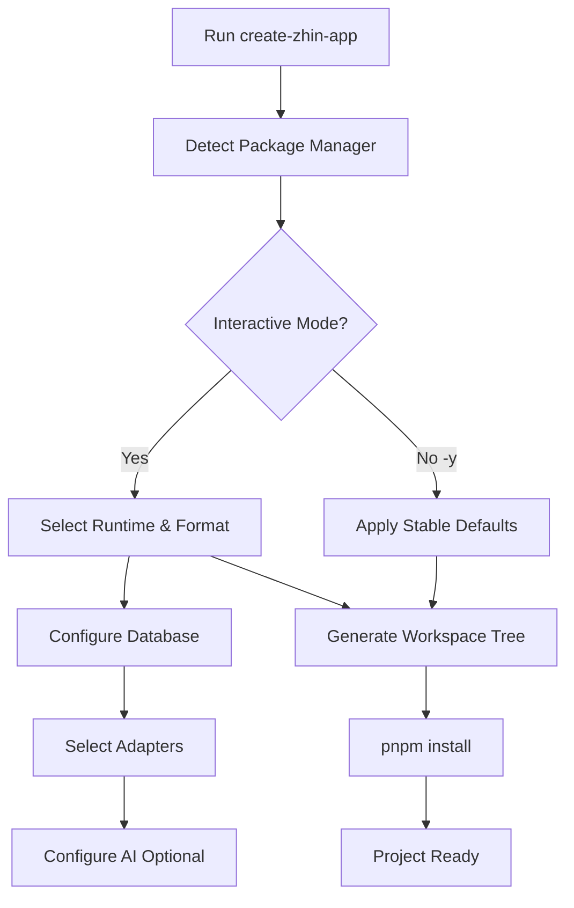
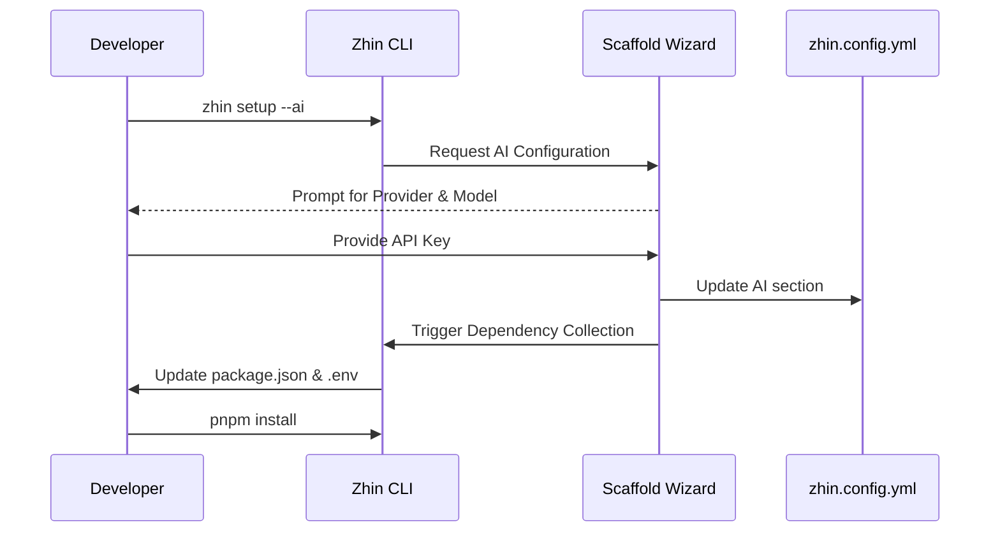

::: warning Generated reference snapshot
[Original Cubic page](https://www.cubic.dev/wikis/zhinjs/zhin?page=page-quickstart) · captured 2026-09-23 · [source commit](https://github.com/zhinjs/zhin/commit/368db14caa4aa91311fb090f07bd792fe4b22fe7). This AI-generated page has not been verified against the current code. Use the [Zhin documentation](/en/getting-started/) for current behavior and [see known corrections](/en/wiki/).
:::

::: danger Known correction
New projects created with `create-zhin-app` require Node.js `>=22.12.0` and currently configure HTTP port `8068`. The broader `zhin.js` library engine range does not describe the generated TypeScript project's requirement. See [Getting Started](/en/getting-started/).
:::

<details>
<summary>Relevant source files</summary>

The following files were used as context for generating this wiki page:

- [README.md](https://github.com/zhinjs/zhin/blob/368db14caa4aa91311fb090f07bd792fe4b22fe7/README.md)
- [packages/toolkit/create-zhin/README.md](https://github.com/zhinjs/zhin/blob/368db14caa4aa91311fb090f07bd792fe4b22fe7/packages/toolkit/create-zhin/README.md)
- [packages/toolkit/scaffold-wizard/README.md](https://github.com/zhinjs/zhin/blob/368db14caa4aa91311fb090f07bd792fe4b22fe7/packages/toolkit/scaffold-wizard/README.md)
- [packages/toolkit/create-zhin/src/workspace.ts](https://github.com/zhinjs/zhin/blob/368db14caa4aa91311fb090f07bd792fe4b22fe7/packages/toolkit/create-zhin/src/workspace.ts)
- [basic/cli/src/commands/setup.ts](https://github.com/zhinjs/zhin/blob/368db14caa4aa91311fb090f07bd792fe4b22fe7/basic/cli/src/commands/setup.ts)
- [basic/cli/src/commands/new.ts](https://github.com/zhinjs/zhin/blob/368db14caa4aa91311fb090f07bd792fe4b22fe7/basic/cli/src/commands/new.ts)
- [AGENTS.md](https://github.com/zhinjs/zhin/blob/368db14caa4aa91311fb090f07bd792fe4b22fe7/AGENTS.md)
</details>

# Quick Start & Setup

Zhin.js provides a streamlined initialization process for building multi-channel chat platform bots. The framework uses a tiered installation model that starts with a lightweight messaging core under 10MB. Developers can expand functionality through an interactive configuration wizard that manages databases, platform adapters, and AI agents.

Sources: [README.md:20-30](https://github.com/zhinjs/zhin/blob/368db14caa4aa91311fb090f07bd792fe4b22fe7/README.md#L20-L30), [README.md:120-130](https://github.com/zhinjs/zhin/blob/368db14caa4aa91311fb090f07bd792fe4b22fe7/README.md#L120-L130)

## Project Initialization

The primary method for starting a new project is the `create-zhin-app` scaffold. This tool generates a pnpm workspace structure and installs the necessary runtime environment.

### The "Golden Path" Installation
For a standard installation including a Sandbox adapter, Host, and Remote Console access, use the following commands:

```bash
npm create zhin-app my-bot -y
cd my-bot
pnpm dev
```
Sources: [README.md:50-55](https://github.com/zhinjs/zhin/blob/368db14caa4aa91311fb090f07bd792fe4b22fe7/README.md#L50-L55), [packages/toolkit/create-zhin/README.md:110-120](https://github.com/zhinjs/zhin/blob/368db14caa4aa91311fb090f07bd792fe4b22fe7/packages/toolkit/create-zhin/README.md#L110-L120)

### Setup Logic Flow
The setup process involves project scaffolding followed by interactive configuration.


The diagram shows the transition from project initiation to workspace generation.
Sources: [packages/toolkit/create-zhin/README.md:40-60](https://github.com/zhinjs/zhin/blob/368db14caa4aa91311fb090f07bd792fe4b22fe7/packages/toolkit/create-zhin/README.md#L40-L60), [packages/toolkit/create-zhin/src/workspace.ts](https://github.com/zhinjs/zhin/blob/368db14caa4aa91311fb090f07bd792fe4b22fe7/packages/toolkit/create-zhin/src/workspace.ts)

## Installation Tiers

Zhin.js categorizes capabilities into tiers to maintain a small production footprint.

| Tier | Required Packages | Production Size | Capabilities |
| :--- | :--- | :--- | :--- |
| **IM Core** | `zhin.js`, `@zhin.js/adapter-sandbox` | <10MB | Plugin runtime, commands, sandbox |
| **AI Agent** | `+ @zhin.js/agent`, `zod`, `ai` | +15MB | ZhinAgent, sessions, tool orchestration |
| **Provider** | `+ @ai-sdk/openai` (or other) | Per Vendor | LLM communication |
| **Rich Media** | `+ @zhin.js/html-renderer` | +~3MB | HTML/Markdown to PNG rendering |

Sources: [README.md:125-145](https://github.com/zhinjs/zhin/blob/368db14caa4aa91311fb090f07bd792fe4b22fe7/README.md#L125-L145), [AGENTS.md:75-85](https://github.com/zhinjs/zhin/blob/368db14caa4aa91311fb090f07bd792fe4b22fe7/AGENTS.md#L75-L85)

## The Scaffold Wizard

The `@zhin.js/scaffold-wizard` serves as a shared library for both project creation and incremental updates. It provides a unified logic for configuring system components.

### Core Configuration Components
*   **Database:** Supports SQLite (recommended for zero-config), MySQL, PostgreSQL, MongoDB, and Redis.
*   **Adapters:** Includes Sandbox, Telegram, Discord, GitHub, QQ, and more.
*   **AI:** Manages LLM providers, trigger rules, and security settings.
*   **Security:** Automatically generates HTTP Tokens and manages `.env` variables.

Sources: [packages/toolkit/scaffold-wizard/README.md:20-40](https://github.com/zhinjs/zhin/blob/368db14caa4aa91311fb090f07bd792fe4b22fe7/packages/toolkit/scaffold-wizard/README.md#L20-L40), [packages/toolkit/create-zhin/README.md:85-100](https://github.com/zhinjs/zhin/blob/368db14caa4aa91311fb090f07bd792fe4b22fe7/packages/toolkit/create-zhin/README.md#L85-L100)

## CLI Setup and Maintenance

Once a project exists, developers use the Zhin CLI (`@zhin.js/cli`) to modify or diagnose the environment.

### Primary Commands
| Command | Action |
| :--- | :--- |
| `zhin setup` | Launches the interactive wizard for incremental configuration. |
| `zhin new` | Scaffolds new plugins, services, or adapters within a workspace. |
| `zhin doctor` | Performs environment diagnostics and identifies missing dependencies. |
| `zhin runtime start` | Starts the bot using the Plugin Runtime engine. |

Sources: [basic/cli/src/commands/setup.ts:180-200](https://github.com/zhinjs/zhin/blob/368db14caa4aa91311fb090f07bd792fe4b22fe7/basic/cli/src/commands/setup.ts#L180-L200), [basic/cli/src/commands/new.ts:40-50](https://github.com/zhinjs/zhin/blob/368db14caa4aa91311fb090f07bd792fe4b22fe7/basic/cli/src/commands/new.ts#L40-L50), [README.md:200-210](https://github.com/zhinjs/zhin/blob/368db14caa4aa91311fb090f07bd792fe4b22fe7/README.md#L200-L210)

### Incremental Setup Sequence


The sequence illustrates adding an AI Agent to an existing IM-only project.
Sources: [basic/cli/src/commands/setup.ts:240-280](https://github.com/zhinjs/zhin/blob/368db14caa4aa91311fb090f07bd792fe4b22fe7/basic/cli/src/commands/setup.ts#L240-L280), [packages/toolkit/scaffold-wizard/README.md:45-55](https://github.com/zhinjs/zhin/blob/368db14caa4aa91311fb090f07bd792fe4b22fe7/packages/toolkit/scaffold-wizard/README.md#L45-L55)

## Generated Project Structure

Executing `create-zhin-app` produces a standardized pnpm workspace.

*   **`plugin.ts`**: The root entry point utilizing `definePlugin`.
*   **`zhin.config.yml`**: The primary configuration for HTTP, databases, and AI.
*   **`commands/`**: Directory for message command definitions.
*   **`skills/`**: Markdown-based `SKILL.md` files for AI agent workflows.
*   **`plugins/`**: Local workspace for developing custom plugin packages.
*   **`.env`**: Secure storage for the `HTTP_TOKEN` and database credentials.

Sources: [packages/toolkit/create-zhin/README.md:150-180](https://github.com/zhinjs/zhin/blob/368db14caa4aa91311fb090f07bd792fe4b22fe7/packages/toolkit/create-zhin/README.md#L150-L180), [packages/toolkit/create-zhin/src/workspace.ts:380-400](https://github.com/zhinjs/zhin/blob/368db14caa4aa91311fb090f07bd792fe4b22fe7/packages/toolkit/create-zhin/src/workspace.ts#L380-L400)

## System Requirements

Proper setup requires specific environmental conditions.

*   **Node.js**: Versions `^20.19.0` or `>=22.12.0` (required for TypeScript projects).
*   **Package Manager**: `pnpm 9+` is strongly recommended for workspace management.
*   **Operating System**: Windows 10+, macOS 10.15+, or modern Linux distributions.

Sources: [README.md:65-70](https://github.com/zhinjs/zhin/blob/368db14caa4aa91311fb090f07bd792fe4b22fe7/README.md#L65-L70), [packages/toolkit/create-zhin/README.md:310-315](https://github.com/zhinjs/zhin/blob/368db14caa4aa91311fb090f07bd792fe4b22fe7/packages/toolkit/create-zhin/README.md#L310-L315)

Zhin.js emphasizes an "Action-Oriented" setup where the framework generates functional bootstrap files like `SOUL.md` and `TOOLS.md` when AI is enabled. These files define the agent's personality and tool usage guidelines immediately upon project creation.

Sources: [basic/cli/src/commands/setup.ts:35-80](https://github.com/zhinjs/zhin/blob/368db14caa4aa91311fb090f07bd792fe4b22fe7/basic/cli/src/commands/setup.ts#L35-L80), [packages/toolkit/create-zhin/src/workspace.ts:115-125](https://github.com/zhinjs/zhin/blob/368db14caa4aa91311fb090f07bd792fe4b22fe7/packages/toolkit/create-zhin/src/workspace.ts#L115-L125)
