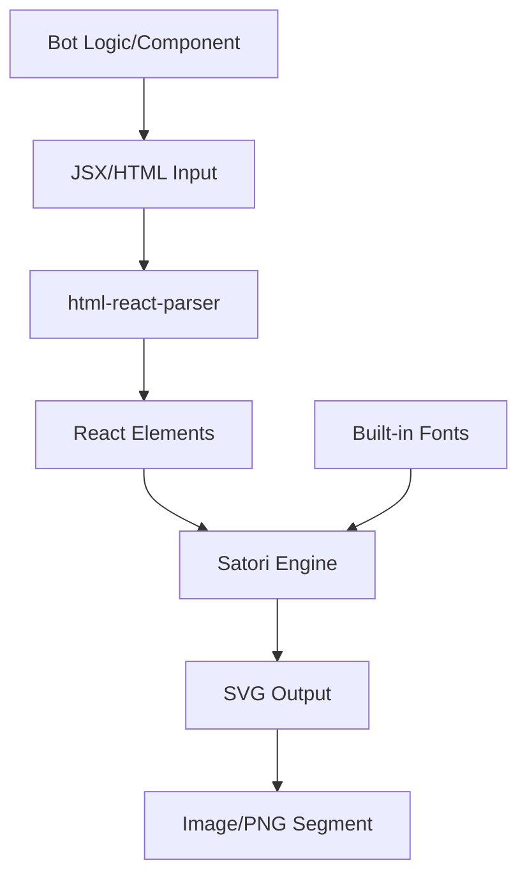
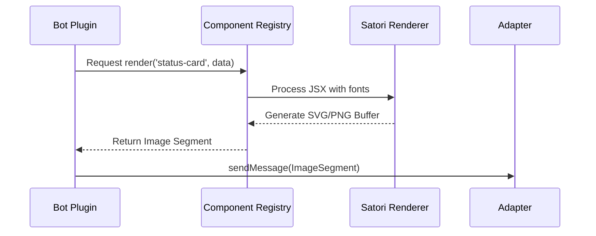

[中文版](/wiki/cubic/satori)

::: warning Generated reference snapshot
[Original Cubic page](https://www.cubic.dev/wikis/zhinjs/zhin?page=page-satori) · captured 2026-09-23 · [source commit](https://github.com/zhinjs/zhin/commit/368db14caa4aa91311fb090f07bd792fe4b22fe7). This AI-generated page has not been verified against the current code. Use the [Zhin documentation](/en/getting-started/) for current behavior and [see known corrections](/en/wiki/).
:::

::: danger Known correction
The `wrapCardHtml` example below requires a background color argument; the normalized copy supplies `DEFAULT_CARD_THEME.canvas`. See [the maintained card example](/en/authoring/middleware-components).
:::

::: details Relevant source files

The following files were used as context for generating this wiki page:

- [packages/toolkit/satori/package.json](https://github.com/zhinjs/zhin/blob/368db14caa4aa91311fb090f07bd792fe4b22fe7/packages/toolkit/satori/package.json)
- [packages/toolkit/satori/fonts/FONTS.md](https://github.com/zhinjs/zhin/blob/368db14caa4aa91311fb090f07bd792fe4b22fe7/packages/toolkit/satori/fonts/FONTS.md)
- [packages/toolkit/satori/CHANGELOG.md](https://github.com/zhinjs/zhin/blob/368db14caa4aa91311fb090f07bd792fe4b22fe7/packages/toolkit/satori/CHANGELOG.md)
- [packages/toolkit/create-zhin/src/workspace.ts](https://github.com/zhinjs/zhin/blob/368db14caa4aa91311fb090f07bd792fe4b22fe7/packages/toolkit/create-zhin/src/workspace.ts)
- [README.md](https://github.com/zhinjs/zhin/blob/368db14caa4aa91311fb090f07bd792fe4b22fe7/README.md)
- [packages/toolkit/create-zhin/template/skills/plugin-init/SKILL.md](https://github.com/zhinjs/zhin/blob/368db14caa4aa91311fb090f07bd792fe4b22fe7/packages/toolkit/create-zhin/template/skills/plugin-init/SKILL.md)
:::

# Rich Media with Satori

The `@zhin.js/satori` module provides a bridge between HTML/CSS content and visual image segments within the Zhin.js ecosystem. It transforms JSX or HTML strings into SVG graphics using the official Satori engine, enabling bots to deliver complex UI elements like status cards and charts across diverse chat platforms. Sources: [packages/toolkit/satori/package.json](https://github.com/zhinjs/zhin/blob/368db14caa4aa91311fb090f07bd792fe4b22fe7/packages/toolkit/satori/package.json), [README.md:163-165](https://github.com/zhinjs/zhin/blob/368db14caa4aa91311fb090f07bd792fe4b22fe7/README.md#L163-L165)

## Core Architecture and Rendering Pipeline

Zhin.js implements a structured pipeline to handle rich media. The rendering process converts inbound or programmatically generated HTML content into outbound image segments (typically PNG). If the rich media module is missing, the system falls back to plain text representation. Sources: [README.md:126-130](https://github.com/zhinjs/zhin/blob/368db14caa4aa91311fb090f07bd792fe4b22fe7/README.md#L126-L130), [README.md:163-165](https://github.com/zhinjs/zhin/blob/368db14caa4aa91311fb090f07bd792fe4b22fe7/README.md#L163-L165)

### Rendering Flow
1. **Input**: A plugin generates a `defineComponent` result or a raw HTML segment.
2. **Parsing**: The `html-react-parser` dependency converts HTML strings into React-compatible element trees.
3. **Styling**: The Satori engine applies CSS rules to the element tree.
4. **Rasterization**: The engine uses built-in fonts to render the final SVG output.
Sources: [packages/toolkit/satori/package.json:28-32](https://github.com/zhinjs/zhin/blob/368db14caa4aa91311fb090f07bd792fe4b22fe7/packages/toolkit/satori/package.json#L28-L32), [packages/toolkit/satori/CHANGELOG.md:89-92](https://github.com/zhinjs/zhin/blob/368db14caa4aa91311fb090f07bd792fe4b22fe7/packages/toolkit/satori/CHANGELOG.md#L89-L92)


The diagram shows the transformation of code-defined UI components into visual image segments for chat platforms.

## Font Management

The `@zhin.js/satori` package includes a set of pre-bundled fonts to ensure consistent rendering across different environments. These fonts cover Latin and CJK (Chinese, Japanese, Korean) character sets. Sources: [packages/toolkit/satori/fonts/FONTS.md:3-5](https://github.com/zhinjs/zhin/blob/368db14caa4aa91311fb090f07bd792fe4b22fe7/packages/toolkit/satori/fonts/FONTS.md#L3-L5)

### Included Font Assets
| Font Name | Language Support | License | File Format |
| :--- | :--- | :--- | :--- |
| **Poppins** | Latin (400, 700 weight) | SIL OFL 1.1 | .ttf |
| **Noto Sans SC** | Simplified Chinese | SIL OFL 1.1 | .otf |
| **Noto Sans JP** | Japanese | SIL OFL 1.1 | .otf |
| **Noto Sans KR** | Korean | SIL OFL 1.1 | .otf |
| **Noto Color Emoji** | Emoji (Bitmap) | SIL OFL 1.1 | .ttf |

Sources: [packages/toolkit/satori/fonts/FONTS.md:7-22](https://github.com/zhinjs/zhin/blob/368db14caa4aa91311fb090f07bd792fe4b22fe7/packages/toolkit/satori/fonts/FONTS.md#L7-L22)

### Font Utility Functions
The module provides several getter functions to retrieve font buffers and metadata for the Satori configuration:
*   `getDefaultFonts()`: Returns Poppins Regular and Bold.
*   `getExtendedFonts()`: Returns Poppins with Simplified Chinese support.
*   `getCJKFonts()`: Returns full Chinese, Japanese, and Korean support.
*   `getCompleteFonts()`: Returns all Latin and CJK fonts.
Sources: [packages/toolkit/satori/fonts/FONTS.md:61-75](https://github.com/zhinjs/zhin/blob/368db14caa4aa91311fb090f07bd792fe4b22fe7/packages/toolkit/satori/fonts/FONTS.md#L61-L75)

## Component-Based Rendering

Developers create rich media using `defineComponent`. This API allows the definition of structured UI using a JSX-like syntax or hyperscript helpers provided by `@zhin.js/satori`. Sources: [packages/toolkit/create-zhin/src/workspace.ts:585-590](https://github.com/zhinjs/zhin/blob/368db14caa4aa91311fb090f07bd792fe4b22fe7/packages/toolkit/create-zhin/src/workspace.ts#L585-L590)

### JSX Integration
To use JSX for rendering, developers must set the `jsxImportSource` to `@zhin.js/satori` at the top of the component file. Sources: [packages/toolkit/create-zhin/template/skills/plugin-init/SKILL.md:126-128](https://github.com/zhinjs/zhin/blob/368db14caa4aa91311fb090f07bd792fe4b22fe7/packages/toolkit/create-zhin/template/skills/plugin-init/SKILL.md#L126-L128)

### Example Component Structure
Components utilize pre-defined UI primitives to build cards and layouts.
```typescript
import { defineComponent } from 'zhin.js/component';
import { Card, CardHeader, Row, StatChip, h, wrapCardHtml, DEFAULT_CARD_THEME } from '@zhin.js/satori';

export default defineComponent({
  render({ title, value }) {
    const body = h(Card, {
      children: [
        h(CardHeader, { title }),
        h(Row, { children: [h(StatChip, { label: 'Status', value })] })
      ],
    });
    return {
      type: 'html',
      data: { html: wrapCardHtml(body, DEFAULT_CARD_THEME.canvas), width: 540 }
    };
  },
});
```
Sources: [packages/toolkit/create-zhin/src/workspace.ts:585-618](https://github.com/zhinjs/zhin/blob/368db14caa4aa91311fb090f07bd792fe4b22fe7/packages/toolkit/create-zhin/src/workspace.ts#L585-L618)

## Integration with Zhin.js

Rich media capabilities are categorized under the "Rich media" install tier. The system requires `@zhin.js/html-renderer` (which depends on `@zhin.js/satori`) for full outbound transformation support. Sources: [README.md:163-165](https://github.com/zhinjs/zhin/blob/368db14caa4aa91311fb090f07bd792fe4b22fe7/README.md#L163-L165)

### Dependency Map
| Tier | Package | Purpose |
| :--- | :--- | :--- |
| **Rendering** | `@zhin.js/satori` | HTML-to-SVG conversion and font bundling. |
| **Integration** | `@zhin.js/html-renderer` | Outbound pipeline processing for `html` segments. |
| **Standard** | `satori` | Official rendering engine. |
| **Parsing** | `html-react-parser` | String-to-React element conversion. |

Sources: [packages/toolkit/satori/package.json:28-32](https://github.com/zhinjs/zhin/blob/368db14caa4aa91311fb090f07bd792fe4b22fe7/packages/toolkit/satori/package.json#L28-L32), [README.md:163-165](https://github.com/zhinjs/zhin/blob/368db14caa4aa91311fb090f07bd792fe4b22fe7/README.md#L163-L165)


The sequence diagram illustrates how a bot plugin requests a component render which Satori processes into a transmittable image. Sources: [packages/toolkit/create-zhin/src/workspace.ts:566-575](https://github.com/zhinjs/zhin/blob/368db14caa4aa91311fb090f07bd792fe4b22fe7/packages/toolkit/create-zhin/src/workspace.ts#L566-L575), [README.md:126-130](https://github.com/zhinjs/zhin/blob/368db14caa4aa91311fb090f07bd792fe4b22fe7/README.md#L126-L130)

## Conclusion
The Satori integration allows Zhin.js bots to bypass the limitations of text-only chat platforms by generating high-quality images from code-defined components. By bundling specific fonts and leveraging established HTML-to-SVG technologies, Zhin ensures that rich media remains consistent, accessible, and easily authorable for developers using TypeScript and JSX. Sources: [README.md:126-130](https://github.com/zhinjs/zhin/blob/368db14caa4aa91311fb090f07bd792fe4b22fe7/README.md#L126-L130), [packages/toolkit/satori/fonts/FONTS.md:37-40](https://github.com/zhinjs/zhin/blob/368db14caa4aa91311fb090f07bd792fe4b22fe7/packages/toolkit/satori/fonts/FONTS.md#L37-L40)
