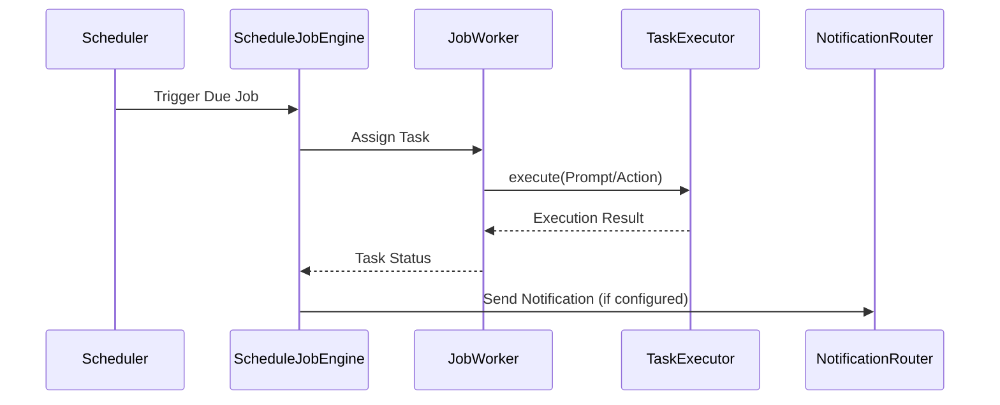

[中文版](/wiki/cubic/scheduling)

::: warning Generated reference snapshot
[Original Cubic page](https://www.cubic.dev/wikis/zhinjs/zhin?page=page-scheduling) · captured 2026-09-23 · [source commit](https://github.com/zhinjs/zhin/commit/368db14caa4aa91311fb090f07bd792fe4b22fe7). This AI-generated page has not been verified against the current code. Use the [Zhin documentation](/en/getting-started/) for current behavior and [see known corrections](/en/wiki/archive).
:::

::: danger Known correction
Some Cubic source line anchors for the plugin example point to unrelated blocks. Check the linked files before copying the example. See [Schedules](/en/authoring/define-plugin).
:::

::: details Relevant source files

The following files were used as context for generating this wiki page:

- [basic/schedule/README.md](https://github.com/zhinjs/zhin/blob/368db14caa4aa91311fb090f07bd792fe4b22fe7/basic/schedule/README.md)
- [basic/schedule/package.json](https://github.com/zhinjs/zhin/blob/368db14caa4aa91311fb090f07bd792fe4b22fe7/basic/schedule/package.json)
- [packages/im/agent/tests/assistant/job-engine.test.ts](https://github.com/zhinjs/zhin/blob/368db14caa4aa91311fb090f07bd792fe4b22fe7/packages/im/agent/tests/assistant/job-engine.test.ts)
- [packages/toolkit/create-zhin/template/skills/plugin-develop/SKILL.md](https://github.com/zhinjs/zhin/blob/368db14caa4aa91311fb090f07bd792fe4b22fe7/packages/toolkit/create-zhin/template/skills/plugin-develop/SKILL.md)
- [packages/im/schedule-feature/package.json](https://github.com/zhinjs/zhin/blob/368db14caa4aa91311fb090f07bd792fe4b22fe7/packages/im/schedule-feature/package.json)
- [AGENTS.md](https://github.com/zhinjs/zhin/blob/368db14caa4aa91311fb090f07bd792fe4b22fe7/AGENTS.md)
- [CLAUDE.md](https://github.com/zhinjs/zhin/blob/368db14caa4aa91311fb090f07bd792fe4b22fe7/CLAUDE.md)

:::

# Schedule Engine & Cron Jobs

The Schedule Engine provides a calendar-semantic scheduling library for Zhin.js. It supports complex timing logic including Solar and Lunar Cron expressions, Chinese statutory holidays, and persistent job management. The system resides in the `basic/schedule` directory and integrates through the `@zhin.js/kernel` and `@zhin.js/agent` layers to provide scheduling capabilities to plugins and AI agents.

Sources: [basic/schedule/README.md:1-5](https://github.com/zhinjs/zhin/blob/368db14caa4aa91311fb090f07bd792fe4b22fe7/basic/schedule/README.md#L1-L5), [AGENTS.md:68-75](https://github.com/zhinjs/zhin/blob/368db14caa4aa91311fb090f07bd792fe4b22fe7/AGENTS.md#L68-L75)

## System Architecture

The scheduling system operates across multiple architectural layers. The base layer provides core calendar logic, while upper layers wrap this logic for specific IM and Agent workflows.

```mermaid
flowchart TD
    subgraph Basic_Layer
        A[@zhin.js/schedule] -->|CalendarScheduler| B[JobStore]
    end
    subgraph Kernel_Layer
        B --> C[@zhin.js/kernel ScheduleEngine]
    end
    subgraph Runtime_Layer
        C --> D[@zhin.js/plugin-runtime scheduleHostToken]
    end
    subgraph Agent_Layer
        D --> E[@zhin.js/agent ScheduleJobEngine]
    end
    E --> F[AI Assistant Tasks]
```
The diagram shows the upward dependency flow from the basic schedule library to the high-level Agent Job Engine.
Sources: [basic/schedule/README.md:12-20](https://github.com/zhinjs/zhin/blob/368db14caa4aa91311fb090f07bd792fe4b22fe7/basic/schedule/README.md#L12-L20), [CLAUDE.md:73-85](https://github.com/zhinjs/zhin/blob/368db14caa4aa91311fb090f07bd792fe4b22fe7/CLAUDE.md#L73-L85)

## Scheduling Capabilities

The `CalendarScheduler` serves as the primary engine for managing time-based triggers. It handles traditional Cron expressions and specialized Chinese calendar requirements.

### Supported Schedule Kinds
The system categorizes triggers into several types to handle complex regional requirements.

| Kind | Description |
| :--- | :--- |
| `solar` | Standard Gregorian Cron (6 segments: sec, min, hour, day, month, week) |
| `lunar` | Traditional Chinese Lunar Calendar Cron |
| `workday` | Statutory workdays, including adjusted working weekends |
| `freeDay` | Rest days and weekends |
| `holiday` | Specific festival intervals (e.g., Spring Festival) |
| `scatter` | Triggers randomly or dispersed within a specific time window |

Sources: [basic/schedule/README.md:37-47](https://github.com/zhinjs/zhin/blob/368db14caa4aa91311fb090f07bd792fe4b22fe7/basic/schedule/README.md#L37-L47), [basic/schedule/package.json:3-5](https://github.com/zhinjs/zhin/blob/368db14caa4aa91311fb090f07bd792fe4b22fe7/basic/schedule/package.json#L3-L5)

### Holiday Data Management
The engine includes built-in holiday data for the years 2019–2026 based on State Council announcements. Users can update these datasets at runtime using the `HolidayCalendar.update` method or through synchronization scripts like `sync-holiday.mjs`.
Sources: [basic/schedule/README.md:52-60](https://github.com/zhinjs/zhin/blob/368db14caa4aa91311fb090f07bd792fe4b22fe7/basic/schedule/README.md#L52-L60)

## Persistent Storage (JobStore)

The Schedule Engine supports multiple persistence backends to ensure jobs survive process restarts. The `JobStore` interface allows for different implementations based on project scale.

*   **Local JSON Store**: Created via `createLocalJsonStore`, suitable for small standalone bots.
*   **SQLite Store**: Created via `createSqliteStore`, providing relational persistence.
*   **Redis Store**: Created via `createRedisStore`, enabling job claiming across multiple worker instances.

Sources: [basic/schedule/README.md:66-72](https://github.com/zhinjs/zhin/blob/368db14caa4aa91311fb090f07bd792fe4b22fe7/basic/schedule/README.md#L66-L72)

## Agent Integration (ScheduleJobEngine)

The `ScheduleJobEngine` within the `@zhin.js/agent` package manages scheduled tasks specifically for AI agents. It links the scheduler to a `JobWorker` and a `TaskExecutor`.

### Job Execution Flow
When a scheduled time is reached, the engine coordinates the task execution and notification.


This sequence illustrates the internal communication between the scheduler, the worker, and the AI task executor.
Sources: [packages/im/agent/tests/assistant/job-engine.test.ts:28-50](https://github.com/zhinjs/zhin/blob/368db14caa4aa91311fb090f07bd792fe4b22fe7/packages/im/agent/tests/assistant/job-engine.test.ts#L28-L50)

### Job Configuration
Agent jobs include metadata for proper execution context:
*   **createdBy**: Identifies the user who initiated the job (userId, roles).
*   **executionPlan**: Contains the prompt, required tools, and skills for the agent.
*   **notify**: Configuration for success/failure feedback (e.g., `silent` or specific IM channels).

Sources: [packages/im/agent/tests/assistant/job-engine.test.ts:52-105](https://github.com/zhinjs/zhin/blob/368db14caa4aa91311fb090f07bd792fe4b22fe7/packages/im/agent/tests/assistant/job-engine.test.ts#L52-L105)

## Plugin Implementation

Developers register scheduled tasks in Zhin plugins using the `scheduleHostToken`. This is the recommended approach for the 1.1.x stable line, moving away from legacy imperative APIs.

```typescript
// plugin.ts
import { definePlugin, scheduleHostToken } from 'zhin.js';

export default definePlugin({
  name: 'example-plugin',
  setup(context) {
    if (!context.resources.has(scheduleHostToken)) return;
    const schedule = context.resources.use(scheduleHostToken);

    context.lifecycle.add(
      schedule.register({
        id: 'my-plugin/hourly-task',
        cron: '0 0 * * * *',
        async execute() {
          console.log('Task executed');
        },
      }),
    );
  },
});
```
Sources: [packages/toolkit/create-zhin/template/skills/plugin-develop/SKILL.md:67-84](https://github.com/zhinjs/zhin/blob/368db14caa4aa91311fb090f07bd792fe4b22fe7/packages/toolkit/create-zhin/template/skills/plugin-develop/SKILL.md#L67-L84), [CLAUDE.md:110-120](https://github.com/zhinjs/zhin/blob/368db14caa4aa91311fb090f07bd792fe4b22fe7/CLAUDE.md#L110-L120)

## Summary

The Schedule Engine & Cron Jobs system provides a robust, calendar-aware scheduling solution integrated deeply into the Zhin.js architecture. By leveraging the `CalendarScheduler` and persistent `JobStore` implementations, the framework ensures reliable task execution across various time regimes, including specific Chinese holiday adjustments. For AI agents, the `ScheduleJobEngine` bridges the gap between time-based triggers and automated agent actions, allowing for sophisticated scheduled workflows like morning briefs or periodic maintenance tasks.
