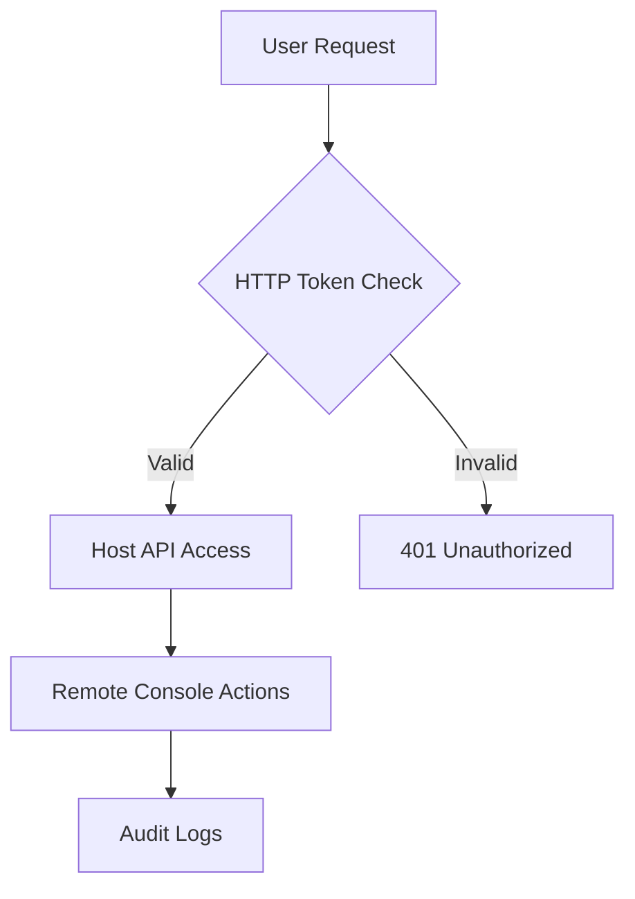
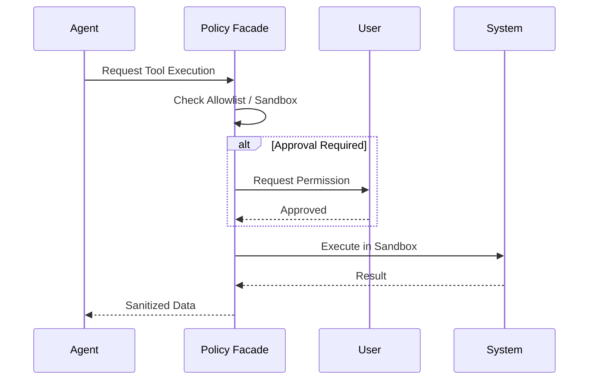

::: warning Generated reference snapshot
[Original Cubic page](https://www.cubic.dev/wikis/zhinjs/zhin?page=page-security-policy) · captured 2026-09-23 · [source commit](https://github.com/zhinjs/zhin/commit/368db14caa4aa91311fb090f07bd792fe4b22fe7). This AI-generated page has not been verified against the current code. Use the [Zhin documentation](/en/getting-started/) for current behavior and [see known corrections](/en/wiki/).
:::

::: danger Known correction
New scaffolded projects currently configure HTTP port `8068`; `8086` is the fallback when the runtime has no configured port. Check the startup output or `http.port`. See [Getting Started](/en/getting-started/).
:::

<details>
<summary>Relevant source files</summary>

The following files were used as context for generating this wiki page:

- [SECURITY.md](https://github.com/zhinjs/zhin/blob/368db14caa4aa91311fb090f07bd792fe4b22fe7/SECURITY.md)
- [AGENTS.md](https://github.com/zhinjs/zhin/blob/368db14caa4aa91311fb090f07bd792fe4b22fe7/AGENTS.md)
- [CLAUDE.md](https://github.com/zhinjs/zhin/blob/368db14caa4aa91311fb090f07bd792fe4b22fe7/CLAUDE.md)
- [agents/dev/system.md](https://github.com/zhinjs/zhin/blob/368db14caa4aa91311fb090f07bd792fe4b22fe7/agents/dev/system.md)
- [packages/toolkit/create-zhin/README.md](https://github.com/zhinjs/zhin/blob/368db14caa4aa91311fb090f07bd792fe4b22fe7/packages/toolkit/create-zhin/README.md)
- [basic/cli/src/commands/setup.ts](https://github.com/zhinjs/zhin/blob/368db14caa4aa91311fb090f07bd792fe4b22fe7/basic/cli/src/commands/setup.ts)
</details>

# Security Policy & Best Practices

Zhin.js implements a multi-layered security model to protect its plugin-based architecture and AI agent execution environment. This policy outlines how to report vulnerabilities, manage credentials, and implement secure plugin logic within the framework.

## Vulnerability Reporting & Response

The Zhin.js team prioritizes the resolution of security issues. You should disclose vulnerabilities privately rather than through public GitHub Issues.

### Reporting Channels
*   **Preferred Method**: Email findings to [security@zhin.dev](mailto:security@zhin.dev).
*   **Alternative**: Use the [GitHub Security Advisory](https://github.com/zhinjs/zhin/security/advisories) private reporting feature.

### Response Timeline
The team follows a structured timeline for vulnerability assessment and patching:
1.  **Acknowledgment**: Within 48 hours of receipt.
2.  **Initial Assessment**: Within 5 business days, including an estimated fix timeline.
3.  **Fix Release**:
    *   Critical Severity: 7-14 days.
    *   Medium Severity: 14-30 days.
    *   Low Severity: 30-60 days.

Sources: [SECURITY.md:204-228](https://github.com/zhinjs/zhin/blob/368db14caa4aa91311fb090f07bd792fe4b22fe7/SECURITY.md#L204-L228)

## User Best Practices

Users managing Zhin.js instances must maintain environment hygiene and restrict access to management interfaces.

### Credential Protection
*   **Environment Variables**: Store sensitive keys in a `.env` file and reference them in `zhin.config.yml` using the `${VAR_NAME}` syntax.
*   **Version Control**: Never commit `.env` files to git; the project includes `.env` in the default `.gitignore`.
*   **HTTP Tokens**: Use a strong `HTTP_TOKEN` for the Web Console. The scaffold-wizard generates a random 32-bit hex string by default.

### Access Control
*   **Host API**: Restrict the Host API (default `:8086`) to trusted sources using firewall rules or reverse proxies like Nginx.
*   **Production Configuration**: Disable file watching in production by setting `NODE_ENV=production` to prevent exhaustion of system resources (inotify limits).


The diagram shows the authentication flow for accessing the Host API via the Remote Console.

Sources: [SECURITY.md:232-261](https://github.com/zhinjs/zhin/blob/368db14caa4aa91311fb090f07bd792fe4b22fe7/SECURITY.md#L232-L261), [packages/toolkit/create-zhin/README.md:126-135](https://github.com/zhinjs/zhin/blob/368db14caa4aa91311fb090f07bd792fe4b22fe7/packages/toolkit/create-zhin/README.md#L126-L135), [SECURITY.md:329-338](https://github.com/zhinjs/zhin/blob/368db14caa4aa91311fb090f07bd792fe4b22fe7/SECURITY.md#L329-L338)

## Developer Security Guidelines

Plugin developers are responsible for sanitizing inputs and preventing injection attacks within the Zhin.js runtime.

### Input Validation
Always validate and sanitize user input. Zhin.js provides a **Schema** system for type checking and range validation.

```typescript
import { Schema } from '@zhin.js/schema'

const Input = Schema.object({
  url: Schema.string().pattern(/^https?:\/\//),
  count: Schema.number().min(1).max(100)
})
const input = Input(untrustedInput)
```
Sources: [SECURITY.md:273-282](https://github.com/zhinjs/zhin/blob/368db14caa4aa91311fb090f07bd792fe4b22fe7/SECURITY.md#L273-L282)

### Injection Prevention
Developers must use parameterized queries for database operations. Concatenating strings into SQL queries is strictly prohibited.
*   **Correct**: `db.model('users').findOne({ where: { id: userId } })`
*   **Incorrect**: `db.query("SELECT * FROM users WHERE id = " + userId)`

Sources: [SECURITY.md:284-290](https://github.com/zhinjs/zhin/blob/368db14caa4aa91311fb090f07bd792fe4b22fe7/SECURITY.md#L284-L290)

### Error Handling
Do not leak sensitive stack traces or internal configuration to chat channels. Use generic error messages for end-users while logging detailed errors to the internal logger.

Sources: [SECURITY.md:309-317](https://github.com/zhinjs/zhin/blob/368db14caa4aa91311fb090f07bd792fe4b22fe7/SECURITY.md#L309-L317)

## Agent Security Architecture

The Zhin.js Agent orchestrator includes high-level security policies to govern tool execution and resource access.

### Execution & File Policies
Agent security is enforced through two primary policy layers:
*   **ExecPolicy**: Governs shell command execution through five levels of defense (e.g., allowlists).
*   **FilePolicy**: Restricts filesystem access through four levels of defense, preventing path traversal.

### Tool Security Configuration
Built-in tools default to strict security settings:
*   `execSecurity`: Set to `allowlist`.
*   `execApprovalMode`: Set to `ask`.


This diagram illustrates the sequence of security checks performed before an AI Agent executes a system tool.

Sources: [CLAUDE.md:144-150](https://github.com/zhinjs/zhin/blob/368db14caa4aa91311fb090f07bd792fe4b22fe7/CLAUDE.md#L144-L150), [AGENTS.md:105-108](https://github.com/zhinjs/zhin/blob/368db14caa4aa91311fb090f07bd792fe4b22fe7/AGENTS.md#L105-L108), [agents/dev/system.md:46-52](https://github.com/zhinjs/zhin/blob/368db14caa4aa91311fb090f07bd792fe4b22fe7/agents/dev/system.md#L46-L52)

## Known Security Considerations

| Feature | Security Risk | Mitigation |
| :--- | :--- | :--- |
| **Plugin System** | Plugins run in the same process with full system access. | Install plugins only from trusted sources. |
| **Hot Reload** | May lead to unauthorized code execution in compromised environments. | Disable in production environments. |
| **Remote Console** | Default listening on `0.0.0.0` exposes the interface. | Restrict to `127.0.0.1` or use a reverse proxy with HTTPS. |
| **File Watching** | Resource exhaustion (inotify). | Avoid watching `node_modules`; specify exact plugin directories. |

Sources: [SECURITY.md:320-338](https://github.com/zhinjs/zhin/blob/368db14caa4aa91311fb090f07bd792fe4b22fe7/SECURITY.md#L320-L338)

## Security Roadmap

The framework plans to introduce the following enhancements in future versions:
*   **Fine-grained Plugin Permissions**: A system for limiting specific plugin capabilities.
*   **Code Signing**: Verification of plugin integrity before loading.
*   **Two-Factor Authentication (2FA)**: Enhanced security for the Remote Console.
*   **Sandbox Isolation**: Executing plugins in isolated environments rather than the main process.

Sources: [SECURITY.md:342-350](https://github.com/zhinjs/zhin/blob/368db14caa4aa91311fb090f07bd792fe4b22fe7/SECURITY.md#L342-L350)
