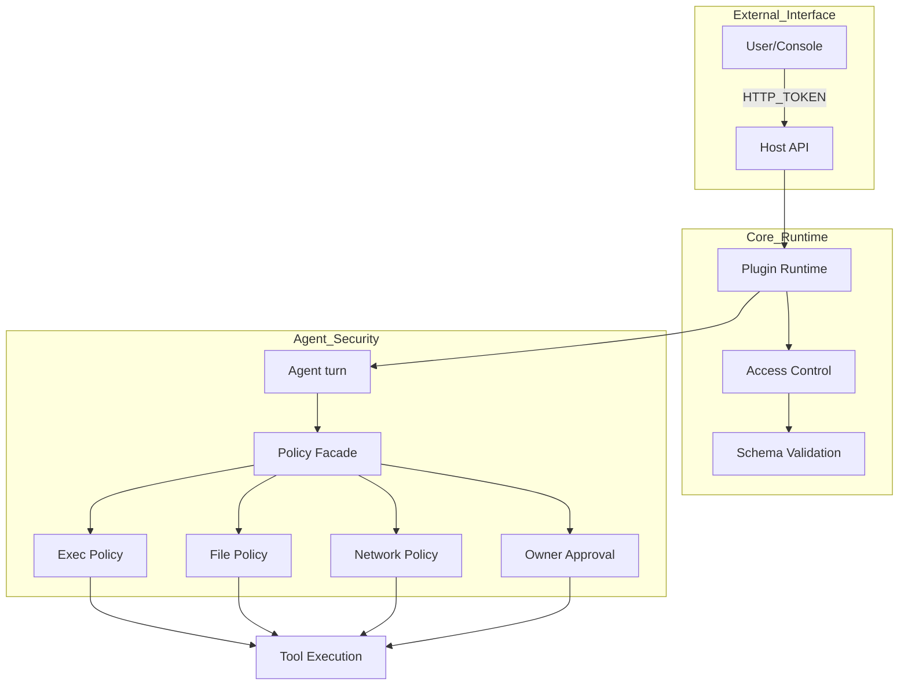
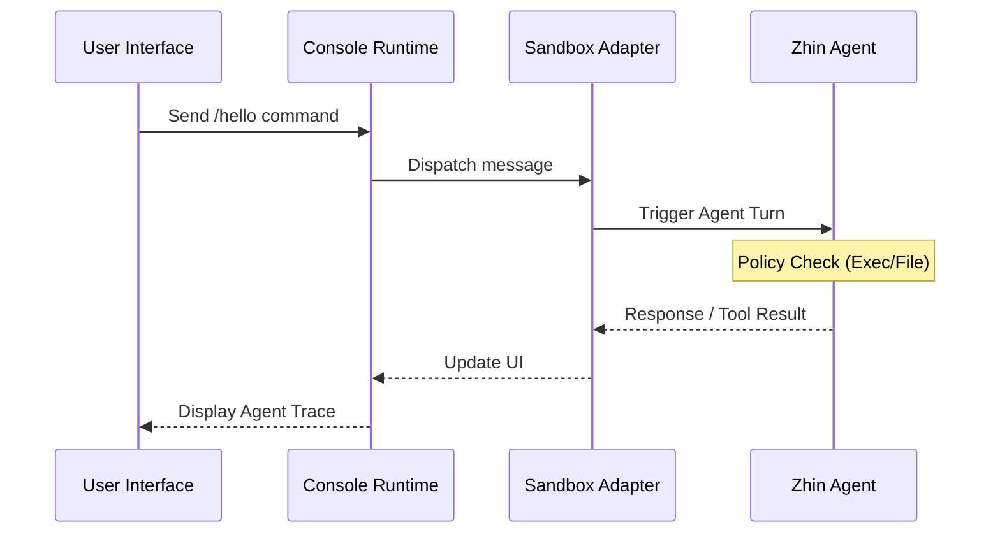

::: warning Generated reference snapshot
[Original Cubic page](https://www.cubic.dev/wikis/zhinjs/zhin?page=page-security-sandbox) · captured 2026-09-23 · [source commit](https://github.com/zhinjs/zhin/commit/368db14caa4aa91311fb090f07bd792fe4b22fe7). This AI-generated page has not been verified against the current code. Use the [Zhin documentation](/en/getting-started/) for current behavior and [see known corrections](/en/wiki/).
:::

::: danger Known correction
`execApprovalMode` is `ask | auto | bypass`. A Tool's separate `requiresApproval` is `never | on-risk | once | always`; these are not interchangeable. The approval-mode table below is stale. See [Agent configuration](/en/ai/) and [Tool authoring](/en/authoring/agent-tools).
:::

<details>
<summary>Relevant source files</summary>

The following files were used as context for generating this wiki page:

- [SECURITY.md](https://github.com/zhinjs/zhin/blob/368db14caa4aa91311fb090f07bd792fe4b22fe7/SECURITY.md)
- [AGENTS.md](https://github.com/zhinjs/zhin/blob/368db14caa4aa91311fb090f07bd792fe4b22fe7/AGENTS.md)
- [CLAUDE.md](https://github.com/zhinjs/zhin/blob/368db14caa4aa91311fb090f07bd792fe4b22fe7/CLAUDE.md)
- [basic/cli/src/commands/setup.ts](https://github.com/zhinjs/zhin/blob/368db14caa4aa91311fb090f07bd792fe4b22fe7/basic/cli/src/commands/setup.ts)
- [plugins/adapters/sandbox/tests/sandbox-console.test.ts](https://github.com/zhinjs/zhin/blob/368db14caa4aa91311fb090f07bd792fe4b22fe7/plugins/adapters/sandbox/tests/sandbox-console.test.ts)
- [agents/ops/system.md](https://github.com/zhinjs/zhin/blob/368db14caa4aa91311fb090f07bd792fe4b22fe7/agents/ops/system.md)
</details>

# Security Policies & Sandbox

The Zhin.js framework implements a multi-layered security model to protect the chatbot runtime, developer credentials, and user data. This system governs how plugins access system resources, how AI Agents execute tools, and how the Remote Console authenticates administrative requests. The security architecture prioritizes isolation, explicit approval for high-risk operations, and credential protection through environment variable injection.

## Security Architecture Overview

The Zhin.js security model operates across three primary domains: the Plugin Runtime, the AI Agent Orchestrator, and the Host API. While plugins currently run in the same process with full system access, the framework provides built-in mechanisms to restrict behavior and isolate testing through specialized adapters.


This diagram illustrates the flow of security validation from external requests through the core runtime and into the fine-grained policies governing AI Agent tool execution.
Sources: [AGENTS.md:162-170](https://github.com/zhinjs/zhin/blob/368db14caa4aa91311fb090f07bd792fe4b22fe7/AGENTS.md#L162-L170), [SECURITY.md:214-230](https://github.com/zhinjs/zhin/blob/368db14caa4aa91311fb090f07bd792fe4b22fe7/SECURITY.md#L214-L230), [CLAUDE.md:188-195](https://github.com/zhinjs/zhin/blob/368db14caa4aa91311fb090f07bd792fe4b22fe7/CLAUDE.md#L188-L195)

## Agent Security Policies

Agent harness engineering provides a defensive perimeter for AI-driven actions. The framework uses a centralized `policy-facade.ts` to coordinate multiple security checks before any tool execution occurs.

### Execution and File Policies
The framework enforces specific constraints on how agents interact with the host system:
*   **Execution Policy (`ExecPolicy`):** Restricts shell command execution using an allowlist of approved binaries.
*   **File Policy (`FilePolicy`):** Limits filesystem access to specific directories, preventing agents from reading sensitive configuration files or writing to system paths.
*   **Network Policy:** Blocks access to private IP ranges and enforces a domain allowlist for outbound requests.

### Tool Approval Modes
Tool execution behavior depends on the configured `execApprovalMode`. You define these modes in the `zhin.config.yml` under the `agent` section.

| Approval Mode | Behavior |
| :--- | :--- |
| `ask` | The agent must request explicit user permission before executing a tool. |
| `allowlist` | Built-in tools on a safe list execute automatically; others require approval. |
| `never` | Disables tool execution (used for restricted environments). |
| `always` | Executes all tools without prompting (not recommended for production). |

Sources: [AGENTS.md:210-215](https://github.com/zhinjs/zhin/blob/368db14caa4aa91311fb090f07bd792fe4b22fe7/AGENTS.md#L210-L215), [CLAUDE.md:188-195](https://github.com/zhinjs/zhin/blob/368db14caa4aa91311fb090f07bd792fe4b22fe7/CLAUDE.md#L188-L195), [README.md:195-205](https://github.com/zhinjs/zhin/blob/368db14caa4aa91311fb090f07bd792fe4b22fe7/README.md#L195-L205)

## Sandbox Environment

The Sandbox environment provides an isolated testbed for developing and testing agents without impacting live chat platforms. It consists of a specialized adapter and a dedicated web interface within the Remote Console.

### Sandbox Features
*   **Agent Testbed:** A specialized console page titled "Agent 试验台" (Agent Playground) allows for real-time monitoring of agent traces and tool execution logs.
*   **Isolated Messaging:** The `@zhin.js/adapter-sandbox` routes messages through internal WebSockets instead of external APIs.
*   **Metadata Extraction:** The system uses `extractPageMetadata` to discover sandbox pages during convention-based plugin loading.


This sequence shows the interaction between the user interface and the agent within the isolated sandbox environment.
Sources: [plugins/adapters/sandbox/tests/sandbox-console.test.ts:32-60](https://github.com/zhinjs/zhin/blob/368db14caa4aa91311fb090f07bd792fe4b22fe7/plugins/adapters/sandbox/tests/sandbox-console.test.ts#L32-L60), [CLAUDE.md:196-198](https://github.com/zhinjs/zhin/blob/368db14caa4aa91311fb090f07bd792fe4b22fe7/CLAUDE.md#L196-L198)

## Credential Protection and Access Control

Zhin.js prevents the accidental exposure of sensitive information through configuration management and network restrictions.

### Environment Variable Injection
You must not hardcode API keys or tokens in `zhin.config.yml`. The framework supports dynamic injection using the `${ENV_VAR}` syntax. The `zhin setup` command facilitates this by writing sensitive values to a `.env` file that is ignored by version control.

```yaml
# Recommended secure configuration
ai:
  providers:
    openai-main:
      sdk: openai
      apiKey: ${AI_API_KEY}
http:
  token: ${HTTP_TOKEN}
```
Sources: [basic/cli/src/commands/setup.ts:167-175](https://github.com/zhinjs/zhin/blob/368db14caa4aa91311fb090f07bd792fe4b22fe7/basic/cli/src/commands/setup.ts#L167-L175), [SECURITY.md:88-95](https://github.com/zhinjs/zhin/blob/368db14caa4aa91311fb090f07bd792fe4b22fe7/SECURITY.md#L88-L95), [README.md:188-193](https://github.com/zhinjs/zhin/blob/368db14caa4aa91311fb090f07bd792fe4b22fe7/README.md#L188-L193)

### Host API Security
The Host API (defaulting to port `8086`) requires a strong `HTTP_TOKEN` for all administrative actions.
*   **Authentication:** Requests must include the token in the `Authorization: Bearer` header or as a `?token=` query parameter.
*   **CORS:** The framework restricts API access to authorized origins, such as `https://console.zhin.dev`.
*   **Production Hardening:** Users should restrict Host API exposure using firewall rules and reverse proxies like Nginx.

Sources: [SECURITY.md:214-216](https://github.com/zhinjs/zhin/blob/368db14caa4aa91311fb090f07bd792fe4b22fe7/SECURITY.md#L214-L216), [packages/toolkit/create-zhin/README.md:120-130](https://github.com/zhinjs/zhin/blob/368db14caa4aa91311fb090f07bd792fe4b22fe7/packages/toolkit/create-zhin/README.md#L120-L130), [basic/cli/src/commands/setup.ts:175-180](https://github.com/zhinjs/zhin/blob/368db14caa4aa91311fb090f07bd792fe4b22fe7/basic/cli/src/commands/setup.ts#L175-L180)

## Plugin Security Best Practices

Developers must adhere to specific validation patterns to prevent common vulnerabilities like injection and data leakage.

*   **Input Validation:** Use the `@zhin.js/schema` system to define and validate user inputs. This provides automatic type checking and sanitization.
*   **Injection Prevention:** Always use parameterized queries when interacting with the database. Never concatenate strings to form SQL commands.
*   **Error Handling:** Implement error boundaries to prevent the leakage of stack traces or internal system paths to end users. Log detailed errors only to the internal logger.

```typescript
// Correct input validation using Schema
import { Schema } from '@zhin.js/schema'

const Input = Schema.object({
  url: Schema.string().pattern(/^https?:\/\//),
  count: Schema.number().min(1).max(100)
})

const input = Input(untrustedInput)
```
Sources: [SECURITY.md:110-125](https://github.com/zhinjs/zhin/blob/368db14caa4aa91311fb090f07bd792fe4b22fe7/SECURITY.md#L110-L125), [SECURITY.md:148-160](https://github.com/zhinjs/zhin/blob/368db14caa4aa91311fb090f07bd792fe4b22fe7/SECURITY.md#L148-L160)

## Summary of Security Governance

The security system in Zhin.js is designed to be "opt-in" for advanced features but "secure by default" for credential handling. While the core framework remains lightweight, adding `@zhin.js/agent` introduces a comprehensive policy engine that governs every AI interaction. The Sandbox environment serves as the primary tool for safely evaluating these policies before deployment.
Sources: [AGENTS.md:10-20](https://github.com/zhinjs/zhin/blob/368db14caa4aa91311fb090f07bd792fe4b22fe7/AGENTS.md#L10-L20), [README.md:140-150](https://github.com/zhinjs/zhin/blob/368db14caa4aa91311fb090f07bd792fe4b22fe7/README.md#L140-L150)
