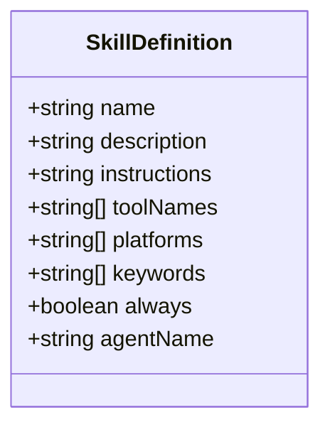
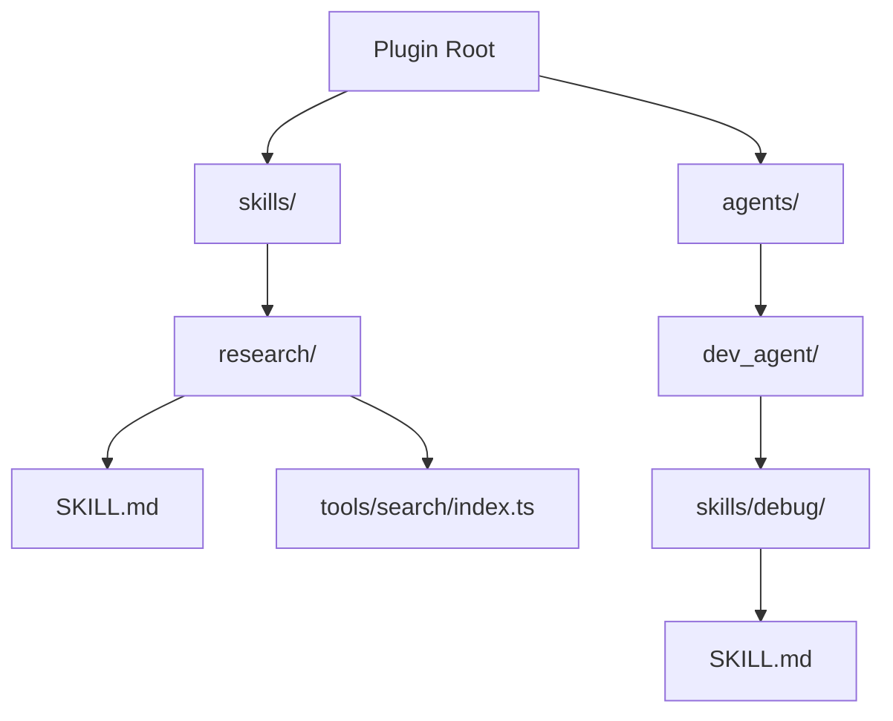
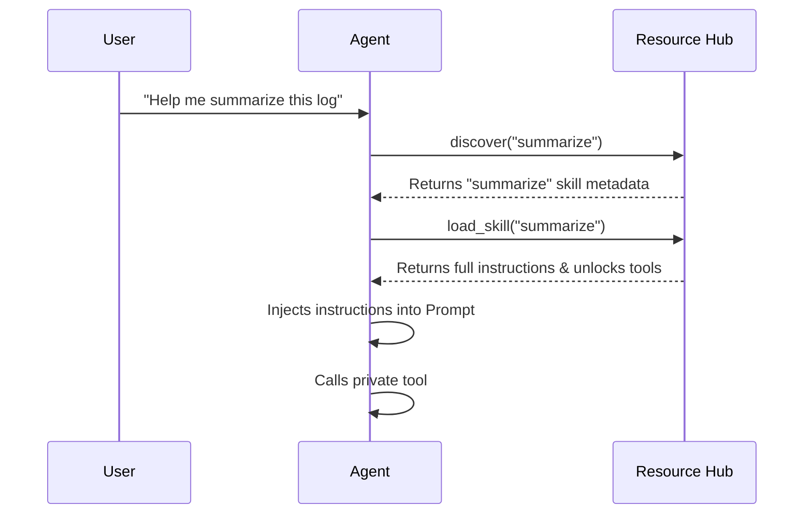

[中文版](/wiki/cubic/skills)

::: warning Generated reference snapshot
[Original Cubic page](https://www.cubic.dev/wikis/zhinjs/zhin?page=page-skills) · captured 2026-09-23 · [source commit](https://github.com/zhinjs/zhin/commit/368db14caa4aa91311fb090f07bd792fe4b22fe7). This AI-generated page has not been verified against the current code. Use the [Zhin documentation](/en/getting-started/) for current behavior and [see known corrections](/en/wiki/).
:::

::: details Relevant source files

The following files were used as context for generating this wiki page:

- [packages/im/skill/src/definition.ts](https://github.com/zhinjs/zhin/blob/368db14caa4aa91311fb090f07bd792fe4b22fe7/packages/im/skill/src/definition.ts)
- [packages/im/skill/README.md](https://github.com/zhinjs/zhin/blob/368db14caa4aa91311fb090f07bd792fe4b22fe7/packages/im/skill/README.md)
- [packages/im/agent/src/skill/skill-instructions.ts](https://github.com/zhinjs/zhin/blob/368db14caa4aa91311fb090f07bd792fe4b22fe7/packages/im/agent/src/skill/skill-instructions.ts)
- [packages/im/skill/src/provider.ts](https://github.com/zhinjs/zhin/blob/368db14caa4aa91311fb090f07bd792fe4b22fe7/packages/im/skill/src/provider.ts)
- [packages/toolkit/create-zhin/template/skills/skill-creator/SKILL.md](https://github.com/zhinjs/zhin/blob/368db14caa4aa91311fb090f07bd792fe4b22fe7/packages/toolkit/create-zhin/template/skills/skill-creator/SKILL.md)
- [AGENTS.md](https://github.com/zhinjs/zhin/blob/368db14caa4aa91311fb090f07bd792fe4b22fe7/AGENTS.md)
- [packages/im/agent/src/prompt/system-prompt.ts](https://github.com/zhinjs/zhin/blob/368db14caa4aa91311fb090f07bd792fe4b22fe7/packages/im/agent/src/prompt/system-prompt.ts)
- [basic/cli/src/commands/new.ts](https://github.com/zhinjs/zhin/blob/368db14caa4aa91311fb090f07bd792fe4b22fe7/basic/cli/src/commands/new.ts)
:::

# Skills & Progressive Disclosure

Skills are action-oriented, searchable, and executable workflows defined in Markdown files (`SKILL.md`). They allow Zhin Agents to perform complex, repeatable tasks without overcrowding the initial context window. Zhin uses a progressive disclosure mechanism to manage these capabilities efficiently.

The system discloses only high-level metadata initially. Full instructions and private tools remain hidden until an Agent explicitly activates the skill. This approach saves tokens and ensures the Agent focuses on relevant tools for the current task.
Sources: [packages/im/skill/README.md:1-24](https://github.com/zhinjs/zhin/blob/368db14caa4aa91311fb090f07bd792fe4b22fe7/packages/im/skill/README.md#L1-L24), [packages/toolkit/create-zhin/template/skills/skill-creator/SKILL.md:1-12](https://github.com/zhinjs/zhin/blob/368db14caa4aa91311fb090f07bd792fe4b22fe7/packages/toolkit/create-zhin/template/skills/skill-creator/SKILL.md#L1-L12)

## Skill Structure and Definition

Each Skill is defined by a `SKILL.md` file located in a dedicated directory. The file contains YAML frontmatter for metadata and Markdown for task instructions.

### Metadata (Frontmatter)
The frontmatter defines how the skill is discovered and what resources it requires.

| Field | Type | Description |
| :--- | :--- | :--- |
| `name` | String | Must match the directory name in kebab-case. |
| `description` | String | One-sentence summary including triggers and use cases. |
| `keywords` | String[] | English and localized trigger words for search. |
| `tools` | String[] | List of global tools required by this skill. |
| `platforms` | String[] | Specific IM platforms supported by the skill. |
| `scopes` | String[] | Support for `private`, `group`, or `channel` interactions. |
| `always` | Boolean | If true, the skill instructions are always injected. |

Sources: [packages/im/skill/src/definition.ts:10-75](https://github.com/zhinjs/zhin/blob/368db14caa4aa91311fb090f07bd792fe4b22fe7/packages/im/skill/src/definition.ts#L10-L75), [packages/toolkit/create-zhin/template/skills/skill-creator/SKILL.md:25-36](https://github.com/zhinjs/zhin/blob/368db14caa4aa91311fb090f07bd792fe4b22fe7/packages/toolkit/create-zhin/template/skills/skill-creator/SKILL.md#L25-L36)

### Runtime Definition
The `SkillDefinition` interface represents the parsed immutable runtime form of a skill.

The diagram shows the internal data structure used to manage skill metadata and instructions during an Agent's execution turn.
Sources: [packages/im/skill/src/definition.ts:12-25](https://github.com/zhinjs/zhin/blob/368db14caa4aa91311fb090f07bd792fe4b22fe7/packages/im/skill/src/definition.ts#L12-L25)

## Skill Discovery and Conventions

Zhin discovers skills based on specific directory conventions. This allows for both global skills and Agent-private skills.

### Directory Layout
*   **Global Skills**: Located in the root `skills/` directory of a plugin.
*   **Agent-Private Skills**: Located in `agents/<agent_name>/skills/`.
*   **Private Tools**: Skills can have local tools in a `tools/` subdirectory that are only visible when the skill is active.

This flowchart illustrates where the Skill Index looks for definitions and how private tools are nested within skill directories.
Sources: [packages/im/skill/README.md:5-17](https://github.com/zhinjs/zhin/blob/368db14caa4aa91311fb090f07bd792fe4b22fe7/packages/im/skill/README.md#L5-L17), [packages/im/skill/src/provider.ts:13-53](https://github.com/zhinjs/zhin/blob/368db14caa4aa91311fb090f07bd792fe4b22fe7/packages/im/skill/src/provider.ts#L13-L53)

## Progressive Disclosure Mechanism

Progressive disclosure optimizes the Agent's system prompt by hiding complexity until it is necessary.

1.  **Initial State**: The Agent's system prompt includes a `Skills (catalog)` section. This catalog contains only the name and a short description (maximum 96 characters) of available skills.
2.  **Search**: The Agent uses the `discover(kind)` tool to find relevant skills based on user input and skill keywords.
3.  **Activation**: The Agent calls `load_skill`.
4.  **Injection**: Zhin parses the `SKILL.md`, extracts specific sections like `Workflow` or `Quick Actions`, and injects them into the "Active Skills" section of the prompt.
5.  **Tool Disclosure**: Private tools associated with the skill are unlocked and added to the Agent's toolset for the current turn.

This sequence shows the interaction between the Agent and the Resource Hub to disclose capabilities progressively.
Sources: [packages/im/skill/README.md:19-24](https://github.com/zhinjs/zhin/blob/368db14caa4aa91311fb090f07bd792fe4b22fe7/packages/im/skill/README.md#L19-L24), [packages/im/agent/src/prompt/system-prompt.ts:153-176](https://github.com/zhinjs/zhin/blob/368db14caa4aa91311fb090f07bd792fe4b22fe7/packages/im/agent/src/prompt/system-prompt.ts#L153-L176), [packages/im/agent/src/skill/skill-instructions.ts:35-58](https://github.com/zhinjs/zhin/blob/368db14caa4aa91311fb090f07bd792fe4b22fe7/packages/im/agent/src/skill/skill-instructions.ts#L35-L58)

## Instruction Processing

Zhin processes the Markdown in `SKILL.md` to ensure the Agent receives actionable guidance.

*   **Extraction**: The system prefers sections titled `Workflow`, `Instructions`, or `使用说明`. If these are missing, it uses the introductory text.
*   **Budgeting**: Instructions are truncated if they exceed the `maxBodyLength` (default 4000 characters).
*   **Dependency Check**: The system verifies executable dependencies (e.g., shell commands) declared in the frontmatter using `which`. It issues a warning if requirements are missing.
*   **Action Enforcement**: Every extracted instruction ends with an "Immediate Action" directive, forbidding the Agent from repeating `load_skill` or using text descriptions instead of tool calls.

Sources: [packages/im/agent/src/skill/skill-instructions.ts:9-85](https://github.com/zhinjs/zhin/blob/368db14caa4aa91311fb090f07bd792fe4b22fe7/packages/im/agent/src/skill/skill-instructions.ts#L9-L85)

## Skill Implementation Requirements

When implementing a skill, you must follow the standard workflow to ensure compatibility with the discovery engine.

1.  **Define Boundary**: Each skill must handle one repeatable task that can be completed in a single conversation turn.
2.  **Frontmatter**: Include triggers that cover common user phrases.
3.  **Numbered Workflow**: Detail the input, action, and output for each step.
4.  **Failure Handling**: Provide a "Failure & Fallback" table describing what to do when tools fail.
5.  **Checkpoints**: Include sensitive information checks to prevent leaking tokens or internal URLs.

Sources: [packages/toolkit/create-zhin/template/skills/skill-creator/SKILL.md:15-88](https://github.com/zhinjs/zhin/blob/368db14caa4aa91311fb090f07bd792fe4b22fe7/packages/toolkit/create-zhin/template/skills/skill-creator/SKILL.md#L15-L88), [packages/toolkit/create-zhin/template/skills/summarize/SKILL.md:28-110](https://github.com/zhinjs/zhin/blob/368db14caa4aa91311fb090f07bd792fe4b22fe7/packages/toolkit/create-zhin/template/skills/summarize/SKILL.md#L28-L110)

The Skill system combined with Progressive Disclosure ensures that Zhin Agents remain lightweight and responsive while maintaining access to a vast library of specialized capabilities. Through directory conventions and Markdown contracts, developers can easily extend Agent behavior without modifying core logic.
Sources: [AGENTS.md:104-115](https://github.com/zhinjs/zhin/blob/368db14caa4aa91311fb090f07bd792fe4b22fe7/AGENTS.md#L104-L115), [packages/im/skill/README.md:28-32](https://github.com/zhinjs/zhin/blob/368db14caa4aa91311fb090f07bd792fe4b22fe7/packages/im/skill/README.md#L28-L32)
