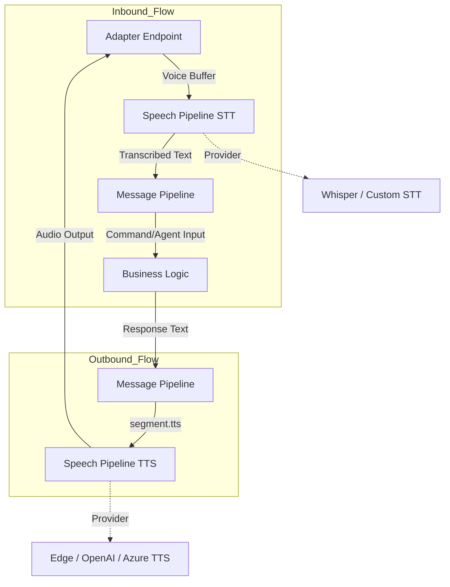
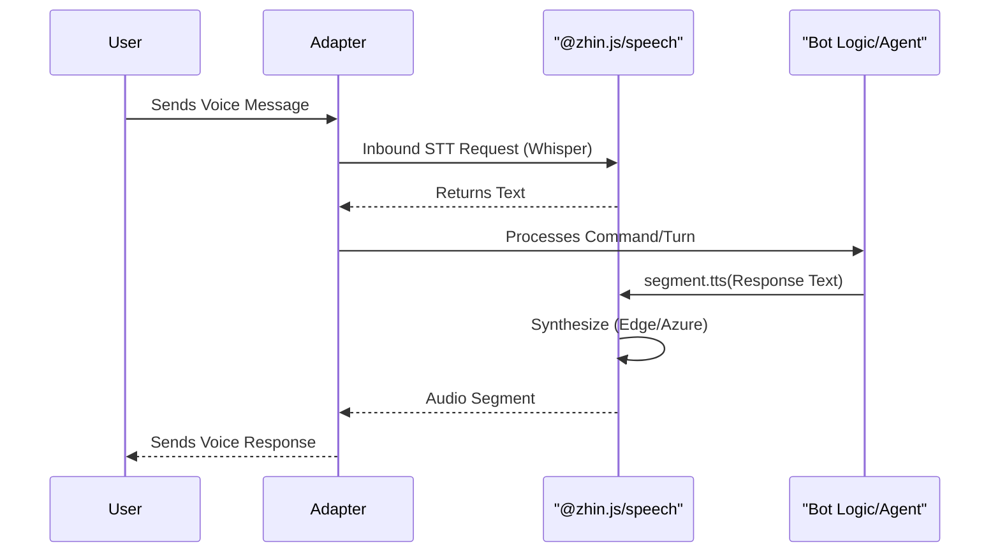

[中文版](/wiki/cubic/speech)

::: warning Generated reference snapshot
[Original Cubic page](https://www.cubic.dev/wikis/zhinjs/zhin?page=page-speech) · captured 2026-09-23 · [source commit](https://github.com/zhinjs/zhin/commit/368db14caa4aa91311fb090f07bd792fe4b22fe7). This AI-generated page has not been verified against the current code. Use the [Zhin documentation](/en/getting-started/) for current behavior and [see known corrections](/en/wiki/).
:::

::: danger Known correction
Some source citation line anchors in the Cubic original point to unrelated lines at the pinned commit. Check the linked file rather than relying on its line range. See [Speech](/en/ai/speech).
:::

::: details Relevant source files

The following files were used as context for generating this wiki page:

- [packages/toolkit/speech/package.json](https://github.com/zhinjs/zhin/blob/368db14caa4aa91311fb090f07bd792fe4b22fe7/packages/toolkit/speech/package.json)
- [README.md](https://github.com/zhinjs/zhin/blob/368db14caa4aa91311fb090f07bd792fe4b22fe7/README.md)
- [README.zh-CN.md](https://github.com/zhinjs/zhin/blob/368db14caa4aa91311fb090f07bd792fe4b22fe7/README.zh-CN.md)
- [AGENTS.md](https://github.com/zhinjs/zhin/blob/368db14caa4aa91311fb090f07bd792fe4b22fe7/AGENTS.md)
- [CLAUDE.md](https://github.com/zhinjs/zhin/blob/368db14caa4aa91311fb090f07bd792fe4b22fe7/CLAUDE.md)
- [packages/toolkit/scaffold-wizard/README.md](https://github.com/zhinjs/zhin/blob/368db14caa4aa91311fb090f07bd792fe4b22fe7/packages/toolkit/scaffold-wizard/README.md)
:::

# Speech Pipeline (STT & TTS)

The Speech Pipeline in Zhin.js provides optional Speech-to-Text (STT) and Text-to-Speech (TTS) capabilities. It enables multi-channel bots to process inbound voice data and generate outbound audio responses. The system operates as a modular "tier" that you can install only when the product requirements necessitate rich media interaction.

Sources: [README.md:92-99](https://github.com/zhinjs/zhin/blob/368db14caa4aa91311fb090f07bd792fe4b22fe7/README.md#L92-L99), [README.zh-CN.md:123](https://github.com/zhinjs/zhin/blob/368db14caa4aa91311fb090f07bd792fe4b22fe7/README.zh-CN.md#L123)

## Architecture and Data Flow

The speech module integrates directly into the Zhin.js message pipeline. When active, it intercepts inbound audio segments for transcription and converts outbound text segments into playable audio formats.


The diagram shows how speech segments flow between external adapters and the internal message pipeline via the speech toolkit.
Sources: [README.md:83-91](https://github.com/zhinjs/zhin/blob/368db14caa4aa91311fb090f07bd792fe4b22fe7/README.md#L83-L91), [packages/toolkit/speech/package.json:20-22](https://github.com/zhinjs/zhin/blob/368db14caa4aa91311fb090f07bd792fe4b22fe7/packages/toolkit/speech/package.json#L20-L22)

### Tier-Based Capabilities
Speech services are categorized under the "Connect" surface of the capability map. If the `@zhin.js/speech` package is missing, the system issues a warning and degrades to standard text processing.

Sources: [README.md:104-106](https://github.com/zhinjs/zhin/blob/368db14caa4aa91311fb090f07bd792fe4b22fe7/README.md#L104-L106), [README.zh-CN.md:123](https://github.com/zhinjs/zhin/blob/368db14caa4aa91311fb090f07bd792fe4b22fe7/README.zh-CN.md#L123)

## Components and Providers

The speech pipeline supports multiple industry-standard engines. These are managed via the `@zhin.js/speech` package, which lists core speech keywords such as Whisper and Edge-TTS.

| Feature | Description | Supported Engines |
| :--- | :--- | :--- |
| **STT** | Inbound Speech-to-Text transcription. | Whisper, Custom providers |
| **TTS** | Outbound Text-to-Speech synthesis. | Edge-TTS, OpenAI, Azure, Custom |
| **Segments** | Audio segment handling in the message pipeline. | `segment.tts` |

Sources: [packages/toolkit/speech/package.json:20-22](https://github.com/zhinjs/zhin/blob/368db14caa4aa91311fb090f07bd792fe4b22fe7/packages/toolkit/speech/package.json#L20-L22), [README.zh-CN.md:123](https://github.com/zhinjs/zhin/blob/368db14caa4aa91311fb090f07bd792fe4b22fe7/README.zh-CN.md#L123)

## Installation and Integration

The speech module is an advanced capability that adds approximately a few megabytes to the production size. It is not included in the default `<10MB` IM core installation.

### Dependency Management
To enable speech features, you must add the speech toolkit to your project:
```bash
pnpm add @zhin.js/speech
```
The package requires `@zhin.js/core` as a peer dependency and is written in TypeScript using ESM modules.

Sources: [README.md:126](https://github.com/zhinjs/zhin/blob/368db14caa4aa91311fb090f07bd792fe4b22fe7/README.md#L126), [packages/toolkit/speech/package.json:1-12](https://github.com/zhinjs/zhin/blob/368db14caa4aa91311fb090f07bd792fe4b22fe7/packages/toolkit/speech/package.json#L1-L12), [packages/toolkit/speech/package.json:28-34](https://github.com/zhinjs/zhin/blob/368db14caa4aa91311fb090f07bd792fe4b22fe7/packages/toolkit/speech/package.json#L28-L34)

### Integration Sequence
The following sequence illustrates a typical speech interaction turn:


Sources: [README.md:83-91](https://github.com/zhinjs/zhin/blob/368db14caa4aa91311fb090f07bd792fe4b22fe7/README.md#L83-L91), [README.zh-CN.md:123](https://github.com/zhinjs/zhin/blob/368db14caa4aa91311fb090f07bd792fe4b22fe7/README.zh-CN.md#L123)

## Configuration Summary

While primary configuration for individual providers is handled through standard Zhin.js configuration projection, the speech module itself is defined as a toolkit package.

| Configuration Element | Role | Reference File |
| :--- | :--- | :--- |
| `@zhin.js/speech` | Entry point for speech capabilities. | `packages/toolkit/speech/package.json` |
| `segment.tts` | The primary UI component for triggering synthesis. | `README.md` |
| `Connect` Surface | Governs adapters and speech integration rules. | `README.md` |

Sources: [README.md:104-106](https://github.com/zhinjs/zhin/blob/368db14caa4aa91311fb090f07bd792fe4b22fe7/README.md#L104-L106), [packages/toolkit/speech/package.json:1-5](https://github.com/zhinjs/zhin/blob/368db14caa4aa91311fb090f07bd792fe4b22fe7/packages/toolkit/speech/package.json#L1-L5)

## Conclusion

The Zhin.js Speech Pipeline provides a scalable solution for audio-based bot interactions. By separating STT and TTS into the `@zhin.js/speech` toolkit, the framework maintains a lightweight core while offering deep integration with professional audio synthesis and transcription engines like Whisper and Edge-TTS. If the module is not installed, the framework ensures stability through graceful degradation to text.

Sources: [README.md:92-99](https://github.com/zhinjs/zhin/blob/368db14caa4aa91311fb090f07bd792fe4b22fe7/README.md#L92-L99), [README.zh-CN.md:123](https://github.com/zhinjs/zhin/blob/368db14caa4aa91311fb090f07bd792fe4b22fe7/README.zh-CN.md#L123)
