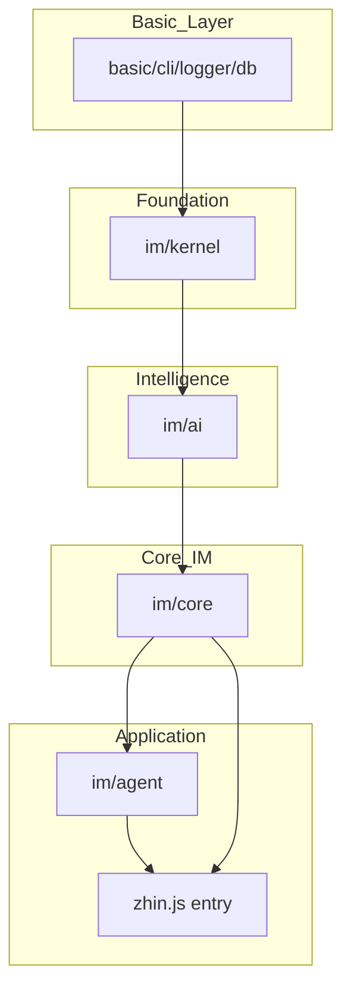
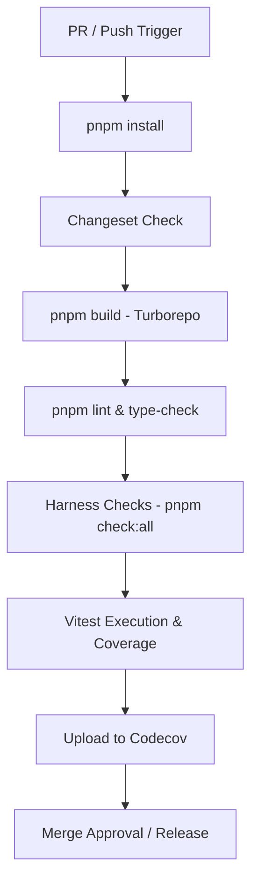

::: warning Generated reference snapshot
[Original Cubic page](https://www.cubic.dev/wikis/zhinjs/zhin?page=page-testing) · captured 2026-09-23 · [source commit](https://github.com/zhinjs/zhin/commit/368db14caa4aa91311fb090f07bd792fe4b22fe7). This AI-generated page has not been verified against the current code. Use the [Zhin documentation](/en/getting-started/) for current behavior and [see known corrections](/en/wiki/).
:::

Relevant source files

The following files were used as context for generating this wiki page:

- [CLAUDE.md](https://github.com/zhinjs/zhin/blob/368db14caa4aa91311fb090f07bd792fe4b22fe7/CLAUDE.md)
- [AGENTS.md](https://github.com/zhinjs/zhin/blob/368db14caa4aa91311fb090f07bd792fe4b22fe7/AGENTS.md)
- [basic/cli/TEST_GENERATION.md](https://github.com/zhinjs/zhin/blob/368db14caa4aa91311fb090f07bd792fe4b22fe7/basic/cli/TEST_GENERATION.md)
- [agents/tester/system.md](https://github.com/zhinjs/zhin/blob/368db14caa4aa91311fb090f07bd792fe4b22fe7/agents/tester/system.md)
- [agents/ops/system.md](https://github.com/zhinjs/zhin/blob/368db14caa4aa91311fb090f07bd792fe4b22fe7/agents/ops/system.md)
- [packages/toolkit/create-zhin/template/skills/plugin-publish/SKILL.md](https://github.com/zhinjs/zhin/blob/368db14caa4aa91311fb090f07bd792fe4b22fe7/packages/toolkit/create-zhin/template/skills/plugin-publish/SKILL.md)
- [packages/im/runtime/tests/console-feature-hmr.test.ts](https://github.com/zhinjs/zhin/blob/368db14caa4aa91311fb090f07bd792fe4b22fe7/packages/im/runtime/tests/console-feature-hmr.test.ts)
- [packages/im/agent/tests/plugin-runtime/native-knowledge-tool.test.ts](https://github.com/zhinjs/zhin/blob/368db14caa4aa91311fb090f07bd792fe4b22fe7/packages/im/agent/tests/plugin-runtime/native-knowledge-tool.test.ts)

# Testing & CI Harness

Zhin.js implements a multi-layered testing and Continuous Integration (CI) harness to maintain framework stability, enforce architectural boundaries, and ensure plugin quality. The harness combines Vitest for unit/integration testing with Turborepo for orchestrated builds and custom automated checks known as "harness engineering."

Sources: [CLAUDE.md:120-130](https://github.com/zhinjs/zhin/blob/368db14caa4aa91311fb090f07bd792fe4b22fe7/CLAUDE.md#L120-L130), [AGENTS.md:60-75](https://github.com/zhinjs/zhin/blob/368db14caa4aa91311fb090f07bd792fe4b22fe7/AGENTS.md#L60-L75)

## Testing Framework & Execution

Zhin.js uses **Vitest 4.x** as its primary testing framework. The environment enables globals by default, removing the need to import `describe`, `it`, or `expect` in test files. Tests run in a `node` environment with a default timeout of 10 seconds.

Sources: [CLAUDE.md:105-115](https://github.com/zhinjs/zhin/blob/368db14caa4aa91311fb090f07bd792fe4b22fe7/CLAUDE.md#L105-L115), [basic/cli/TEST_GENERATION.md:175-185](https://github.com/zhinjs/zhin/blob/368db14caa4aa91311fb090f07bd792fe4b22fe7/basic/cli/TEST_GENERATION.md#L175-L185)

### Key Test Execution Commands

| Command | Action |
|---------|--------|
| `pnpm test` | Runs all Vitest tests across the workspace |
| `pnpm test:watch` | Starts Vitest in watch mode |
| `pnpm test:coverage` | Generates code coverage reports (v8 provider) |
| `pnpm --filter <pkg> test` | Runs tests for a specific package |

Sources: [CLAUDE.md:17-25](https://github.com/zhinjs/zhin/blob/368db14caa4aa91311fb090f07bd792fe4b22fe7/CLAUDE.md#L17-L25), [basic/cli/TEST_GENERATION.md:180-190](https://github.com/zhinjs/zhin/blob/368db14caa4aa91311fb090f07bd792fe4b22fe7/basic/cli/TEST_GENERATION.md#L180-L190)

### Coverage Thresholds
The project enforces minimum coverage requirements to ensure code reliability:
- **Lines**: 45%
- **Branches**: 35%
Plugins generally aim for 60-70% base coverage, with a target of 90%+ for critical components.

Sources: [CLAUDE.md:113-114](https://github.com/zhinjs/zhin/blob/368db14caa4aa91311fb090f07bd792fe4b22fe7/CLAUDE.md#L113-L114), [basic/cli/TEST_GENERATION.md:195-200](https://github.com/zhinjs/zhin/blob/368db14caa4aa91311fb090f07bd792fe4b22fe7/basic/cli/TEST_GENERATION.md#L195-L200), [packages/toolkit/create-zhin/template/skills/plugin-publish/SKILL.md:65-70](https://github.com/zhinjs/zhin/blob/368db14caa4aa91311fb090f07bd792fe4b22fe7/packages/toolkit/create-zhin/template/skills/plugin-publish/SKILL.md#L65-L70)

## Architecture & Dependency Harness

The harness enforces a strict one-way dependency flow to prevent circular dependencies and architectural degradation. The hierarchy moves from foundation to application: `basic → kernel → ai → core → agent → zhin`.

Sources: [CLAUDE.md:65-75](https://github.com/zhinjs/zhin/blob/368db14caa4aa91311fb090f07bd792fe4b22fe7/CLAUDE.md#L65-L75), [AGENTS.md:70-80](https://github.com/zhinjs/zhin/blob/368db14caa4aa91311fb090f07bd792fe4b22fe7/AGENTS.md#L70-L80)

### Architectural Dependency Flow

The diagram represents the mandatory dependency direction where lower layers must not import from higher layers. Sources: [CLAUDE.md:65-75](https://github.com/zhinjs/zhin/blob/368db14caa4aa91311fb090f07bd792fe4b22fe7/CLAUDE.md#L65-L75), [AGENTS.md:70-80](https://github.com/zhinjs/zhin/blob/368db14caa4aa91311fb090f07bd792fe4b22fe7/AGENTS.md#L70-L80)

### Custom Harness Checks
The `pnpm check:all` command executes various specialized scripts to validate repo constraints:
- `check:architecture`: Verifies that no package violates the dependency hierarchy.
- `check:harness-paths`: Detects plugins that bypass `Adapter.sendMessage` to call internal bot methods directly.
- `check:no-koa`: Ensures plugins use the framework's `RouterContext` instead of direct Koa imports.
- `check:install-size`: Validates that the core IM production `node_modules` remains ≤10MB.
- `check:plugin`: Confirms plugins include mandatory files (package.json, README, src, tests).

Sources: [CLAUDE.md:30-45](https://github.com/zhinjs/zhin/blob/368db14caa4aa91311fb090f07bd792fe4b22fe7/CLAUDE.md#L30-L45), [AGENTS.md:85-95](https://github.com/zhinjs/zhin/blob/368db14caa4aa91311fb090f07bd792fe4b22fe7/AGENTS.md#L85-L95)

## CI/CD Pipeline & GitHub Actions

GitHub Actions manages the CI lifecycle through workflows defined in `ci.yml`. The pipeline runs on every Pull Request and push to the `main` branch, utilizing a matrix to test across multiple Node.js versions (22, 24, 26) and operating systems (Ubuntu, Windows).

Sources: [CLAUDE.md:120-128](https://github.com/zhinjs/zhin/blob/368db14caa4aa91311fb090f07bd792fe4b22fe7/CLAUDE.md#L120-L128), [agents/ops/system.md:15-25](https://github.com/zhinjs/zhin/blob/368db14caa4aa91311fb090f07bd792fe4b22fe7/agents/ops/system.md#L15-L25)

### CI Pipeline Sequence

This flowchart illustrates the sequential gates required for a code change to be considered stable within the Zhin environment. Sources: [CLAUDE.md:120-130](https://github.com/zhinjs/zhin/blob/368db14caa4aa91311fb090f07bd792fe4b22fe7/CLAUDE.md#L120-L130), [agents/ops/system.md:15-25](https://github.com/zhinjs/zhin/blob/368db14caa4aa91311fb090f07bd792fe4b22fe7/agents/ops/system.md#L15-L25)

## Automated Test Generation

The Zhin CLI provides automated test suite generation through the `zhin new` command. When you create a new plugin, service, or adapter, the CLI populates a `tests/index.test.ts` file with relevant boilerplate.

Sources: [basic/cli/TEST_GENERATION.md:5-15](https://github.com/zhinjs/zhin/blob/368db14caa4aa91311fb090f07bd792fe4b22fe7/basic/cli/TEST_GENERATION.md#L5-L15)

### Template Capabilities
- **Plugins**: Includes lifecycle tests (start/stop), instance validation, and middleware execution.
- **Adapters**: Mocks endpoints to test message receiving, sending, and lifecycle events like `message.receive`.
- **Services**: Generates placeholders for dependency injection and method execution tests.

Sources: [basic/cli/TEST_GENERATION.md:25-90](https://github.com/zhinjs/zhin/blob/368db14caa4aa91311fb090f07bd792fe4b22fe7/basic/cli/TEST_GENERATION.md#L25-L90)

## Quality Control & Release Roles

The harness includes specialized AI Agent roles to monitor and maintain quality:

1.  **Tester Agent**: Performs functional verification of PRs, designs test cases for edge cases, and provides structured Bug reports if validation fails. Sources: [agents/tester/system.md:5-15](https://github.com/zhinjs/zhin/blob/368db14caa4aa91311fb090f07bd792fe4b22fe7/agents/tester/system.md#L5-L15)
2.  **Ops Agent**: Monitors workflow status, manages release tags (v{major}.{minor}.{patch}), and ensures environment variables/secrets are not leaked in CI logs. Sources: [agents/ops/system.md:5-15](https://github.com/zhinjs/zhin/blob/368db14caa4aa91311fb090f07bd792fe4b22fe7/agents/ops/system.md#L5-L15)

### Release Readiness Checklist
Before publishing a plugin, the harness requires:
- `pnpm build` (tsc) passes with zero errors.
- All tests pass with adequate coverage (≥60%).
- `npm pack --dry-run` confirms the presence of `lib/`, `src/`, and `skills/` directories.
- No sensitive keys exist in `.env` or configuration files.

Sources: [packages/toolkit/create-zhin/template/skills/plugin-publish/SKILL.md:40-100](https://github.com/zhinjs/zhin/blob/368db14caa4aa91311fb090f07bd792fe4b22fe7/packages/toolkit/create-zhin/template/skills/plugin-publish/SKILL.md#L40-L100)

Testing and CI in Zhin.js focus on early discovery of architectural violations and ensuring that every plugin provides a baseline level of verification through automated generation and strict CI gates.

Sources: [CLAUDE.md:130-135](https://github.com/zhinjs/zhin/blob/368db14caa4aa91311fb090f07bd792fe4b22fe7/CLAUDE.md#L130-L135), [AGENTS.md:65](https://github.com/zhinjs/zhin/blob/368db14caa4aa91311fb090f07bd792fe4b22fe7/AGENTS.md#L65)
