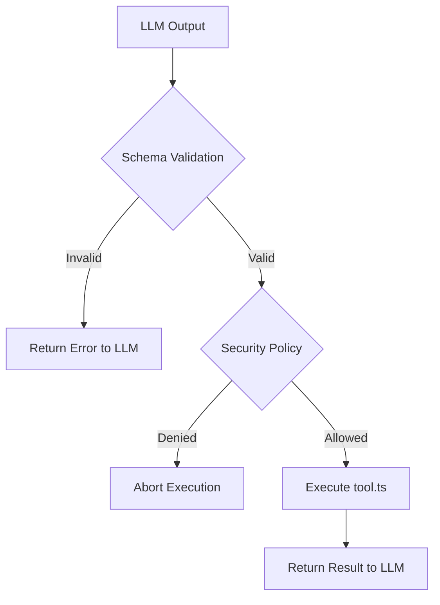
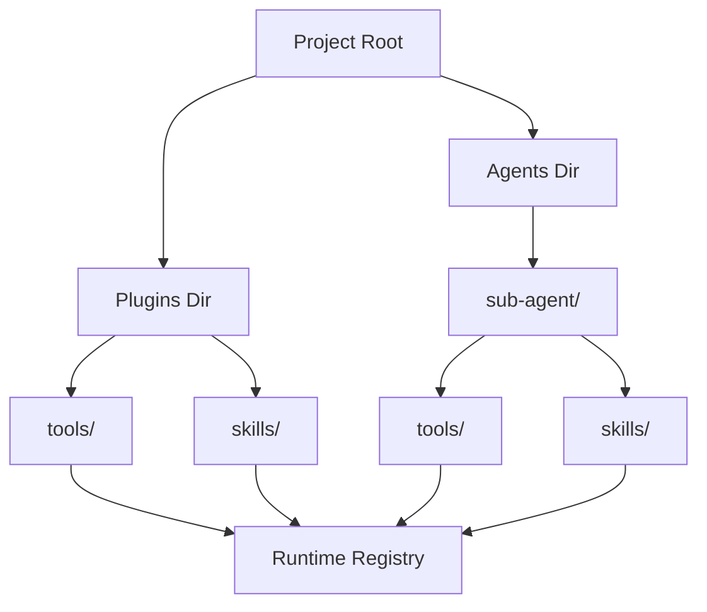

[中文版](/wiki/cubic/tools-caps)

::: warning Generated reference snapshot
[Original Cubic page](https://www.cubic.dev/wikis/zhinjs/zhin?page=page-tools-caps) · captured 2026-09-23 · [source commit](https://github.com/zhinjs/zhin/commit/368db14caa4aa91311fb090f07bd792fe4b22fe7). This AI-generated page has not been verified against the current code. Use the [Zhin documentation](/en/getting-started/) for current behavior and [see known corrections](/en/wiki/archive).
:::

::: details Relevant source files

The following files were used as context for generating this wiki page:

- [packages/im/agent-feature/src/definition.ts](https://github.com/zhinjs/zhin/blob/368db14caa4aa91311fb090f07bd792fe4b22fe7/packages/im/agent-feature/src/definition.ts)
- [packages/im/agent/src/discovery/agent-surface-info.ts](https://github.com/zhinjs/zhin/blob/368db14caa4aa91311fb090f07bd792fe4b22fe7/packages/im/agent/src/discovery/agent-surface-info.ts)
- [packages/toolkit/create-zhin/template/skills/skill-creator/SKILL.md](https://github.com/zhinjs/zhin/blob/368db14caa4aa91311fb090f07bd792fe4b22fe7/packages/toolkit/create-zhin/template/skills/skill-creator/SKILL.md)
- [packages/toolkit/create-zhin/template/skills/plugin-develop/SKILL.md](https://github.com/zhinjs/zhin/blob/368db14caa4aa91311fb090f07bd792fe4b22fe7/packages/toolkit/create-zhin/template/skills/plugin-develop/SKILL.md)
- [AGENTS.md](https://github.com/zhinjs/zhin/blob/368db14caa4aa91311fb090f07bd792fe4b22fe7/AGENTS.md)
- [packages/im/agent/tests/agent-definition-enhancements.test.ts](https://github.com/zhinjs/zhin/blob/368db14caa4aa91311fb090f07bd792fe4b22fe7/packages/im/agent/tests/agent-definition-enhancements.test.ts)
:::

# Agent Tools & Capabilities

Agent Tools and Capabilities provide the functional interface for AI agents within the Zhin.js framework. They allow agents to interact with the external environment, execute logic, and follow repeatable workflows. These capabilities are governed by a centralized runtime that manages discovery, security policies, and execution lifecycle.

The system distinguishes between **Tools** (functional code units) and **Skills** (repeatable Markdown-based workflows). Both are discovered via convention-based directory structures within plugins or the main project workspace.

## Agent Tools

Tools are the primary mechanism for an agent to perform actions. You define a tool using the `defineAgentTool()` function, which requires a description and an input schema.

### Tool Structure and Definition
Each tool exists as a standalone module, typically in a `tools/<name>/index.ts` file. The runtime uses the `inputSchema` to validate LLM generated arguments before execution.


The diagram shows the validation and security checkpoints required before a tool executes its internal logic.
Sources: [packages/toolkit/create-zhin/template/skills/plugin-develop/SKILL.md:59-71](https://github.com/zhinjs/zhin/blob/368db14caa4aa91311fb090f07bd792fe4b22fe7/packages/toolkit/create-zhin/template/skills/plugin-develop/SKILL.md#L59-L71), [AGENTS.md:144-150](https://github.com/zhinjs/zhin/blob/368db14caa4aa91311fb090f07bd792fe4b22fe7/AGENTS.md#L144-L150)

### Key Tool Components
| Component | Description |
| :--- | :--- |
| **Description** | A concise text explaining what the tool does and when the agent should use it. |
| **Input Schema** | A Zod or JSON Schema defining the expected parameters. |
| **Execute Function** | The asynchronous logic that performs the task and returns a string or object. |
| **Security Policy** | Metadata defining if the tool requires user approval (`ask`) or follows an allowlist. |

Sources: [packages/toolkit/create-zhin/template/skills/plugin-develop/SKILL.md:59-71](https://github.com/zhinjs/zhin/blob/368db14caa4aa91311fb090f07bd792fe4b22fe7/packages/toolkit/create-zhin/template/skills/plugin-develop/SKILL.md#L59-L71), [AGENTS.md:144-150](https://github.com/zhinjs/zhin/blob/368db14caa4aa91311fb090f07bd792fe4b22fe7/AGENTS.md#L144-L150)

## Agent Skills

Skills represent repeatable, searchable, and executable workflows defined in Markdown (`SKILL.md`). Unlike tools, skills focus on the process and sequence of actions rather than raw execution logic.

### Skill Definition
A skill package contains frontmatter metadata and a structured Markdown body. The `name` in the frontmatter must match the directory name.

```yaml
---
name: my-skill
description: "Used when the user asks for X. Triggers: keywords"
keywords: [keyword1, keyword2]
tags: [zhin, plugin]
---
```
Sources: [packages/toolkit/create-zhin/template/skills/skill-creator/SKILL.md:30-41](https://github.com/zhinjs/zhin/blob/368db14caa4aa91311fb090f07bd792fe4b22fe7/packages/toolkit/create-zhin/template/skills/skill-creator/SKILL.md#L30-L41)

### Skill Workflow Requirements
- **Triggers**: Explicit keywords and description markers that help the agent activate the skill.
- **Numbered Steps**: A step-by-step instruction set specifying inputs, actions, and outputs.
- **Failures & Fallbacks**: A table or list describing what to do when specific steps fail.
- **Constraints**: A "What not to do" section to prevent hallucination or improper tool usage.

Sources: [packages/toolkit/create-zhin/template/skills/skill-creator/SKILL.md:43-60](https://github.com/zhinjs/zhin/blob/368db14caa4aa91311fb090f07bd792fe4b22fe7/packages/toolkit/create-zhin/template/skills/skill-creator/SKILL.md#L43-L60)

## Discovery and Architecture

The Zhin.js runtime scans specific directories to register capabilities. This convention-based discovery allows for hot-reloading (HMR) and modular expansion.

### Capability Discovery Flow

The discovery mechanism registers both global capabilities and agent-private capabilities nested within specific agent directories.
Sources: [packages/im/agent/src/discovery/agent-surface-info.ts:60-84](https://github.com/zhinjs/zhin/blob/368db14caa4aa91311fb090f07bd792fe4b22fe7/packages/im/agent/src/discovery/agent-surface-info.ts#L60-L84), [packages/im/agent-feature/README.md:1-25](https://github.com/zhinjs/zhin/blob/368db14caa4aa91311fb090f07bd792fe4b22fe7/packages/im/agent-feature/README.md#L1-L25)

### Scoped Access
Capabilities are disclosed progressively based on the active context:
1. **Global Tools**: Located in the project root or plugin root `tools/`.
2. **Skill-Private Tools**: Located in `skills/<name>/tools/`; disclosed only when the skill is active.
3. **Agent-Private Tools**: Located in `agents/<name>/tools/`; disclosed only to the specific agent.

Sources: [CLAUDE.md:88-96](https://github.com/zhinjs/zhin/blob/368db14caa4aa91311fb090f07bd792fe4b22fe7/CLAUDE.md#L88-L96), [packages/im/agent-feature/README.md:27-40](https://github.com/zhinjs/zhin/blob/368db14caa4aa91311fb090f07bd792fe4b22fe7/packages/im/agent-feature/README.md#L27-L40)

## Agent Definition and Configuration

Agents are defined by an `agent.json` manifest and core Markdown files. This manifest controls the agent's behavior, iteration limits, and allowed capabilities.

### Agent Manifest Fields
| Field | Type | Description |
| :--- | :--- | :--- |
| `name` | `string` | Stable capability ID (kebab-case). |
| `trigger_rules` | `object` | Keywords and file patterns that trigger this agent. |
| `entry_points` | `string[]` | Must include `system.md`, `boundaries.md`, and `conventions.md`. |
| `disallowed_tools` | `string[]` | List of tools the agent is prohibited from using. |
| `max_iterations` | `number` | Limit on tool-call loops (default varies by effort level). |
| `effort` | `enum` | Iteration budget: `low` (3), `medium` (5), `high` (10), `max` (20). |

Sources: [packages/im/agent-feature/src/definition.ts:25-56](https://github.com/zhinjs/zhin/blob/368db14caa4aa91311fb090f07bd792fe4b22fe7/packages/im/agent-feature/src/definition.ts#L25-L56), [packages/im/agent/tests/agent-definition-enhancements.test.ts:79-88](https://github.com/zhinjs/zhin/blob/368db14caa4aa91311fb090f07bd792fe4b22fe7/packages/im/agent/tests/agent-definition-enhancements.test.ts#L79-L88)

### Security and Governance
The runtime enforces security through multiple layers:
- **Execution Policy**: Controlled via `execSecurity` (e.g., `allowlist`) and `execApprovalMode` (e.g., `ask`).
- **File & Network Policies**: Restricts access to sensitive files or unauthorized domains.
- **Sub-agent Filtering**: Sub-agents automatically block dangerous tools like `spawn_task` unless explicitly permitted.

Sources: [AGENTS.md:144-150](https://github.com/zhinjs/zhin/blob/368db14caa4aa91311fb090f07bd792fe4b22fe7/AGENTS.md#L144-L150), [packages/im/agent/tests/agent-definition-enhancements.test.ts:16-25](https://github.com/zhinjs/zhin/blob/368db14caa4aa91311fb090f07bd792fe4b22fe7/packages/im/agent/tests/agent-definition-enhancements.test.ts#L16-L25)

## Implementation Summary

Agent capabilities are integrated into the message pipeline. When a message is received, the `ZhinAgent` orchestrator determines the appropriate agent, activates relevant skills based on keywords, and manages the tool-call loop within a secure sandbox environment. The modular nature of tools and skills ensures that specific plugin logic remains separated from the core IM runtime.
