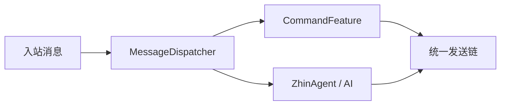
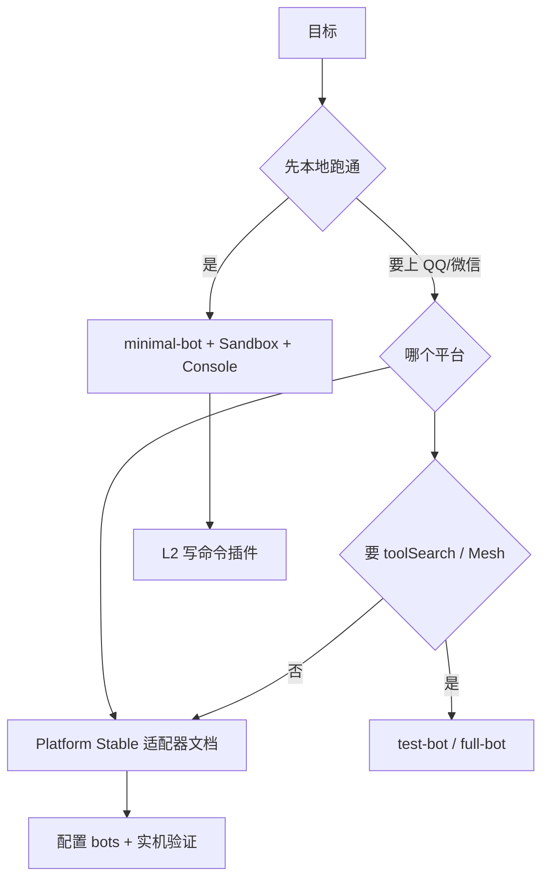

# 能力分档与产品定位

> 维护者决策记录见 [ADR 0015 — 能力分档模型](/adr/0015-capability-tier-model)。

Zhin.js 是 **TypeScript AI Agent 运行时**：通过 **Endpoint** 接入 IM、邮件、GitHub、Sandbox 等通道，同时支持 **传统命令交互**、**ZhinAgent 对话** 与 **二者混合**。

**产品对标**：多通道 **生活/工作助手**（私聊/群聊、记忆、cron、Home Assistant、通知）——不是 Cursor / Claude Code 类的 **写代码 Agent**，也不内置 **plan mode** 或以改仓库为主轴的 Harness。IM 是 Endpoint 的主场景之一，不是产品定义的全部。

## 产品边界（刻意不做 vs 计划中）

| 方向 | 态度 | 说明 |
|------|------|------|
| 多轮对话、工具、记忆、Compaction、会话树 | ✅ 核心 | 服务**对话与生活场景**；会话树是「聊天分支」，不是代码变更计划 |
| `spawn_task` / 子 Agent | ✅ Advanced | 任务分工（查资料、总结），非 IDE 式 plan-and-execute 写代码 |
| Assistant Runtime、Home、Profile | ✅ Advanced / opt-in | [ADR 0008](/adr/0008-introduce-assistant-runtime.md) 路线 |
| **RAG / 知识库** | ✅ Advanced | `knowledge_search` 工具，`ai.knowledge.baseDir` 配置 |
| **plan mode、终端 coding harness、项目级写代码** | ❌ 不在范围 | [ADR 0010](/adr/0010-pi-coding-agent-harness-alignment.md) 仅借鉴 compaction/会话树，不照搬 pi coding-agent 产品形态 |
| MCP Server 对外暴露工具 | 可选集成 | 供 Claude Desktop / Cursor **调用** Zhin；不改变 Zhin 自身「生活助手」定位 |

与 pi 的关系：对齐 **LLM 内核与会话 Harness 机制**，不对齐 **coding-agent 终端产品**。详见 [pi 映射表](/advanced/pi-coding-agent-mapping) 与 ADR 0010「不在本 ADR 范围」。

## 四档一览

| 档位 | 一句话 | 验证 |
|------|--------|------|
| **Stable（Core）** | 最少配置能跑：Sandbox + AI + 命令 + cron + MCP Client 契约 | `pnpm check:stable`（Core 批）· [minimal-bot](https://github.com/zhinjs/zhin/tree/main/examples/minimal-bot) |
| **Platform Stable** | 主流 IM 适配器，框架侧 integration 有 CI | `pnpm check:stable`（Platform 批）· [适配器索引](/adapters/) |
| **Advanced** | 编排增强：toolSearch、MCP Mesh、多 Endpoint 同进程 | [test-bot ACCEPTANCE](https://github.com/zhinjs/zhin/blob/main/examples/test-bot/ACCEPTANCE.md) |
| **Experimental** | 协议试验，自行验证 | 无全量 CI 承诺 |

**Platform Stable 说明**：我们保证 Adapter 与消息链路的集成测试；QQ 风控、公众号 HTTPS、NapCat 部署等 **平台侧问题由你自担**。

## 命令与 AI：同一套栈

很多用户以为必须二选一。实际上：

| 能力 | 档位 | 文档 |
|------|------|------|
| `MessageCommand` / `addCommand` | Stable | [命令系统](/essentials/commands) |
| `/` 前缀命令（不触发 AI） | Stable | `ai.trigger.ignorePrefixes` |
| `@` / 关键词触发 Agent | Stable | [AI 模块](/advanced/ai) |
| 内置运维命令 `/tools`、`/mcp` | Stable（需 trusted） | [命令 — 内置 IM 运维](/essentials/commands#内置-im-运维命令adr-0010) |
| `toolSearch` + Worker | Advanced | [Agent 概念 — toolSearch](/advanced/agent-concepts#toolsearch何时开启) |

典型混合 Bot：日常用 `hello`、`签到` 等命令；需要时用 `@机器人` 或 `ai:` 前缀走 Agent。

## Platform Stable 适配器（当前）

| 适配器 | 文档 |
|--------|------|
| ICQQ | [icqq](/adapters/icqq) |
| QQ 官方 | [qq](/adapters/qq) |
| OneBot v11 | [onebot11](/adapters/onebot11) |
| NapCat | [napcat](/adapters/napcat) |
| KOOK | [kook](/adapters/kook) |
| Telegram | [telegram](/adapters/telegram) |
| Discord | [discord](/adapters/discord) |
| Slack | [slack](/adapters/slack) |
| 钉钉 | [dingtalk](/adapters/dingtalk) |
| 飞书 | [lark](/adapters/lark) |
| 微信公众号 | [wechat-mp](/adapters/wechat-mp) |
| 微信 iLink（个人微信） | [weixin-ilink](/adapters/weixin-ilink) |

本地调试 IM 仍推荐 **Sandbox**（Stable Core）：[Remote Console 沙盒页](/console-remote#官方管理界面能做什么)。

完整矩阵与 Experimental 列表见 [平台适配器索引](/adapters/)。

**Platform Stable 共 12 个 IM 路径**（含 QQ 三件套 ICQQ / NapCat / OneBot11 与个人微信 iLink）。

## 待补充平台

下列 IM 尚无 Platform Stable 适配器，Issue 跟踪中：

| 平台 | 跟踪 |
|------|------|
| 企业微信（WeCom） | [#484](https://github.com/zhinjs/zhin/issues/484) |
| LINE | [#485](https://github.com/zhinjs/zhin/issues/485) |

## Stable（Core）还包含什么

除 Sandbox 外，下列**不**需要开启 Advanced 开关：

- 插件化（`usePlugin`）、热重载、TypeScript
- Feature：Tool / Skill / cron / 数据库（`cron-engine` 在 `check:stable`）
- MCP Client：filesystem 等（`mcpServers` 默认可为空；见 [MCP 集成](/advanced/mcp)）
- Agent：`spawn_task`、exec 策略、三层文件记忆、Bootstrap（SOUL/AGENTS/TOOLS）
- Remote Console 连接 Host API（见下）

## Remote Console = 官方管理界面

Host（`:8086`）**故意不提供**内嵌网页 UI；**[console.zhin.dev](https://console.zhin.dev)** 即为官方管理面板（独立仓库 [zhin-console](https://github.com/zhinjs/zhin-console)）。

这不是「少做了一个 GUI」，而是 **UI 与 Endpoint 解耦**：

- 一个 Console 可管理多个 Host（换 API Base 即可）；
- 改 Console 不用重启 Bot；
- 适配器可通过 Console Entry 扩展专属页（如 ICQQ 登录辅助）。

登录：API Base（如 `http://127.0.0.1:8086`）+ Bearer Token（`.env` 的 `HTTP_TOKEN`）。详见 [Remote Console](/console-remote)。

## 我该用哪条路径

| 目标 | 起点 |
|------|------|
| 5 分钟首跑 | [快速开始](/getting-started/) → Console 沙盒 |
| 纯命令 Endpoint | [命令系统](/essentials/commands) + 任选 Platform Stable 适配器 |
| QQ / 微信系 | [qq](/adapters/qq)、[icqq](/adapters/icqq)、[wechat-mp](/adapters/wechat-mp)、[weixin-ilink](/adapters/weixin-ilink)、[napcat](/adapters/napcat) |
| Agent + MCP | [Agent 概念](/advanced/agent-concepts) → [test-bot](https://github.com/zhinjs/zhin/tree/main/examples/test-bot) |
| 硬编排 + 语义记忆 | [full-bot](https://github.com/zhinjs/zhin/tree/main/examples/full-bot) · `pnpm check:l4` |

## 维护者：升档检查清单

将适配器升为 Platform Stable 时：

1. 确认 `integration.test.ts` 通过；
2. 更新 `scripts/sync-adapter-docs.mjs` 的 `ADAPTER_META`；
3. 将测试路径加入 `scripts/run-stable-smoke.mjs` 的 `platformStableTests`；
4. `pnpm sync:adapter-docs` + `pnpm check:stable`；
5. 更新 [ACCEPTANCE.md](https://github.com/zhinjs/zhin/blob/main/examples/test-bot/ACCEPTANCE.md) Platform Stable 段。

## 相关文档

- [学习路径](/essentials/learning-paths)
- [适配器概览](/essentials/adapters)
- [Host 栈](/host/)
- [Harness 工程](/contributing/harness-engineering)
