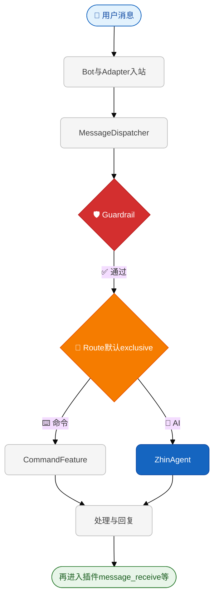

# 核心概念

> **级别：L1～L2**。不知道从哪里读起时，先看 [学习路径](./learning-paths)；弄清消息顺序请看 [消息如何流转](./message-flow)。

在深入学习之前，让我们先理解 Zhin.js 的核心概念。这些概念是构建机器人的基础。

## 插件（Plugin）

**插件是 Zhin.js 中最基本的功能单元**。每个插件都是一个独立的模块，可以添加命令、中间件、服务等功能。

### 什么是插件？

想象你在搭积木：
- **Zhin.js** 是积木底板
- **插件** 是各种形状的积木块
- 你可以自由组合这些积木块，搭建出你想要的机器人

### 创建插件

使用 `usePlugin()` 获取插件 API：

```typescript
import { usePlugin } from 'zhin.js'

const { addCommand, logger } = usePlugin()

logger.info('插件已加载')
```

**解释**：
- `usePlugin()` 返回当前插件的 API 对象
- `logger` 是日志工具，用于输出信息
- 每个插件文件都会自动调用 `usePlugin()`

### 插件的作用

- ✅ **添加命令** - 让机器人响应用户消息
- ✅ **处理消息** - 拦截和修改消息流
- ✅ **提供服务** - 为其他插件提供功能
- ✅ **管理数据** - 存储和查询数据

## 命令（Command）

**命令是用户与机器人交互的主要方式**。用户发送特定格式的消息，机器人执行相应的操作。

### 命令的组成

一个命令包含三个部分：

1. **模式（Pattern）** - 命令的触发词和参数格式
2. **描述（Description）** - 命令的说明
3. **动作（Action）** - 命令被触发时执行的函数

### 创建命令

```typescript
import { MessageCommand } from 'zhin.js'

addCommand(
  new MessageCommand('hello')           // 1. 模式
    .desc('打个招呼')                    // 2. 描述
    .action(() => '你好！')              // 3. 动作
)
```

### 带参数的命令

```typescript
addCommand(
  new MessageCommand('echo <message:string>')
    .desc('回显消息')
    .action((_, result) => {
      // result.params.message 是用户输入的参数
      return `你说：${result.params.message}`
    })
)
```

**用户输入**：`echo 测试`  
**机器人回复**：`你说：测试`

## 中间件（Middleware）

> **级别：L2～L3**。请先阅读 [消息如何流转](./message-flow)：框架用 **MessageDispatcher** 做主路由；**在路由之前**拦截请优先 **Guardrail** 或 [消息过滤](./message-filter)；`addMiddleware` 注册的链主要在 Dispatcher **主处理之后** 运行。

**中间件**仍可用于日志、统计、在 `next()` 前后附加逻辑等。详细说明、与 Guardrail 的分工及示例见 **[中间件与消息调度](./middleware)**。

## 上下文（Context）

**上下文是依赖管理系统**。它确保在使用某个服务前，该服务已经准备好。

### 为什么需要上下文？

假设你的插件需要使用数据库：
- ❌ 直接使用 - 可能数据库还没启动，导致错误
- ✅ 使用上下文 - 等数据库启动后再执行你的代码

### 使用上下文

```typescript
const { useContext } = usePlugin()

useContext('database', (db) => {
  // 这里的代码只在数据库启动后执行
  const users = db.models.get('users')
  console.log('数据库已就绪')
})
```

### 等待多个上下文

```typescript
useContext('database', 'http', (db, http) => {
  // 等数据库和 HTTP 服务都启动后执行
  console.log('所有服务已就绪')
})
```

## 服务（Service）

**服务是可复用的功能模块**。你可以创建服务供其他插件使用。

### 提供服务

```typescript
const { provide } = usePlugin()

provide({
  name: 'calculator',
  description: '计算器服务',
  value: {
    add(a, b) {
      return a + b
    },
    multiply(a, b) {
      return a * b
    }
  }
})
```

### 使用服务

```typescript
const { inject } = usePlugin()

const calculator = inject('calculator')
if (calculator) {
  console.log(calculator.add(1, 2))  // 3
}
```

## 生命周期

**生命周期钩子让你在特定时机执行代码**。

### 主要生命周期

```typescript
const { onMounted, onDispose } = usePlugin()

// 插件启动时
onMounted(() => {
  console.log('插件已启动')
  // 初始化资源、连接数据库等
})

// 插件卸载时
onDispose(() => {
  console.log('插件已卸载')
  // 清理资源、关闭连接等
})
```

### 实用示例：定时任务

```typescript
onMounted(() => {
  const timer = setInterval(() => {
    console.log('每分钟执行一次')
  }, 60000)
  
  // 卸载时清理定时器
  onDispose(() => {
    clearInterval(timer)
  })
})
```

## 完整示例

让我们把这些概念组合起来，创建一个完整的插件：

```typescript
import { usePlugin, MessageCommand } from 'zhin.js'

const {
  addCommand,
  addMiddleware,
  useContext,
  onMounted,
  onDispose,
  logger
} = usePlugin()

// 1. 生命周期
onMounted(() => {
  logger.info('待办插件已启动')
})

// 2. 中间件（记录所有命令）
addMiddleware(async (message, next) => {
  logger.debug(`用户 ${message.$sender?.id} 发送: ${message.$raw}`)
  return next()
})

// 3. 使用数据库上下文
useContext('database', (db) => {
  // 4. 添加命令
  addCommand(
    new MessageCommand('todo <text:string>')
      .desc('添加待办事项')
      .action(async (_, result) => {
        // 保存到数据库
        await db.models.get('todos').insert({
          text: result.params.text
        })
        return '✅ 已添加'
      })
  )
})

// 5. 清理
onDispose(() => {
  logger.info('待办插件已卸载')
})
```

## 核心概念关系图

下图粗粒度表示 **Dispatcher 内部**；完整入站顺序（含 `Adapter.emit`、根插件 `message.receive`）见 [消息如何流转](./message-flow)。



> 详细分层与依赖请参阅 [架构概览](/architecture-overview)；术语见 [术语表](/reference/glossary)。

## 下一步

现在你已经理解了核心概念，可以继续学习：

- **[学习路径](./learning-paths)** - 按 L1/L2/L3 选读
- **[消息如何流转](./message-flow)** - 入站/出站一页弄清
- **[配置文件](./configuration)** - 配置机器人行为
- **[命令系统](./commands)** - 深入学习命令开发
- **[插件系统](./plugins)** - 创建复杂的插件
- **[中间件](./middleware)** - 与 Dispatcher、Guardrail 的配合
- **[插件开发、测试与发布](/guide/plugin-development)** - 完整的插件生命周期指南

