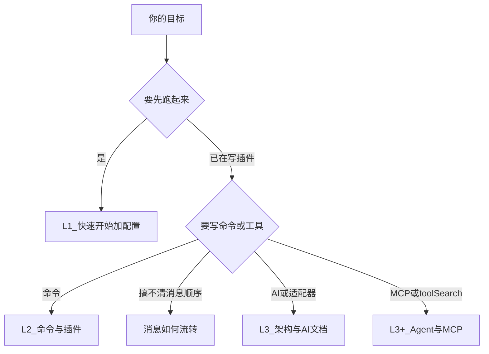

# 学习路径

> **L1 起点**：先能跑起来，再按需加深。不必一次读完所有文档。

Zhin.js 文档按三条跑道组织，对应不同目标。

## L1 — 能用

**目标**：安装、配置、让机器人收到消息并回复。

**建议阅读顺序**：

1. [快速开始 / 安装与启动](/getting-started/)
2. [配置文件](/essentials/configuration)
3. 任选：[Remote Console](/console-remote)（管理 bot 与 Sandbox）
4. 任选：[消息如何流转](/essentials/message-flow)（一页弄清「消息从哪来到哪去」）

**这一阶段不必了解**：`@zhin.js/kernel`、`AsyncLocalStorage` 出站上下文、`PluginBase`、双轨路由细节。

## L2 — 会写业务插件

**目标**：用 `usePlugin` 加命令、简单处理消息、读配置。

**在 L1 基础上继续**：

1. [核心概念](/essentials/)（插件、命令）
2. [命令系统](/essentials/commands)
3. [插件系统](/essentials/plugins)

**可选**：

- [中间件与消息调度](/essentials/middleware)（L2～L3，建议先读 [消息如何流转](/essentials/message-flow)）
- [适配器概览](/essentials/adapters)（多平台同跑、群管工具）
- [平台适配器索引](/adapters/)（各平台安装与配置，一适配器一篇）

## L3 — 扩展与贡献

**目标**：理解全链路、AI 与工具、适配器/仓库结构，向社区贡献。

**推荐阅读**：

1. [架构概览](/architecture-overview)
2. [消息如何流转](/essentials/message-flow)（与源码、`AGENTS.md` 对齐）
3. [AI 模块](/advanced/ai)
4. [工具与技能](/advanced/tools-skills)
5. [贡献指南](/contributing) 与 [仓库结构与模块化约定](/contributing/repo-structure)

**术语速查**：[术语表](/reference/glossary)

## L3+ — AI 与 MCP 进阶

**目标**：在跑通 Stable 路径后，理解 Agent 编排、接入 MCP、启用 Advanced 能力。

**建议在 L3 之前或并行阅读**（概念优先于配置细节）：

1. [Agent 概念入门](/advanced/agent-concepts)
2. [AI 模块](/advanced/ai)
3. [MCP 集成](/advanced/mcp)
4. [工具与技能](/advanced/tools-skills)
5. [Agent 安全与角色](/advanced/agent-harness-engineering)

**验证环境**：[examples/test-bot](https://github.com/zhinjs/zhin/tree/main/examples/test-bot)（厨房水槽，非默认模板）。

## L4 — 全维度参考

**目标**：在 Stable 之上验收硬编排、语义记忆、MCP Agent Mesh、多适配器（Sandbox + NapCat + KOOK）。

**建议阅读**：

1. [Agent Mesh 硬编排](/advanced/agent-mesh)
2. [MCP 集成](/advanced/mcp)
3. [examples/full-bot](https://github.com/zhinjs/zhin/tree/main/examples/full-bot) README 与 ACCEPTANCE.md

**验证**：`pnpm check:l4`（仓库根）；Stable 仍用 `pnpm check:stable`（仅 minimal-bot）。

**进阶路径**：**Stable（minimal-bot）→ L4（full-bot）→ 厨房水槽（test-bot）**。

## 生活助手路径

**目标**：搭建一个能聊天、记东西、定时提醒、查询知识的个人助手（不是写代码的 Agent）。

**与 L1-L4 的关系**：生活助手 = L1（跑起来）+ L2（写插件）+ 部分 L3+（记忆、知识库）。不需要 L4 的硬编排和多适配器。

**建议阅读顺序**：

1. [快速开始](/getting-started/) — 跑通 minimal-bot
2. [配置文件 / 记忆系统](/essentials/configuration#记忆系统) — 开启 Markdown 三层记忆 + 语义记忆
3. [配置文件 / 本地知识库](/essentials/configuration#本地知识库-knowledge-search-工具) — 创建 `knowledge/` 目录放入 FAQ/说明书
4. [AI 模块](/advanced/ai) — 理解 Provider、Agent、工具调用
5. [工具与技能](/advanced/tools-skills) — 注册自定义工具（天气、日程等）
6. 可选：[Agent 安全](/advanced/agent-harness-engineering) — 沙箱、执行策略

**关键配置**：

```yaml
# zhin.config.yml — 生活助手推荐配置
ai:
  knowledge:
    baseDir: knowledge           # 本地知识库
  memory:
    semantic:
      enabled: true              # 语义记忆（碎片事实）
  agent:
    execSecurity: allowlist      # 安全模式
```

**明确**：生活助手 ≠ 写代码 Agent。它关注的是对话、记忆、提醒、知识检索，不涉及 plan mode 或终端 coding harness。

## 我现在该读哪篇？



仓库内给 AI/自动化代理的速查表见根目录 **`AGENTS.md`**（维护者向，可与 L3 对照阅读）。
