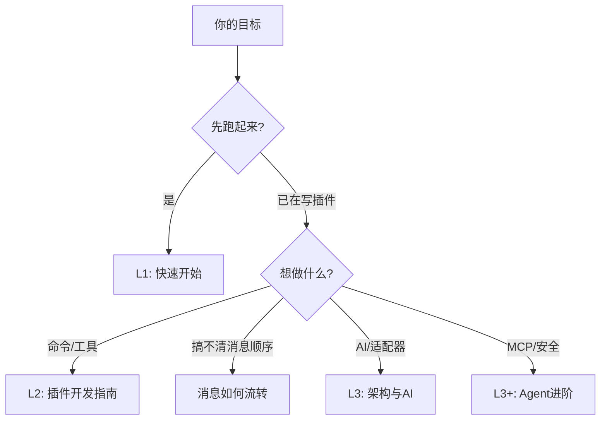

# 学习路径

> 先能跑起来，再按需加深。不必一次读完所有文档。

## L1 — 跑起来

**目标**：安装、配置、让机器人收到消息并回复。

1. [快速开始](/getting-started/) — 5 分钟创建项目并发送第一条消息
2. [配置文件](/essentials/configuration) — 了解配置项
3. [消息如何流转](/essentials/message-flow) — 一页搞清消息从哪来到哪去

**不用管**：内核、AsyncLocalStorage、Feature 系统。

## L2 — 写插件

**目标**：用 `usePlugin` 写命令、处理消息、用数据库。

1. [核心概念速查](/essentials/) — 6 个核心概念一页看完
2. [插件开发指南](/guide/plugin-development) — 从创建到发布
3. [命令系统](/essentials/commands) — 命令参数、权限、帮助

**可选**：
- [中间件](/essentials/middleware) — 拦截消息流
- [平台适配器](/adapters/) — 接入 QQ、Discord 等

## L3 — 深入理解

**目标**：理解全链路、AI 工具、适配器架构。

1. [架构概览](/architecture-overview) — 5 层架构
2. [AI 模块](/advanced/ai) — Provider、Agent、工具调用
3. [工具与技能](/advanced/tools-skills) — 注册自定义工具
4. [Feature 系统](/advanced/features) — 命令、工具、定时任务的统一抽象
5. [贡献指南](/contributing) — 仓库结构与开发规范

## L3+ — AI 进阶

**目标**：Agent 编排、MCP 集成、安全策略。

1. [Agent 概念入门](/advanced/agent-concepts)
2. [MCP 集成](/advanced/mcp)
3. [Agent 安全与角色](/advanced/agent-harness-engineering)

## L4 — 全维度验收

**目标**：硬编排、语义记忆、MCP Agent Mesh、多适配器、可选多模态（STT/TTS、Rich Segment）。

1. [Agent Mesh 硬编排](/advanced/agent-mesh)
2. [AI 内容链可观测](/advanced/ai-content-chain) — stage 日志、optional peer、doctor
3. [Rich Segment 适配器矩阵](/essentials/rich-segment-adapters)
4. [examples/full-bot](https://github.com/zhinjs/zhin/tree/main/examples/full-bot) — 全功能示例
5. `pnpm check:l4` 验收；`zhin doctor --upgrade-l4` 从 minimal 升级

## 我该读哪篇？

