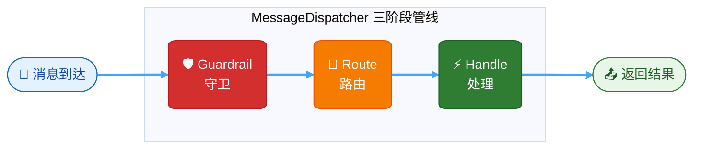

# 中间件与消息调度

> **级别：L2～L3**。若尚未了解消息如何进入框架，请先读 [消息如何流转](./message-flow.md)。

## 消息处理架构 {#消息处理架构}

Zhin.js 使用 **MessageDispatcher**（消息调度器）处理所有收到的消息。调度器将消息处理分为三个阶段：



1. **Guardrail（守卫阶段）** - 安全检查、频率限制、日志记录等前置过滤
2. **Route（路由阶段）** - 判断消息应走「命令路径」还是「AI 路径」
3. **Handle（处理阶段）** - 交由命令系统或 AI Agent 处理

正式运行时须 **`inject('dispatcher').dispatch` 可用**（`zhin.js` 默认会注册）。若缺失，入站命令/AI 不会执行，且 **`addMiddleware` 链也不会运行**（见 `runInboundMessage`）。

**入站总顺序**（在 MessageDispatcher 三阶段**之前**还有一层根 `middleware`）：

```
root.middleware（addMiddleware 洋葱链）
  └─ 终端 next() → MessageDispatcher.dispatch
       ├─ Guardrail → Route → Handle
       └─ …
→ plugin.dispatch('message.receive')
→ adapter 观察者
```

因此：`addMiddleware` **包裹** Dispatcher，而不是在 Dispatcher **之后**再跑一遍。路由前拦截请优先 **`dispatcher.addGuardrail`** 或 [消息过滤](./message-filter.md)。

**路由阶段默认 `exclusive`**（命令与 AI 互斥）。需要「指令 + AI」同时判定时，在配置里显式设置 `dispatcher.mode: dual` 等，详见 [AI 模块：MessageDispatcher 路由](/advanced/ai.html#messagedispatcher-指令与-ai-路由)。

## 中间件（Middleware）何时运行 {#中间件-middleware-何时运行}

`addMiddleware` 注册到**根插件**的洋葱链（应用插件请用 **`root.addMiddleware`**），在 **`MessageDispatcher.dispatch` 之前**执行（`runInboundMessage` 将 Dispatcher 作为链的终端 `next()`）。

因此：

- **路由前拦截、过滤、限流**：优先 **`dispatcher.addGuardrail`** 或框架内置的 [消息过滤](./message-filter.md)。
- **中间件更适合**：`Prompt` 等待用户下一条输入、`ask_user` 一次性监听、日志与耗时统计等**包裹整条 dispatch** 的场景。

中间件以洋葱模型运行：每个中间件可选择不调用 `next()` 以终止本条链路（Dispatcher 与后续生命周期均不会执行）。

### 基础用法

```typescript
import { usePlugin } from 'zhin.js'

const { root } = usePlugin()

root.addMiddleware(async (message, next) => {
  console.log('收到消息:', message.$raw)
  return next()
})
```

### 拦截消息

```typescript
root.addMiddleware(async (message, next) => {
  // 拦截特定消息，不再传递
  if (message.$raw === 'stop') {
    return  // 不调用 next()，消息到此为止
  }
  
  return next()
})
```

### 日志记录

```typescript
root.addMiddleware(async (message, next) => {
  const start = Date.now()
  const result = await next()
  const time = Date.now() - start
  
  console.log(`处理耗时: ${time}ms`)
  
  return result
})
```

## 守卫（Guardrail）

守卫是 MessageDispatcher 提供的前置过滤机制，在路由之前执行。用于全局的安全检查、频率限制等。

```typescript
import { usePlugin } from 'zhin.js'

const { useContext } = usePlugin()

useContext('dispatcher', (dispatcher) => {
  // 添加守卫：频率限制
  dispatcher.addGuardrail(async (message, next) => {
    const key = message.$sender?.id
    if (isRateLimited(key)) {
      return  // 丢弃消息
    }
    return next()
  })
})
```

## 消息路由

MessageDispatcher 在路由阶段判断消息应该怎么处理：

- **命令路径**：消息匹配到已注册的命令 → 交给 `CommandFeature` 处理
- **AI 路径**：消息满足 AI 触发条件（如 @机器人、私聊、前缀）→ 交给 AI Handler / ZhinAgent
- **无双路径命中**（`skip`）：可能写入群/频道旁听上下文（`maybeRecordGroupPassiveContext`），通常无回复；**不会**在 Dispatcher 之后再执行 `addMiddleware`

### AI 触发条件

AI 触发由以下条件决定（可在配置文件中调整）：

- `respondToAt: true` — @机器人 时触发
- `respondToPrivate: true` — 私聊时触发
- `prefixes: ["ai "]` — 消息以指定前缀开头时触发
- `ignorePrefixes: ["/", "!"]` — 以这些前缀开头的消息不触发 AI

## 完整示例

```typescript
import { usePlugin } from 'zhin.js'

const { root, useContext, logger } = usePlugin()

// 全局日志中间件（须挂在根插件链上）
root.addMiddleware(async (message, next) => {
  logger.info(`[${message.$adapter}] ${message.$sender?.id}: ${message.$raw}`)
  return next()
})

// 敏感词过滤 — 更推荐 dispatcher.addGuardrail（见 [内容审查](/advanced/content-moderation)）
root.addMiddleware(async (message, next) => {
  if (message.$raw?.includes('敏感词')) {
    logger.warn('消息包含敏感词，已拦截')
    return
  }
  return next()
})

// 使用 Dispatcher 守卫
useContext('dispatcher', (dispatcher) => {
  // 添加守卫：只处理群聊消息
  const dispose = dispatcher.addGuardrail(async (message, next) => {
    if (message.$channel?.type !== 'group') {
      return  // 非群聊消息不处理
    }
    return next()
  })
  
  // 返回 dispose 函数，插件卸载时自动移除守卫
  return dispose
})
```
