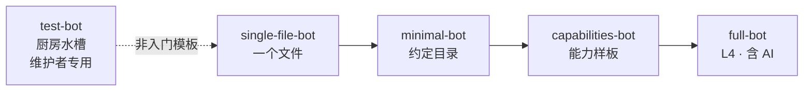

# 示例速览

想学框架先从跑起来的东西入手。仓库 `examples/` 下维护分层递进的官方示例，全部开箱可跑（仓库根先 `pnpm install`）：

| 示例 | 定位 | 启动 | 通道 |
|------|------|------|------|
| [single-file-bot](#single-file-bot-一个-botts-就是机器人) | **一个 `bot.ts` 就是 bot**，零约定目录 | `pnpm --filter single-file-bot dev` | Sandbox + Console |
| [minimal-bot](#minimal-bot-stable-最小路径) | **Stable 约定目录**最小路径，仅 IM | 根目录 `pnpm dev` | 终端 |
| [capabilities-bot](#capabilities-bot-defineplugin-能力样板) | `definePlugin` 能力样板，插件 + 配置即应用 | `pnpm --filter capabilities-bot dev` | Sandbox + Console |
| [full-bot](#full-bot-l4-参考含-ai) | **L4 参考**，含 AI 栈、语义记忆、MCP | `pnpm dev:full` | Sandbox + NapCat + KOOK |
| [test-bot](#test-bot-维护者厨房水槽) | 维护者厨房水槽，全平台全插件 | `pnpm dev:test` | 20+ 适配器 |



学习路径：**single-file-bot → minimal-bot → capabilities-bot → full-bot**；test-bot 仅供维护者对照。

## single-file-bot：一个 bot.ts 就是机器人

不建 `commands/`、`components/`：在 `setup({ addCommand })` 里注册命令，和目录发现进同一个 `CommandIndex`。

```bash
pnpm --filter single-file-bot dev
```

打开 [Remote Console](https://console.zhin.dev)，Host 填 `http://127.0.0.1:8086`，Sandbox 发 **`/hello`**。

```text
single-file-bot/
├── bot.ts              # definePlugin + addCommand('hello')
├── package.json        # zhin.entry → ./bot.ts；plugins → sandbox
└── zhin.config.yml     # sandbox commandPrefix: '/'
```

适合 demo、一次性脚本、向别人展示「启动有多短」。能力变多后再拆成约定目录（见 [minimal-bot](#minimal-bot-stable-最小路径)）。细节见该目录 [README](https://github.com/zhinjs/zhin/tree/main/examples/single-file-bot)。

## minimal-bot：Stable 最小路径

最小可运行的约定目录项目：一个 `plugin.ts` + `adapters/` `commands/` `components/`，
Stable Features（adapter / command / component）由框架核心自动继承，`package.json#zhin` 的
`features` / `plugins` 均可为空。

```bash
# 仓库根
pnpm install
pnpm dev            # = pnpm --filter minimal-bot dev
```

等到 `zhin> ` 提示符出现，在同一终端输入 `/hello` 或 `/card`（渲染 Satori 状态卡片）。
`Ctrl+C` 退出；编辑约定目录下的文件会触发热重载。

要求 Node ≥22.6（22.6–22.17 由 CLI 自动带 `--experimental-strip-types`，22.18+ 原生 TypeScript）。

目录结构：

```text
minimal-bot/
├── plugin.ts                 # definePlugin() 入口
├── schema.json               # 配置契约
├── zhin.config.yml           # plugin / plugins 分层配置
├── adapters/terminal.ts      # stdin/stdout 终端 Endpoint
├── commands/hello.ts         # /hello
├── commands/card.ts          # /card → 组件渲染
└── components/status-card.ts # Satori 卡片组件
```

## capabilities-bot：definePlugin 能力样板

**一个插件 + 一个 `zhin.config.yml` 即可启动**的能力展示样板：一个 `setup()` 覆盖常用能力面——
配置视图、数据库表、定时任务、Agent 工具（可选降级）、主动出站、lifecycle 回收、Console 卡片 metadata，
并演示挂载 npm 包子插件（`@zhin.js/adapter-sandbox`）。

```bash
cd examples/capabilities-bot
pnpm dev            # zhin runtime start
```

启动后：

- Console 在 `http://127.0.0.1:18099`（token `capabilities-dev-token`），plugins 页可见 `Capabilities Bot` 卡片
- 已注册 `whoami` / `stats` 命令（后者演示数据库计数）
- 心跳定时任务每 5 分钟打一行日志；`pushOnBoot: true` 时向 Sandbox 私聊推一条上线消息

能力与代码的逐项对照见该目录 `README.md`。

## full-bot：L4 参考（含 AI）

在约定目录之上叠加完整 AI 栈：`@zhin.js/agent`、语义记忆、MCP、A2A Agent Mesh，
以及 Sandbox + NapCat + KOOK 三适配器与 Skill / Tool / Page 等 Feature。

```bash
# 仓库根已 pnpm install && pnpm build
cd examples/full-bot
cp .env.example .env    # 填入模型 Provider Key 与 HTTP_TOKEN
pnpm dev                # 或仓库根 pnpm dev:full
```

- Host 默认 `http://127.0.0.1:8069`；Remote Console 的 API Base / Token 与 `.env` 中 `HTTP_TOKEN` 一致
- 验收清单与 NapCat/KOOK 实机步骤见该目录 `ACCEPTANCE.md`

## test-bot：维护者厨房水槽

> **这不是入门模板，请勿复制为新项目的起点。** 新项目用 `pnpm create zhin-app`、[single-file-bot](#single-file-bot-一个-botts-就是机器人) 或 [minimal-bot](#minimal-bot-stable-最小路径)。

挂载 20+ 平台适配器（Sandbox、ICQQ×5、QQ 官方、Slack、Discord、Telegram、KOOK、钉钉、飞书、
企业微信、LINE、Email、GitHub……）与全部功能插件（游戏中心、lottery、group-suite、rss、code-runner 等），
用于维护者做多端回归。

```bash
pnpm install && pnpm build   # 仓库根
pnpm dev:test                # 或 cd examples/test-bot && pnpm dev
```

要求 Node ≥22.18；凭据读该目录 `.env`（模板见 `.env.example`）。
Console：打开 `https://console.zhin.dev`，API Base 填 `http://127.0.0.1:8086`，Token 填 `test-bot-dev-token`。

后台守护模式：`pnpm daemon`（`zhin runtime start --daemon`），`pnpm stop` 停止。
