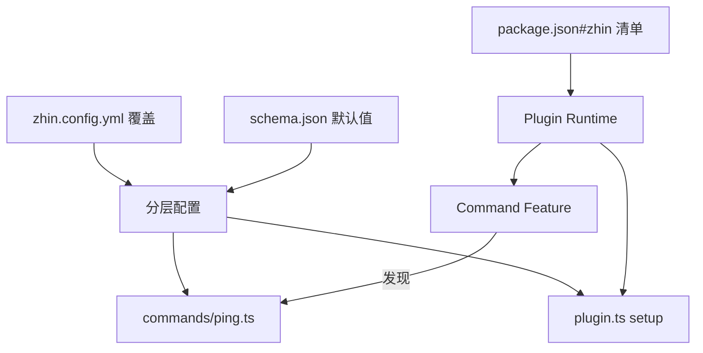

# 编写第一个插件

本页从空目录写一个可运行的插件 `ping-pong`：一个命令、一份配置 schema、一个 `definePlugin` 入口。
所有 API 均来自官方示例 [capabilities-bot](https://github.com/zhinjs/zhin/tree/main/examples/capabilities-bot)，可直接运行。

最终目录结构：

```text
ping-pong/
├── package.json      # zhin 清单（拓扑事实来源）
├── plugin.ts         # definePlugin 入口
├── schema.json       # 配置契约（默认值 + 校验）
├── commands/
│   └── ping.ts       # /ping 命令
└── zhin.config.yml   # 可选：放进配置即变「插件即应用」
```

## 1. package.json 与 zhin 清单

```json
{
  "name": "ping-pong",
  "private": true,
  "version": "0.1.0",
  "type": "module",
  "scripts": {
    "dev": "zhin runtime start"
  },
  "dependencies": {
    "@zhin.js/command": "^1.0.0",
    "@zhin.js/plugin-runtime": "^1.0.0"
  },
  "devDependencies": {
    "@zhin.js/cli": "^1.0.0"
  },
  "zhin": {
    "protocol": 1,
    "type": "plugin",
    "entry": "./plugin.ts",
    "engine": "^1.0.0",
    "runtime": "trusted",
    "features": [
      { "package": "@zhin.js/command", "api": "^1.0.0" }
    ],
    "plugins": []
  }
}
```

`zhin` 字段是插件拓扑的清单：

| 字段 | 含义 |
|------|------|
| `entry` | 插件入口文件，必须是 `./` 开头的包内相对路径 |
| `runtime` | `trusted`（主进程内运行） |
| `features` | 启用的 Feature 提供者；`@zhin.js/command` 负责发现 `commands/` 目录 |
| `plugins` | 挂载的子插件实例（本例为空，见第 5 节挂载方式） |

## 2. plugin.ts

```ts
import { definePlugin } from '@zhin.js/plugin-runtime';

interface PingPongConfig {
  reply: string;
}

export default definePlugin<PingPongConfig>({
  name: 'ping-pong',
  // Console 插件卡片展示
  metadata: { displayName: 'Ping Pong', icon: 'Blocks' },

  async setup(context) {
    // 配置视图：schema.json 提供默认值，zhin.config.yml 覆盖
    const config = context.config.get();
    console.log(`[ping-pong] setup: reply=${config.reply}`);

    // 可选：返回 Dispose，在 generation 结束时执行（热重载安全）
    return () => console.log('[ping-pong] disposed');
  },
});
```

## 3. commands/ping.ts

`commands/` 下的文件由 Command Feature 自动发现，文件名即命令名：

```ts
import { defineCommand } from '@zhin.js/command';

interface PingPongConfig {
  reply: string;
}

export default defineCommand<PingPongConfig, string>({
  description: '回复配置的文案',
  execute({ config }) {
    return config.reply;
  },
});
```

命令的 `config` 与 `setup` 里 `context.config.get()` 是同一份分层配置。

## 4. schema.json 与配置

`schema.json`（JSON Schema 2020-12）声明配置契约与默认值：

```json
{
  "$schema": "https://json-schema.org/draft/2020-12/schema",
  "type": "object",
  "additionalProperties": false,
  "properties": {
    "reply": {
      "type": "string",
      "default": "pong",
      "description": "/ping 命令的回复内容"
    }
  }
}
```

配置注入是**分层**的：Root 插件读 `zhin.config.yml` 的 `plugin:` 段，
子插件实例读 `plugins.<instanceKey>` 段。

## 5. 挂载到应用

### 方式 A：`./` 本地目录子插件（推荐开发期）

在宿主应用的 `package.json#zhin.plugins` 里以 `./` 相对路径引用（不允许 `..` 越出包根）：

```json
{
  "zhin": {
    "plugins": [
      { "package": "./plugins/ping-pong", "instanceKey": "ping-pong" }
    ]
  }
}
```

然后在宿主的 `zhin.config.yml` 给这个实例传配置：

```yaml
plugins:
  ping-pong:
    reply: pong!
```

`instanceKey` 规则：小写字母 / 数字 / 连字符（`^[a-z0-9][a-z0-9-]*$`）。

### 方式 B：插件即应用

把 `zhin.config.yml` 直接放进插件目录，插件自己就是 Root：

```yaml
# ping-pong/zhin.config.yml
plugin:
  reply: pong!

plugins: {}
```

```bash
cd ping-pong
pnpm install
pnpm dev        # zhin runtime start
```

## 6. 启动与验证

```bash
zhin runtime start
```

- 启动日志应出现 `[ping-pong] setup: reply=pong!`
- 在接通的通道里发 `/ping`，Bot 回复 `pong!`
- 改 `commands/ping.ts` 或 `zhin.config.yml` 会触发热重载，无需重启进程
- `zhin runtime start --once` 可做装配冒烟（不进入交互）



## 下一步

- [示例速览](../examples/index.md)：capabilities-bot 演示数据库、定时任务、Agent 工具、主动出站等全部能力
- 插件能力全景（Host Resources、lifecycle、handoff）见插件系统概念页
