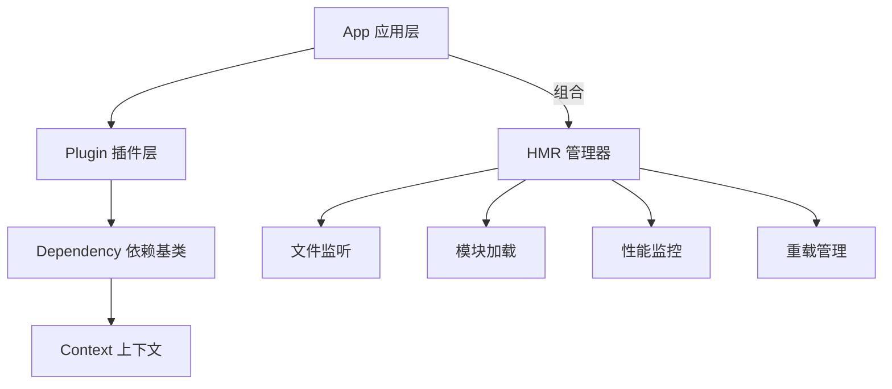

# 🏗️ 架构设计深度解析

深入剖析 zhin-next 的架构设计思路，理解这个世界级框架是如何构建的。

## 🎯 **整体架构概览**

### 🌟 **三层架构设计**

zhin-next 采用精简的**三层架构**，结合**组合模式**实现核心功能，相比传统的四层继承结构更加灵活和高效。



### 📊 **架构设计原则**

zhin-next 严格遵循现代软件工程的最佳实践：

- **🧩 组合优于继承** - App 不再继承 HMR，而是组合 HMRManager，职责更清晰。
- **🎯 单一职责** - 每层专注特定功能，确保代码清晰、易于维护。
- **🔓 开闭原则** - 通过插件化扩展实现功能增强，核心保持稳定。
- **🔄 依赖倒置** - 函数式依赖注入实现松耦合、高可测试性。
- **🎛️ 控制反转** - Context生命周期管理，框架控制执行，开发者声明需求。

---

## 🏢 **App 层：应用核心**

### 🎯 **职责定义**
App 层是整个框架的入口和协调者，作为根插件（Root Plugin）存在。它通过组合 `HMRManager` 获得热重载能力。

```typescript
export class App extends Plugin {
  // 🌟 核心属性
  public readonly hmrManager: HMRManager<Plugin>; // HMR 能力组合
  private config: AppConfig;                      // 应用配置
  adapters: string[] = [];                        // 注册的适配器列表
  
  // 🎯 核心方法
  async sendMessage(options: SendOptions);        // 统一消息发送
  getContext<T>(name: string): T;                 // 获取上下文实例
  async start(mode: 'dev' | 'prod');              // 启动应用
  async stop();                                   // 停止应用
}
```

### 🔧 **关键实现细节**

#### **1. 配置管理系统**
App 负责加载和监听 `zhin.config.yml` (或 ts/js/json) 配置文件。
- **自动热重载**：配置文件变更时，App 会自动重新应用配置。
- **智能插件重载**：如果检测到某个插件的配置项发生变化，App 会自动卸载并重新加载该插件，确保配置立即生效。

#### **2. HMR 集成**
App 在构造函数中初始化 `HMRManager`，并将自身作为入口（Entry）传递给管理器。
```typescript
this.hmrManager = new HMRManager(this, {
  dirs: config.get("plugin_dirs"),
  // ...
});
```

---

## ⚡ **HMRManager：热更新引擎**

### 🎯 **独立组件设计**

HMR 功能被封装在独立的 `HMRManager` 类中，不再作为基类。它负责文件监听、模块加载、性能监控和重载调度。

```typescript
export class HMRManager<P extends Dependency> {
  // 🔧 功能模块组合
  public readonly fileWatcher: FileWatcher;
  public readonly moduleLoader: ModuleLoader<P>;
  public readonly performanceMonitor: PerformanceMonitor;
  public readonly reloadManager: ReloadManager;
  
  // 🎯 核心能力
  async import(name: string, filePath: string): Promise<P>;
  async reload(filePath: string): Promise<void>;
}
```

### 🔧 **核心模块解析**

#### **1. ModuleLoader - 模块加载器**
- **智能加载**：负责 ESM/CommonJS 模块的动态导入。
- **缓存清理**：在重载前自动清除 `require.cache` 或 ESM 缓存，确保加载最新代码。
- **依赖追踪**：维护 `dependencies` 映射，管理插件实例。

#### **2. PerformanceMonitor - 性能监控**
- **零干扰监控**：只记录指标，不主动干预 GC，避免影响业务性能。
- **智能告警**：结合内存使用率和绝对数值（最小堆阈值），避免在低内存占用时的误报。
- **详细报告**：提供 RSS、Heap、GC 事件等多维度性能数据。

---

## 🧩 **Dependency 层：依赖基类**

### 🌟 **核心设计理念**

Dependency 是整个框架的基石，实现了依赖注入、上下文共享和生命周期管理。

```typescript
export class Dependency<P extends Dependency = any> extends EventEmitter {
  // 🗂️ 核心数据结构
  contexts: Map<string, Context>;       // Context 映射表
  dependencies: Map<string, P>;         // 子依赖映射表
  
  // 🎯 核心方法
  register<T>(context: Context<T, P>): Context<T, P>;    // 注册 Context
  useContext<T>(...args): void;                         // 使用 Context
  dispose(): void;                                       // 销毁清理
}
```

### 🔧 **依赖注入实现**

#### **1. Context 机制**
- **声明式依赖**：通过 `useContext` 声明所需的上下文（如 `database`, `adapter`）。
- **自动等待**：如果依赖尚未就绪，框架会自动等待其 `mounted` 事件。
- **副作用清理**：Context 销毁时，自动清理相关的副作用（监听器、中间件等）。

#### **2. 依赖树**
- **树状结构**：每个 Dependency 都有一个 `parent` 指针（除了 App）。
- **事件传播**：
    - `dispatch`：向上冒泡事件。
    - `broadcast`：向下广播事件给所有子依赖。

---

## 🧩 **Plugin 层：业务逻辑**

### 🎯 **插件系统设计**

Plugin 层继承自 Dependency，专门处理消息、命令和组件管理。

```typescript
export class Plugin extends Dependency<Plugin> {
  // 📦 业务组件
  middlewares: MessageMiddleware<any>[] = [];          // 中间件列表
  components: Map<string, Component<any, any, any>>;   // 组件映射
  commands: MessageCommand[] = [];                     // 命令列表
  
  // 🎯 Hooks 支持
  // 插件开发大量使用 Hooks API (useApp, usePlugin, onMessage)
  // 这些 Hooks 依赖于 Dependency.currentDependency 静态栈来自动定位当前插件实例。
}
```

---

## 🚀 **架构演进路线**

### 📈 **当前版本 (Refactored)**
- ✅ **三层架构**：结构更清晰，耦合度更低。
- ✅ **配置热重载**：插件配置变更自动生效。
- ✅ **性能优化**：智能内存监控，消除误报。
- ✅ **HMR 独立化**：热重载逻辑与业务逻辑彻底解耦。

### 🔮 **未来规划**
- 🔄 分布式依赖注入
- 🌊 流式消息处理
- 🤖 AI 辅助开发
- 📊 高级性能分析可视化

---

**🎯 深入理解这些架构设计，你将掌握现代软件工程的精髓！**
