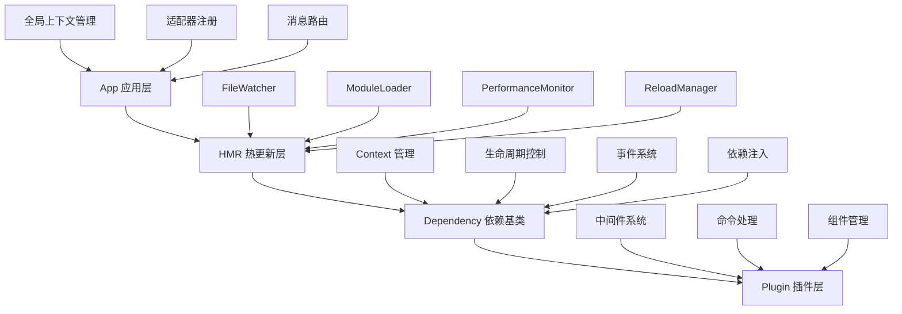

# 🏗️ 架构设计深度解析

深入剖析 zhin-next 的架构设计思路，理解这个世界级框架是如何构建的。

## 🎯 **整体架构概览**

### 🌟 **四层抽象设计**



### 📊 **架构设计原则**

zhin-next 严格遵循现代软件工程的最佳实践：

- **🎯 单一职责** - 每层专注特定功能，确保代码清晰、易于维护
- **🔓 开闭原则** - 通过插件化扩展实现功能增强，核心保持稳定
- **🔄 依赖倒置** - 函数式依赖注入实现松耦合、高可测试性
- **🧩 组合优于继承** - HMR模块组合设计提供更强的灵活性
- **🎛️ 控制反转** - Context生命周期管理，框架控制执行，开发者声明需求

---

## 🏢 **App 层：应用核心**

### 🎯 **职责定义**
App 层是整个框架的入口和协调者，继承自 HMR 以获得热重载能力。

```typescript
export class App extends HMR<Plugin> {
  // 🌟 核心属性
  private config: AppConfig              // 应用配置
  adapters: string[] = []               // 注册的适配器列表
  static currentPlugin: Plugin          // 当前活动插件
  
  // 🎯 核心方法
  async sendMessage(options: SendOptions)  // 统一消息发送
  getContext<T>(name: string): T           // 获取上下文实例
  async start(mode: 'dev' | 'prod')        // 启动应用
  async stop()                             // 停止应用
}
```

### 🔧 **关键实现细节**

#### **1. 配置管理系统**
```typescript
// 🌟 支持多种配置格式和动态加载
export async function createApp(config?: Partial<AppConfig>): Promise<App> {
  let finalConfig: AppConfig, configPath: string = ''
  
  // 🎯 环境变量文件检测
  const envFiles = ['.env', `.env.${process.env.NODE_ENV}`]
    .filter(filename => fs.existsSync(path.join(process.cwd(), filename)))
  
  if (!config || Object.keys(config).length === 0) {
    try {
      // 🔍 智能配置文件发现
      [configPath, finalConfig] = await loadConfig()
    } catch (error) {
      // 🛡️ 优雅降级到默认配置
      finalConfig = Object.assign({}, App.defaultConfig)
    }
  }
  
  const app = new App(finalConfig)
  
  // 🔄 配置文件热更新监听
  app.watching(envFiles, () => process.exit(51))
  if (configPath) {
    app.watching(configPath, () => process.exit(51))
  }
  
  return app
}
```

#### **2. 适配器注册机制**
```typescript
// 🎯 统一的适配器注册接口
export function registerAdapter<T extends Adapter>(adapter: T) {
  const plugin = usePlugin()
  plugin.app.adapters.push(adapter.name)
  
  // 🌟 将适配器注册为特殊的 Context
  plugin.register({
    name: adapter.name,
    description: `adapter for ${adapter.name}`,
    async mounted(plugin) {
      await adapter.start(plugin)
      return adapter
    },
    dispose() {
      return adapter.stop(plugin)
    }
  })
}
```

#### **3. 消息路由系统**
```typescript
// 🚀 跨适配器的统一消息发送
async sendMessage(options: SendOptions) {
  // 🔍 查找目标适配器
  const adapter = this.getContext<Adapter>(options.context)
  if (!adapter) throw new Error(`can't find adapter for name ${options.context}`)
  
  // 🎯 查找目标机器人实例
  const bot = adapter.bots.get(options.bot)
  if (!bot) throw new Error(`can't find bot ${options.bot} for adapter ${options.context}`)
  
  // 📝 执行发送前钩子
  const processedOptions = await this.handleBeforeSend(options)
  
  return bot.$sendMessage(processedOptions)
}
```

---

## ⚡ **HMR 层：热更新引擎**

### 🎯 **组合模式设计**

HMR 层采用组合模式，集成了四个核心功能模块：

```typescript
export abstract class HMR<P extends Dependency = Dependency> extends Dependency<P> {
  // 🔧 功能模块组合
  protected readonly fileWatcher: FileWatcher           // 文件监听
  protected readonly moduleLoader: ModuleLoader<P>      // 模块加载
  protected readonly performanceMonitor: PerformanceMonitor  // 性能监控
  protected readonly reloadManager: ReloadManager       // 重载管理
  
  constructor(name: string, options: HMROptions = {}) {
    super(null, name, getCallerFile(), finalOptions)
    
    // 🎯 初始化各个模块
    this.fileWatcher = new FileWatcher(...)
    this.moduleLoader = new ModuleLoader(...)
    this.performanceMonitor = new PerformanceMonitor()
    this.reloadManager = new ReloadManager(...)
    
    // 🔗 设置模块间的事件链接
    this.setupEventListeners()
  }
}
```

### 🔧 **核心模块解析**

#### **1. FileWatcher - 文件监听器**
```typescript
export class FileWatcher extends EventEmitter {
  readonly #dirs: string[]                    // 监听目录列表
  readonly #dirWatchers: Map<string, fs.FSWatcher>  // 目录监听器映射
  readonly #watchableExtensions: Set<string>  // 可监听文件扩展名
  
  startWatching(): void {
    for (const dir of this.#dirs) {
      this.setupDirWatcher(dir)
    }
  }
  
  private setupDirWatcher(dir: string): void {
    // 🔍 递归监听目录变化
    const watcher = fs.watch(dir, { 
      recursive: true, 
      persistent: isBun  // Bun 特殊处理
    })
    
    watcher.on('change', (eventType, filename) => {
      if (filename && this.isWatchableFile(path.join(dir, filename))) {
        this.emit('file-change', path.join(dir, filename), eventType)
      }
    })
  }
}
```

#### **2. ModuleLoader - 模块加载器**
```typescript
export class ModuleLoader<P extends Dependency = Dependency> extends EventEmitter {
  readonly #loadingDependencies: Set<string> = new Set()  // 加载中的依赖
  readonly #reloadDependencies: Set<string> = new Set()   // 重载中的依赖
  
  async import(name: string, filePath: string): Promise<P> {
    // 🛡️ 循环依赖检测
    if (this.#loadingDependencies.has(filePath)) {
      throw createError(ERROR_MESSAGES.CIRCULAR_DEPENDENCY, { filePath })
    }
    
    try {
      this.#loadingDependencies.add(filePath)
      
      // 🎯 创建依赖实例
      const dependency = this.hmr.createDependency(name, filePath)
      this.hmr.dependencies.set(filePath, dependency)
      
      // 📊 记录文件信息
      const stats = fs.statSync(filePath)
      dependency.mtime = stats.mtime
      dependency.hash = this.calculateHash(filePath)
      
      // 🚀 动态导入模块（防缓存）
      const fileUrl = pathToFileURL(filePath).href
      const importUrl = `${fileUrl}?t=${Date.now()}`
      await import(importUrl)
      
      return dependency
    } finally {
      this.#loadingDependencies.delete(filePath)
    }
  }
}
```

#### **3. 缓存清除策略**
```typescript
// 💥 多运行时环境的缓存清除
remove(filePath: string): void {
  const cache = isBun ? 
    require?.cache?.[filePath] || import.meta?.cache?.[filePath] :
    isCommonJS ? 
      require?.cache?.[filePath] :
      import.meta?.cache?.[filePath]
  
  if (cache) {
    delete require?.cache?.[filePath]        // CommonJS 缓存
    delete import.meta?.cache?.[filePath]    // ES Module 缓存
  }
  
  // 🗑️ 销毁依赖实例
  dependency.dispose()
  this.dependencies.delete(filePath)
}
```

---

## 🧩 **Dependency 层：依赖基类**

### 🌟 **核心设计理念**

Dependency 是整个框架的基石，实现了依赖注入和生命周期管理的核心逻辑。

```typescript
export class Dependency<P extends Dependency = any> extends EventEmitter {
  // 🗂️ 核心数据结构
  contexts: Map<string, Context>        // Context 映射表
  dependencies: Map<string, P>          // 子依赖映射表
  private lifecycleState: 'waiting' | 'ready' | 'disposed' = 'waiting'
  
  // 🎯 核心方法
  register<T>(context: Context<T, P>): Context<T, P>     // 注册 Context
  useContext<T>(...args): void                          // 使用 Context
  async waitForReady(): Promise<void>                    // 等待就绪
  dispose(): void                                        // 销毁清理
}
```

### 🔧 **依赖注入实现**

#### **1. Context 注册机制**
```typescript
register<T>(context: Context<T, P>): Context<T, P> {
  // 📝 注册到本地映射表
  this.contexts.set(context.name, context as Context)
  
  // 📡 分发注册事件
  this.dispatch('context.add', context)
  
  // 🚀 如果已就绪，立即初始化
  if (this.lifecycleState === 'ready') {
    if (!context.value && context.mounted) {
      Promise.resolve(context.mounted(this as any)).then(res => {
        context.value = res
        this.dispatch('context.mounted', context.name)
      })
    }
  }
  
  // 🧹 注册清理钩子
  this.on('dispose', () => {
    this.dispatch('context.remove', context)
  })
  
  return context
}
```

#### **2. 智能依赖等待**
```typescript
useContext<T extends (keyof GlobalContext)[]>(...args) {
  const contexts = args.slice(0, -1) as T
  const sideEffect = args[args.length - 1] as SideEffect<T>
  
  // 🎯 依赖就绪检查函数
  const contextReadyCallback = async () => {
    const args = contexts.map(item => this.#use(item))
    const dispose = await sideEffect(...args as Contexts<T>)
    
    // 🗑️ 注册清理函数
    if (!dispose) return
    const disposeFn = async (name: string) => {
      if (contexts.includes(name)) {
        await dispose(this.#use(name))
      }
      this.off('context.dispose', disposeFn)
    }
    this.on('context.dispose', disposeFn)
  }
  
  // 📡 监听依赖挂载事件
  const onContextMounted = async (name: string) => {
    if (!this.#contextsIsReady(contexts) || !contexts.includes(name)) return
    await contextReadyCallback()
  }
  
  this.on('context.mounted', onContextMounted)
  
  // ✅ 如果依赖已就绪，立即执行
  if (this.#contextsIsReady(contexts)) {
    contextReadyCallback()
  }
}
```

#### **3. 生命周期管理**
```typescript
async mounted(): Promise<void> {
  // 🚀 初始化所有 Context
  for (const context of this.contextList) {
    if (context.mounted && !context.value) {
      try {
        context.value = await context.mounted(this)
      } catch (error) {
        this.emit('error', error)
        continue
      }
    }
    this.dispatch('context.mounted', context.name)
  }
  
  // 📡 分发就绪事件
  this.dispatch('dependency.mounted', this)
  this.emit('self.mounted', this)
  this.setLifecycleState('ready')
}

dispose(): void {
  if (this.lifecycleState === 'disposed') return
  
  this.setLifecycleState('disposed')
  
  // 🗑️ 递归销毁子依赖
  for (const [key, child] of this.dependencies) {
    child.dispose()
  }
  this.dependencies.clear()
  
  // 🧹 清理所有 Context
  for (const context of this.contextList) {
    if (context.dispose && context.value) {
      try {
        context.dispose(context.value)
        this.dispatch('context.dispose', context)
      } catch (error) {
        this.emit('error', error)
      }
    }
  }
  
  // 🗑️ 清理资源
  this.contexts.clear()
  this.removeAllListeners()
  this.parent = null
  
  // 🧹 手动垃圾回收
  performGC({ onDispose: true }, `dispose: ${this.name}`)
}
```

---

## 🧩 **Plugin 层：业务逻辑**

### 🎯 **插件系统设计**

Plugin 层继承自 Dependency，专门处理消息、命令和组件管理。

```typescript
export class Plugin extends Dependency<Plugin> {
  // 📦 业务组件
  middlewares: MessageMiddleware<any>[] = []           // 中间件列表
  components: Map<string, Component<any, any, any>>    // 组件映射
  commands: MessageCommand[] = []                      // 命令列表
  
  constructor(parent: Dependency<Plugin>, name: string, filePath: string) {
    super(parent, name, filePath)
    
    // 🎯 注册消息处理
    this.on('message.receive', this.#handleMessage.bind(this))
    
    // 🔧 添加命令中间件
    this.addMiddleware(async (message, next) => {
      for (const command of this.commands) {
        const result = await command.handle(message)
        if (result) message.$reply(result)
      }
      return next()
    })
  }
}
```

### 🔧 **中间件系统**

#### **1. 洋葱模型实现**
```typescript
async #runMiddlewares(message: Message, index: number): Promise<void> {
  if (index >= this.middlewares.length) return
  
  const middleware = this.middlewares[index]
  
  try {
    // 🧅 洋葱模型：递归调用下一个中间件
    await middleware(message, () => this.#runMiddlewares(message, index + 1))
  } catch (error) {
    throw new PluginError(
      `中间件执行失败: ${(error as Error).message}`,
      this.name,
      { middlewareIndex: index, originalError: error }
    )
  }
}
```

#### **2. 命令处理系统**
```typescript
export class MessageCommand {
  constructor(
    public template: string,                    // 命令模板
    public options: CommandOptions = {}         // 命令选项
  ) {}
  
  action(handler: ActionHandler): this {
    this.handler = handler
    return this
  }
  
  async handle(message: Message): Promise<any> {
    // 🎯 模板匹配和参数解析
    const result = this.parseTemplate(message.raw)
    if (!result) return null
    
    try {
      return await this.handler(message, result)
    } catch (error) {
      throw new CommandError(`Command execution failed`, this.template, error)
    }
  }
}
```

---

## 🌐 **跨层通信机制**

### 📡 **事件系统设计**

```typescript
// 🎯 分层事件传播机制
class Dependency extends EventEmitter {
  /** 向上分发事件（冒泡） */
  dispatch(eventName: string | symbol, ...args: unknown[]): void {
    if (this.parent) {
      this.parent.dispatch(eventName, ...args)
    } else {
      this.broadcast(eventName, ...args)
    }
  }

  /** 向下广播事件 */
  broadcast(eventName: string | symbol, ...args: unknown[]): void {
    this.emit(eventName, ...args)
    for (const [key, child] of this.dependencies) {
      child.broadcast(eventName, ...args)
    }
  }
}
```

### 🔄 **Context 共享机制**

```typescript
// 🌟 跨依赖的 Context 查找
#use(name: string) {
  // 🔍 在整个依赖树中查找 Context
  const context = this.allContextList.find(c => c.name === name)
  if (!context) {
    throw createError(ERROR_MESSAGES.CONTEXT_NOT_FOUND, { name })
  }
  if (!context.value) {
    throw createError(ERROR_MESSAGES.CONTEXT_NOT_MOUNTED, { name })
  }
  return context.value
}

get allContextList(): Context[] {
  if (this.parent) return this.parent.allContextList
  
  // 🌍 收集所有子依赖的 Context
  return Array.from(this.dependencies.values()).reduce((result, dep) => {
    result.push(...dep.contextList)
    return result
  }, this.contextList)
}
```

---

## 🎯 **架构优势总结**

### 🏆 **架构优势**

#### **🧩 高度模块化设计**
- 四层抽象结构确保职责清晰分离
- 组合模式提供优异的代码复用性
- 每个模块都可独立测试和维护

#### **🚀 强大的扩展能力**
- 插件化架构支持功能的无限扩展
- 依赖注入系统支持动态功能组合
- 热插拔机制实现运行时功能调整

#### **🛡️ 企业级可靠性**
- 全栈 TypeScript 提供完整的类型安全保障
- 智能错误处理和优雅降级机制
- 内置监控和日志系统提供完整的可观测性

#### **⚡ 卓越的开发体验**
- 企业级热重载系统大幅提升开发效率
- 声明式API设计降低学习成本
- 丰富的开发工具和调试支持

---

## 🚀 **架构演进路线**

### 📈 **当前版本 (v1.x)**
- ✅ 核心依赖注入系统
- ✅ 企业级热重载
- ✅ 多平台适配器支持
- ✅ Web 管理控制台

### 🔮 **未来规划 (v2.x)**
- 🔄 分布式依赖注入
- 🌊 流式消息处理
- 🤖 AI 辅助开发
- 📊 高级性能分析

---

**🎯 深入理解这些架构设计，你将掌握现代软件工程的精髓！**

👉 **[体验这些架构创新](/guide/getting-started)** • **[学习核心技术](/guide/innovations)**
