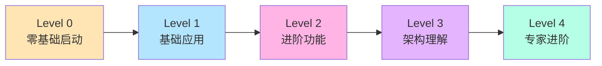

# 🎓 渐进式学习路径

欢迎来到 Zhin.js！本指南将带你从零基础到精通 Zhin.js 框架，每个阶段都有清晰的目标和实践项目。

## 🎯 学习路径概览



---

## 📚 Level 0: 零基础启动 (15 分钟)

> **目标**: 快速体验 Zhin.js，看到第一个运行的机器人
>
> **适合人群**: 完全不了解机器人框架的新手

### ✅ 学习目标
- [ ] 成功启动机器人
- [ ] 在终端发送第一条消息
- [ ] 看到机器人的回复
- [ ] 了解 Web 控制台

### 📖 学习内容

#### 1. 一键创建项目
```bash
# 🚀 3 个命令完成启动
npm create zhin-app my-first-bot
cd my-first-bot
pnpm dev
```

#### 2. 立即测试
```bash
# 在终端输入
> hello
< 你好！欢迎使用 Zhin 机器人框架！

> status
< 🤖 机器人状态
  ⏱️ 运行时间: 30秒
  📊 内存使用: 42.15MB
```

#### 3. 访问 Web 控制台
打开浏览器访问: `http://localhost:8086`

查看：
- 📊 实时状态监控
- 📝 日志输出
- 🧩 插件列表

### 🎯 实践任务

**任务 1: 修改欢迎语**
```typescript
// 打开 src/plugins/example.ts
addCommand(new MessageCommand('hello')
  .action(() => {
    return '你好！我是你的专属机器人！' // 修改这里
  })
)
```

保存后立即测试，体验热重载！

### 📚 参考文档
- [60秒极速体验](./quick-start.md)

---

## 📘 Level 1: 基础应用 (2-3 小时)

> **目标**: 掌握基本的插件开发，能够独立编写简单命令
>
> **适合人群**: 有基础 JavaScript/TypeScript 知识的开发者

### ✅ 学习目标
- [ ] 理解插件文件结构
- [ ] 编写基本命令
- [ ] 使用参数和可选参数
- [ ] 监听消息事件
- [ ] 使用日志系统

### 📖 学习内容

#### 1. 插件基础结构
```typescript
// src/plugins/my-plugin.ts
import { addCommand, MessageCommand, useLogger } from 'zhin.js'

const logger = useLogger()

// 简单命令：没有参数
addCommand(new MessageCommand('ping')
  .action(() => '🏓 Pong!')
)

// 带参数命令：一个必需参数
addCommand(new MessageCommand('echo <text>')
  .action((message, result) => {
    return `你说：${result.params.text}`
  })
)

// 可选参数命令：带默认值
addCommand(new MessageCommand('roll [sides:number=6]')
  .action((message, result) => {
    const sides = result.params.sides ?? 6
    const roll = Math.floor(Math.random() * sides) + 1
    return `🎲 掷出了 ${roll} 点！（${sides}面骰子）`
  })
)

logger.info('我的插件已加载')
```

#### 2. 消息事件监听
```typescript
import { onMessage, onGroupMessage, onPrivateMessage } from 'zhin.js'

// 监听所有消息
onMessage(async (message) => {
  if (message.raw.includes('帮助')) {
    await message.reply('输入 hello 试试！')
  }
})

// 只监听群聊消息
onGroupMessage(async (message) => {
  logger.info(`群聊消息: ${message.raw}`)
})

// 只监听私聊消息
onPrivateMessage(async (message) => {
  await message.reply('这是私聊回复')
})
```

#### 3. 日志使用
```typescript
import { useLogger } from 'zhin.js'

const logger = useLogger()

logger.debug('调试信息') // 需要 debug: true
logger.info('普通信息')
logger.warn('警告信息')
logger.error('错误信息')
```

### 🎯 实践项目

**项目 1: 简单问答机器人**
```typescript
// src/plugins/qa-bot.ts
import { onMessage, useLogger } from 'zhin.js'

const logger = useLogger()

const qaDatabase = {
  '你好': '你好！有什么可以帮助你的吗？',
  '再见': '再见！祝你有愉快的一天！',
  '时间': () => `现在时间：${new Date().toLocaleString()}`,
  '天气': '今天天气不错！☀️'
}

onMessage(async (message) => {
  const answer = qaDatabase[message.raw]
  
  if (answer) {
    const reply = typeof answer === 'function' ? answer() : answer
    await message.reply(reply)
  }
})

logger.info('问答机器人已启动')
```

**项目 2: 计算器命令**
```typescript
// src/plugins/calculator.ts
import { addCommand, MessageCommand, useLogger } from 'zhin.js'

const logger = useLogger()

addCommand(new MessageCommand('add <a:number> <b:number>')
  .action((message, result) => {
    const sum = result.params.a + result.params.b
    return `🧮 ${result.params.a} + ${result.params.b} = ${sum}`
  })
)

addCommand(new MessageCommand('multiply <a:number> <b:number>')
  .action((message, result) => {
    const product = result.params.a * result.params.b
    return `🧮 ${result.params.a} × ${result.params.b} = ${product}`
  })
)

logger.info('计算器插件已加载')
```

### 📝 练习题

1. **基础命令**: 编写一个 `/greet <name>` 命令，回复 "你好，{name}！"
2. **随机选择**: 编写一个 `/choose <option1> <option2>` 命令，随机选择其中一个选项
3. **倒计时**: 编写一个 `/countdown <seconds>` 命令，每秒更新一次消息

### 📚 参考文档
- [基础用法示例](../examples/basic-usage.md)
- [插件开发基础](../plugin/development.md)
- [API 参考 - 命令](../api/plugin.md#命令系统)

---

## 📙 Level 2: 进阶功能 (4-6 小时)

> **目标**: 掌握中间件、依赖注入、配置系统等进阶特性
>
> **适合人群**: 完成 Level 1 的开发者

### ✅ 学习目标
- [ ] 使用中间件系统
- [ ] 理解依赖注入（Context）
- [ ] 配置 Schema 系统
- [ ] 数据持久化
- [ ] 错误处理和日志

### 📖 学习内容

#### 1. 中间件系统
```typescript
import { addMiddleware, useLogger } from 'zhin.js'

const logger = useLogger()

// 日志中间件
addMiddleware(async (message, next) => {
  const start = Date.now()
  logger.info(`收到消息: ${message.raw}`)
  
  await next() // 继续处理
  
  const duration = Date.now() - start
  logger.info(`处理完成，耗时 ${duration}ms`)
})

// 权限检查中间件
const adminUsers = ['123456', '789012']

addMiddleware(async (message, next) => {
  if (message.raw.startsWith('admin:')) {
    if (!adminUsers.includes(message.sender.id)) {
      await message.reply('❌ 权限不足')
      return // 不调用 next()，中断处理
    }
  }
  
  await next()
})

// 频率限制中间件
const userLastTime = new Map<string, number>()
const RATE_LIMIT = 1000 // 1秒

addMiddleware(async (message, next) => {
  const userId = message.sender.id
  const now = Date.now()
  const lastTime = userLastTime.get(userId) || 0
  
  if (now - lastTime < RATE_LIMIT) {
    await message.reply('⏰ 发送太频繁了')
    return
  }
  
  userLastTime.set(userId, now)
  await next()
})
```

#### 2. 依赖注入（简化版）
```typescript
import { register, useContext, useLogger } from 'zhin.js'

const logger = useLogger()

// 注册一个服务
register({
  name: 'myService',
  async mounted() {
    logger.info('我的服务初始化')
    return {
      greet: (name: string) => `Hello, ${name}!`,
      getTime: () => new Date().toLocaleString()
    }
  },
  dispose(service) {
    logger.info('我的服务销毁')
  }
})

// 使用服务（等服务ready后才执行）
useContext('myService', (service) => {
  addCommand(new MessageCommand('service-test')
    .action(() => {
      return service.greet('Zhin')
    })
  )
})
```

#### 3. Schema 配置系统
```typescript
import { Schema, defineSchema, usePlugin } from 'zhin.js'

// 定义插件配置
defineSchema(Schema.object({
  enabled: Schema.boolean()
    .default(true)
    .description('是否启用插件'),
  
  prefix: Schema.string()
    .default('!')
    .description('命令前缀'),
  
  maxRetries: Schema.number()
    .default(3)
    .min(1)
    .max(10)
    .description('最大重试次数'),
  
  apiConfig: Schema.object({
    endpoint: Schema.string()
      .default('https://api.example.com')
      .description('API 端点'),
    timeout: Schema.number()
      .default(5000)
      .description('超时时间（毫秒）')
  }).description('API 配置')
}))

// 使用配置
const plugin = usePlugin()
const config = plugin.config

logger.info('配置:', config)
```

### 🎯 实践项目

**项目 1: 用户签到系统**
```typescript
// src/plugins/checkin.ts
import { 
  addCommand, 
  MessageCommand, 
  useLogger,
  addMiddleware 
} from 'zhin.js'

const logger = useLogger()

// 用户数据（生产环境应使用数据库）
const userData = new Map<string, {
  lastCheckIn: Date
  totalDays: number
  points: number
}>()

// 签到命令
addCommand(new MessageCommand('checkin')
  .action(async (message) => {
    const userId = message.sender.id
    const user = userData.get(userId) || {
      lastCheckIn: new Date(0),
      totalDays: 0,
      points: 0
    }
    
    const now = new Date()
    const lastDate = user.lastCheckIn
    
    // 检查是否今天已签到
    if (now.toDateString() === lastDate.toDateString()) {
      return `✅ 今天已经签到过了！
📊 连续签到: ${user.totalDays} 天
💰 积分: ${user.points}`
    }
    
    // 更新签到数据
    user.lastCheckIn = now
    user.totalDays++
    user.points += 10
    userData.set(userId, user)
    
    return `🎉 签到成功！
📅 连续签到: ${user.totalDays} 天
💰 获得积分: +10 (总计: ${user.points})`
  })
)

// 查询命令
addCommand(new MessageCommand('myinfo')
  .action((message) => {
    const userId = message.sender.id
    const user = userData.get(userId)
    
    if (!user) {
      return '❌ 还没有签到记录，输入 checkin 开始签到吧！'
    }
    
    return `📊 你的信息：
📅 连续签到: ${user.totalDays} 天
💰 总积分: ${user.points}
⏰ 上次签到: ${user.lastCheckIn.toLocaleString()}`
  })
)

logger.info('签到系统已加载')
```

**项目 2: 简单的 TODO 管理**
```typescript
// src/plugins/todo.ts
import { addCommand, MessageCommand, useLogger } from 'zhin.js'

const logger = useLogger()

interface Todo {
  id: number
  text: string
  done: boolean
  createdAt: Date
}

const userTodos = new Map<string, Todo[]>()
let nextId = 1

// 添加 TODO
addCommand(new MessageCommand('todo add <text:text>')
  .action((message, result) => {
    const userId = message.sender.id
    const todos = userTodos.get(userId) || []
    
    const newTodo: Todo = {
      id: nextId++,
      text: result.params.text,
      done: false,
      createdAt: new Date()
    }
    
    todos.push(newTodo)
    userTodos.set(userId, todos)
    
    return `✅ 已添加 TODO #${newTodo.id}: ${newTodo.text}`
  })
)

// 列出 TODO
addCommand(new MessageCommand('todo list')
  .action((message) => {
    const userId = message.sender.id
    const todos = userTodos.get(userId) || []
    
    if (todos.length === 0) {
      return '📝 还没有 TODO 事项'
    }
    
    let response = '📝 你的 TODO 列表：\n'
    todos.forEach(todo => {
      const status = todo.done ? '✅' : '⬜'
      response += `${status} #${todo.id}: ${todo.text}\n`
    })
    
    return response
  })
)

// 完成 TODO
addCommand(new MessageCommand('todo done <id:number>')
  .action((message, result) => {
    const userId = message.sender.id
    const todos = userTodos.get(userId) || []
    const todo = todos.find(t => t.id === result.params.id)
    
    if (!todo) {
      return `❌ 找不到 TODO #${result.params.id}`
    }
    
    todo.done = true
    return `✅ 已完成 TODO #${todo.id}: ${todo.text}`
  })
)

// 删除 TODO
addCommand(new MessageCommand('todo delete <id:number>')
  .action((message, result) => {
    const userId = message.sender.id
    const todos = userTodos.get(userId) || []
    const index = todos.findIndex(t => t.id === result.params.id)
    
    if (index === -1) {
      return `❌ 找不到 TODO #${result.params.id}`
    }
    
    const deleted = todos.splice(index, 1)[0]
    userTodos.set(userId, todos)
    
    return `🗑️ 已删除 TODO #${deleted.id}: ${deleted.text}`
  })
)

logger.info('TODO 管理系统已加载')
```

### 📝 练习题

1. **中间件练习**: 编写一个敏感词过滤中间件
2. **配置练习**: 为计算器插件添加 Schema 配置（允许的最大数值、精度等）
3. **数据持久化**: 将签到系统改造为使用数据库存储

### 📚 参考文档
- [中间件系统](../plugin/middleware.md)
- [依赖注入系统](../guide/concepts.md#依赖注入)
- [Schema 配置系统](../guide/schema-system.md)

---

## 📕 Level 3: 架构理解 (6-8 小时)

> **目标**: 深入理解 Zhin.js 的架构设计和技术创新
>
> **适合人群**: 希望深入掌握框架的开发者

### ✅ 学习目标
- [ ] 理解四层架构设计
- [ ] 掌握热重载原理
- [ ] 理解依赖注入系统
- [ ] 学习事件系统
- [ ] 了解性能优化

### 📖 学习内容

#### 1. 四层架构理解

```
┌─────────────────────────────────┐
│        App (应用层)              │  ← 配置管理、消息路由、适配器注册
├─────────────────────────────────┤
│        HMR (热重载层)            │  ← 文件监听、模块加载、性能监控
├─────────────────────────────────┤
│     Dependency (依赖基类)        │  ← Context管理、生命周期、事件系统
├─────────────────────────────────┤
│      Plugin (插件层)             │  ← 中间件、命令、组件管理
└─────────────────────────────────┘
```

#### 2. 依赖注入深入理解

```typescript
// 高级依赖注入示例
import { register, useContext } from 'zhin.js'

// 注册数据库服务
register({
  name: 'database',
  async mounted() {
    const db = await connectDatabase()
    return db
  },
  dispose(db) {
    db.close()
  }
})

// 注册缓存服务（依赖数据库）
register({
  name: 'cache',
  async mounted() {
    // 这里可以访问其他已注册的服务
    return new CacheService()
  }
})

// 使用多个依赖
useContext('database', 'cache', (db, cache) => {
  addCommand(new MessageCommand('user <id>')
    .action(async (message, result) => {
      // 先查缓存
      let user = await cache.get(`user:${result.params.id}`)
      
      if (!user) {
        // 缓存未命中，查数据库
        user = await db.query('SELECT * FROM users WHERE id = ?', [result.params.id])
        await cache.set(`user:${result.params.id}`, user, 300) // 缓存5分钟
      }
      
      return `用户信息：${JSON.stringify(user)}`
    })
  )
})
```

#### 3. 事件系统理解

```typescript
import { usePlugin, onEvent } from 'zhin.js'

const plugin = usePlugin()

// 监听插件生命周期事件
plugin.on('self.mounted', () => {
  logger.info('插件已挂载')
})

plugin.on('self.dispose', () => {
  logger.info('插件即将销毁')
})

// 监听依赖事件
plugin.on('context.mounted', (contextName) => {
  logger.info(`Context ${contextName} 已挂载`)
})

// 自定义事件
plugin.on('custom.event', (data) => {
  logger.info('收到自定义事件:', data)
})

// 分发事件
plugin.dispatch('custom.event', { message: 'Hello' })

// 广播事件（发送给所有子依赖）
plugin.broadcast('global.event', { data: 'test' })
```

### 🎯 实践项目

**项目 1: 构建一个简单的适配器**
```typescript
// src/plugins/simple-adapter.ts
import { Adapter, Bot, Plugin, Message } from '@zhin.js/core'
import { registerAdapter, useLogger } from 'zhin.js'

const logger = useLogger()

// 自定义 Bot 类
class SimpleBot implements Bot {
  connected = false
  
  constructor(
    public plugin: Plugin,
    public config: { name: string }
  ) {}
  
  async connect() {
    logger.info(`SimpleBot ${this.config.name} 连接中...`)
    this.connected = true
    
    // 模拟接收消息
    setInterval(() => {
      this.receiveMessage('模拟消息')
    }, 10000)
  }
  
  async disconnect() {
    logger.info(`SimpleBot ${this.config.name} 断开连接`)
    this.connected = false
  }
  
  async sendMessage(options) {
    logger.info('发送消息:', options.content)
  }
  
  private receiveMessage(content: string) {
    const message = new Message({
      id: Date.now().toString(),
      content,
      sender: { id: 'system', name: 'System' },
      // ... 其他字段
    })
    
    this.plugin.dispatch('message.receive', message)
  }
}

// 创建适配器
const adapter = new Adapter('simple', SimpleBot)

// 注册适配器
registerAdapter(adapter)

logger.info('Simple 适配器已注册')
```

**项目 2: 性能监控插件**
```typescript
// src/plugins/performance.ts
import { 
  addCommand, 
  MessageCommand, 
  useApp, 
  useLogger,
  addMiddleware 
} from 'zhin.js'

const logger = useLogger()

// 性能统计
const stats = {
  messageCount: 0,
  totalProcessTime: 0,
  maxProcessTime: 0,
  minProcessTime: Infinity,
  errorCount: 0
}

// 监控中间件
addMiddleware(async (message, next) => {
  const start = Date.now()
  stats.messageCount++
  
  try {
    await next()
    
    const duration = Date.now() - start
    stats.totalProcessTime += duration
    stats.maxProcessTime = Math.max(stats.maxProcessTime, duration)
    stats.minProcessTime = Math.min(stats.minProcessTime, duration)
  } catch (error) {
    stats.errorCount++
    throw error
  }
})

// 性能报告命令
addCommand(new MessageCommand('perf')
  .action(() => {
    const app = useApp()
    const avgTime = stats.messageCount > 0 
      ? (stats.totalProcessTime / stats.messageCount).toFixed(2)
      : 0
    
    const memory = process.memoryUsage()
    const memoryMB = (memory.heapUsed / 1024 / 1024).toFixed(2)
    
    return `📊 性能统计:
━━━━━━━━━━━━━━━━
📨 消息处理:
  • 总数: ${stats.messageCount}
  • 错误: ${stats.errorCount}
  • 平均耗时: ${avgTime}ms
  • 最大耗时: ${stats.maxProcessTime}ms
  • 最小耗时: ${stats.minProcessTime === Infinity ? 0 : stats.minProcessTime}ms
━━━━━━━━━━━━━━━━
💾 内存使用:
  • 堆内存: ${memoryMB}MB
  • 总内存: ${(memory.rss / 1024 / 1024).toFixed(2)}MB
━━━━━━━━━━━━━━━━
⏱️ 运行时间: ${(process.uptime() / 60).toFixed(1)} 分钟`
  })
)

logger.info('性能监控插件已加载')
```

### 📝 深入研究任务

1. **阅读源码**: 研究 `packages/core/src/app.ts` 的实现
2. **热重载实验**: 修改插件代码，观察热重载过程
3. **事件追踪**: 使用日志追踪一条消息的完整处理流程
4. **性能测试**: 测试框架处理大量消息的性能

### 📚 参考文档
- [架构设计深度解析](./architecture.md)
- [核心创新技术](./innovations.md)
- [核心创新技术](./innovations.md)

---

## 📗 Level 4: 专家进阶 (8+ 小时)

> **目标**: 成为 Zhin.js 专家，能够开发复杂插件和适配器
>
> **适合人群**: 希望成为框架专家的开发者

### ✅ 学习目标
- [ ] 开发自定义适配器
- [ ] 构建复杂的插件生态
- [ ] 优化性能和内存
- [ ] 贡献开源代码
- [ ] 指导其他开发者

### 📖 学习内容

#### 1. 自定义适配器开发
- 理解 Adapter 接口
- 实现消息的接收和发送
- 处理平台特定功能
- 错误处理和重连机制

#### 2. 高级插件模式
- 插件间通信
- 插件依赖管理
- 插件版本兼容
- 插件市场发布

#### 3. 性能优化
- 内存管理和垃圾回收
- 消息处理优化
- 数据库查询优化
- 缓存策略

#### 4. 生产环境部署
- Docker 容器化
- PM2 进程管理
- 日志收集和监控
- 性能调优

### 🎯 大型项目

**项目: 完整的内容管理系统**
- 用户权限系统
- 内容审核系统
- 数据分析和报表
- RESTful API
- Web 管理后台

### 📚 参考文档
- [适配器开发指南](../adapter/development.md)
- [生产环境部署](./production-deployment.md)
- [最佳实践](./best-practices.md)
- [贡献指南](../contributing.md)

---

## 🎓 学习建议

### 📅 时间安排建议

- **快速入门**: 每天 30 分钟，1 周完成 Level 0-1
- **深入学习**: 每天 1-2 小时，2 周完成 Level 2-3  
- **专家进阶**: 持续学习，通过实际项目提升

### 💡 学习技巧

1. **动手实践**: 每学一个概念立即写代码验证
2. **阅读源码**: 深入理解实现原理
3. **参与社区**: 在 GitHub Discussions 提问和分享
4. **构建项目**: 通过真实项目巩固知识
5. **教学相长**: 帮助其他新手，加深理解

### 📊 学习检查清单

打印这个清单，完成一项打勾一项：

**Level 0 - 零基础启动**
- [ ] 成功创建并启动项目
- [ ] 发送第一条消息
- [ ] 访问 Web 控制台
- [ ] 修改欢迎语并看到效果

**Level 1 - 基础应用**
- [ ] 编写简单命令
- [ ] 使用命令参数
- [ ] 监听消息事件
- [ ] 使用日志系统
- [ ] 完成问答机器人项目

**Level 2 - 进阶功能**
- [ ] 编写中间件
- [ ] 使用依赖注入
- [ ] 配置 Schema
- [ ] 完成签到系统项目
- [ ] 完成 TODO 管理项目

**Level 3 - 架构理解**
- [ ] 理解四层架构
- [ ] 掌握热重载原理
- [ ] 深入依赖注入
- [ ] 阅读核心源码
- [ ] 完成性能监控项目

**Level 4 - 专家进阶**
- [ ] 开发自定义适配器
- [ ] 发布到插件市场
- [ ] 完成大型项目
- [ ] 贡献开源代码
- [ ] 帮助其他开发者

---

## 🆘 获取帮助

### 遇到问题时的正确姿势

1. **📖 查阅文档**: 先在文档中搜索关键词
2. **🔍 搜索 Issues**: 看看是否有人遇到过类似问题
3. **💬 提问讨论**: 在 GitHub Discussions 提问
4. **🐛 报告 Bug**: 在 GitHub Issues 报告问题
5. **📝 贡献文档**: 完善文档，帮助后来者

### 社区资源

- 💬 [GitHub Discussions](https://github.com/zhinjs/zhin/discussions) - 技术讨论
- 🐛 [GitHub Issues](https://github.com/zhinjs/zhin/issues) - Bug 报告
- 📚 [官方文档](https://zhin.pages.dev) - 完整教程
- 🎯 [示例项目](https://github.com/zhinjs/examples) - 实用案例

---

🎉 **祝你学习愉快！让我们一起构建更好的机器人应用！**

> 💡 **提示**: 学习是一个循序渐进的过程，不要着急。遇到困难是正常的，坚持下去你一定能成为 Zhin.js 专家！

