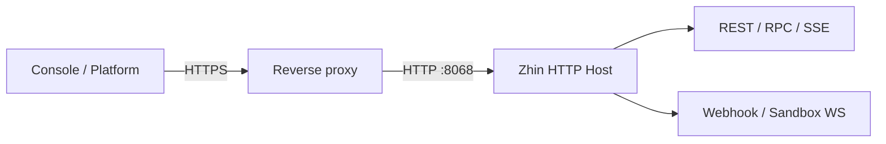

# 把 Zhin 部署成可恢复的服务

这份方案面向单实例 Bot、团队 Workroom 和远程 Console。目标是让进程、入口、密钥、状态、监控、备份与恢复都有明确责任人。

## 1. 发布前基线

- Node 使用 `^20.19.0 || >=22.12.0`，依赖由 lockfile 固定。
- 执行 `zhin doctor`、`pnpm build` 与项目测试。
- 用 `zhin runtime start --once --mode test` 验证装配，不连接长期 supervisor。
- 记录当前提交、lockfile hash、配置版本与数据备份点。

最小生产配置来自可执行 fixture：

<<< ../snippets/production/zhin.config.yml

密钥只通过环境变量注入。示例将 Host 绑定在 loopback，由同机反向代理提供 TLS；若容器或独立网关需要直连，再显式改为 `0.0.0.0`。

## 2. 网络与鉴权



反向代理必须保留 Authorization、Webhook 原始请求体、SSE 流式响应与 WebSocket Upgrade。不要缓存 `/api/events`，也不要改写需要平台验签的 body。

公开探针是 `GET /pub/health`。它证明 HTTP 进程可响应，不证明所有 Endpoint、Database 或 Agent provider 已就绪；完整判断仍看 Console Dashboard 与运行时能力。

生产环境设置 full token。演示与只读观察使用独立 demo token；平台 Webhook 继续使用各自的签名密钥，不能拿 Console token 代替。

## 3. 进程托管

```bash
# 容器或外部 supervisor：前台运行，由平台收集 stdout
zhin runtime start --mode production --no-watch

# Linux：安装用户级 systemd 服务
zhin service install --user
zhin service status --user
```

macOS 使用不带 `--user` 的 launchd 服务命令。只保留一层进程重启策略：使用 systemd、launchd、Kubernetes 或 PM2 时，让外部 supervisor 管理前台 Runtime；只有直接裸机运行时才使用 `--daemon`。

退出码 51 表示 Console 请求重启，75 表示 Runtime 需要重启。若外部 supervisor 接管，需允许这两类退出重新拉起，同时配置重启风暴限制。

## 4. 持久状态与备份

| 状态 | 默认位置或权威源 | 备份要求 |
| --- | --- | --- |
| 主数据库 | `.zhin/data.sqlite` 或 `database` 指定后端 | 使用数据库一致性快照 |
| Workroom Catalog | 数据库 `workroom_catalog`；文件模式 `.zhin/workroom-catalog.json` | 与 Workroom Journal 同一恢复点 |
| Workroom Journal | 数据库 `workroom_events`；文件模式 `.zhin/workroom-journal` | append-only 数据必须完整复制 |
| 调度任务 | `data/schedule-jobs.json` | 与配置、时区和目标 Endpoint 一起保存 |
| Runtime 私有状态 | `.zhin/` | 按功能选择；不要通过 Agent 文件工具暴露 |
| 密钥 | Secret manager / 环境注入 | 单独轮换，不进入普通备份包 |

SQLite 备份应使用数据库快照或停写复制，不要在写入中直接复制单个文件。外部数据库使用对应引擎的备份工具，并定期做恢复演练。

## 5. 监控与告警

监控至少覆盖 HTTP 探针、进程重启次数、Endpoint 在线状态、SSE recovery gap、日志错误率、数据库容量、Workroom 阻塞项和 Agent 失败/取消比例。

日志默认进入 stdout；daemon 模式写 `.zhin/runtime.log`。设置宿主日志轮转，不要只依赖 Console 清理。告警应携带 Endpoint、Project、runtimeId 或 runId，避免只报一段错误文本。

## 6. 发布与回滚

1. 暂停会产生新副作用的入口，保留只读探针。
2. 备份数据库、Workroom 状态、调度任务、配置与 lockfile。
3. 安装锁定依赖，运行 doctor、测试与一次性启动。
4. 启动生产进程，完成 [Console 标准验收](/console/#一次标准验收)。
5. 观察一个完整业务窗口，再解除旧版本与备份保留。

回滚必须恢复代码、lockfile、配置和数据的同一检查点。若新版本已经写入新 Schema 或外部副作用，不要只降级 npm 包；先执行迁移说明中的数据恢复方案。

## 事故检查顺序

1. `/pub/health` 是否可达。
2. Dashboard 是否连接到预期 Host 与版本。
3. Endpoint 是否在线，统一收件箱是否收到事件。
4. 当前 generation 是否发布所需能力。
5. Database、SSE history 与 Workroom Journal 是否从同一权威恢复。

升级操作见[版本兼容与迁移](./upgrades)，页面级诊断见 [Console](/console/)。
