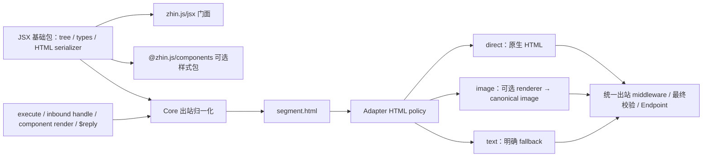

# JSX、组件与 HTML 出站重整计划

状态：P0–P5 已实现并完成本地验收，等待 PR / CI。2026-10-09 基于 `codex/stability-console-acceptance` / `b8c0f46c7` 的审计；实现分支 `feat/jsx-html-components` 已更新到最新 main。三个 Agent 分别审计公共契约、返回值链路和平台策略；中间件语义、样式包名和旧入口直接移除均已由用户确认。

## 目标与已确认行为

- `zhin.js/jsx` 对外提供统一 JSX 能力，指令 `execute`、入站中间件 `handle`、注册组件 `render` 均可直接返回 JSX。
- JSX 先生成 HTML，再生成 `segment.html`；平台策略决定保留 HTML、渲染图片或降级文本。
- `zhin.js/component` 提供组件定义、发现与调用能力；样式组件放在独立可选包 `@zhin.js/components`。
- 入站链结果向外传递，链结束后自动回复一次；显式 `$reply` 仍可多次发送。
- 出站中间件保留 `next()` 的放行控制，通过 `envelope.replace(JSX)` 改写，不引入返回值自动发送。

完成标准是三种作者入口进入同一条真实发送链路，类型与实际值一致。只有 HTML serializer 的测试通过不代表完成。

## 实施前的问题与依据

| 问题 | 当前代码 |
| --- | --- |
| Core JSX 返回 `{type,data}`，原生标签丢失标签与属性；与 Segment 外形冲突 | [`core/jsx.ts`](../../packages/im/core/src/jsx.ts)、[`contracts.ts`](../../packages/im/core/src/plugin-runtime/im/contracts.ts) |
| Satori JSX 返回普通字符串；嵌套标签被当作文本再次转义 | [`satori/jsx.ts`](https://github.com/zhinjs/zhin/blob/b8c0f46c7/packages/toolkit/satori/src/jsx.ts) |
| html-renderer 又有独立 `{type,props}` serializer，未覆盖函数与异步组件 | [`html-renderer/jsx.ts`](https://github.com/zhinjs/zhin/blob/b8c0f46c7/packages/toolkit/html-renderer/src/jsx.ts) |
| 实际 OutboundRenderer 不消费现有 JSX；旧 JSX 发送测试调用的是旧 helper | [`outbound-renderer.ts`](../../packages/im/core/src/plugin-runtime/im/outbound-renderer.ts)、[`jsx-send-pipeline.test.ts`](https://github.com/zhinjs/zhin/blob/b8c0f46c7/packages/im/core/tests/jsx-send-pipeline.test.ts) |
| 指令立即自动发送结果；中间件只返回 void，并丢弃返回值 | [`message-dispatcher.ts`](../../packages/im/core/src/plugin-runtime/im/message-dispatcher.ts)、[`middleware-index.ts`](../../packages/im/middleware/src/middleware-index.ts) |
| 根入口旧函数式 defineComponent 与子路径对象式 defineComponent 同名异义 | [`core/component.ts`](https://github.com/zhinjs/zhin/blob/b8c0f46c7/packages/im/core/src/component.ts)、[`component/definition.ts`](../../packages/im/component/src/definition.ts) |
| Adapter 已声明 `html: direct/image/text`，实际仍仅按 Sandbox 包名判断 direct | [`adapter/definition.ts`](../../packages/im/adapter/src/definition.ts)、[`outbound-delivery-runtime.ts`](../../packages/im/core/src/plugin-runtime/im/outbound-delivery-runtime.ts) |
| SendContent 数组允许嵌套，但后续平台归一化没有完整扁平化 | [`outbound-renderer.ts`](../../packages/im/core/src/plugin-runtime/im/outbound-renderer.ts)、[`outbound-segments.ts`](../../packages/im/core/src/plugin-runtime/im/outbound-segments.ts) |
| 官方插件指引禁止服务端 TSX，Component README 也与实际 TSX loader 矛盾 | [插件指引](https://github.com/zhinjs/zhin/blob/b8c0f46c7/.github/instructions/zhin-plugin.instructions.md)、[Component README](https://github.com/zhinjs/zhin/blob/b8c0f46c7/packages/im/component/README.md) |

当前真实链路是 `RuntimeMessage reply → OutboundDeliveryRuntime → OutboundRenderer → 出站 middleware → AdapterIndex.send → Endpoint.send`。`before.sendMessage` 目前只有 MessageBus 声明，计划和验收不把它当成已经触发的运行时事件；本次采用真实出站中间件作为拦截点，清理相关失真说明。

## 目标模块分工

| 入口 / 包 | 负责什么 | 依赖限制 |
| --- | --- | --- |
| 新增 `@zhin.js/jsx`，目录 `packages/im/jsx` | branded JSX tree、JSX 类型、factory、Fragment、唯一异步 HTML serializer | 零运行时依赖，无 IM、平台、React、截图引擎 |
| `zhin.js/jsx` | 公开上述 JSX 创作面与 `renderToHtml` | 门面，不再另写 renderer |
| `zhin.js/jsx-runtime` / `jsx-dev-runtime` | automatic JSX 编译技术入口，委托同一实现 | 与显式入口具有完全相同语义 |
| `zhin.js/component` | 唯一对象式 `defineComponent({render})`、组件调用 `component(name,props)`、相关类型 | 注册组件由 ComponentIndex 解析当前 snapshot/requester/owner |
| 新增 `@zhin.js/components`，目录 `packages/toolkit/components` | Card、布局、主题、指标、图表与 Markdown 等纯 JSX 函数组件 | JSX 基础包及解析／高亮依赖，可选安装；不依赖 IM |
| Core 出站模块 | JSX → HTML → canonical HTML Segment；统一 SendContent 校验、顺序、平台协商与投递 | 不直接依赖组件库、Satori、Shotium |
| `@zhin.js/html-renderer` | HTML → PNG/JPEG/WebP | 不拥有 JSX/组件定义或第二套 serializer |
| `@zhin.js/tailwind` | 官方静态工具类 → 内联样式 | 可选；不加载 CSS 文件，不拥有 JSX runtime |
| CLI | 可选 renderer 的加载和 generation-owned Resource 装配 | 沿用唯一 composition root |



上图是职责图，实际执行须保留现有出站中间件能检查最终候选 payload 的能力：第一次归一化建立 envelope，替换内容再通过同一归一入口校验；相同 JSX 根不得重复求值。

Feature 的 TResult 保持传输中立，IM 组装层负责校验是否可发送；Command 的通用业务返回能力不强制改成 HTML。新增基础包、组件包必须登记到架构与依赖门禁，不能借未映射的目录绕过检查。

## JSX 与 SendContent 契约

1. JSX.Element 精确对应带独立 brand 的 lazy tree，不是 HTML string，也不借用 Segment 的 `{type,data}`。JSX.ElementType 单独描述 intrinsic、同步/异步函数组件和 Fragment，确保 TypeScript 能接受异步 JSX 函数组件。
2. 普通字符串继续表示文本；`'<b>x</b>'` 不自动解释成 HTML。纯函数组件不需要 defineComponent 注册。
3. 嵌套 JSX、函数返回的 JSX、异步子树和数组递归求值；`null/undefined/boolean` 为空，数字保留，包括 `0`；Fragment 不增加 DOM 包装。
4. 文本和属性默认转义。className、style 对象、HTML/SVG 属性与 void 元素形成明确类型和序列化规则；不声称支持浏览器事件处理器或 React hooks。Raw HTML 只允许显式入口。
5. 服务端 TSX 只转译 JSX，不支持直接导入 `.css`、CSS Modules、`?raw` 或样式预处理；使用内联 style、主题与 custom.style。
6. JSX 子树输出一个 HTML 段；外部 SendContent 的数组则扁平化并保留 text、HTML、mention、image、keyboard 的顺序。JSX 中不隐式塞入平台 Segment；混合消息写在 SendContent 数组中。
7. 统一根入口、runtime 与 `$reply` 的 SendContent，消除旧 MessageComponent 类型与实际 runtime 类型双轨。各入口无需 `as SendContent` 即可使用 JSX。
8. `renderToHtml` 只序列化，不发送、不截图。直接返回 JSX 采用已有渲染默认值；需自定义宽度、文件名、明确文本 fallback 时仍使用 `segment.html({html: await renderToHtml(node), ...})`。第一版不引入特殊标签偷偷改变发布或平台策略。
9. renderer 使用当前 operation snapshot；函数组件不读取模块级最新 generation。注册组件的资源上下文只由 ComponentIndex 提供，普通纯函数 JSX 不伪造 CapabilityContext。
10. JSX 求值失败进入明确的投递失败与内部诊断，不将异常堆栈或错误文本伪装成正常聊天内容。空 Fragment 与 void 在结果类型上区分，最终空内容不调用 Endpoint。
11. `${...}` 旧文本模板解析不再对生成的 HTML 或 JSX 文本二次执行。

默认保留 `jsxImportSource: "zhin.js"`，编译器解析现有技术子路径；作者显式导入 JSX 能力使用 `zhin.js/jsx`。若确定要把 `jsxImportSource` 也设为 `zhin.js/jsx`，须增加 `./jsx/jsx-runtime` 与 `./jsx/jsx-dev-runtime` 导出；这属于同一实现的编译入口，不能误写成一套新 runtime。

```tsx
import { defineCommand } from 'zhin.js/command';
import { Card, Row, Badge } from '@zhin.js/components';

export default defineCommand({
  execute: () => (
    <Card>
      <h2>服务状态</h2>
      <Row><Badge>在线</Badge><span>运行正常</span></Row>
    </Card>
  ),
});
```

注册组件仍是对象式定义，其 `render` 直接返回同样的 JSX；通过 `component('status-card', props)` 调用时，名字查找、override 和资源读取继续归当前 generation 的 ComponentIndex。不再用另一套同名函数式 defineComponent 解释 JSX 函数。

## 入站中间件结果：已确认

| 写法 | 行为 | 自动回复内容 owner |
| --- | --- | --- |
| `return <Card />` | 停止后续链，形成待回复结果 | 当前 middleware |
| `return next()` | 透传下游结果 | 保留下游 owner |
| `await next(); return <Card />` | 用新内容替换下游待自动回复结果 | 当前 middleware |
| `await next()`，无 return | 继续透传下游结果 | 保留下游 owner |
| 不 next、无返回 | 消费输入，无自动回复 | 无 |
| 显式 `$reply(A)` 后返回 JSX | 显式消息立即发送，链结束再自动发送 JSX | 分别按各自调用者 |

实现使用一个很小的 continuation 类型：`next()` 返回只用于透传的不透明结果，普通作者仍只需 `return next()`。内部 frame 保存完整下游 outcome，区分路由事实和待发送内容；当前 frame 的 carrier 身份保留 owner，返回新内容属于当前 middleware。绝不通过“返回值与下游内容相等”判断 owner。

CommandDispatcher 停止立即自动回复，只返回匹配事实与待回复内容；最外层 InboundRuntime 在租约关闭前执行最终 `$replyFrom(owner, content)`。匹配命令返回 void 仍是 matched；没有内容不等于 miss，不会因此启动 AI。

当前 AI/interaction 使用显式回复且可能发送多条消息，它们的 outcome 是 handled、没有待自动回复内容，避免重复发送。上游替换只作用于尚未自动发送的返回值，不能撤销已经发生的显式回复。交互输入 claim 的独占规则保留。

防护包括 next 单次调用、跨 frame/operation/generation 的 carrier 拒绝、未 await 的下游 Promise 在 scope 结束前结算、异常不被丢弃。出站 middleware 单独保留 void/replace/next 类型，入站 carrier 不进入出站链。

## 平台策略与降级

| Adapter 声明 / 生效策略 | HTML 段处理 | 验收对象 |
| --- | --- | --- |
| `html: direct` | 保留 HTML，平台 codec 消费；其他段继续归一化与支持类型校验 | Sandbox、Email |
| `html: image`（显式或省略后的默认策略） | 可用 renderer 生成 PNG，进入 canonical image / MediaRef 与平台媒体投递 | ICQQ、OneBot、Telegram、Slack 当前未显式声明，使用默认策略 |
| `html: text` | 明确 fallback 优先，否则提取 HTML 文本；不调用 renderer | 纯文本端点 |
| 未声明 | 继续保守 image-or-text 默认策略 | 自定义适配器 |
| 只接受 URL、没有二进制投递方式 | 跳过无意义的截图，转文本 | GitHub、LINE、对应钉钉模式 |

按 endpoint 对应的当前 Adapter definition 解析策略，支持 1:N 展开的 endpoint，不再判断供应商包名。direct 只跳过 HTML 转换，不能跳过其他媒体/交互/支持类型校验。

没有 renderer 或截图失败可在尚未投递前转文本，同时记录结构化原因；诊断不记录完整 HTML。平台上传/发送已经尝试后失败或结果未知，保留 failed/unknown receipt，不擅自再发文本造成重复。HTML 中的按钮只是展示，原生交互仍使用 canonical keyboard。

## 分步交付与多 Agent 分工

使用新 issue 分支与一个集成 PR，分步形成可审查提交；不在 main 提交。包契约冻结后再并行实现，基础运行时和样式包在同一次受控发版中切换，避免用户装到半套新语义。

| 阶段 | 工作与验收 | 责任 |
| --- | --- | --- |
| P0：冻结契约 | 本计划、包名、导出、JSX tree、入站/出站语义；补实际调用链清单 | 主 Agent；公共契约与链路 Agent 复核 |
| P1：唯一 JSX 模块 | branded tree、HTML serializer、类型 fixture、automatic runtime exports；架构门禁 | JSX Agent；先冻结交接类型 |
| P2：真实发送链 | canonical SendContent、OutboundRenderer、数组展开、Adapter html policy、replace(JSX)；真实 Runtime 测试 | IM Agent；与 P1 接口串行联调 |
| P3：结果传递 | middleware target 类型、continuation、command 延迟自动回复、owner/lease/AI/interaction 回归 | IM Agent；同一批核心文件不让多个 Agent 同时改 |
| P4：样式与工具收敛 | 提取 Card/布局/主题/指标/图表；html-renderer 通过 Shotium 消费 HTML，移除 Satori 图片工具；全仓库消费者切换 | Components Agent，可与 P2/P3 并行改自己的目录 |
| P5：用户路径与收尾 | minimal-bot、脚手架、tsx loader/HMR、预览、双语文档、skill/AGENTS、changesets、包产物验证 | 主 Agent 负责集成；独立审查 Agent 复核最终 diff |

实现期间最多三条主工作线：JSX 基础、IM 链路、组件与消费者。每条线明确目录所有权；核心类型冻结前不让下游猜接口。最终审查须有人专门检查越层依赖、owner、generation、重复发送和降级后误报。

P4 的统一定制面：ThemeProvider 以 JSX 树作用域传递共享背景、色彩、字体、间距、圆角、边框、阴影与默认文案；组件 `custom.style` 提供局部覆盖，展示位使用 JSXRenderable。异步／嵌套／并行主题不得串色或读取模块级 current theme。

间距使用统一 4px 基准刻度：组件间的外距优先 margin，容器与内容的内距用 padding；默认上下同值、左右同值，Divider 也使用对称外距，避免父 gap 与子 margin 重复。普通 block 文档流可折叠纵向相邻 margin；图片渲染所需的 Flex 布局不承诺折叠，横向与换行布局保留 gap。局部自定义 CSS 仍允许按业务需要覆盖。

P4 的第一批稳定组件：CardCanvas/Card、Row/Col、Section/Divider、Badge、KvTable、MetricBlock、UsageBar 和主题 tokens；迁移现有图表消费者。展示验收补充 Table/TableRow/TableCell、List/ListItem、Markdown/CodeBlock 与 Checkbox/Radio/Switch/Button；控件仅展示状态和样式，不接入事件或平台交互。Markdown 使用解析后的 token 构造 JSX，代码块提供语言标签、语法着色、可选行号和标题，并验证长代码在 HTML / SVG 中可读。解析与高亮依赖仅属于可选组件包，不进入 IM 核心。

## 验收矩阵

- **类型与包产物**：公开源码与已构建 npm 产物均能编译 execute、inbound handle、component render、`$reply(JSX)`；development/prod exports 一致；JSX.Element 与运行时 brand 一致；异步函数组件可作为标签。
- **HTML 语义**：nested intrinsic、异步函数返回 JSX、Fragment、数组、false/null/undefined/0、Unicode、文本/属性/style 转义、显式 Raw、HTML/SVG、void 元素、循环/过深树失败。
- **实际入口**：通过真实 ImRuntime 的命令、中间件和注册组件各返回同一 JSX，送到测试 Endpoint 的 payload 一致；组件只执行一次，替换内容再走归一化；混合段保持顺序。
- **入站语义**：四种 next 写法、两层/三层回卷、同值新内容 owner 更新、void matched、短路、跨 frame carrier、next 重复、显式多次回复加一次自动结果、AI/interaction 不重复发送。
- **平台能力**：direct/image/text、缺 renderer、renderer 异常、URL-only、展开 endpoint、未支持 Segment；direct 不使其他段绕过审核；上传失败/未知状态不重发文本。
- **运行时**：组件 await 期间 HMR 后仍使用原 snapshot；多 Root 不互串；CLI 开发 TSX 与编译后的生产启动均能跑；Console 预览通过真实 render/send 路径。
- **用户黄金路径**：minimal-bot 的 `.tsx` execute/middleware/component 示例、脚手架新建与 `.tsx` HMR；无截图引擎时文本结果可读，安装可选引擎后图片结果可用。
- **架构与发布**：architecture/dependency/harness-paths、相关类型检查与 lint、IM 安装体积预算、组件包不拉入 React/截图引擎、文档链接、changeset 和 pack 后导出；全局门禁按最终改动范围运行。

确定性测试使用测试 Endpoint 和可控 renderer；实际平台图片上传另做专门账号验收，不能以 mock 通过宣称所有平台可用。

## 旧入口的处置：已确认

直接删除旧 MessageComponent JSX、旧函数式 defineComponent/模板组件 helper、Satori JSX/string 样式组件导入、html-renderer 独立 JSX serializer。清理所有仓库消费者、测试与导出，不保留双 runtime 或迁移入口。

用户已确认包名及旧入口直接移除。实施按 P1–P5 推进，测试与实际完成情况在 PR 中记录；不自动合并或发布。

## 本地验收记录（2026-10-09）

- 全量 Vitest：最终 `pnpm exec vitest run --maxWorkers=2`，1008 个文件、7646 项测试通过，12 项保持跳过。默认并发下原有页面构建 100ms 性能断言会受本机负载影响；降低 worker 数后保留原阈值通过。临时 Git fixture 清理使用有限重试处理瞬时 ENOTEMPTY。测试涉及本机 HTTP/TLS 监听，须在允许该能力的环境运行；受限沙箱中的失败不作为代码回归结论。
- 完整 harness 的其他 56 项检查通过，包括类型、lint、架构、依赖、公开导出、API 文档、发布计划、Stable、L4-CI、IM 安装体积。最终单测按上面的独立全量复验记录，不将初次 `check:all` 的单测失败记成通过。
- `pnpm check:created-project`：候选 tarball → 空项目安装 → 真实 CLI / Sandbox → Console HTTP JSX 预览 → JSX `/card` → `.tsx` 组件 HMR → 指令 HMR → production 重启，全部通过。
- 两个新包 tarball 的独立 NodeNext TSX 消费验证通过：无 React / IM Runtime，异步展示插槽、共享主题、局部样式与 Divider 对称外距可用。厨房水槽 `test-bot` 类型检查通过。
- 浏览器检查默认、深色、局部覆盖主题；实际测量 block 的 16/24px 相邻纵向外距为 24px，Flex 为 40px。SVG 回归验证对称间距及主题缩放仅执行一次。
- 最终 `HARNESS_SEQUENTIAL=1 HARNESS_SKIP_TEST=1 pnpm check:all` 全部通过，单测使用上述独立全量结果。扩展后的组件包 8 个测试文件、80 项测试通过；Satori 包另有 5 项测试通过。
- 34 个组件提供三套主题、10 个模块的真实 HTML 画廊：表格、布局、嵌套列表、Markdown、代码、控件、按钮、图表、默认间距与局部覆盖。QuoteCard → EmptyState 默认间距为 8px；1280px 浏览器视口各模块无横向溢出。
- Markdown 和 CodeBlock 经真实 SVG 验证：100/320px 窄画布长行、空行、Tab、转义文本与完整代码内容保真。Satori 清理改为解析后处理实际元素／属性，避免误改代码里的 `onclick=`、`href=javascript:` 文字。
- 更新后的两个新包独立安装、NodeNext TSX 编译和 Markdown／代码／嵌套 List／Table／控件输出通过；已发布文件包含可直接运行的画廊脚本。高亮和解析依赖仅属于可选组件包，IM 核心体积门禁通过。
- 当时新包 `@zhin.js/jsx`、`@zhin.js/components` 尚未在 npm 注册；首次发布须遵循[维护者发布流程](../contributing/development.md)，后续再交给自动发布。当前首发进展见下方记录；真实 IM 平台图片发送不在上述本地证据范围内。

## CI 故障修复（2026-10-10）

- PR #695 的包构建已通过，Ubuntu / Node 24 作业失败于 Email admission 的覆盖率测试。给第二轮 fetch 结束增加 80ms 延迟后，旧测试可稳定复现相同断言失败；固定 20ms 等待无法证明解析与分发完成。测试改为按下一轮实际获准轮询推进，并可显式控制 fetch 结束与消息 body；保留忙时拦截、UID 去重、UIDVALIDITY 与 TTL 的断言。
- 文档整站构建复现 4 个死链：源文件存在，但位于 VitePress 站点根目录之外。改为仓库链接；`pnpm docs:build` 完整通过，且已加入 PR 的 Node 24 CI，保留严格死链检查。
- 两个 CodeQL 告警位于 Markdown 测试的正则文本提取工具，未涉及生产 HTML 输出。改用真实 HTML/XML 解析器提取正文，补充实体、嵌套标签、引号与注释回归；解析器仅增加为测试依赖，不进入组件包生产依赖。
- Node 24 全量覆盖率复验：1008 个文件、7647 项通过，12 项保持跳过；lines 72.79%、branches 61.99%，保留原门槛。其后补强第二轮完全 drain、第三轮 body 未释放时的去重断言，并通过 Email 与完整组件包的 88 项复验。


## PR 审查修复（2026-10-10）

本轮核对 [PR #695](https://github.com/zhinjs/zhin/pull/695) 的 39 条未解决建议，修复 37 条指出的问题；其中 Satori 的 style/title 建议只采纳 HTML style 保真部分。此前两条 CodeQL 建议已解决。

- JSX 禁止普通 script 标签，只有显式受信任 raw HTML 入口保留原文；classic factory 的单个 children 保持标量。JSX 与组件包发布 src，保证 development 条件指向实际文件。
- 默认 RootHost 装配作用域内的 TSX loader。Sandbox 聊天页补 HTML 隔离展示，保留 direct 策略；真实 Chrome 验证显示、自动高度、CSP、来源校验和父页面隔离。
- 修复组件 CSS 注释解析、负数图表、短十六进制颜色、删除线、控件可访问状态、列表编号与内层主题、空表格预算，以及可等待的 Promise 插槽。行类型开放已有 bold 能力，预览默认路径使用系统临时目录。
- 核心校验 keyboard/action 的数据形状，消息段辅助函数限制到已渲染内容，空 HTML/文本统一抑制发送。数组使用独立结构预算和循环检测，不消耗组件递归预算；原始输入、replace、raw 和组件返回路径都有回归。
- 修正脚手架、中英文 README、消息流图、插件指引和依赖说明；文档构建移到只读 harness 后。Email 与 Sandbox 源 README 的变更同步到适配器文档。

两条建议不自动采纳：major 升级指出的破坏性 API 变更确实存在，但用户已确认直接移除旧入口，仓库当前发布策略只允许 patch，本 PR 不改变版本治理规则。超深 HTML 静默截断会丢失内容，因此保留明确 RangeError；发送链已验证渲染失败只在投递前降级一次。title 与 SVG style 保持转义，防止解析器解码的实体被重新解释为标签。

本轮修复的本地复验：1013 个测试文件、7695 项测试通过，12 项保持跳过；lines 72.83%、branches 62.07%。91 个包构建、56 项非单测 harness、文档整站构建及两个新包的独立安装/导出验证通过。默认 RootHost 的无全局 TSX loader 子进程测试、Sandbox HTML 的真实 Chrome 隔离测试通过；这些是本地证据，尚未代表新提交的 CI 或实机平台验收。

## Tailwind 与图片渲染收敛

用户确认首版 Tailwind 采用静态工具类，明确渲染边界。作者接口为可选 `@zhin.js/tailwind` 的 `createTailwindStyle()`：初始化后返回同步 `tw(classes)`，结果直接用于原生 JSX `style`、组件 `custom.style` 或主题样式。不新增 JSX runtime、样式树包装器、全局 CSS loader 或 IM 核心依赖。工具类由官方 Tailwind 编译，按生成 CSS 的优先级合并；未知或无法转为单元素内联样式的类明确报错。CSS import、CSS Modules 和预处理器仍不属于服务端 TSX 支持范围。

图片后端已升级为 npm 发布的 `@pixel.js/shotium@0.12.1`，按该版本实际声明使用同步 `start()` 和 `releaseMemory()`。HTML renderer 返回格式严格对应 PNG/JPEG/WebP，不再接受 SVG。已删除 `@zhin.js/satori` 图片工具及其字体、依赖和消费者；Satori IM 协议适配器仍保留。组件、插件和示例的截图测试改为真实 Chromium PNG，检查尺寸、色块边界、间距和主题；不再由另一套布局引擎间接证明截图结果。

可选 Tailwind 包独立生产安装、浏览器打包和真实截图已通过。组件局部样式覆盖保留 CSS 声明顺序，使 `p-0` 等 shorthand 能覆盖先前的单边默认值。新增审查建议同时补齐了稀疏数组发送、AI 交互段 Schema、CSS 注释间隔、展示控件的可访问名称，以及 Sandbox 普通 HTTP nonce 和高度回报脚本时序。

### 已知原生退出问题

macOS arm64 / Node 24 本地验收中，Shotium 0.12.1 曾在子进程退出清理时发生一次 `SIGSEGV`；原生堆栈包含 `napi_async_cleanup_hook_handle__`、`napi_remove_async_cleanup_hook` 和 `shotium.node`。随后单文件与多文件各 10 轮压力复验均通过，没有在代码中增加重试或吞掉退出错误。退出清理的线程调用值得继续调查，但尚未确认根因，因此这条风险仍开放；不能以 20 轮通过视作修复，也不能据本地截图结果宣称生产稳定。其他 Zhin 包尚未发布。

### 新包手动首发（2026-10-10）

维护者授权并完成 npm 登录／验证后，`@zhin.js/jsx@1.1.0`、`@zhin.js/components@1.1.0`、`@zhin.js/tailwind@1.1.0` 已从提交 `e77861283` 的冻结 tarball 完成首发。Registry 下载内容与本地校验值一致，独立项目安装后的运行时冒烟及 NodeNext TSX 类型检查通过。

发布使用 `--tag next`，但 npm 首发同时生成 `latest`；三个包的两种标签均指向 `1.1.0`。删除 JSX 包 `latest` 的请求在验证后被 Registry 以 HTTP 400 拒绝，其他清理已取消。本轮后续审查修复通过已有 changeset 进入下一次 patch 发布，不覆盖已发布的 `1.1.0`。CI Trusted Publisher 配置尚未在本次首发中设置。

### 最终本地复验

Node 24 全量覆盖率运行通过 1020 个文件、7813 项测试，3 个文件与 12 项测试保持跳过；lines 72.98%、branches 62.29%。之后补充的 List 懒执行回归随该文件 12 项测试通过。56 项非单测 harness、91 个包构建、文档整站构建均通过，最后的 Core／组件／Sandbox 修复再次构建通过；适配器同步、文档链接与 diff 检查通过。当前记录是本地证据，远端 CI 需按最终提交单独核对。

截图测试的清理检查还补齐了“子进程已提前异常退出”分支，避免最后一张截图成功后发生的原生崩溃被遗漏。该检查更新后，组件和 Tailwind 集成的 12 个测试文件、127 项测试通过。

### 首发后的审查补充（2026-10-10）

新增 9 条建议中，8 条采纳：静态 Tailwind 禁止 `unset`；主题快照记录实际依赖版本；许可证保留仓库与 Tailwind 双方归属；组件说明明确异步初始化；画廊只忽略可选包本身缺失，内部依赖与初始化失败继续抛出；截图失败回归覆盖两个并发槽位；插件目录继续排除已删除的 Satori 图片包并排除三个新展示库；模块表补齐 WebP。转义 URL 字符串当前运行时只有一个反斜杠，已有测试有效，该建议不改代码。

组件、Tailwind、HTML renderer 合计 16 个测试文件、185 项测试通过，Tailwind 构建及 NodeNext 类型检查通过；改动的 TypeScript 文件 lint、MJS 语法、文档链接及 diff 检查通过。隔离 fixture 验证了可选包未安装时画廊仍可生成，而内部依赖丢失和初始化错误必须失败；插件目录 fixture 保留 Satori 协议适配器但不收录图片工具。临时移除截图槽位释放后，新回归按预期超时失败，恢复实现后通过。上述为本地证据，当前提交远端 CI 另行核验。
