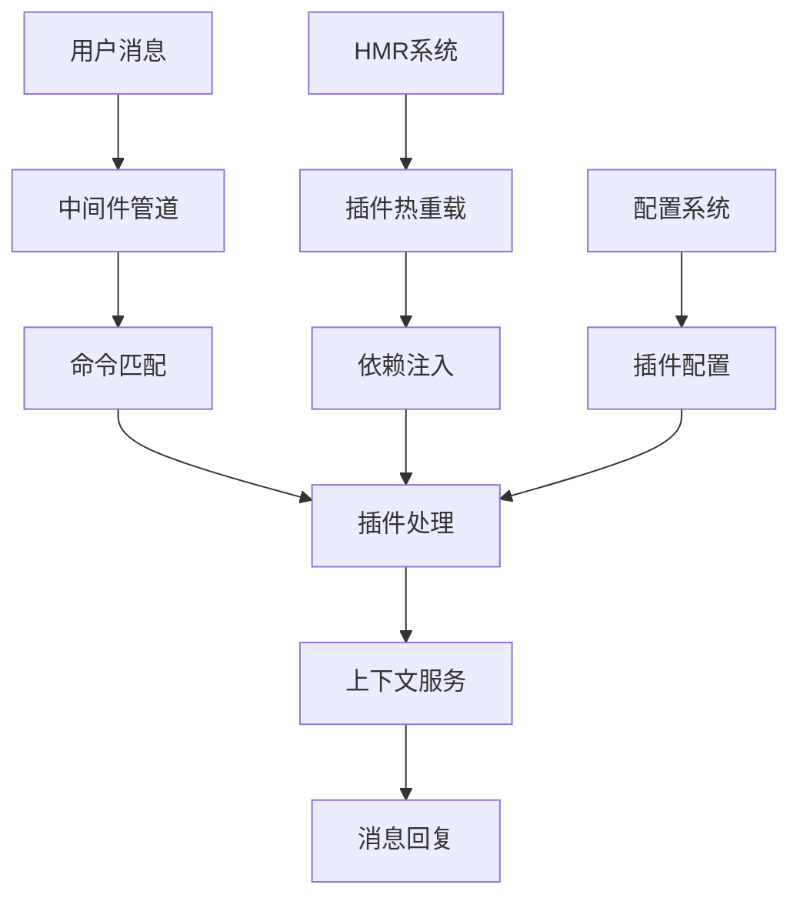
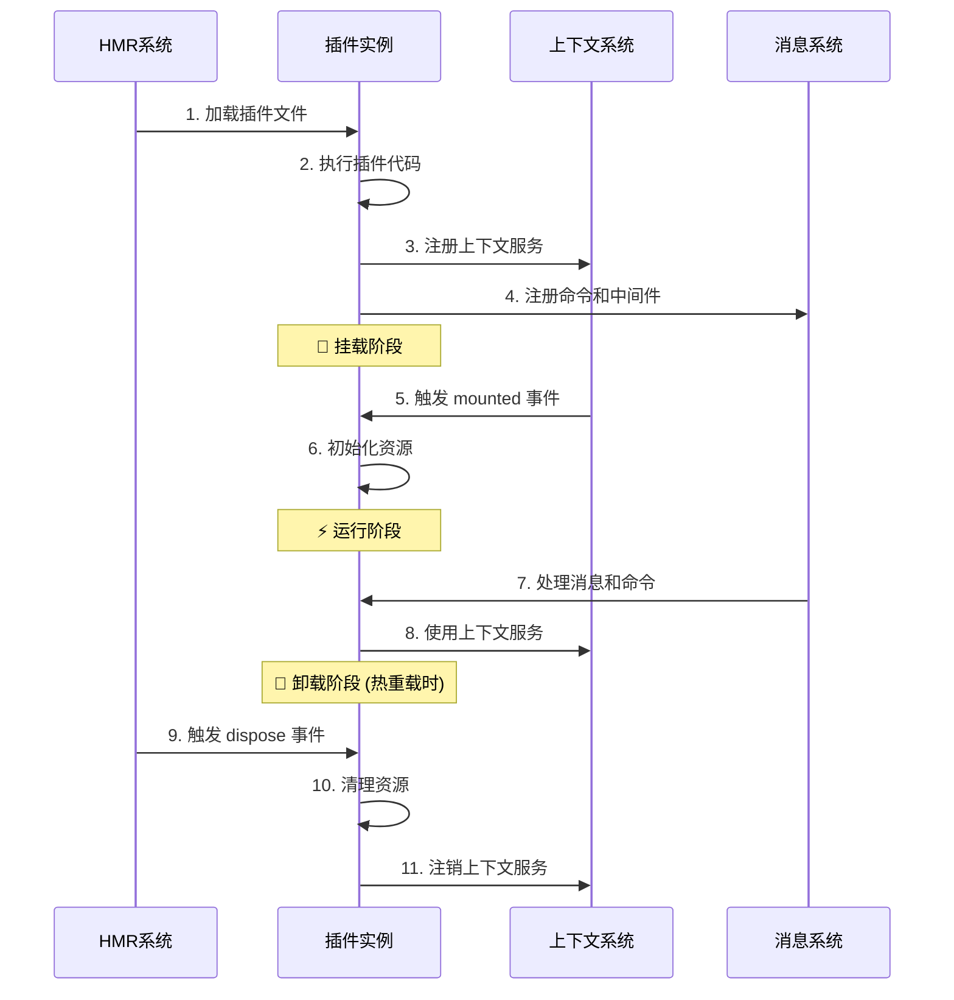

# 🧩 插件开发指南

本指南将帮助你深入掌握 Zhin.js 插件开发，从基础到高级技巧。

> **生态说明**：Zhin.js 开箱即用支持控制台适配器、HTTP 服务、Web 控制台、SQLite 数据库。Telegram、Discord、QQ、KOOK、OneBot v11、MySQL、PostgreSQL 等需手动安装扩展包。建议插件开发优先兼容主仓库内置服务，跨平台请注明依赖。

## 🎯 插件核心概念

插件是 Zhin 框架的灵魂，每个插件都是一个功能完整的模块。一个优秀的插件应该：

- 🎮 **处理消息** - 响应用户输入，提供智能交互
- ⚡ **注册命令** - 定义清晰的命令接口和参数解析
- 🔧 **提供服务** - 通过上下文系统为其他插件提供功能
- 🔗 **添加中间件** - 在消息处理流程中插入自定义逻辑
- 📡 **监听事件** - 响应系统和其他插件的事件
- 💾 **管理状态** - 维护插件的持久化数据和缓存

## 🏗️ 插件架构设计



## 📁 现代插件结构

基于实际项目生成的标准插件结构：

```typescript
import {
  useLogger,          // 日志系统
  onMessage,          // 消息监听
  addCommand,         // 命令注册
  addMiddleware,      // 中间件系统
  MessageCommand,     // 命令解析器
  useContext,         // 上下文依赖
  onDispose,          // 生命周期
  register,           // 服务注册
  defineComponent,    // 组件定义
  segment             // 消息段工具
} from 'zhin.js'

// 📝 获取日志记录器
const logger = useLogger()

// 🎯 注册简单命令
addCommand(new MessageCommand('hello')
  .action(async (message) => {
    logger.info('Hello command called by:', message.sender.name)
    return '你好！欢迎使用 Zhin 机器人框架！'
  })
)

// 📊 带参数的复杂命令
addCommand(new MessageCommand('weather <city:text> [date:string]')
  .action(async (message, result) => {
    const { city, date = 'today' } = result.args
    const weather = await getWeatherData(city, date)
    return `${city} ${date}的天气：${weather}`
  })
)

// 🔧 添加中间件处理
addMiddleware(async (message, next) => {
  const start = Date.now()
  logger.debug(`处理消息: ${message.raw}`)
  
  await next() // 继续处理管道
  
  const duration = Date.now() - start
  logger.debug(`消息处理完成，耗时: ${duration}ms`)
})

// 💬 消息监听和智能响应
onMessage(async (message) => {
  // 智能问候检测
  const greetings = ['你好', 'hello', 'hi', '早上好', '晚上好']
  const text = message.raw.toLowerCase()
  
  if (greetings.some(greeting => text.includes(greeting))) {
    const responses = [
      '你好呀！👋 有什么可以帮助你的吗？',
      '嗨！很高兴见到你！😊',
      '早安！今天过得怎么样？🌅',
      '晚上好！休息得好吗？🌙'
    ]
    const randomResponse = responses[Math.floor(Math.random() * responses.length)]
    await message.reply(randomResponse)
  }
})

// 🔧 注册可复用服务
register({
  name: 'weatherService',
  async mounted(plugin) {
    const cache = new Map()
    
    return {
      async getWeather(city: string) {
        const cacheKey = `weather:${city}`
        
        if (cache.has(cacheKey)) {
          return cache.get(cacheKey)
        }
        
        const weather = await fetchWeatherAPI(city)
        cache.set(cacheKey, weather)
        
        // 5分钟后清除缓存
        setTimeout(() => cache.delete(cacheKey), 5 * 60 * 1000)
        
        return weather
      }
    }
  },
  
  async dispose(service) {
    logger.info('天气服务已清理')
  }
})

// 🎯 使用其他服务的上下文依赖
useContext('database', async (db) => {
  // 数据库就绪后执行初始化
  await db.query(`
    CREATE TABLE IF NOT EXISTS user_preferences (
      user_id VARCHAR(255) PRIMARY KEY,
      preferred_weather_city VARCHAR(255),
      created_at TIMESTAMP DEFAULT CURRENT_TIMESTAMP
    )
  `)
  
  logger.info('用户偏好表已准备就绪')
})

// 🧩 定义可复用组件
const WeatherCard = defineComponent({
  name: 'weather-card',
  props: {
    city: String,
    temperature: Number,
    condition: String,
    icon: String
  },
  
  async render(props) {
    return [
      `🌡️ **${props.city}天气预报**`,
      `温度：${props.temperature}°C`,
      `天气：${props.condition} ${props.icon}`,
      `更新时间：${new Date().toLocaleString()}`
    ].join('\n')
  }
})

addComponent(WeatherCard)

// 🧹 插件销毁时的清理工作
onDispose(() => {
  logger.info('天气插件已销毁，资源已清理')
})

// 🛠️ 工具函数
async function getWeatherData(city: string, date: string) {
  // 实现天气数据获取逻辑
  return `${city} ${date} 晴天，温度 22°C`
}

async function fetchWeatherAPI(city: string) {
  // 实际的API调用逻辑
  return { temperature: 22, condition: '晴天', icon: '☀️' }
}

logger.info('天气插件已加载 🌤️')
```

## ⚡ 快速开始：你的第一个插件

### 1️⃣ 创建插件文件

在 `src/plugins/` 目录下创建 `my-awesome-plugin.ts`：

```typescript
import { 
  useLogger, 
  onMessage, 
  addCommand, 
  MessageCommand 
} from 'zhin.js'

const logger = useLogger()

// 🎯 创建你的第一个命令
addCommand(new MessageCommand('awesome')
  .action(async () => {
    return '🚀 这是我的第一个 Zhin 插件！'
  })
)

// 💬 智能消息响应
onMessage(async (message) => {
  if (message.raw.includes('插件')) {
    await message.reply('🧩 插件开发很有趣！')
  }
})

logger.info('我的超棒插件已启动！ ✨')
```

### 2️⃣ 启用插件

在 `zhin.config.ts` 中添加插件：

```javascript
export default defineConfig(async (env) => {
  return {
    // ... 其他配置
    plugins: [
      'adapter-process',
      'http',
      'console', 
      'my-awesome-plugin'  // 添加你的插件
    ]
  }
})
```

### 3️⃣ 测试插件

启动开发服务器并测试：

```bash
pnpm dev

# 在控制台输入测试
> awesome
< 🚀 这是我的第一个 Zhin 插件！

> 我想了解插件开发
< 🧩 插件开发很有趣！
```

## 🔄 插件生命周期详解

### 📋 完整生命周期流程



### 🎯 各阶段详细说明

#### 1️⃣ **加载阶段**
```typescript
// ✅ 在这个阶段可以做的事情：
import { useLogger, addCommand } from 'zhin.js'

const logger = useLogger()  // 获取日志记录器

// ❌ 不能做的事情：
// - 访问其他插件的上下文（还未就绪）
// - 发送消息（机器人可能还未连接）
```

#### 2️⃣ **挂载阶段** 
```typescript
import { onMounted, useContext } from 'zhin.js'

onMounted(async () => {
  // ✅ 所有上下文都已就绪，可以安全使用
  const db = useContext('database')
  await db.query('SELECT 1')  // 现在可以安全使用数据库
  
  logger.info('插件挂载完成，所有依赖就绪')
})
```

#### 3️⃣ **运行阶段**
```typescript
import { onMessage, addCommand } from 'zhin.js'

// 🎯 处理用户消息
onMessage(async (message) => {
  // 插件的主要工作逻辑
})

// ⚡ 响应命令
addCommand(new MessageCommand('status')
  .action(async () => {
    return '插件运行正常！'
  })
)
```

#### 4️⃣ **卸载阶段**
```typescript
import { onDispose } from 'zhin.js'

let timer: NodeJS.Timeout

// 创建定时器
timer = setInterval(() => {
  logger.debug('定时任务执行中...')
}, 1000)

onDispose(() => {
  // 🧹 清理资源，防止内存泄漏
  if (timer) {
    clearInterval(timer)
  }
  
  // 关闭数据库连接、清理缓存等
  logger.info('插件资源已清理')
})
```

## 🚀 高级特性和最佳实践

### 💡 智能错误处理

```typescript
import { useLogger, onMessage } from 'zhin.js'

const logger = useLogger()

// 🛡️ 全局错误捕获
process.on('unhandledRejection', (reason, promise) => {
  logger.error('未处理的 Promise 拒绝:', reason)
})

// 🎯 优雅的命令错误处理
addCommand(new MessageCommand('risky')
  .action(async (message) => {
    try {
      const result = await riskyOperation()
      return `操作成功: ${result}`
    } catch (error) {
      logger.error('操作失败:', error)
      return '😅 操作失败了，请稍后重试'
    }
  })
)
```

### 🎭 插件配置管理

```typescript
// config/plugin-config.ts
interface PluginConfig {
  apiKey: string
  maxRetries: number
  debug: boolean
}

const defaultConfig: PluginConfig = {
  apiKey: process.env.API_KEY || '',
  maxRetries: 3,
  debug: process.env.NODE_ENV === 'development'
}

export { PluginConfig, defaultConfig }

// my-plugin.ts
import { defaultConfig } from './config/plugin-config'

const config = { ...defaultConfig }
```

### 📊 性能优化技巧

```typescript
import { addMiddleware, useContext } from 'zhin.js'

// 🚀 缓存服务示例
register({
  name: 'cache',
  mounted() {
    const cache = new Map()
    const stats = { hits: 0, misses: 0 }
    
    return {
      get(key: string) {
        if (cache.has(key)) {
          stats.hits++
          return cache.get(key)
        }
        stats.misses++
        return null
      },
      
      set(key: string, value: any, ttl = 300000) { // 5分钟默认TTL
        cache.set(key, value)
        setTimeout(() => cache.delete(key), ttl)
      },
      
      getStats: () => ({ ...stats, size: cache.size })
    }
  }
})

// 📈 使用缓存优化性能
useContext('cache', (cache) => {
  addCommand(new MessageCommand('weather <city>')
    .action(async (message, { args }) => {
      const cacheKey = `weather:${args.city}`
      
      // 先检查缓存
      let weather = cache.get(cacheKey)
      if (weather) {
        return `${weather} (来自缓存)`
      }
      
      // 调用API获取数据
      weather = await fetchWeatherAPI(args.city)
      cache.set(cacheKey, weather, 600000) // 缓存10分钟
      
      return weather
    })
  )
})
```

### 🔄 定时任务和调度

```typescript
import { onMounted, onDispose } from 'zhin.js'

let scheduledTasks: NodeJS.Timeout[] = []

onMounted(() => {
  // 🕒 简单定时任务
  const dailyTask = setInterval(async () => {
    logger.info('执行每日任务...')
    await performDailyMaintenance()
  }, 24 * 60 * 60 * 1000) // 24小时
  
  // 📅 复杂调度示例
  const hourlyCheck = setInterval(async () => {
    const hour = new Date().getHours()
    if (hour >= 9 && hour <= 18) { // 工作时间
      await performHourlyCheck()
    }
  }, 60 * 60 * 1000) // 每小时
  
  scheduledTasks.push(dailyTask, hourlyCheck)
})

onDispose(() => {
  // 🧹 清理所有定时任务
  scheduledTasks.forEach(clearInterval)
  scheduledTasks = []
})
```

## 📝 插件发布指南

### 1️⃣ NPM 包结构
```
my-awesome-zhin-plugin/
├── src/
│   ├── index.ts          # 主插件文件
│   └── utils/            # 工具函数
├── dist/                 # 编译输出
├── package.json          # 包配置
├── README.md            # 使用说明
└── tsconfig.json        # TypeScript配置
```

### 2️⃣ package.json 配置
```json
{
  "name": "@your-org/zhin-plugin-awesome",
  "version": "1.0.0",
  "description": "一个超棒的 Zhin 插件",
  "main": "dist/index.js",
  "types": "dist/index.d.ts",
  "keywords": ["zhin", "plugin", "bot"],
  "peerDependencies": {
    "zhin.js": ">=1.0.0"
  },
  "files": ["dist", "README.md"],
  "publishConfig": {
    "access": "public"
  }
}
```

### 3️⃣ 发布流程
```bash
# 构建插件
pnpm build

# 发布到 NPM
npm publish
```

## 🎯 实用插件示例

### 🤖 AI 聊天插件
```typescript
import { onMessage, addCommand, MessageCommand } from 'zhin.js'

addCommand(new MessageCommand('ai <prompt:text>')
  .action(async (message, { args }) => {
    const response = await callAIAPI(args.prompt)
    return `🤖 AI回复: ${response}`
  })
)

async function callAIAPI(prompt: string) {
  // 调用 AI API 的实现
  return "这是AI的回复"
}
```

### 📊 数据统计插件
```typescript
register({
  name: 'stats',
  mounted() {
    const stats = {
      messageCount: 0,
      commandCount: 0,
      userCount: new Set()
    }
    
    return {
      increment(type: keyof typeof stats, user?: string) {
        if (type === 'userCount' && user) {
          stats.userCount.add(user)
        } else if (typeof stats[type] === 'number') {
          (stats[type] as number)++
        }
      },
      getStats: () => ({
        ...stats,
        userCount: stats.userCount.size
      })
    }
  }
})

useContext('stats', (stats) => {
  addMiddleware(async (message, next) => {
    stats.increment('messageCount', message.sender.id)
    await next()
  })
  
  addCommand(new MessageCommand('stats')
    .action(() => {
      const data = stats.getStats()
      return `📊 统计数据：
      消息总数：${data.messageCount}
      命令总数：${data.commandCount}  
      用户总数：${data.userCount}`
    })
  )
})
```


---

## 🌍 生态系统与扩展

### � 开箱即用
- 控制台适配器（@zhin.js/adapter-process，默认内置）
- HTTP 服务（@zhin.js/http）
- Web 控制台（@zhin.js/console）
- SQLite 数据库（默认）

### 🔌 可选扩展（需手动安装）
- Telegram（@zhin.js/adapter-telegram）
- Discord（@zhin.js/adapter-discord）
- QQ（@zhin.js/adapter-qq）
- KOOK（@zhin.js/adapter-kook）
- OneBot v11（@zhin.js/adapter-onebot11）
- MySQL（@zhin.js/database-mysql）
- PostgreSQL（@zhin.js/database-pg）

## �📚 更多资源
- 📖 [完整 API 参考](../api/README.md) - 详细的 API 文档
- 💡 [实用示例集合](../examples/README.md) - 更多插件示例
- 🚀 [最佳实践指南](../guide/best-practices.md) - 生产环境优化
- 🌟 [社区插件库](https://github.com/zhinjs/awesome-zhin) - 优秀插件推荐

---

🎉 **恭喜！** 你现在已经掌握了 Zhin 插件开发的核心技能，可以创建功能强大的机器人插件了！
