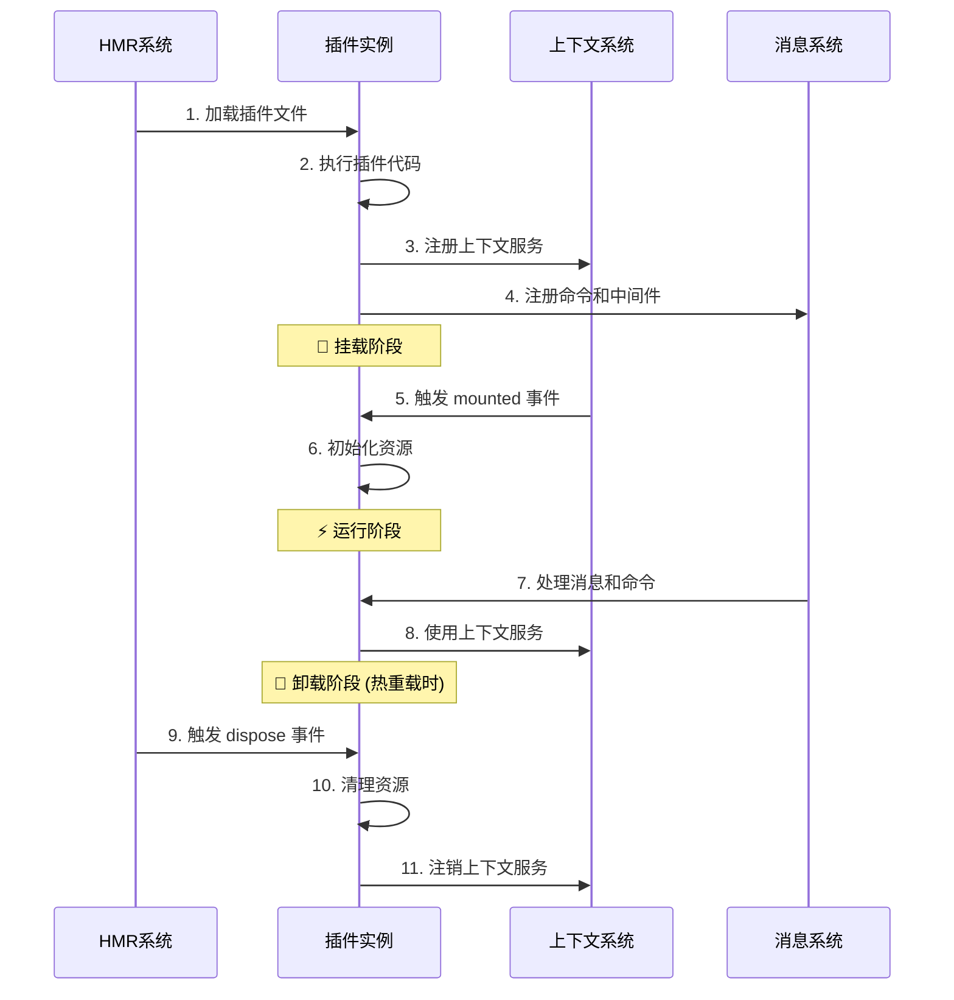

# 🔄 插件生命周期

深入了解 Zhin.js 插件的生命周期管理。

## 🎯 生命周期概述

插件的生命周期包含四个主要阶段：

1. **加载阶段** - 加载插件代码
2. **挂载阶段** - 初始化插件资源
3. **运行阶段** - 处理消息和事件
4. **卸载阶段** - 清理插件资源

## 📋 生命周期流程图



## 🚀 加载阶段

### 插件文件加载
插件文件被 HMR 系统加载和执行。

```typescript
// 在这个阶段可以做的事情：
import { useLogger, addCommand } from 'zhin.js'

const logger = useLogger()  // 获取日志记录器

// ❌ 不能做的事情：
// - 访问其他插件的上下文（还未就绪）
// - 发送消息（机器人可能还未连接）
```

### 代码执行
插件代码被同步执行，注册命令、中间件等。

```typescript
// src/plugins/my-plugin.ts
import { addCommand, MessageCommand, onMessage } from 'zhin.js'

// ✅ 注册命令
addCommand(new MessageCommand('hello')
  .action(async () => 'Hello!')
)

// ✅ 注册消息监听
onMessage(async (message) => {
  console.log('收到消息:', message.raw)
})
```

## 🔧 挂载阶段

### onMounted 钩子
所有上下文都已就绪，可以安全使用依赖服务。

```typescript
import { onMounted, useContext } from 'zhin.js'

onMounted(() => {
  logger.info('插件挂载完成')
})

// ✅ 使用上下文依赖
useContext('database', async (db) => {
  await db.query('SELECT 1')  // 数据库已就绪，可以安全使用
  logger.info('数据库连接成功')
})
```

### 资源初始化
在挂载阶段初始化插件需要的资源。

```typescript
import { onMounted, onDispose } from 'zhin.js'

let resources: any[] = []

onMounted(async () => {
  // 初始化数据库连接
  const db = await createDatabaseConnection()
  resources.push(db)
  
  // 初始化缓存
  const cache = new Map()
  resources.push(cache)
  
  // 启动定时任务
  const timer = setInterval(() => {
    console.log('定时任务执行中...')
  }, 60000)
  resources.push(timer)
  
  logger.info('插件资源初始化完成')
})
```

## ⚡ 运行阶段

### 消息处理
插件的主要工作阶段，处理用户消息和命令。

```typescript
import { onMessage, addCommand, MessageCommand } from 'zhin.js'

// 🎯 处理用户消息
onMessage(async (message) => {
  // 插件的主要工作逻辑
  if (message.raw.includes('天气')) {
    await message.reply('今天天气很好！')
  }
})

// ⚡ 响应命令
addCommand(new MessageCommand('status')
  .action(async () => {
    return '插件运行正常！'
  })
)
```

### 上下文使用
在运行阶段使用上下文服务。

```typescript
import { useContext } from 'zhin.js'

useContext('database', (db) => {
  addCommand(new MessageCommand('users')
    .action(async () => {
      const users = await db.query('SELECT * FROM users')
      return `用户数量: ${users.length}`
    })
  )
})
```

## 🛑 卸载阶段

### onDispose 钩子
插件即将被销毁时触发，用于清理资源。

```typescript
import { onDispose } from 'zhin.js'

let timer: NodeJS.Timeout
let database: any

onMounted(() => {
  // 创建定时器
  timer = setInterval(() => {
    logger.debug('定时任务执行中...')
  }, 1000)
  
  // 创建数据库连接
  database = createDatabaseConnection()
})

onDispose(() => {
  // 🧹 清理资源，防止内存泄漏
  if (timer) {
    clearInterval(timer)
  }
  
  if (database) {
    database.close()
  }
  
  logger.info('插件资源已清理')
})
```

### 资源清理
确保所有资源都被正确清理。

```typescript
import { onDispose } from 'zhin.js'

class PluginResourceManager {
  private resources: Array<{ dispose: () => void }> = []
  
  add(resource: { dispose: () => void }) {
    this.resources.push(resource)
  }
  
  dispose() {
    this.resources.forEach(resource => {
      try {
        resource.dispose()
      } catch (error) {
        logger.error('资源清理失败:', error)
      }
    })
    this.resources = []
  }
}

const resourceManager = new PluginResourceManager()

onMounted(() => {
  // 添加资源
  resourceManager.add({
    dispose: () => clearInterval(timer)
  })
  
  resourceManager.add({
    dispose: () => database.close()
  })
})

onDispose(() => {
  resourceManager.dispose()
})
```

## 🔄 热重载生命周期

### 热重载过程
当插件文件发生变化时，会触发热重载。

```typescript
// 热重载时的生命周期：
// 1. 当前插件触发 onDispose
// 2. 清理当前插件的资源
// 3. 重新加载插件文件
// 4. 执行新的插件代码
// 5. 触发新的 onMounted
```

### 热重载友好的设计
设计插件时考虑热重载的兼容性。

```typescript
import { onMounted, onDispose } from 'zhin.js'

// ✅ 热重载友好的设计
let globalResource: any = null

onMounted(() => {
  // 检查资源是否已存在（避免重复创建）
  if (!globalResource) {
    globalResource = createGlobalResource()
  }
})

onDispose(() => {
  // 只在真正需要时清理全局资源
  if (globalResource && shouldCleanupGlobalResource()) {
    globalResource.dispose()
    globalResource = null
  }
})
```

## 🎯 最佳实践

### 1. 生命周期钩子使用
正确使用生命周期钩子。

```typescript
// ✅ 好的做法
onMounted(() => {
  // 初始化逻辑
  initializePlugin()
})

onDispose(() => {
  // 清理逻辑
  cleanupPlugin()
})

// ❌ 避免的做法
// 在插件顶层直接执行初始化逻辑
initializePlugin() // 这可能在依赖未就绪时执行
```

### 2. 错误处理
在生命周期钩子中添加错误处理。

```typescript
onMounted(async () => {
  try {
    await initializePlugin()
    logger.info('插件初始化成功')
  } catch (error) {
    logger.error('插件初始化失败:', error)
    // 不要抛出错误，让插件继续运行
  }
})

onDispose(() => {
  try {
    cleanupPlugin()
    logger.info('插件清理成功')
  } catch (error) {
    logger.error('插件清理失败:', error)
  }
})
```

### 3. 异步操作
正确处理异步操作。

```typescript
onMounted(async () => {
  // ✅ 使用 async/await
  try {
    await initializeAsyncResources()
  } catch (error) {
    logger.error('异步初始化失败:', error)
  }
})

onDispose(() => {
  // ✅ 同步清理
  cleanupSyncResources()
  
  // ✅ 异步清理（如果需要）
  cleanupAsyncResources().catch(error => {
    logger.error('异步清理失败:', error)
  })
})
```

## 🔗 相关链接

- [插件开发指南](./development.md)
- [上下文系统](./context.md)
- [中间件系统](./middleware.md)
- [定时任务](./cron.md)
