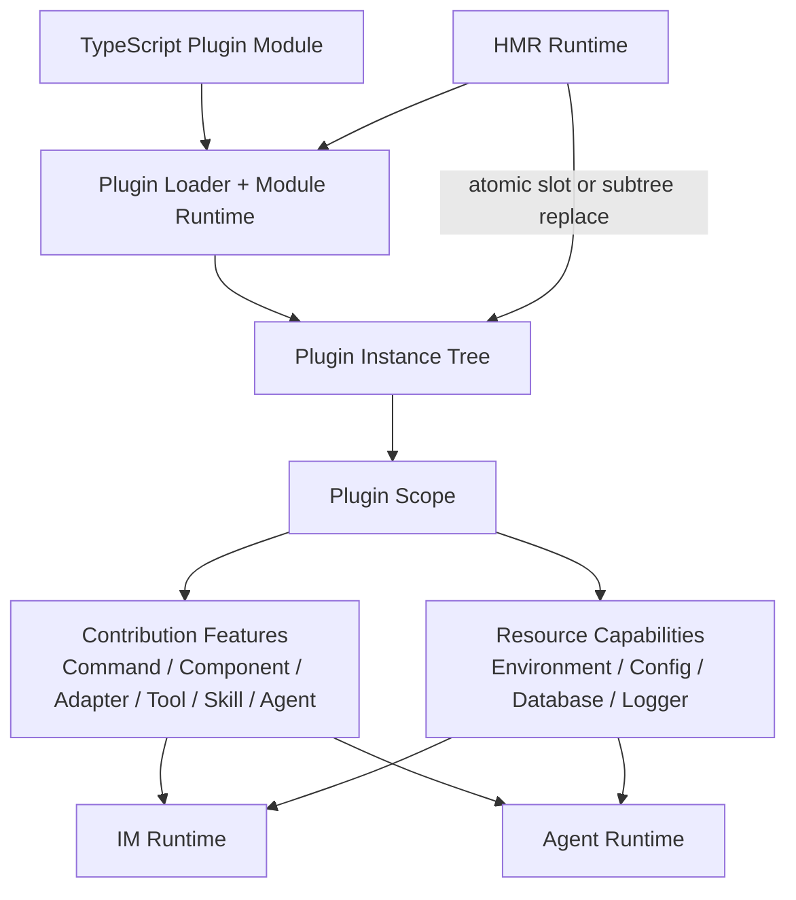
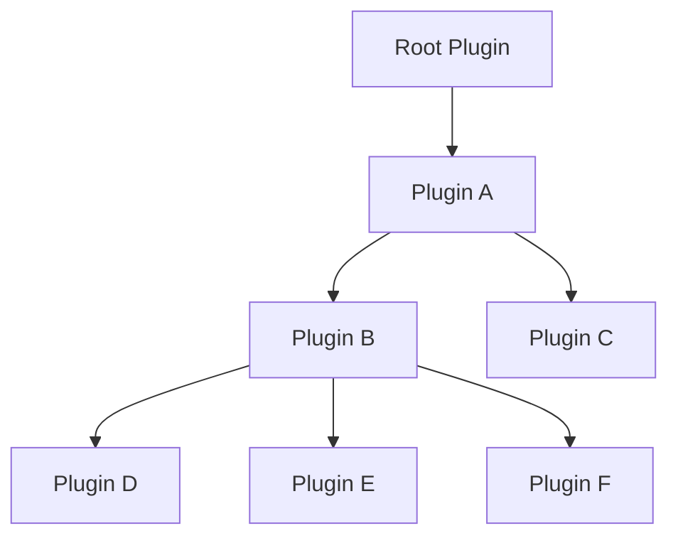
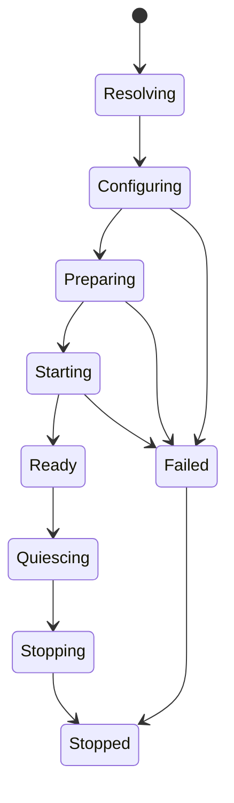
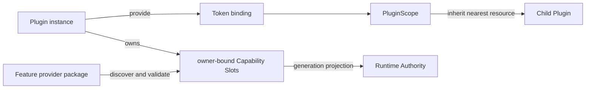
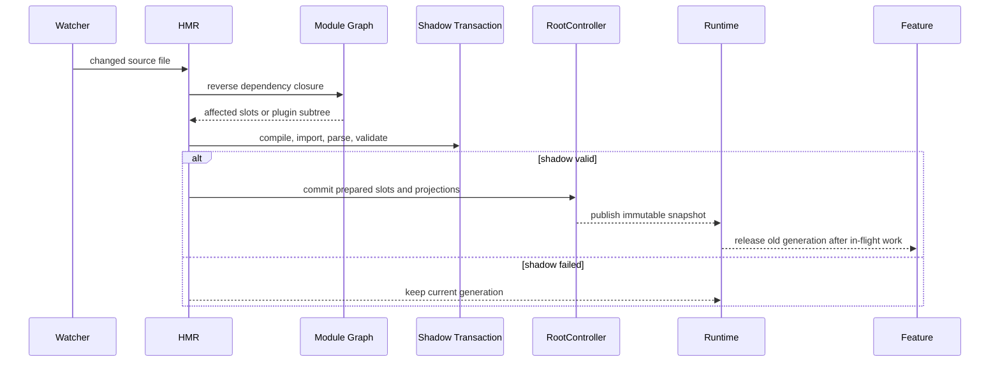
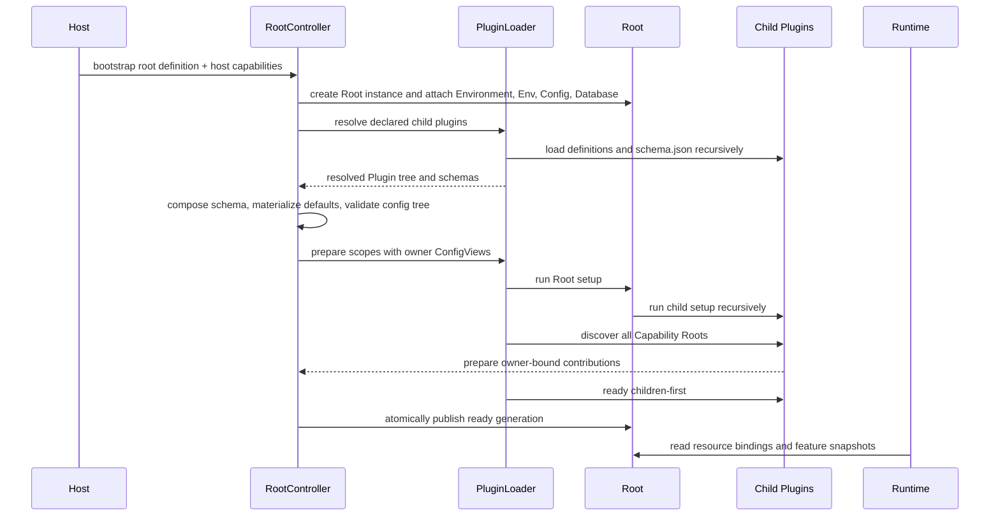
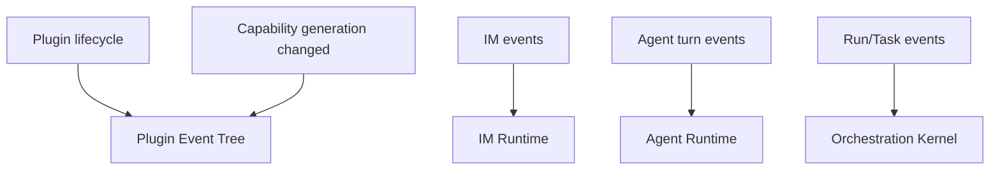

# Zhin Plugin-first 目标架构（SSOT）

> 状态：全新项目的规范性目标架构。  
> 核心：原生支持 TypeScript 与 Hot Module Replace 的 Plugin Runtime。  
> 前提：现有代码只用于理解领域，不约束目标 interface，也不要求兼容旧格式。
> 技术实现：[目标技术实现蓝图](./architecture/target-implementation/)。

## 1. 一句话模型

> Zhin 是一棵可动态装载、可继承能力、可局部热替换的 Plugin 树；数据库、配置、环境、IM 与 Agent 都是附着在 Plugin 作用域上的能力。

框架只需要回答五个问题：

1. Plugin 如何加载子 Plugin？
2. Plugin 如何提供、继承和贡献能力？
3. 能力如何绑定 owner 与生命周期？
4. TypeScript 模块变化时如何原子替换 Capability Slot 或 Plugin 子树？
5. Runtime 如何消费能力而不成为第二个注册源？

## 2. 总体架构



架构分为三层：

| 层 | 职责 |
|---|---|
| **Plugin Kernel** | TypeScript 模块加载、Plugin 树、作用域、生命周期、HMR |
| **Capability Layer** | Resource binding 与 Feature contribution，记录 owner |
| **Runtime Layer** | IM、Agent、Console、Schedule 等运行时只读并执行能力 |

Plugin Kernel 不理解 Message、Tool 或数据库表。Runtime Layer 不负责发现 Plugin 或保存第二份可写能力目录。

## 3. 发布、运行时与热更身份

三个层级不能合并成同一个概念：

| 层级 | 身份 | 职责 |
|---|---|---|
| 发布 | npm package | 分发、版本、依赖与生产构建 |
| 运行时 | Plugin instance | owner、PluginScope、父子关系与生命周期 |
| 热更 | Capability Slot | 一个声明文件对应的最小可原子替换能力 |

约定一个 npm package 根导出一个 canonical Plugin definition，因此作者视角可以把“一个插件包”理解为“一个 Plugin”。但两者并非同一运行时对象：同一个包可以被实例化多次，Plugin id 由装载位置和配置决定，npm package name 不替代 Plugin identity。

## 4. Plugin 是唯一基础单元

每个 Plugin 都是一个带层级身份和局部作用域的运行时实例：

```ts
interface Plugin {
  readonly id: string;
  readonly name: string;
  readonly parent?: Plugin;
  readonly root: Plugin;
  readonly children: readonly Plugin[];
  readonly scope: PluginScope;
  readonly environment: RuntimeEnvironment;

  use<T>(token: Token<T>): T;
}
```

这是 Runtime 只读视图的目标语义，不要求实现直接采用同名 TypeScript interface。装配期通过 `PluginSetupContext` 提供 Resource 和 disposer；child 装载、Feature Slot 与 generation commit 只由 RootController 管理。

Plugin 负责：

- 作为静态 manifest 所声明父子关系中的运行时节点。
- 持有 PluginScope。
- 成为所有能力贡献的 owner。
- 接受 RootController 管理的 setup、mount、dispose 生命周期。
- 在 HMR 时作为最小可替换子树根。

Plugin 不负责：

- 解释 Command、Tool 或 Adapter 的业务语义。
- 直接执行 IM 消息或 Agent turn。
- 通过全局变量寻找当前 Plugin。
- 维护脱离作用域的隐藏注册表。

### 4.1 每个 Plugin 包都可独立运行

Plugin 包是一个可被直接启动的项目，而不只是必须依附某个应用的扩展：

```text
<plugin-project>/
├── package.json
├── pnpm-workspace.yaml
├── plugin.ts
├── schema.json
├── packages/
├── plugins/
├── pages/
├── commands/
├── components/
├── middlewares/
├── agents/
├── skills/
└── tools/
```

`zhin dev .` 或 `zhin run <package>` 可以把该包的 Plugin definition 实例化为 Root。相同代码也可以被另一个 Plugin 声明为 child；Plugin 实现不得假设自己一定有 parent、一定是 Root，或硬编码完整 config/route path。

npm package 是可运行项目与发布物，Plugin instance 仍是具体运行时身份。一个包能够以不同 instance key、配置和 parent 多次实例化。

## 5. Plugin 树

Plugin 的组合结构是实例树，模块 import graph 可以是 DAG，但运行时 owner 与生命周期必须落在树上。



树提供四个稳定语义：

- **Identity**：实例 id 由父路径与本地 name 组成，例如 `root/a/b/d`。
- **Visibility**：子 Plugin 可读取本地或最近祖先提供的 Resource。
- **Ownership**：每个 contribution 始终归属于产生它的 Plugin 实例。
- **Lifecycle**：父 Plugin 被替换或卸载时，其整棵子树按依赖顺序处理。

父 Plugin 不自动读取子 Plugin 的私有 Resource。需要全树可见的数据通过 Feature contribution 或显式向父层发布。

### 5.1 声明式装载

Plugin package 在 `package.json#zhin` 中显式声明子 Plugin，使 CLI 无需执行 TypeScript 即可解析 topology：

```json
{
  "dependencies": {
    "@acme/plugin-b": "workspace:*",
    "@acme/plugin-c": "^1.0.0"
  },
  "zhin": {
    "protocol": 1,
    "type": "plugin",
    "entry": "./plugin.ts",
    "plugins": [
      { "package": "@acme/plugin-b", "instanceKey": "b" },
      { "package": "@acme/plugin-c", "instanceKey": "c" }
    ]
  }
}
```

Plugin B 可以用相同方式声明 D、E、F。PluginLoader 递归构造实例树，`plugin.ts` 只提供纯 setup definition，不产生模块级注册副作用。

环境条件装载也必须使用可静态检查的 manifest policy，而不是在任意回调中调用隐式全局 loader。第一版 protocol 若未定义 condition 字段，则通过环境专属 Root manifest 明确选择 topology，不在 `plugin.ts` 中动态返回 children。

package dependency 只表示“可解析”，不会自动成为 child。只有 `zhin.plugins` 中的声明会实例化 Plugin。

### 5.2 Root 定义生命周期域

`parent === undefined` 的 Plugin instance 是当前树的 Root。Root 与普通 Plugin 使用同一 instance interface，但 Root 额外持有该树唯一的 `RootController`：

- Plugin tree mutation lock 与 generation counter。
- Environment、ConfigStore、Database、Logger 等基础 Resource。
- Config composition、validation 与 transaction commit。
- Capability/Page/Layout snapshot publication。
- HMR Coordinator、drain、rollback 与 graceful shutdown。
- Host signal、fatal error 和最终 Resource 回收。

Child Plugin 可以声明或请求树变更，但不能直接提交 generation、替换 sibling、关闭共享 Resource 或自行建立第二个 lifecycle controller。一个进程可以承载多棵独立 Plugin tree，但每棵树分别只有一个 Root，树之间不继承 Resource 或生命周期。



setup/start 为 parent-first，ready 在 children ready 后向上确认；关闭时 Root 先阻止新任务并 drain，随后 children-first dispose，Root 基础 Resource 最后释放。详见 [ADR 0047](./adr/0047-standalone-plugin-and-root-lifecycle-domain.md)。

## 6. PluginScope

PluginScope 是能力附着的唯一 seam，对作者只暴露两个模型：

### 6.1 Resource Capability

Resource 是单值绑定，按 Plugin 树向祖先查找：

```text
plugin.scope local binding
        ↓ missing
parent.scope binding
        ↓ missing
root.scope binding
```

适合：

- RuntimeEnvironment
- EnvStore
- ConfigStore
- Database
- Logger
- Clock、Filesystem 等基础依赖

### 6.2 Contribution Feature

Feature provider 定义多值能力的作者接口、发现约定与运行时投影。Root 将发现结果绑定到 Plugin owner，并在 RuntimeSnapshot 中发布只读 Slot。标准 provider 包括：

- CommandFeature
- ComponentFeature
- MiddlewareFeature
- PageFeature
- LayoutFeature
- AdapterFeature
- ToolFeature
- SkillFeature
- AgentFeature
- MCPFeature



Resource 与 Feature Slot 是两种使用形状，不是两套 Plugin 系统。它们共享 owner、dispose、HMR 和诊断机制；Kernel 不枚举具体 Feature，provider package 才拥有领域语义。

## 7. 基础 Resource

### 7.1 RuntimeEnvironment

环境区分由显式对象表达，不直接散落读取 `process.env.NODE_ENV`：

```ts
interface RuntimeEnvironment {
  readonly mode: 'development' | 'test' | 'production' | string;
  readonly platform: 'node' | 'bun' | string;
  is(mode: string): boolean;
}
```

Environment 由 Root Plugin 提供，所有子 Plugin 只读继承。

### 7.2 EnvStore

EnvStore 负责环境变量读取、schema 校验、secret 标记和缺失诊断：

```ts
const env = plugin.use(EnvToken).parse({
  DATABASE_URL: string().secret(),
  PORT: number().default(8080),
});
```

Plugin 运行时代码不直接依赖全局 `process.env`。

### 7.3 ConfigStore

ConfigStore 是共享 Resource，Plugin 配置树严格投影 Plugin instance tree。Root 自身配置位于 `plugin`，直接 children 位于 `plugins`，之后内部路径与 Plugin tree 一一对应：

```text
root          -> config.plugin
root/a        -> config.plugins.a
root/a/b      -> config.plugins.a.b
root/a/b/c    -> config.plugins.a.b.c
```

```yaml
plugin:
  mode: production
plugins:
  a:
    endpoint: https://example.test
    b:
      retries: 3
      c:
        enabled: true
```

每个 Plugin 包根的 `schema.json` 只描述该 Plugin 自身字段。Config Composer 根据 Plugin 树递归嵌入子 schema，形成整棵配置树的 Effective Schema。Plugin A 只得到 `{ endpoint }`，B 只得到 `{ retries }`，C 只得到 `{ enabled }`；父 Plugin 不通过自己的 ConfigView 读取子 Plugin 配置。

当 A 自己作为 Root 运行时，A 的 ConfigView 解析 `config.plugin`，B/C 分别解析 `config.plugins.b` 与 `config.plugins.b.c`。当 A 挂载为别人的 child 时，它解析自己的 child path。Plugin 代码只持有 owner-scoped ConfigView，因此不随 Root/child 角色变化。

Capability definition 不在 import 时读取配置。Runtime 根据 Capability Slot owner，把同一 Plugin generation 的只读 ConfigView 放入 Command、Component、Middleware、Tool、Skill、Agent 的执行上下文。

子 Plugin instance key 占用父配置节点中的同名属性。若父 `schema.json.properties` 已声明同名字段，PluginLoader 必须报告 schema/child collision，不能静默覆盖。详见 [ADR 0045](./adr/0045-hierarchical-plugin-config-schema.md)。

### 7.4 Database

Database 连接池与事务设施由 Root Plugin 共享提供；Plugin 获得 owner-scoped view：

- 共享物理连接与事务。
- 模型、迁移和表名前缀记录 owner。
- Plugin unload 不关闭共享连接，只撤销该 Plugin 的模型和订阅。
- Root dispose 最后关闭连接池。

### 7.5 Plugin Monorepo 与 Package Graph

每个 Plugin 项目只有一个 workspace root，并允许携带两类一级 workspace package：

```text
<plugin-project>/
├── packages/*   # 可发布或私有 Feature provider package
├── plugins/*    # 可发布或私有 child Plugin package
├── package.json
└── pnpm-workspace.yaml
```

`plugins/*` 的物理目录始终扁平，不能嵌套 workspace。运行时 Plugin tree 则由各 package 的 `package.json#zhin.plugins` 递归声明；child 可以解析到本地 workspace package，也可以来自 npm dependency。依赖只提供可解析性，只有 manifest 中显式声明的 child 才会加载。

Command、Component、Skill、Tool、Agent、Page 和 Middleware 等能力由 `packages/*` 或 npm 中的 Feature provider 提供。Kernel 只认识稳定 `FeatureId` 与 owner-bound Slot，不内建能力枚举和目录表。Feature provider 拥有 definition helper、发现约定、验证和 generation projection。详见 [ADR 0048](./adr/0048-plugin-monorepo-and-feature-provider-packages.md)。

## 8. Capability Root

每个项目根或 Plugin 包根都是 Capability Root。PluginLoader 在创建 Plugin 实例时，使用该树显式启用的 Feature provider 进行发现：

```text
<capability-root>/
├── plugin.ts
├── schema.json
├── pages/
│   ├── <page>.ts|tsx
│   ├── $nav.tsx
│   └── $footer.tsx
├── commands/<command>.ts|tsx
├── components/<component>.ts|tsx
├── middlewares/<middleware>.ts
├── agents/<name>.md
├── skills/<skill>/SKILL.md
└── tools/<tool>.ts
```

| Kind | Definition | Runtime consumer |
|---|---|---|
| Page | default client component + `definePage()` metadata | Console Router / Navigation |
| Layout Slot | `pages/$nav.tsx` / `pages/$footer.tsx` | Console Shell |
| Command | `defineCommand()` | Message Dispatcher |
| Component | `defineComponent()` | Outbound Renderer |
| Middleware | `defineMiddleware()` | Inbound Runner |
| Agent | Markdown frontmatter + instructions | Agent Orchestrator |
| Skill | `SKILL.md` | Agent Orchestrator |
| Tool | `defineAgentTool()` | Agent Orchestrator |

上述目录是标准 Feature provider 的默认约定，不是 Kernel 常量。自定义 Feature 可以拥有自己的目录和 definition contract。TypeScript definition 函数是纯函数：不寻找 Plugin、不注册、不产生模块级副作用。

`schema.json` 是 Plugin Config Resource 的声明，不是 Feature contribution，也不产生 Capability Slot。它在 Plugin setup 之前被读取、组合和校验。

`pages/` 是浏览器侧 Page 与 Layout Feature。普通文件产生 Page route：A 的 `pages/name.tsx` 对应 `/a/p-name`，A 的子 Plugin B 中 `pages/foo.tsx` 对应 `/a/b/p-foo`。保留文件 `$nav.tsx`、`$footer.tsx` 不产生 route，而是覆盖 owner Plugin 子树的 Console layout slot，并按最近祖先回退。左侧导航模型仍从 PageFeature snapshot 与 Plugin tree 派生，不由 `$nav.tsx` 自行维护。详见 [ADR 0046](./adr/0046-convention-pages-and-plugin-navigation.md)。

`middlewares/` 专指 IM 入站 Middleware。HTTP、Agent event、outbound polish 等协议拥有各自的 Feature 与 definition，不能被一个无类型的通用 Middleware interface 混合。

```text
Feature provider convention
  -> file path
  -> local identity
  -> provider parser and validation
  -> owner-bound Capability Slot
  -> owner-aware snapshot
  -> Runtime Authority
```

Canonical identity 是 `(plugin.id, featureId, localName)`。Command pattern、Component tag 和 Tool 展示名属于各自 interface，不替代 identity。

每个发现文件都会产生一个 `CapabilitySlot`：

```ts
interface CapabilitySlot<T> {
  readonly identity: CapabilityIdentity;
  readonly owner: PluginId;
  readonly feature: FeatureId;
  readonly source: ModuleId;
  readonly definition: T;
}
```

Slot 是 Feature contribution 的 owner-bound 容器，不是新的业务抽象。generation 属于完整 RuntimeSnapshot；Slot 让一个能力文件能够独立 prepare、validate 和 dispose，再随完整快照原子 commit。

## 9. TypeScript Module Runtime

“原生支持 TypeScript”是 Zhin Runtime 的能力，不依赖 Plugin 作者手动构建才能开发：

- 开发模式直接接受 `.ts`、`.tsx` Plugin 与 Capability 文件。
- Module Runtime 统一处理 transpile、source map、JSX runtime 和 module cache。
- 生产模式可以预编译为 `.js`，但产物保持相同的 module identity 与 Plugin 行为。
- PluginLoader 不区分源码定义来自开发编译还是生产产物。

Module Runtime 分成两个 adapter，共享 module identity 与 source ownership contract：

- Server Module Runtime 加载 Plugin、Command、Middleware、Tool 等 Node definition。
- Client Module Runtime 编译 Page TS/TSX、提取静态 metadata，并向浏览器发布 manifest 与模块。

两者的 transform 实现属于独立可替换 adapter，必须分别遵守服务端开发工具和客户端构建工具的体积预算；Page 浏览器模块不得由服务端 PluginLoader 直接执行。

## 10. Hot Module Replace

HMR 优先替换受影响的 Capability Slot；只有变化越过 Plugin setup 或 Resource seam 时，才升级为 Plugin 子树替换。



### 10.1 失效升级规则

| 变化 | 最小替换单位 |
|---|---|
| `commands/foo.ts`、`components/card.tsx`、`middlewares/log.ts`、`tools/weather.ts` | 对应 Capability Slot |
| `pages/foo.tsx` 页面实现 | 对应 Page Slot 与浏览器模块；不重载服务端 Plugin |
| Page metadata 或 owner Plugin path | 原子替换 Page manifest，并重建受影响导航子树 |
| `pages/$nav.tsx`、`pages/$footer.tsx` | 对应 Layout Slot；保持 route 与页面状态，只重渲染匹配的 layout region |
| `agents/foo.md`、`skills/foo/SKILL.md` | 对应 Capability Slot |
| 仅被若干 Capability 引用的纯共享模块 | 反向依赖闭包中的 Slot，单事务批量替换 |
| `plugin.ts`、其 setup 依赖、Resource provider | 当前 Plugin 子树 |
| `package.json#zhin.plugins` 或 `package.json#zhin.features` | 当前 Plugin 子树及其 package graph |
| `schema.json` 或对应 Plugin 自身配置字段 | 当前 Plugin 子树；校验失败则保留旧 generation |
| package exports、运行时 ABI、Root Resource | 受影响 Plugin 森林或进程重启 |

Capability 不应把持久状态保存在模块顶层。可恢复状态放入 ConfigStore/Database 等 Resource；短暂状态随 Slot generation 销毁。直接 import 另一个 Capability definition 不是稳定 interface，共享逻辑应进入纯模块或显式 Resource。

Plugin 子树替换继续遵守：

- D 变化只替换 D 子树。
- B 变化替换 B、D、E、F 子树。
- A 变化替换 A 以下整棵子树。
- Root 变化可以选择进程级重启，因为 Root 持有进程资源。
- 新子树在 shadow scope 中完成编译、definition 校验和 setup 后才能发布。
- 失败不破坏旧子树；成功时 contribution、resource binding 和 child reference 原子切换。
- dispose 顺序为 children-first，setup 顺序为 parent-first，ready 在 children ready 后完成。

每个 Resource 和 Feature contribution 都必须返回 disposer，HMR 不接受无法撤销的隐式注册。

### 10.2 事务式局部替换

`HmrCoordinator` 对一次文件变化执行：

1. `SourceOwnershipIndex` 定位 npm package、Plugin instance 和直接 Capability Slot。
2. `ModuleGraph` 计算反向依赖闭包并按上表决定替换级别。
3. `ModuleRuntime` 在 shadow transaction 中编译和执行新模块，重新取得最新 exports。
4. Feature provider 校验 definition、identity、依赖与冲突，但不修改 active snapshot。
5. `RootController.commit(expectedGeneration, prepared)` 以 compare-and-swap 提交 Slot、projection 与其它整树状态组成的新 generation。
6. Runtime 每次处理消息或 turn 时租用一个 immutable snapshot；已有请求继续使用旧 generation，新请求立即使用新 generation。
7. 旧 generation 引用归零后调用 disposer；超过 drain timeout 的任务由对应 Runtime Authority 取消或记为泄漏诊断。

任何 prepare 或 compare-and-swap 失败都只销毁 shadow transaction，不触碰 active generation。

### 10.3 Module Runtime 实现

开发模式通过独立的 `ModuleRuntime` adapter 处理 TS/TSX transform、source map、依赖失效和重新执行；具体实现必须遵守安装体积预算，不能进入 `zhin.js` 默认生产闭包。Zhin 自己掌握 Capability identity、事务提交和 Plugin 生命周期。生产模式使用预编译 ESM adapter，不携带 compiler、watcher 与 HMR server。

不能继续以 `import(entry + '?t=...')` 作为完整实现：它只能可靠刷新入口，无法为 Zhin 提供可控的传递依赖失效、旧 generation 回收和长期模块缓存治理。开发 adapter 必须提供等价的 content-addressed Module Graph；Node `vm.SourceTextModule` 仍是实验接口，不作为默认生产基础。

## 11. 启动流程



启动过程中不存在“先写临时 registry，再同步到正式 registry”的阶段。

## 12. Runtime Authority

Plugin 与 Feature 只负责装配，Runtime Authority 负责解释和执行：

| 能力 | Runtime Authority |
|---|---|
| Middleware | Inbound Runner |
| Command | Message Dispatcher |
| Component | Outbound Renderer |
| Page | Console Router / Navigation |
| Layout Slot | Console Shell |
| Adapter / Endpoint | Endpoint Runtime |
| Tool / Skill / Agent / MCP | Agent Orchestrator |
| Model turn | `agentLoop` |
| Run / Task state | Orchestration Kernel |

Runtime 只能读取 snapshot。能力变化由 PluginScope 发布新 generation，Runtime 丢弃旧 snapshot；Runtime 不反向注册能力。

## 13. 事件模型

事件沿 Plugin 树传播，但不同领域事件保持独立类型：



Plugin Event Tree 负责作用域传播与观察，不成为所有领域事件的无类型总线。

## 14. 架构不变量

1. Root Plugin 与普通 Plugin 使用同一种实例模型。
2. Plugin 实例形成树；owner 和 dispose 不依赖 module import graph 推断。
3. 子 Plugin 只继承祖先 Resource，不隐式读取兄弟或后代私有 Resource。
4. Resource binding 与 Feature Slot/projection 都必须绑定 owner 和 disposer。
5. Runtime 只读能力 snapshot，不维护第二份可写 registry。
6. TypeScript/TSX、source map 和 JSX 是 Module Runtime 的统一职责。
7. HMR 以 Capability Slot 为最小单位，越过 setup/Resource seam 时升级为 Plugin 子树；成功原子替换，失败保留旧 generation。
8. Module definition 不通过顶层副作用注册能力。
9. Capability identity 只来自 Plugin id、FeatureId 与 provider 解析出的 localName。
10. 配置、环境变量和数据库通过显式 Resource 使用，不从全局状态旁路读取。
11. 出站消息仍经过统一 Renderer 与 Endpoint 链。
12. Agent 主绑定、Agent Orchestrator、agentLoop 与 Orchestration Kernel 各自保持唯一权威。
13. npm package、Plugin instance 与 Capability Slot 分别承担发布、运行时和热更身份。
14. Plugin 配置树与 Plugin instance tree 同构；每个 ConfigView 只暴露 owner schema 声明的字段。
15. Console route 与 navigation 只从 Plugin tree 和 PageFeature snapshot 派生，不维护第二份菜单配置。
16. Layout override 只替换有类型的 Shell slot；不能接管 route catalog、权限过滤或 Content Outlet。
17. 任意 Plugin 包都可提升为 Root 独立运行；每棵 Plugin tree 只有 Root 可以提交 lifecycle generation。
18. 一个 checkout 只有一个 workspace root；本地 Feature/Plugin package 只位于一级 `packages/*`、`plugins/*`。
19. package dependency 不自动加载 Plugin；运行时 topology 只来自静态 `package.json#zhin.plugins`。
20. Kernel 不枚举 Feature 类型或目录，Feature provider package 拥有创作与 projection contract。

## 15. Greenfield 搭建顺序

1. 静态 package manifest、一级 workspace validator、PackageResolver 与 ProjectGraph。
2. `PluginDefinition`、Plugin instance tree 与 RootController 生命周期状态机。
3. PluginScope、Token、FeatureId、Capability Slot、owner/disposer generation。
4. Feature provider contract，以及 Command vertical slice 的 definition/discovery/projection。
5. TypeScript Module Runtime、Module Graph 与 source ownership index。
6. Environment、EnvStore、ConfigStore、Config Composer、Database Resource。
7. 其余标准 Feature provider 与 IM/Agent/Console Runtime projection。
8. Slot transaction、snapshot lease、shadow subtree HMR、原子 swap 与失败回滚。
9. CLI create/build/publish、诊断、测试 harness 和生产预编译。

每一步都通过同一个 Plugin public Interface 测试，不为测试开放实现内部 registry。

## 16. 变更检查表

- 这是 Resource、Feature contribution，还是 Runtime Authority？
- 能力 owner 是哪个 Plugin instance？
- 子 Plugin 如何获得该能力？
- dispose/HMR 如何完整撤销？
- 是否新增了第二份可写 registry？
- 是否绕过 PluginScope 读取全局配置、环境变量或数据库？
- `schema.json` 字段是否与子 Plugin instance key 冲突？
- 文件变化时最小受影响 Plugin 子树是什么？
- 能否只替换 Capability Slot；如果不能，越过了哪个 seam？
- shadow setup 失败时旧树能否继续运行？
- Runtime 是否只消费只读 snapshot？
- 这个 interface 是否让 Plugin 作者必须理解实现细节？

## 17. 相关决策

- [ADR 0042：Capability Features 与按需 Capability Ingress](./adr/0042-capability-features-and-on-demand-ingress.md)
- [ADR 0043：统一 Capability Root 与声明式文件接口](./adr/0043-unify-capability-roots.md)
- [ADR 0044：TypeScript HMR Plugin Kernel](./adr/0044-typescript-hmr-plugin-kernel.md)
- [ADR 0045：层级 Plugin 配置与 schema.json](./adr/0045-hierarchical-plugin-config-schema.md)
- [ADR 0046：约定式 pages 与 Plugin 导航树](./adr/0046-convention-pages-and-plugin-navigation.md)
- [ADR 0047：独立 Plugin 项目与 Root 生命周期域](./adr/0047-standalone-plugin-and-root-lifecycle-domain.md)
- [上下文地图](https://github.com/zhinjs/zhin/blob/main/CONTEXT-MAP.md)
