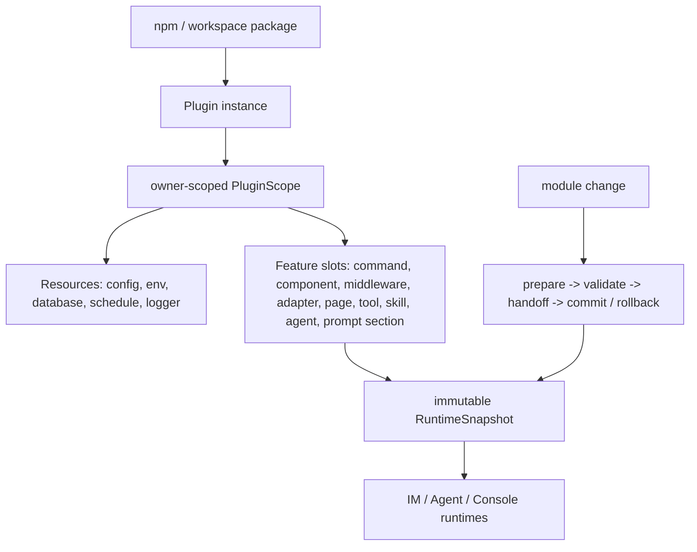
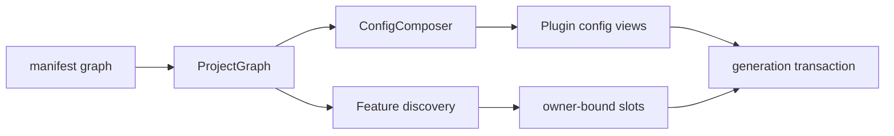
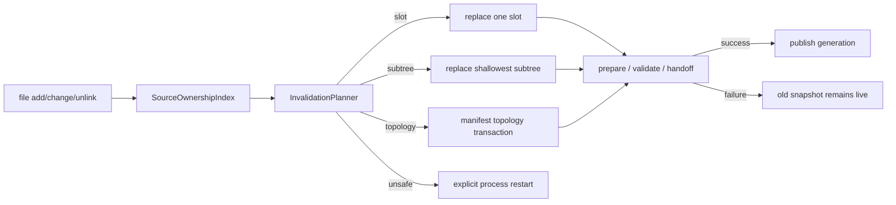
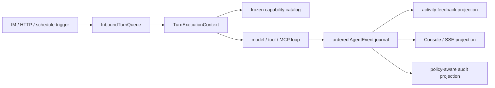

# Zhin Plugin-first Target Architecture (SSOT)

> Status: normative target for Zhin 4.x. This document defines the intended
> contracts and acceptance criteria; package READMEs explain their local APIs.

## Product Model

Zhin is a tree of independently runnable Plugin packages. A Plugin owns its
configuration, resources, Feature contributions, and lifecycle. The Root Plugin
is the only authority allowed to publish a new runtime generation.


```mermaid
flowchart TB
  Package["npm / workspace package"] --> Instance["Plugin instance"]
  Instance --> Scope["owner-scoped PluginScope"]
  Scope --> Resources["Resources: config, env, database, schedule, logger"]
  Scope --> Slots["Feature slots: command, component, middleware, adapter, page, tool, skill, agent, prompt section"]
  Slots --> Snapshot["immutable RuntimeSnapshot"]
  Snapshot --> Runtimes["IM / Agent / Console runtimes"]
  HMR["module change"] --> Transaction["prepare -> validate -> handoff -> commit / rollback"]
  Transaction --> Snapshot
```

The package, runtime instance, and hot-reload slot are deliberately different:

| Identity | Purpose |
| --- | --- |
| Package | distribution, dependencies, build output |
| Plugin instance | owner, config path, resource scope, lifecycle |
| Capability slot | one discoverable contribution and its smallest reload unit |

## Non-Negotiable Invariants

1. Plugin code has no import-time registration side effect. It exports a pure
   `definePlugin()` definition or a pure Feature definition.
2. Every resource and contribution has one owner `PluginId`; no mutable global
   registry can be a second source of truth.
3. A runtime reads one immutable generation snapshot for the whole operation.
   A reload either commits atomically or leaves the prior snapshot live.
4. A Feature file reload replaces only that slot when the change is generation-safe.
   A manifest, schema, child, or feature topology change replaces the shallowest
   affected subtree. Package ABI, unclassifiable importer, or Adapter change that
   affects Endpoint credentials, identity, connection address, or transport
   implementation requires an explicit process restart.
5. All IM output travels through a snapshot-bound `ReplyPort` or traceable
   `DeliveryPort`, then the outbound pipeline. Agent code never receives an IM
   Message or Adapter and cannot become a side channel around policy,
   components, rendering, or observability.
6. All Agent work has a turn identity, fixed capability snapshot, cancellation
   signal, and exactly one terminal event.
7. Default IM installation remains below the 10 MB production dependency budget.
   Optional AI, browser build, and development transforms stay in opt-in packages.

## Plugin Package and Topology

```text
plugin-package/
  package.json                 # zhin manifest, package dependencies
  plugin.ts                    # default definePlugin()
  schema.json                  # only this Plugin's own config fields
  commands/**/*.ts(x)
  components/**/*.ts(x)
  middlewares/**/*.ts
  handlers/**/*.ts
  tools/**/*.ts
  skills/<name>/SKILL.md
  agents/<name>.agent.md
  pages/**/*.ts(x)
  plugins/*                    # optional, one-level workspace children
  packages/*                   # optional Feature provider workspaces
```

`package.json#zhin.plugins` is the sole topology declaration. A package may be
resolved from npm or `./plugins/<name>`, but a dependency alone never creates a
runtime child. A child may declare its own children in its own manifest; the
physical `plugins/` workspace directory stays one level deep.


```mermaid
flowchart LR
  M["manifest graph"] --> G["ProjectGraph"]
  G --> C["ConfigComposer"]
  G --> D["Feature discovery"]
  C --> P["Plugin config views"]
  D --> S["owner-bound slots"]
  P --> T["generation transaction"]
  S --> T
```

### Config and Environment

For a root with `a -> b -> c`, configuration is structurally identical to the
Plugin tree:

```yaml
plugin:                    # root fields
  commandPrefix: "/"
plugins:
  a:                       # root/a fields
    enabled: true
    b:                     # root/a/b fields
      region: apac
      c:                   # root/a/b/c fields
        limit: 10
```

Each `schema.json` defines only its own fields. `ConfigComposer` recursively
forms the effective schema, rejects child/schema key collisions, validates the
complete document transactionally, and projects only the owning Plugin's fields.
Environment variables are an owner-scoped read-only resource; secret values are
never copied into events or Console responses.

## Feature and Reload Contract

Feature providers own their file convention, parser, validation, and projection.
The Kernel knows only `FeatureId`, `CapabilityIdentity`, owner, source, and
disposal. Standard providers use the following conventions:

| Feature | Convention | Runtime consumer |
| --- | --- | --- |
| Command | `commands/**/*.ts(x)` / `defineCommand()` | CommandIndex |
| Component | `components/**/*.ts(x)` / `defineComponent()` | OutboundRenderer |
| Middleware | `middlewares/**/*.ts` / `defineMiddleware()` | Inbound/outbound pipeline |
| Handler | `handlers/**/*.ts` / `defineHandler()` (`.`-joined localName) | HandlerIndex (`message.receive` wired in ImRuntime) |
| Adapter | `adapters/**/*.ts` / `defineAdapter()` | AdapterIndex |
| Tool | `tools/**/*.ts` / `defineAgentTool()` | Agent capability catalog |
| Skill | `skills/<name>/SKILL.md` | Agent capability catalog |
| Agent | `agents/<name>.agent.md` | Agent capability catalog |
| Prompt Section | `agent/prompt-sections/**/*.ts` / `defineAgentPromptSection()` | Fixed-generation Agent prompt assembly |
| Page | `pages/**/*.ts(x)` / `definePage()` | Console PageIndex |
| Layout | `pages/$nav.tsx`, `pages/$footer.tsx` | Console layout projection |

The canonical capability identity is `(pluginId, featureId, localName)`. Display
names, command patterns, component tags, and platform endpoint names do not
replace it.


```mermaid
flowchart LR
  Change["file add/change/unlink"] --> Ownership["SourceOwnershipIndex"]
  Ownership --> Planner["InvalidationPlanner"]
  Planner -->|slot| Slot["replace one slot"]
  Planner -->|subtree| Subtree["replace shallowest subtree"]
  Planner -->|topology| Topology["manifest topology transaction"]
  Planner -->|unsafe| Restart["explicit process restart"]
  Slot & Subtree & Topology --> Prepare["prepare / validate / handoff"]
  Prepare -->|success| Commit["publish generation"]
  Prepare -->|failure| Rollback["old snapshot remains live"]
```

HMR must emit one structured reload record: changed sources, plan kind, affected
owners and slots, duration, outcome, and error/restart reason. The Console can
render it, but Console is not the source of reload state.

## IM and Adapter Boundary


```mermaid
flowchart LR
  Inbound["platform event"] --> Endpoint["Endpoint<Client>"]
  Endpoint --> Gateway["EndpointEventGateway.receive"]
  Gateway --> Normalize["canonical Segment + ConversationRef"]
  Normalize --> Middleware["inbound middleware"]
  Middleware --> Command["CommandIndex"]
  Command --> Route["typed route outcome"]
  Route -->|not_found| Agent["Agent TurnIngress adapter"]
  Command & Agent --> Outbound["ReplyPort / DeliveryPort"]
  Outbound --> Render["components + canonical segments"]
  Render --> OutboundMW["outbound middleware"]
  OutboundMW --> Adapter["AdapterIndex -> Endpoint.send"]
```

`Segment` and `MediaRef` are the only cross-platform media representation.
Adapter definitions declare inbound/outbound media and operation capabilities.
Endpoint control is an explicit port (`recall`, reactions, later edit), never a
Core duck-type check. Every operation reports a normalized result or a typed
unsupported/failed outcome.

The target operation matrix is:

| Capability | Required semantics |
| --- | --- |
| inbound / outbound | normalized identity, target, Segment payload, trace context |
| media | declared URL/path/base64/upload support and deterministic fallback |
| recall / reaction / edit | explicit `EndpointControl`, typed unsupported result |
| acknowledgement | stable platform message reference when available |
| retry | only idempotent transport failures; idempotency key carried by envelope |
| observability | ingress, delivery, failure and latency events without secret payloads |

## Agent Runtime

An Agent turn consumes one Agent-owned immutable `TurnIngress`. It fixes origin,
principal, canonical content/media, session address, capability projection,
policy context, scoped ports, and abort signal before execution. It does not
receive an IM `Message`, `Plugin`, `Adapter`, or synthetic compatibility object.
HMR affects the next turn; it never swaps a tool closure under a running turn.


```mermaid
flowchart LR
  Trigger["IM / HTTP / schedule trigger"] --> Queue["InboundTurnQueue"]
  Queue --> Turn["TurnExecutionContext"]
  Turn --> Catalog["frozen capability catalog"]
  Turn --> Loop["model / tool / MCP loop"]
  Loop --> Journal["ordered AgentEvent journal"]
  Journal --> Activity["activity feedback projection"]
  Journal --> Console["Console / SSE projection"]
  Journal --> Audit["policy-aware audit projection"]
```

Every event is an envelope containing `version`, `eventId`, `rootId`,
`generation`, `traceId`, `turnId`, per-turn `sequence`, timestamp, visibility,
and typed data. It includes received, queued, started, model, tool, approval,
delivery, persistence, completed, cancelled, and failed events. The journal is
the fact source; activity feedback, HTTP streams, logs, and transcript views are
projections.

Tool execution receives the turn abort signal. A tool that cannot be cancelled
must declare it, and cancellation prevents subsequent delivery or persistence
writes. Approval is a real `ApprovalPort`: unavailable approval means deny, not
a silent conversion of `on-risk` into unconditional execution.

Every turn ends exactly once with a discriminated `TurnOutcome`: `completed`,
`failed`, `cancelled`, or `budget_exceeded`. IM adapts a completed outcome to a
snapshot-bound reply; HTTP projects journal events to a stream; A2A maps the
same outcome to its protocol response. Schedule and deferred work persist a
`DeliveryIntent` and execute it as a new operation carrying `parentTurnId`;
they never fabricate an IM message or silently borrow the current generation.

## Console Pages and Navigation

`pages/<name>.tsx` belongs to its Plugin owner. Its route derives from the Plugin
path: root `pages/status.tsx` is `/p-status`; `root/a/b/pages/status.tsx` is
`/a/b/p-status`. `$nav.tsx` and `$footer.tsx` are owner-scoped layout slots;
they are not pages and resolve by nearest-ancestor fallback. Navigation is always
derived from the PageIndex plus Plugin tree, so layout code cannot create a
competing navigation registry.

Browser compilation is an optional adapter. It consumes static page artifacts in
production and a development module runtime in development; it does not pull a
bundler into default IM installation.

## Migration and Quality Gates

4.x is intentionally breaking. `zhin migrate` and the migration Skill must:

1. detect legacy `usePlugin`, `MessageCommand`, `add*` registrations and direct
   platform sends;
2. produce convention-directory definitions and a `definePlugin()` entry;
3. preserve manual-review markers for dynamic behavior; and
4. run dual-version fixture tests before cutover.

Completion is measured by gates, not migration claims:

- architecture, dependency policy, package publish content, install-size, lockfile;
- provider contract tests for each Feature convention and add/change/unlink HMR;
- message/adapter compatibility matrix and Agent cancellation/approval/event tests;
- root-child-grandchild configuration, page/layout, and local/npm child fixtures;
- a long-running E2E suite covering reload rollback, overlapping turns, and
  plugin subtree removal.

## Delivery Order

1. Publish topology, capability snapshot, and event envelope contracts.
2. Complete precise HMR and convention discovery against those contracts.
3. Complete Adapter operation matrix and Agent execution/event/approval boundary.
4. Complete config/page projections and migration tooling.
5. Make every invariant above executable in CI, then remove obsolete APIs.

No new subsystem is considered complete merely because it has an API. It is
complete only when it has one owner, one snapshot path, one lifecycle transaction,
an explicit failure mode, and a focused contract test.
