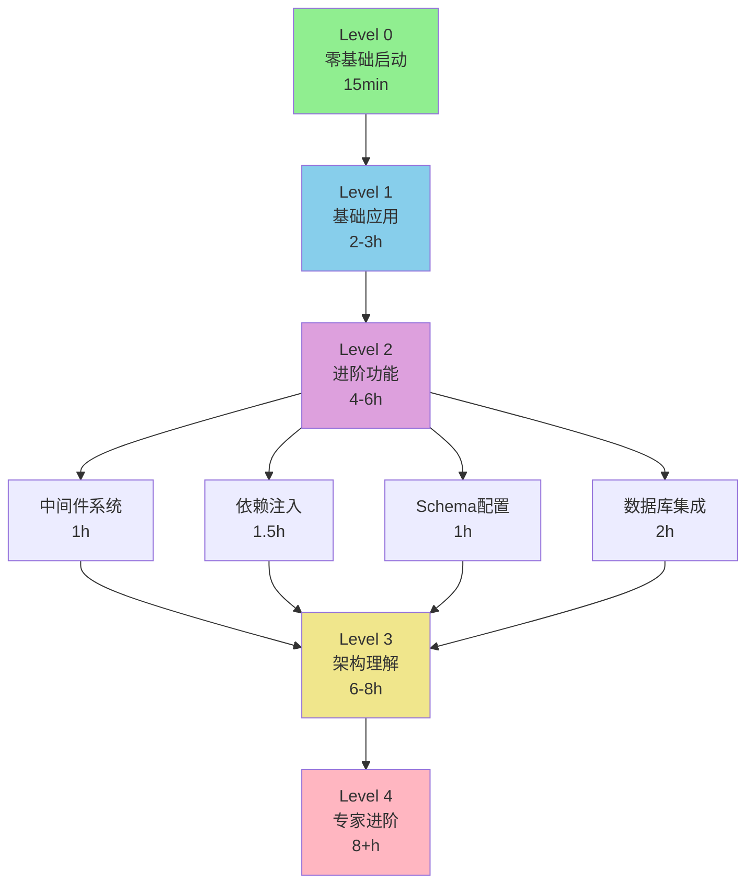

# 📚 Zhin.js 教程中心

欢迎来到 Zhin.js 教程中心！这里为你准备了从零基础到专家的完整学习路径。

---

## 🎯 选择你的学习路径

### 我应该从哪里开始？

<table>
<tr>
<td width="50%">

**🌱 完全新手**

"我从来没做过机器人"

✨ **开始**: [Level 0 - 零基础快速开始](./level0-quickstart.md)
- ⏱️ 时间: 15 分钟
- 🎯 目标: 看到机器人运行起来
- 📦 工具: 只需要 Node.js

**你将学到**:
- ✅ 创建第一个项目
- ✅ 启动机器人
- ✅ 发送和接收消息
- ✅ 体验热重载魔法

</td>
<td width="50%">

**💻 有编程基础**

"我会 JavaScript/TypeScript"

⚡ **开始**: [Level 1 - 基础应用](./level1-basics.md)
- ⏱️ 时间: 2-3 小时
- 🎯 目标: 开发实用插件
- 📚 前置: 了解 JS/TS 基础

**你将学到**:
- ✅ 命令系统完整用法
- ✅ 消息监听和处理
- ✅ 日志系统使用
- ✅ 构建完整应用

</td>
</tr>
<tr>
<td width="50%">

**🚀 有框架经验**

"我用过其他机器人框架"

🎨 **开始**: [核心概念](../guide/concepts.md)
- ⏱️ 时间: 4-6 小时
- 🎯 目标: 掌握高级特性
- 📚 前置: 完成 Level 1

**你将学到**:
- ✅ 中间件系统
- ✅ 依赖注入
- ✅ Schema 配置
- ✅ 数据持久化

</td>
<td width="50%">

**🧠 追求深度**

"我想理解框架原理"

🏗️ **开始**: [架构设计解析](../guide/architecture.md)
- ⏱️ 时间: 6-8 小时
- 🎯 目标: 精通框架设计
- 📚 前置: 完成 Level 2

**你将学到**:
- ✅ 四层架构设计
- ✅ 热重载原理
- ✅ 依赖注入深入
- ✅ 性能优化技巧

</td>
</tr>
</table>

---

## 📖 教程列表

### 基础教程

| 教程 | 难度 | 时间 | 状态 | 链接 |
|------|------|------|------|------|
| Level 0: 零基础快速开始 | ⭐ | 15 分钟 | ✅ | [开始学习](./level0-quickstart.md) |
| Level 1: 基础应用开发 | ⭐⭐ | 2-3 小时 | ✅ | [开始学习](./level1-basics.md) |
| Level 2: 进阶功能掌握 | ⭐⭐⭐ | 4-6 小时 | 📅 | [即将推出](../guide/concepts.md) |

### 专题教程

| 教程 | 难度 | 时间 | 状态 | 链接 |
|------|------|------|------|------|
| 中间件系统详解 | ⭐⭐⭐ | 1 小时 | 📅 | 即将推出 |
| 依赖注入实战 | ⭐⭐⭐ | 1.5 小时 | 📅 | 即将推出 |
| Schema 配置系统 | ⭐⭐⭐ | 1 小时 | 📅 | 即将推出 |
| 数据库集成 | ⭐⭐⭐ | 2 小时 | 📅 | 即将推出 |
| 自定义适配器 | ⭐⭐⭐⭐ | 3 小时 | 📅 | 即将推出 |

### 实战项目

| 项目 | 难度 | 时间 | 状态 | 链接 |
|------|------|------|------|------|
| 问答机器人 | ⭐ | 30 分钟 | ✅ | 见 Level 1 |
| 计算器插件 | ⭐⭐ | 1 小时 | ✅ | 见 Level 1 |
| 用户签到系统 | ⭐⭐⭐ | 2 小时 | 📅 | 即将推出 |
| TODO 管理器 | ⭐⭐⭐ | 2 小时 | 📅 | 即将推出 |
| 聊天游戏合集 | ⭐⭐⭐ | 3 小时 | 📅 | 即将推出 |
| 内容管理系统 | ⭐⭐⭐⭐ | 8 小时 | 📅 | 即将推出 |

---

## 🎓 学习建议

### ✅ 推荐的学习方式

1. **循序渐进**: 不要跳级，按顺序完成每个 Level
2. **动手实践**: 每个教程都有练习，一定要自己写代码
3. **理解原理**: 不仅要知道怎么用，还要理解为什么这样设计
4. **查阅文档**: 遇到问题先查阅 [API 文档](../api/index.md)
5. **参与社区**: 在 [GitHub Discussions](https://github.com/zhinjs/zhin/discussions) 分享你的学习心得

### ❌ 要避免的陷阱

1. ~~跳过基础教程，直接看进阶内容~~
2. ~~只看教程不写代码~~
3. ~~遇到错误就放弃~~
4. ~~不理解就死记硬背~~
5. ~~独自学习，不寻求帮助~~

---

## 📊 学习进度追踪

使用这个清单追踪你的学习进度：

```markdown
### 基础教程
- [ ] Level 0: 零基础快速开始
- [ ] Level 1: 基础应用开发
- [ ] Level 2: 进阶功能掌握

### 专题学习
- [ ] 中间件系统
- [ ] 依赖注入
- [ ] Schema 配置
- [ ] 数据库集成

### 实战项目
- [ ] 问答机器人
- [ ] 计算器插件
- [ ] 签到系统
- [ ] TODO 管理器
```

---

## 🎯 学习路线图



---

## 💡 学习资源

### 📚 文档资源
- [完整文档](../index.md) - 全面的参考文档
- [快速开始](../guide/quick-start.md) - 60秒快速体验
- [API 参考](../api/index.md) - 完整 API 文档
- [架构设计](../guide/architecture.md) - 深入理解框架

### 💻 代码资源
- [示例项目](../examples/index.md) - 实用代码示例
- [官方插件](../official/plugins.md) - 官方插件列表
- [完整项目示例](../examples/real-world.md) - 真实项目案例

### 🌐 社区资源
- [GitHub](https://github.com/zhinjs/zhin) - 源代码和问题追踪
- [Discussions](https://github.com/zhinjs/zhin/discussions) - 社区讨论
- [Issues](https://github.com/zhinjs/zhin/issues) - Bug 报告和功能请求

---

## 🆘 获取帮助

### 遇到问题时

1. **📖 查文档**: 先在文档中搜索相关内容
2. **🔍 搜索 Issues**: 看看是否有人遇到过类似问题
3. **💬 提问**: 在 GitHub Discussions 提问
4. **🐛 报 Bug**: 在 GitHub Issues 报告问题

### 常见问题

- [配置系统](../guide/configuration.md) - 配置指南
- [常见问题](../guide/getting-started.md#常见问题) - 问题解答
- [最佳实践](../guide/best-practices.md) - 开发建议

---

## 🎉 开始学习

选择你的起点，开始你的 Zhin.js 学习之旅：

<table>
<tr>
<td align="center" width="33%">

### 🌱 新手

👉 [Level 0 教程](./level0-quickstart.md)

15 分钟快速入门

</td>
<td align="center" width="33%">

### 💻 开发者

👉 [Level 1 教程](./level1-basics.md)

2-3 小时掌握基础

</td>
<td align="center" width="33%">

### 🚀 进阶

👉 [进阶学习](../guide/concepts.md)

4-6 小时深入学习

</td>
</tr>
</table>

---

**💡 记住**: 每个专家都是从新手开始的。享受学习的过程，祝你成功！🎓

