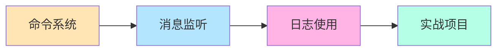

# 📘 Level 1: 基础应用 - 构建你的第一个实用机器人

> **⏱️ 预计时间**: 2-3 小时  
> **🎯 目标**: 掌握命令、消息处理、日志等基础功能  
> **📋 前置要求**: 完成 [Level 0](./level0-quickstart.md)

---

## 📚 本章学习内容



---

## 🎮 Part 1: 命令系统入门 (30 分钟)

### 📖 理论知识

在 Zhin.js 中，**命令**是处理用户输入的主要方式。命令格式：

```
命令名 <必需参数> [可选参数]
```

### 💻 实践：创建你的第一个命令插件

#### 步骤 1: 创建新插件文件

在项目中创建 `src/plugins/my-commands.ts`：

```typescript
import { addCommand, MessageCommand, useLogger } from 'zhin.js'

const logger = useLogger()

// 🏓 简单命令：无参数
addCommand(new MessageCommand('ping')
  .action(() => {
    return '🏓 Pong!'
  })
)

logger.info('我的命令插件已加载')
```

#### 步骤 2: 测试命令

保存文件后，终端会自动重载。测试：

```bash
> ping
< 🏓 Pong!
```

✅ **成功！你创建了第一个命令！**

---

### 🎯 实践：带参数的命令

在同一文件继续添加：

```typescript
// 🎤 Echo 命令：一个必需参数
addCommand(new MessageCommand('echo <text>')
  .action((message, result) => {
    const text = result.params.text
    return `你说：${text}`
  })
)

// 🎲 骰子命令：可选参数（带默认值）
addCommand(new MessageCommand('roll [sides:number=6]')
  .action((message, result) => {
    const sides = result.params.sides ?? 6
    const roll = Math.floor(Math.random() * sides) + 1
    return `🎲 掷出了 ${roll} 点！（${sides}面骰子）`
  })
)

// 🧮 加法命令：多个参数
addCommand(new MessageCommand('add <a:number> <b:number>')
  .action((message, result) => {
    const { a, b } = result.params
    const sum = a + b
    return `🧮 ${a} + ${b} = ${sum}`
  })
)
```

#### 测试命令

```bash
> echo Hello World
< 你说：Hello World

> roll
< 🎲 掷出了 4 点！（6面骰子）

> roll 20
< 🎲 掷出了 15 点！（20面骰子）

> add 5 7
< 🧮 5 + 7 = 12
```

---

### 📝 练习 1: 自己动手

**任务**: 添加一个 `multiply` 命令，实现乘法

<details>
<summary>💡 点击查看答案</summary>

```typescript
addCommand(new MessageCommand('multiply <a:number> <b:number>')
  .action((message, result) => {
    const { a, b } = result.params
    const product = a * b
    return `🧮 ${a} × ${b} = ${product}`
  })
)
```

测试：
```bash
> multiply 6 7
< 🧮 6 × 7 = 42
```

</details>

---

## 💬 Part 2: 消息监听 (30 分钟)

### 📖 理论知识

除了命令，你还可以监听**所有消息**并做出响应。

### 💻 实践：智能问答机器人

创建 `src/plugins/qa-bot.ts`：

```typescript
import { onMessage, useLogger } from 'zhin.js'

const logger = useLogger()

// 简单的问答数据库
const qaDatabase = {
  '你好': ['你好！👋', '嗨！', '你好呀！'],
  '再见': ['再见！👋', '拜拜！', '下次见！'],
  '天气': ['今天天气不错哦！☀️', '天气很好呢！'],
  '时间': () => `现在是 ${new Date().toLocaleString()}`,
  '帮助': `我能回答以下问题：
  • 你好
  • 再见
  • 天气
  • 时间
  • 帮助`
}

onMessage(async (message) => {
  const userMessage = message.raw.trim()
  
  // 查找匹配的回答
  for (const [question, answer] of Object.entries(qaDatabase)) {
    if (userMessage.includes(question)) {
      let reply: string
      
      if (typeof answer === 'function') {
        reply = answer()
      } else if (Array.isArray(answer)) {
        // 随机选择一个回答
        reply = answer[Math.floor(Math.random() * answer.length)]
      } else {
        reply = answer
      }
      
      await message.reply(reply)
      return // 找到答案就返回
    }
  }
})

logger.info('问答机器人已启动')
```

#### 测试问答机器人

```bash
> 你好
< 嗨！

> 时间
< 现在是 2024/1/15 下午3:45:20

> 天气
< 今天天气不错哦！☀️

> 帮助
< 我能回答以下问题：
  • 你好
  • 再见
  • 天气
  • 时间
  • 帮助
```

---

### 🎯 区分群聊和私聊

```typescript
import { onGroupMessage, onPrivateMessage, useLogger } from 'zhin.js'

const logger = useLogger()

// 只响应群聊消息
onGroupMessage(async (message) => {
  if (message.raw.includes('@机器人')) {
    await message.reply('我在！有什么可以帮助你的吗？')
  }
})

// 只响应私聊消息
onPrivateMessage(async (message) => {
  await message.reply('这是私聊回复！如果需要帮助，输入"帮助"')
})
```

---

### 📝 练习 2: 扩展问答库

**任务**: 在问答库中添加 3 个新的问题和答案

<details>
<summary>💡 点击查看示例</summary>

```typescript
const qaDatabase = {
  // ... 原有内容
  '你是谁': '我是 Zhin 机器人，很高兴认识你！',
  '你会什么': '我会聊天、回答问题、执行命令！',
  '作者': '我是由 Zhin.js 框架开发的机器人',
}
```

</details>

---

## 📝 Part 3: 日志系统 (20 分钟)

### 📖 理论知识

日志对于调试和监控非常重要。Zhin.js 提供了完整的日志系统。

### 💻 实践：使用日志

创建 `src/plugins/logger-demo.ts`：

```typescript
import { useLogger, addCommand, MessageCommand } from 'zhin.js'

const logger = useLogger()

// 不同级别的日志
logger.debug('调试信息 - 只在 debug: true 时显示')
logger.info('普通信息 - 默认级别')
logger.warn('警告信息 - 需要注意')
logger.error('错误信息 - 出现问题')

// 带额外信息的日志
logger.info('用户登录', {
  userId: '12345',
  username: 'Alice',
  timestamp: new Date()
})

// 在命令中使用日志
addCommand(new MessageCommand('debug-test')
  .action((message) => {
    logger.debug('收到 debug-test 命令')
    logger.info(`发送者: ${message.sender.name}`)
    logger.info(`消息内容: ${message.raw}`)
    
    return '日志已记录！查看终端输出'
  })
)
```

### 🔍 日志级别说明

| 级别 | 用途 | 颜色 |
|------|------|------|
| `debug` | 调试信息 | 灰色 |
| `info` | 一般信息 | 蓝色 |
| `warn` | 警告信息 | 黄色 |
| `error` | 错误信息 | 红色 |

### 📊 在 Web 控制台查看日志

1. 打开 `http://localhost:8086`
2. 点击左侧 **Logs** 菜单
3. 你会看到所有日志的实时输出
4. 可以按级别过滤、搜索关键词

---

## 🎯 Part 4: 实战项目 - 完整的计算器 (40 分钟)

现在让我们把所学的知识结合起来，构建一个完整的计算器插件！

### 💻 创建 `src/plugins/calculator.ts`

```typescript
import { 
  addCommand, 
  MessageCommand, 
  onMessage,
  useLogger 
} from 'zhin.js'

const logger = useLogger()

// 📊 统计数据
const stats = {
  totalCalculations: 0,
  lastCalculation: null as string | null
}

// ➕ 加法
addCommand(new MessageCommand('add <a:number> <b:number>')
  .action((message, result) => {
    const { a, b } = result.params
    const sum = a + b
    
    stats.totalCalculations++
    stats.lastCalculation = `${a} + ${b} = ${sum}`
    
    logger.info(`计算: ${a} + ${b} = ${sum}`)
    return `🧮 ${a} + ${b} = ${sum}`
  })
)

// ➖ 减法
addCommand(new MessageCommand('sub <a:number> <b:number>')
  .action((message, result) => {
    const { a, b } = result.params
    const diff = a - b
    
    stats.totalCalculations++
    stats.lastCalculation = `${a} - ${b} = ${diff}`
    
    return `🧮 ${a} - ${b} = ${diff}`
  })
)

// ✖️ 乘法
addCommand(new MessageCommand('mul <a:number> <b:number>')
  .action((message, result) => {
    const { a, b } = result.params
    const product = a * b
    
    stats.totalCalculations++
    stats.lastCalculation = `${a} × ${b} = ${product}`
    
    return `🧮 ${a} × ${b} = ${product}`
  })
)

// ➗ 除法
addCommand(new MessageCommand('div <a:number> <b:number>')
  .action((message, result) => {
    const { a, b } = result.params
    
    if (b === 0) {
      logger.warn('尝试除以零')
      return '❌ 错误：不能除以零！'
    }
    
    const quotient = a / b
    const result_str = Number.isInteger(quotient) 
      ? quotient.toString() 
      : quotient.toFixed(2)
    
    stats.totalCalculations++
    stats.lastCalculation = `${a} ÷ ${b} = ${result_str}`
    
    return `🧮 ${a} ÷ ${b} = ${result_str}`
  })
)

// 📊 统计信息
addCommand(new MessageCommand('calc-stats')
  .action(() => {
    return `📊 计算器统计：
━━━━━━━━━━━━━━
📈 总计算次数: ${stats.totalCalculations}
📝 最后计算: ${stats.lastCalculation || '无'}
━━━━━━━━━━━━━━`
  })
)

// 🆘 帮助信息
addCommand(new MessageCommand('calc-help')
  .action(() => {
    return `🧮 计算器帮助：
━━━━━━━━━━━━━━
可用命令：
• add <a> <b>  - 加法
• sub <a> <b>  - 减法
• mul <a> <b>  - 乘法
• div <a> <b>  - 除法
• calc-stats   - 查看统计
• calc-help    - 显示帮助
━━━━━━━━━━━━━━
示例: add 5 3`
  })
)

// 🎯 智能识别计算表达式
onMessage(async (message) => {
  const text = message.raw.trim()
  
  // 匹配简单的数学表达式: "5+3" 或 "10 - 4"
  const match = text.match(/^(\d+)\s*([\+\-\*\/])\s*(\d+)$/)
  
  if (match) {
    const a = parseInt(match[1])
    const op = match[2]
    const b = parseInt(match[3])
    
    let result: number
    let symbol: string
    
    switch (op) {
      case '+':
        result = a + b
        symbol = '+'
        break
      case '-':
        result = a - b
        symbol = '-'
        break
      case '*':
        result = a * b
        symbol = '×'
        break
      case '/':
        if (b === 0) {
          await message.reply('❌ 不能除以零！')
          return
        }
        result = a / b
        symbol = '÷'
        break
      default:
        return
    }
    
    stats.totalCalculations++
    stats.lastCalculation = `${a} ${symbol} ${b} = ${result}`
    
    await message.reply(`🧮 ${a} ${symbol} ${b} = ${result}`)
    logger.info(`自动计算: ${text} = ${result}`)
  }
})

logger.info('🧮 计算器插件已加载')
```

### 🎮 测试计算器

```bash
> add 5 3
< 🧮 5 + 3 = 8

> mul 6 7
< 🧮 6 × 7 = 42

> div 10 3
< 🧮 10 ÷ 3 = 3.33

> 5+3
< 🧮 5 + 3 = 8

> 10 * 4
< 🧮 10 × 4 = 40

> calc-stats
< 📊 计算器统计：
  ━━━━━━━━━━━━━━
  📈 总计算次数: 5
  📝 最后计算: 10 × 4 = 40
  ━━━━━━━━━━━━━━

> calc-help
< 🧮 计算器帮助：
  ━━━━━━━━━━━━━━
  可用命令：
  • add <a> <b>  - 加法
  ...
```

---

## 📝 练习 3: 扩展计算器

**任务 A**: 添加平方命令 `square <num>`

<details>
<summary>💡 点击查看答案</summary>

```typescript
addCommand(new MessageCommand('square <num:number>')
  .action((message, result) => {
    const num = result.params.num
    const square = num * num
    return `🧮 ${num}² = ${square}`
  })
)
```

</details>

**任务 B**: 添加清除统计命令 `calc-reset`

<details>
<summary>💡 点击查看答案</summary>

```typescript
addCommand(new MessageCommand('calc-reset')
  .action(() => {
    stats.totalCalculations = 0
    stats.lastCalculation = null
    return '✅ 统计已清除'
  })
)
```

</details>

---

## 🎓 Level 1 总结

### ✅ 你学会了

- [x] 创建简单命令
- [x] 使用命令参数（必需和可选）
- [x] 监听消息事件
- [x] 使用日志系统
- [x] 构建完整的应用（计算器）

### 📊 能力评估

如果你能独立完成以下任务，说明你已经掌握了 Level 1：

- [ ] 创建一个新插件文件
- [ ] 添加 3 个不同的命令
- [ ] 使用参数和默认值
- [ ] 监听消息并做出响应
- [ ] 使用日志记录信息

---

## 🎯 下一步

准备好进入 Level 2 了吗？你将学习：

- 🔧 **中间件系统** - 拦截和处理消息
- 🎯 **依赖注入** - 服务化架构
- ⚙️ **配置系统** - Schema 验证
- 💾 **数据持久化** - 存储用户数据

👉 **[继续学习：进阶概念](../guide/concepts.md)**

---

## 💡 学习建议

1. **不要着急**: 确保理解每个概念再继续
2. **多做练习**: 完成所有练习题
3. **实验探索**: 尝试修改代码，看看会发生什么
4. **查阅文档**: 遇到问题先查文档
5. **写笔记**: 记录重要概念和常用代码

---

🎉 **恭喜你完成 Level 1！继续加油！** 💪

