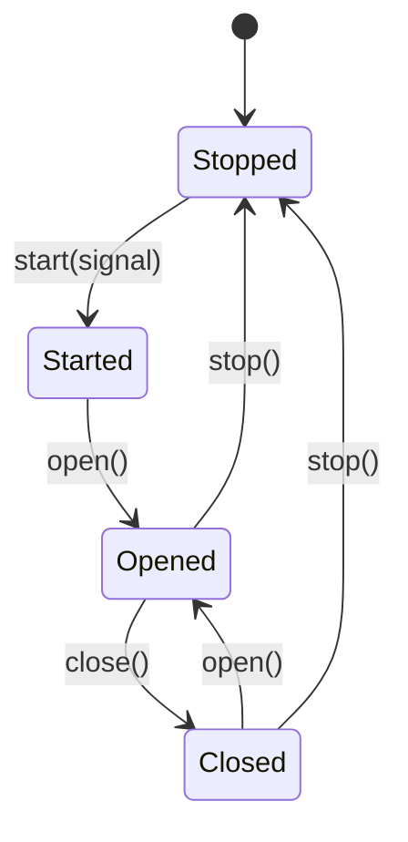
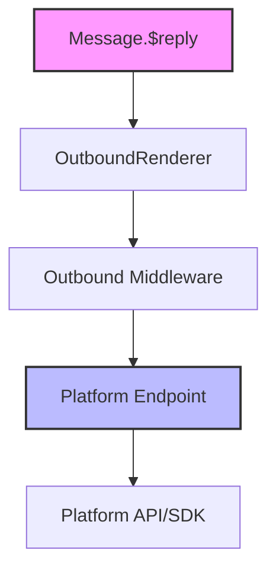

[英文原文](/en/wiki/cubic/adapters-core)

::: warning 第三方生成的参考快照
[Cubic 原页面](https://www.cubic.dev/wikis/zhinjs/zhin?page=page-adapters-core) · 抓取于 2026-09-23 · [源码提交](https://github.com/zhinjs/zhin/commit/368db14caa4aa91311fb090f07bd792fe4b22fe7)。本页由英文快照机器辅助翻译，尚未逐页与当前代码核验；实际开发请以[维护中的 Zhin 文档](/getting-started/)和[资料存档勘误](/wiki/archive)为准。
:::

::: danger 已确认勘误
下文生命周期图将脚手架 Endpoint 示例与 `createEndpointLifecycle` 混为一谈。后者使用 `idle / connecting / open / reconnecting / closed / stopped` 状态，不暴露图中的 `open()` / `close()` 转换。下文实现示例本身无法编译：`Endpoint` 不接收构造参数，且示例未实现抽象方法 `open()` 和 `close()`。它只是部分骨架，不能直接作为完整入站适配器使用。参见[端点生命周期](/authoring/endpoint-lifecycle)。
:::

::: details 相关源文件

以下文件是 Cubic 生成本页时引用的上下文：

- [README.md](https://github.com/zhinjs/zhin/blob/368db14caa4aa91311fb090f07bd792fe4b22fe7/README.md)
- [CLAUDE.md](https://github.com/zhinjs/zhin/blob/368db14caa4aa91311fb090f07bd792fe4b22fe7/CLAUDE.md)
- [AGENTS.md](https://github.com/zhinjs/zhin/blob/368db14caa4aa91311fb090f07bd792fe4b22fe7/AGENTS.md)
- [basic/cli/src/commands/new.ts](https://github.com/zhinjs/zhin/blob/368db14caa4aa91311fb090f07bd792fe4b22fe7/basic/cli/src/commands/new.ts)
- [plugins/adapters/README.md](https://github.com/zhinjs/zhin/blob/368db14caa4aa91311fb090f07bd792fe4b22fe7/plugins/adapters/README.md)
:::

# 适配器核心与端点生命周期

Adapter Core 负责管理 Zhin.js 中各平台的连接，为 QQ、Discord、Telegram 和 Slack 等多种聊天平台提供统一接口。它对来自不同协议的入站消息流进行标准化处理，并通过标准化的平台端点管理出站发送流程。

该系统使单个机器人实例能够同时运行多个账号，覆盖多个平台。核心组件确保每条消息要么匹配到相应命令，要么经过中间件处理，最终进入统一的发送流水线。
来源：[README.md:16-20](https://github.com/zhinjs/zhin/blob/368db14caa4aa91311fb090f07bd792fe4b22fe7/README.md#L16-L20), [CLAUDE.md:70-75](https://github.com/zhinjs/zhin/blob/368db14caa4aa91311fb090f07bd792fe4b22fe7/CLAUDE.md#L70-L75), [AGENTS.md:13-18](https://github.com/zhinjs/zhin/blob/368db14caa4aa91311fb090f07bd792fe4b22fe7/AGENTS.md#L13-L18)

## 适配器架构

适配器以独立的包形式存在于 `plugins/adapters/` 目录中。它们遵循 Plugin Runtime 中发现和执行的标准约定。一个适配器主要由 `Endpoint` 类的实现以及调用 `defineAdapter` 导出定义两部分构成。

### 能力与输入输出
适配器将功能划分为 `inbound`（接收消息/事件）和 `outbound`（发送消息）两个部分。根据平台协议的不同，某些端点可能仅支持其中一种能力（例如，仅支持 webhook 的入站源）。
来源：[basic/cli/src/commands/new.ts:318-325](https://github.com/zhinjs/zhin/blob/368db14caa4aa91311fb090f07bd792fe4b22fe7/basic/cli/src/commands/new.ts#L318-L325), [AGENTS.md:180-185](https://github.com/zhinjs/zhin/blob/368db14caa4aa91311fb090f07bd792fe4b22fe7/AGENTS.md#L180-L185)

### 核心组件
| 组件 | 描述 |
| :--- | :--- |
| `defineAdapter` | 一个高阶函数，用于为 Zhin 运行时定义并导出适配器。 |
| `Endpoint` | 平台特定客户端的基础类。它负责传输、心跳检测和消息传递。 |
| `emit()` | 由端点使用的方法，用于将标准化的平台事件注入到 Zhin 消息管道中。 |
| `send()` | 用于将消息传递到平台特定 API 的实现方法。 |
来源：[basic/cli/src/commands/new.ts:318-362](https://github.com/zhinjs/zhin/blob/368db14caa4aa91311fb090f07bd792fe4b22fe7/basic/cli/src/commands/new.ts#L318-L362), [CLAUDE.md:78-83](https://github.com/zhinjs/zhin/blob/368db14caa4aa91311fb090f07bd792fe4b22fe7/CLAUDE.md#L78-L83)

## 终端生命周期管理

长连接，特别是使用 WebSocket 或持久 HTTP 流的连接，采用标准化的生命周期方法。Zhin 运行时通过内部的 `createEndpointLifecycle` 机制来管理这些连接，以处理状态转换、心跳和重连操作。

### 生命周期状态
1.  **启动**：建立初始的传输连接（例如，打开一个 WebSocket）。
2.  **打开**：将终端置于就绪状态，使其能够接收并发出事件。
3.  **关闭**：暂停新事件的接收，但不一定终止传输连接。
4.  **停止**：完全释放传输连接、心跳和重连任务。
来源：[basic/cli/src/commands/new.ts:335-358](https://github.com/zhinjs/zhin/blob/368db14caa4aa91311fb090f07bd792fe4b22fe7/basic/cli/src/commands/new.ts#L335-L358), [AGENTS.md:177-185](https://github.com/zhinjs/zhin/blob/368db14caa4aa91311fb090f07bd792fe4b22fe7/AGENTS.md#L177-L185)


上图展示了由 Zhin 运行时管理的平台端点的状态转换。
来源：[basic/cli/src/commands/new.ts:335-355](https://github.com/zhinjs/zhin/blob/368db14caa4aa91311fb090f07bd792fe4b22fe7/basic/cli/src/commands/new.ts#L335-L355), [AGENTS.md:177-180](https://github.com/zhinjs/zhin/blob/368db14caa4aa91311fb090f07bd792fe4b22fe7/AGENTS.md#L177-L180)

## 出站消息流水线

所有出站消息必须遵循统一的发送链路。项目架构约束禁止直接调用平台特定的SDK来绕过该链路。

### 发送链路流程
1. **消息发起**：一个命令或中间件调用 `Message.$reply` 或 `Adapter.sendMessage`。
2. **渲染处理**：`OutboundRenderer` 对消息内容进行处理（例如，将 HTML/Markdown 转换为 PNG 或文本）。
3. **中间件处理**：出站中间件拦截消息，用于日志记录、过滤或转换。
4. **端点交付**：消息传递至特定的 `Endpoint`，并通过平台API进行分发。
来源：[CLAUDE.md:78-83](https://github.com/zhinjs/zhin/blob/368db14caa4aa91311fb090f07bd792fe4b22fe7/CLAUDE.md#L78-L83), [AGENTS.md:183-185](https://github.com/zhinjs/zhin/blob/368db14caa4aa91311fb090f07bd792fe4b22fe7/AGENTS.md#L183-L185)


该流程代表了 Zhin.js 框架中所有传出消息的必经路径。
来源：[CLAUDE.md:78-83](https://github.com/zhinjs/zhin/blob/368db14caa4aa91311fb090f07bd792fe4b22fe7/CLAUDE.md#L78-L83), [AGENTS.md:183-185](https://github.com/zhinjs/zhin/blob/368db14caa4aa91311fb090f07bd792fe4b22fe7/AGENTS.md#L183-L185)

## 稳定性等级

Zhin.js 根据适配器的实现成熟度和维护水平，将其划分为三个等级：

*   **稳定（核心）**：`Sandbox` 适配器，用于本地测试和调试。
*   **平台稳定**：满足严格可靠性标准的适配器（目前处于开发中）。
*   **高级/实验性**：用于第三方协议（如 Telegram、Discord 和企业微信）的适配器。这些适配器可能需要特定配置，例如 webhook 或 HTTP 路由器。
来源：[plugins/adapters/README.md:14-25](https://github.com/zhinjs/zhin/blob/368db14caa4aa91311fb090f07bd792fe4b22fe7/plugins/adapters/README.md#L14-L25)

## 实现示例

以下模板展示了使用 `defineAdapter` API 配置的 Zhin.js 适配器的标准结构。

```typescript
// plugins/adapters/my-adapter/adapters/my-adapter/index.ts
import { Endpoint, defineAdapter, type EndpointSendRequest } from 'zhin.js/adapter';

export default defineAdapter({
  capabilities: ['inbound', 'outbound'],
  create(context) {
    return new class extends Endpoint {
      async start(signal: AbortSignal) {
        // Establish connection
      }
      async stop() {
        // Release resources
      }
      async send({ conversation, payload }: EndpointSendRequest) {
        // Call platform API
        return 'message-id';
      }
    }(String(context.id), context.config);
  },
});
```
来源：[basic/cli/src/commands/new.ts:318-360](https://github.com/zhinjs/zhin/blob/368db14caa4aa91311fb090f07bd792fe4b22fe7/basic/cli/src/commands/new.ts#L318-L360)

## 概述

适配器核心和终端生命周期系统为聊天平台的通信提供了强大的抽象层。通过强制执行单一发送链路和标准化的生命周期转换，Zhin.js 确保插件在保持平台无关性的同时，支持热重载以及跨多种通信渠道的AI Agent编排等高级功能。
来源：[README.md:43-58](https://github.com/zhinjs/zhin/blob/368db14caa4aa91311fb090f07bd792fe4b22fe7/README.md#L43-L58), [AGENTS.md:177-185](https://github.com/zhinjs/zhin/blob/368db14caa4aa91311fb090f07bd792fe4b22fe7/AGENTS.md#L177-L185)
