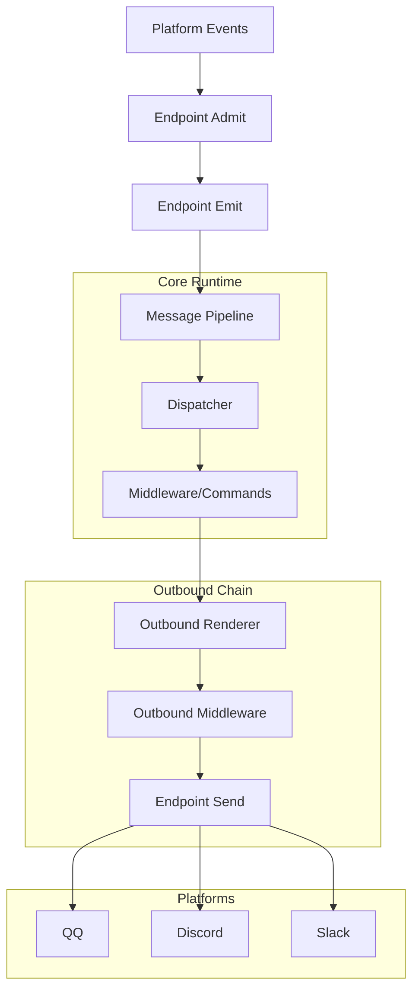
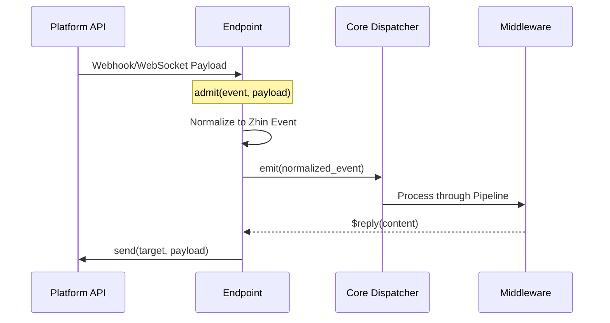

[英文原文](/en/wiki/cubic/adapters-platforms)

::: warning 第三方生成的参考快照
[Cubic 原页面](https://www.cubic.dev/wikis/zhinjs/zhin?page=page-adapters-platforms) · 抓取于 2026-09-23 · [源码提交](https://github.com/zhinjs/zhin/commit/368db14caa4aa91311fb090f07bd792fe4b22fe7)。本页由英文快照机器辅助翻译，尚未逐页与当前代码核验；实际开发请以[维护中的 Zhin 文档](/getting-started/)和[知识库勘误](/wiki/)为准。
:::

::: details 相关源文件

以下文件是 Cubic 生成本页时引用的上下文：

- [README.md](https://github.com/zhinjs/zhin/blob/368db14caa4aa91311fb090f07bd792fe4b22fe7/README.md)
- [AGENTS.md](https://github.com/zhinjs/zhin/blob/368db14caa4aa91311fb090f07bd792fe4b22fe7/AGENTS.md)
- [plugins/adapters/README.md](https://github.com/zhinjs/zhin/blob/368db14caa4aa91311fb090f07bd792fe4b22fe7/plugins/adapters/README.md)
- [basic/cli/src/commands/new.ts](https://github.com/zhinjs/zhin/blob/368db14caa4aa91311fb090f07bd792fe4b22fe7/basic/cli/src/commands/new.ts)
- [packages/toolkit/scaffold-wizard/README.md](https://github.com/zhinjs/zhin/blob/368db14caa4aa91311fb090f07bd792fe4b22fe7/packages/toolkit/scaffold-wizard/README.md)
:::

# 平台接入

Zhin.js 提供了多通道架构，使单个代码库能够运行于 20 多个聊天平台，包括 QQ、Discord、Slack、Telegram 和微信。该系统对入站和出站消息流进行标准化处理，使得单个机器人实例可同时管理多个账号和端点。

来源：[README.md:18-20](https://github.com/zhinjs/zhin/blob/368db14caa4aa91311fb090f07bd792fe4b22fe7/README.md#L18-L20), [README.md:79-81](https://github.com/zhinjs/zhin/blob/368db14caa4aa91311fb090f07bd792fe4b22fe7/README.md#L79-L81)

## 核心架构

集成系统由两个主要层次构成：**适配器**和**端点**。适配器定义了平台的协议和逻辑，而端点代表一个具体的账户实例，并管理其生命周期和传输过程。

### 端点生命周期
每个平台集成都扩展了 `Endpoint` 类，以管理连接状态。
- **`start`**：建立传输连接（例如 WebSocket、HTTP 长轮询）。
- **`open`**：使端点能够开始处理并发出事件。
- **`stop`**：幂等释放传输、心跳和重连任务。
- **`send`**：将处理后的负载传递给平台目标。

来源：[basic/cli/src/commands/new.ts:310-348](https://github.com/zhinjs/zhin/blob/368db14caa4aa91311fb090f07bd792fe4b22fe7/basic/cli/src/commands/new.ts#L310-L348), [AGENTS.md:154-156](https://github.com/zhinjs/zhin/blob/368db14caa4aa91311fb090f07bd792fe4b22fe7/AGENTS.md#L154-L156)

### 消息流水线
Zhin.js 为所有传出通信使用统一的发送链路。消息必须经过 `OutboundRenderer` 和传出中间件，才能到达平台 `Endpoint`。建议避免直接调用平台特定的机器人 API，以保持架构一致性。

来源：[CLAUDE.md:75-76](https://github.com/zhinjs/zhin/blob/368db14caa4aa91311fb090f07bd792fe4b22fe7/CLAUDE.md#L75-L76), [AGENTS.md:150-152](https://github.com/zhinjs/zhin/blob/368db14caa4aa91311fb090f07bd792fe4b22fe7/AGENTS.md#L150-L152)


*图示展示了 Zhin.js 核心与外部聊天平台之间通过端点实现的双向数据流。*

## 支持的平台与层级

适配器根据其在 Zhin 生态系统中的稳定性及功能支持情况被划分为不同层级。

| 平台类别 | 适配器 | 源码包 |
| :--- | :--- | :--- |
| **稳定（核心）** | Sandbox | `@zhin.js/adapter-sandbox` |
| **消息通信** | QQ、ICQQ、NapCat、OneBot 11/12 | `@zhin.js/adapter-icqq`、`@zhin.js/adapter-qq` |
| **社区** | Discord、Telegram、Slack、KOOK | `@zhin.js/adapter-discord`、`@zhin.js/adapter-telegram` |
| **企业级** | DingTalk、Feishu（Lark）、WeChat Work | `dingtalk`、`lark`、`wecom` |
| **协议/其他** | GitHub、Email、Satori、LINE | `@zhin.js/adapter-github`、`email`、`satori` |

来源：[README.md:126-136](https://github.com/zhinjs/zhin/blob/368db14caa4aa91311fb090f07bd792fe4b22fe7/README.md#L126-L136), [plugins/adapters/README.md:7-18](https://github.com/zhinjs/zhin/blob/368db14caa4aa91311fb090f07bd792fe4b22fe7/plugins/adapters/README.md#L7-L18)

### 功能能力
端点声明特定能力以表明其功能范围：
- **`inbound`**：该端点可以接收平台发送的事件和消息。
- **`outbound`**：该端点可以向平台发送消息和媒体。

来源：[basic/cli/src/commands/new.ts:352-355](https://github.com/zhinjs/zhin/blob/368db14caa4aa91311fb090f07bd792fe4b22fe7/basic/cli/src/commands/new.ts#L352-L355), [AGENTS.md:154-156](https://github.com/zhinjs/zhin/blob/368db14caa4aa91311fb090f07bd792fe4b22fe7/AGENTS.md#L154-L156)

## 配置与设置

平台集成通过 `zhin.config.yml` 或交互式向导进行配置。

### 模板生成
`@zhin.js/scaffold-wizard` 为复杂平台提供分步配置：
1. **选择**：您选择平台（例如 Telegram、GitHub App）。
2. **参数**：您输入所需凭证（令牌、应用 ID、Webhook 密钥）。
3. **环境**：向导将敏感凭证写入 `.env`，并生成相应的 `zhin.config.yml` 条目。

来源：[packages/toolkit/scaffold-wizard/README.md:17-29](https://github.com/zhinjs/zhin/blob/368db14caa4aa91311fb090f07bd792fe4b22fe7/packages/toolkit/scaffold-wizard/README.md#L17-L29), [basic/cli/src/commands/setup.ts:220-240](https://github.com/zhinjs/zhin/blob/368db14caa4aa91311fb090f07bd792fe4b22fe7/basic/cli/src/commands/setup.ts#L220-L240)

### 配置方式集成
```yaml
plugins:
  qq:
    id: my-qq-bot
    token: ${QQ_TOKEN}
  discord:
    id: my-discord-bot
    token: ${DISCORD_TOKEN}
```
*示例展示了如何使用环境变量引用平台令牌进行配置。*
来源：[README.md:113-124](https://github.com/zhinjs/zhin/blob/368db14caa4aa91311fb090f07bd792fe4b22fe7/README.md#L113-L124), [basic/cli/src/commands/new.ts:384-398](https://github.com/zhinjs/zhin/blob/368db14caa4aa91311fb090f07bd792fe4b22fe7/basic/cli/src/commands/new.ts#L384-L398)

## 事件处理
平台通过 `admit` 和 `emit` 方法传递数据。当端点接收到平台事件时，会接收并处理该数据，将其标准化为 Zhin 事件，然后调用 `emit`。这使得 `Dispatcher` 能够一致地处理来自不同源平台的事件。


平台接收至内部回复机制的事件序列。
来源：[basic/cli/src/commands/new.ts:344-348](https://github.com/zhinjs/zhin/blob/368db14caa4aa91311fb090f07bd792fe4b22fe7/basic/cli/src/commands/new.ts#L344-L348), [CLAUDE.md:75-76](https://github.com/zhinjs/zhin/blob/368db14caa4aa91311fb090f07bd792fe4b22fe7/CLAUDE.md#L75-L76)

## 概述
Zhin.js 的平台集成采用标准化的 `Endpoint` 和 `Adapter` 模式，以抽象平台特定的协议。通过使用统一的发送链路和标准化事件触发机制，开发者可以基于单一代码库，实现与 20 多个平台无缝交互的助手。生命周期管理与交互式脚手架进一步简化了在多个账户和服务提供商间扩展机器人功能的过程。
