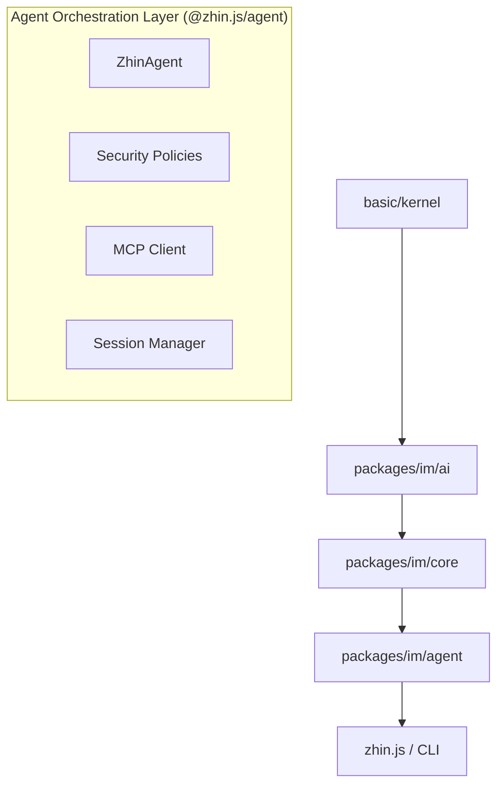
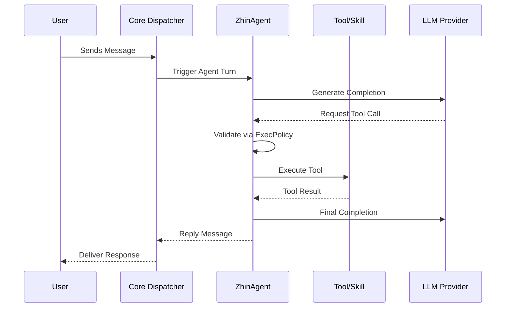

[英文原文](/en/wiki/cubic/ai-orchestration)

::: warning 第三方生成的参考快照
[Cubic 原页面](https://www.cubic.dev/wikis/zhinjs/zhin?page=page-ai-orchestration) · 抓取于 2026-09-23 · [源码提交](https://github.com/zhinjs/zhin/commit/368db14caa4aa91311fb090f07bd792fe4b22fe7)。本页由英文快照机器辅助翻译，尚未逐页与当前代码核验；实际开发请以[维护中的 Zhin 文档](/getting-started/)和[资料存档勘误](/wiki/archive)为准。
:::

::: danger 已确认勘误
Tool 与 Hook 分别使用 `tools/<name>/index.ts` 和 `hooks/<name>/index.ts`。`execSecurity`（`deny | allowlist | full`）与 `execApprovalMode`（`ask | auto | bypass`）是独立配置。参见[约定目录](/authoring/conventions)和[Agent 配置](/ai/)。
:::

::: details 相关源文件

以下文件是 Cubic 生成本页时引用的上下文：

- [README.md](https://github.com/zhinjs/zhin/blob/368db14caa4aa91311fb090f07bd792fe4b22fe7/README.md)
- [AGENTS.md](https://github.com/zhinjs/zhin/blob/368db14caa4aa91311fb090f07bd792fe4b22fe7/AGENTS.md)
- [CLAUDE.md](https://github.com/zhinjs/zhin/blob/368db14caa4aa91311fb090f07bd792fe4b22fe7/CLAUDE.md)
- [packages/im/agent/package.json](https://github.com/zhinjs/zhin/blob/368db14caa4aa91311fb090f07bd792fe4b22fe7/packages/im/agent/package.json)
- [packages/im/agent-feature/package.json](https://github.com/zhinjs/zhin/blob/368db14caa4aa91311fb090f07bd792fe4b22fe7/packages/im/agent-feature/package.json)
- [packages/toolkit/create-zhin/src/workspace.ts](https://github.com/zhinjs/zhin/blob/368db14caa4aa91311fb090f07bd792fe4b22fe7/packages/toolkit/create-zhin/src/workspace.ts)
- [packages/toolkit/create-zhin/template/skills/skill-creator/SKILL.md](https://github.com/zhinjs/zhin/blob/368db14caa4aa91311fb090f07bd792fe4b22fe7/packages/toolkit/create-zhin/template/skills/skill-creator/SKILL.md)
:::

# Agent 编排与 ZhinAgent

ZhinAgent 是 Zhin.js 框架中的核心编排组件，负责 AI 会话管理、工具执行以及多模型协同工作。它作为 Instant Messaging（IM）核心的可选扩展层运行，使开发者能够将大语言模型（LLMs）与聊天平台适配器进行集成。尽管基础框架大小不足 10MB，但通过引入 `@zhin.js/agent` 可启用高级功能，如长期记忆、能力治理以及模型上下文协议（MCP）集成。

来源：[README.md:18-22](https://github.com/zhinjs/zhin/blob/368db14caa4aa91311fb090f07bd792fe4b22fe7/README.md#L18-L22), [AGENTS.md:6-10](https://github.com/zhinjs/zhin/blob/368db14caa4aa91311fb090f07bd792fe4b22fe7/AGENTS.md#L6-L10), [packages/im/agent/package.json:3-5](https://github.com/zhinjs/zhin/blob/368db14caa4aa91311fb090f07bd792fe4b22fe7/packages/im/agent/package.json#L3-L5)

## 架构定位

Agent 层在项目 Monorepo 的依赖层级中占据一个特定位置。它位于 AI 引擎和 IM 核心之上，位于最终入口点之下。这种结构确保了底层消息传递和内核逻辑不会受到特定 AI 实现的影响。


该图展示了依赖流，其中高层模块（如代理编排）依赖于AI引擎和IM核心。
来源：[CLAUDE.md:46-65](https://github.com/zhinjs/zhin/blob/368db14caa4aa91311fb090f07bd792fe4b22fe7/CLAUDE.md#L46-L65), [AGENTS.md:46-59](https://github.com/zhinjs/zhin/blob/368db14caa4aa91311fb090f07bd792fe4b22fe7/AGENTS.md#L46-L59)

### 执行流程
Agent 的执行遵循标准化的“轮次”运行时机制。一个标准化的消息流会经过适配器处理，匹配命令或中间件，然后进入 Agent 轮次进行处理。


*该流程展示了消息在 Agent 中的传递过程，包括工具验证和大语言模型（LLM）的交互。*
来源：[README.md:46-59](https://github.com/zhinjs/zhin/blob/368db14caa4aa91311fb090f07bd792fe4b22fe7/README.md#L46-L59), [AGENTS.md:162-168](https://github.com/zhinjs/zhin/blob/368db14caa4aa91311fb090f07bd792fe4b22fe7/AGENTS.md#L162-L168)

## 核心组件

Agent 编排模块由多个专用的子包和工具组成，并通过`@zhin.js/agent` 包导出。

| 组件 | 职责 | 源码路径 |
|:---|:---|:---|
| **ZhinAgent** | 主控协调器，负责管理执行循环和会话状态。 | `packages/im/agent/src/core/` |
| **ExecPolicy** | 强制执行安全边界，例如工具执行的白名单控制。 | `packages/im/agent/src/security/` |
| **会话管理器** | 跟踪对话历史、用户偏好和记忆压缩。 | `packages/im/agent/src/session/` |
| **MCP客户端** | 通过模型上下文协议集成外部工具。 | `packages/im/agent/src/mcp/` |
| **资源中心** | 为代理能力提供依赖注入（DI）容器。 | `packages/im/agent/src/resource-hub/` |

来源：[packages/im/agent/package.json:8-60](https://github.com/zhinjs/zhin/blob/368db14caa4aa91311fb090f07bd792fe4b22fe7/packages/im/agent/package.json#L8-L60), [CLAUDE.md:75-80](https://github.com/zhinjs/zhin/blob/368db14caa4aa91311fb090f07bd792fe4b22fe7/CLAUDE.md#L75-L80), [AGENTS.md:162-168](https://github.com/zhinjs/zhin/blob/368db14caa4aa91311fb090f07bd792fe4b22fe7/AGENTS.md#L162-L168)

## 能力发现

ZhinAgent 采用约定优于配置的方式自动发现工具、技能和子代理。`Plugin Runtime` 会扫描插件或项目根目录中的特定目录，自动注册相应能力。

### 目录约定
*   `tools/<name>/index.ts`：使用 `defineAgentTool` 定义的全局 AI 工具。
*   `skills/<name>/SKILL.md`：可复用的代理工作流和文档说明。
*   `agents/<name>/agent.json`：子代理定义，包含私有工具和系统提示。
*   `hooks/<name>/index.ts`：代理回合的生命周期钩子，用于拦截代理执行过程。

来源：[CLAUDE.md:128-142](https://github.com/zhinjs/zhin/blob/368db14caa4aa91311fb090f07bd792fe4b22fe7/CLAUDE.md#L128-L142), [AGENTS.md:135-145](https://github.com/zhinjs/zhin/blob/368db14caa4aa91311fb090f07bd792fe4b22fe7/AGENTS.md#L135-L145), [packages/toolkit/create-zhin/template/skills/skill-creator/SKILL.md:42-50](https://github.com/zhinjs/zhin/blob/368db14caa4aa91311fb090f07bd792fe4b22fe7/packages/toolkit/create-zhin/template/skills/skill-creator/SKILL.md#L42-L50)

## 安全与治理（Harness Engineering）

该框架采用“Harness Engineering”机制来确保Agent 的安全性。执行过程由多层策略进行管控，以防止未经授权的工具使用或数据泄露。

*   **执行策略**：将 `execSecurity`（`deny | allowlist | full`）与 `execApprovalMode`（`ask | auto | bypass`）进行隔离。
*   **沙箱**：工具在受限环境中执行，以与主机系统隔离。
*   **文件策略**：限制代理对文件系统特定路径的访问。
*   **能力接入**：外部提供商必须通过受控的接入方式投递能力，而非直接执行。

来源：[README.md:96-115](https://github.com/zhinjs/zhin/blob/368db14caa4aa91311fb090f07bd792fe4b22fe7/README.md#L96-L115), [AGENTS.md:90-110](https://github.com/zhinjs/zhin/blob/368db14caa4aa91311fb090f07bd792fe4b22fe7/AGENTS.md#L90-L110), [CLAUDE.md:183-188](https://github.com/zhinjs/zhin/blob/368db14caa4aa91311fb090f07bd792fe4b22fe7/CLAUDE.md#L183-L188)

## 配置与初始化

通过 `zhin.config.yml` 配置 Agent。`create-zhin` 工具包提供交互式初始化功能，用于设置 AI 提供商和 Agent 的默认参数。

```yaml
# Example zhin.config.yml for ZhinAgent
ai:
  enabled: true
  providers:
    openai-main:
      sdk: openai
      apiKey: ${AI_API_KEY}
  agents:
    zhin:
      provider: openai-main
      model: gpt-4o-mini
  agent:
    execSecurity: allowlist
    execApprovalMode: ask
```
来源：[README.md:148-164](https://github.com/zhinjs/zhin/blob/368db14caa4aa91311fb090f07bd792fe4b22fe7/README.md#L148-L164), [packages/toolkit/create-zhin/src/workspace.ts:162-175](https://github.com/zhinjs/zhin/blob/368db14caa4aa91311fb090f07bd792fe4b22fe7/packages/toolkit/create-zhin/src/workspace.ts#L162-L175)

### 安装层级

Agent 系统需要特定的依赖包才能正常运行。

| 层级 | 包名 | 用途 |
|:---|:---|:---|
| **代理逻辑** | `@zhin.js/agent` | 任务编排与会话管理。 |
| **验证** | `zod` | 对工具输入进行模式验证。 |
| **AI SDK** | `ai` | 核心大语言模型交互库。 |
| **提供商** | `@ai-sdk/openai`（或其他） | 供应商特定的大语言模型实现。 |

来源：[README.md:127-141](https://github.com/zhinjs/zhin/blob/368db14caa4aa91311fb090f07bd792fe4b22fe7/README.md#L127-L141), [packages/im/agent/package.json:117-124](https://github.com/zhinjs/zhin/blob/368db14caa4aa91311fb090f07bd792fe4b22fe7/packages/im/agent/package.json#L117-L124), [AGENTS.md:25-30](https://github.com/zhinjs/zhin/blob/368db14caa4aa91311fb090f07bd792fe4b22fe7/AGENTS.md#L25-L30)

## 概述

ZhinAgent 作为 Zhin.js 的核心智能中枢，连接了原始的 IM 消息与大语言模型（LLM）能力。通过实施严格的安防策略，并利用基于约定的工具和技能发现机制，它为构建自主聊天助手提供了一个结构清晰且安全的环境。该系统采用分层架构，将编排逻辑与底层 AI 服务和 IM 协议有效解耦。

来源：[AGENTS.md:158-168](https://github.com/zhinjs/zhin/blob/368db14caa4aa91311fb090f07bd792fe4b22fe7/AGENTS.md#L158-L168), [README.md:85-95](https://github.com/zhinjs/zhin/blob/368db14caa4aa91311fb090f07bd792fe4b22fe7/README.md#L85-L95)
