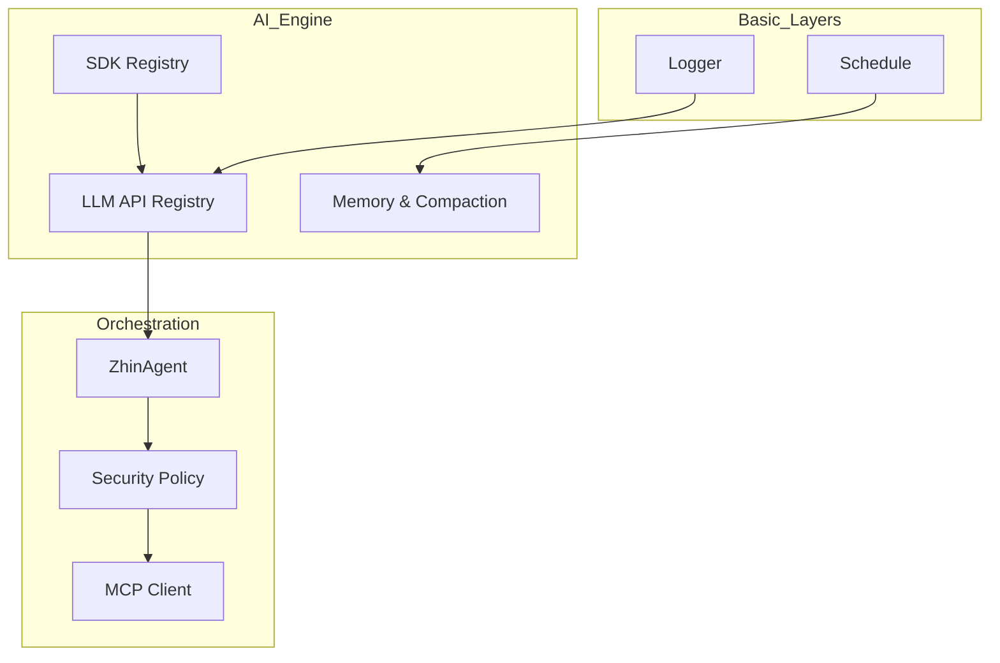
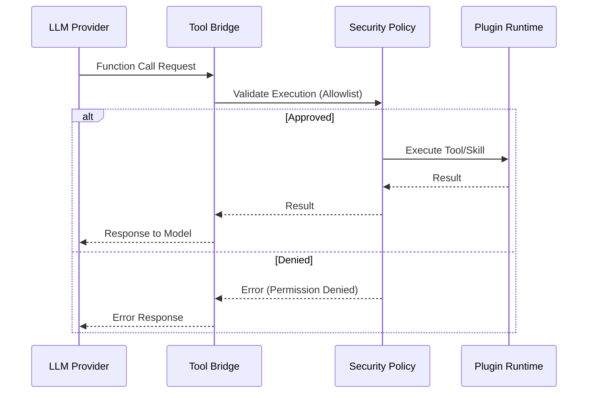

[英文原文](/en/wiki/cubic/ai-providers)

::: warning 第三方生成的参考快照
[Cubic 原页面](https://www.cubic.dev/wikis/zhinjs/zhin?page=page-ai-providers) · 抓取于 2026-09-23 · [源码提交](https://github.com/zhinjs/zhin/commit/368db14caa4aa91311fb090f07bd792fe4b22fe7)。本页由英文快照机器辅助翻译，尚未逐页与当前代码核验；实际开发请以[维护中的 Zhin 文档](/getting-started/)和[知识库勘误](/wiki/)为准。
:::

::: details 相关源文件

以下文件是 Cubic 生成本页时引用的上下文：

- [packages/im/ai/src/llm/index.ts](https://github.com/zhinjs/zhin/blob/368db14caa4aa91311fb090f07bd792fe4b22fe7/packages/im/ai/src/llm/index.ts)
- [packages/im/ai/src/llm/sdk-registry.ts](https://github.com/zhinjs/zhin/blob/368db14caa4aa91311fb090f07bd792fe4b22fe7/packages/im/ai/src/llm/sdk-registry.ts)
- [packages/im/ai/src/llm/tool-bridge.ts](https://github.com/zhinjs/zhin/blob/368db14caa4aa91311fb090f07bd792fe4b22fe7/packages/im/ai/src/llm/tool-bridge.ts)
- [README.md](https://github.com/zhinjs/zhin/blob/368db14caa4aa91311fb090f07bd792fe4b22fe7/README.md)
- [CLAUDE.md](https://github.com/zhinjs/zhin/blob/368db14caa4aa91311fb090f07bd792fe4b22fe7/CLAUDE.md)
- [AGENTS.md](https://github.com/zhinjs/zhin/blob/368db14caa4aa91311fb090f07bd792fe4b22fe7/AGENTS.md)
- [basic/cli/src/commands/setup.ts](https://github.com/zhinjs/zhin/blob/368db14caa4aa91311fb090f07bd792fe4b22fe7/basic/cli/src/commands/setup.ts)
- [packages/toolkit/scaffold-wizard/README.md](https://github.com/zhinjs/zhin/blob/368db14caa4aa91311fb090f07bd792fe4b22fe7/packages/toolkit/scaffold-wizard/README.md)
- [packages/toolkit/create-zhin/src/workspace.ts](https://github.com/zhinjs/zhin/blob/368db14caa4aa91311fb090f07bd792fe4b22fe7/packages/toolkit/create-zhin/src/workspace.ts)
:::

# LLM Provider 与 SDK 桥接

Zhin.js 实现了一种可选的 AI 架构，将核心即时通讯（IM）框架与大语言模型（LLM）处理过程解耦。该系统采用分层安装模型，其中 LLM 能力由 `@zhin.js/ai` 和 `@zhin.js/agent` 包提供，这些包将标准 AI SDK（如 Vercel AI SDK）桥接到 Zhin 插件运行时环境。

桥接机制将标准化的 Zhin 工具和技能定义转换为与外部 LLM 提供商兼容的格式。它确保无论底层模型或 SDK 如何，Agent 的执行始终受安全策略（如执行白名单和审批流程）的约束。

来源：[README.md:120-135](https://github.com/zhinjs/zhin/blob/368db14caa4aa91311fb090f07bd792fe4b22fe7/README.md#L120-L135), [CLAUDE.md:46-55](https://github.com/zhinjs/zhin/blob/368db14caa4aa91311fb090f07bd792fe4b22fe7/CLAUDE.md#L46-L55), [AGENTS.md:10-20](https://github.com/zhinjs/zhin/blob/368db14caa4aa91311fb090f07bd792fe4b22fe7/AGENTS.md#L10-L20)

## 架构与依赖层

AI引擎位于内核和工具层之上，位于IM核心和编排层之下。这种分层结构确保了底层服务（如日志记录和调度）可以被AI引擎使用，同时避免了循环依赖的问题。


### 关键AI组件
1. **AI引擎（`@zhin.js/ai`）**：负责提供者抽象、代理循环、模型注册表以及对话记忆管理。
2. **代理编排器（`@zhin.js/agent`）**：管理`ZhinAgent`实例，执行文件/网络/执行权限的安全策略，并提供MCP客户端支持。
3. **SDK注册中心**：作为中央枢纽，统一管理多个大语言模型SDK及模型提供者。
4. **工具桥接器**：将Zhin原生工具定义映射到大语言模型函数调用 schema。

来源：[CLAUDE.md:40-65](https://github.com/zhinjs/zhin/blob/368db14caa4aa91311fb090f07bd792fe4b22fe7/CLAUDE.md#L40-L65), [AGENTS.md:55-75](https://github.com/zhinjs/zhin/blob/368db14caa4aa91311fb090f07bd792fe4b22fe7/AGENTS.md#L55-L75), [README.md:95-105](https://github.com/zhinjs/zhin/blob/368db14caa4aa91311fb090f07bd792fe4b22fe7/README.md#L95-L105)

## LLM 提供商配置

提供商通过 `zhin.config.yml` 文件进行配置。Zhin.js 支持多个模型供应商，通过将各供应商的 SDK 统一集成到一个接口中实现。

### 配置结构

| 键 | 类型 | 描述 |
|-----|------|-------------|
| `ai.enabled` | 布尔值 | 启用 AI Agent 栈。 |
| `ai.providers` | 对象 | LLM SDK 配置字典（例如，openai、ollama）。 |
| `ai.agents` | 对象 | 命名代理配置，指定提供商和模型。 |
| `ai.agent.execSecurity` | 字符串 | 工具执行的安全模式（例如，`allowlist`）。 |
| `ai.agent.execApprovalMode` | 字符串 | 高风险工具的审批模式（例如，`ask`）。 |

### 提供商配置示例
```yaml
ai:
  enabled: true
  providers:
    openai-main:
      sdk: openai
      apiKey: ${AI_API_KEY}
  agents:
    zhin:
      provider: openai-main
      model: gpt-4o-mini
  agent:
    execSecurity: allowlist
    execApprovalMode: ask
```
来源：[README.md:143-160](https://github.com/zhinjs/zhin/blob/368db14caa4aa91311fb090f07bd792fe4b22fe7/README.md#L143-L160), [packages/toolkit/scaffold-wizard/README.md:25-35](https://github.com/zhinjs/zhin/blob/368db14caa4aa91311fb090f07bd792fe4b22fe7/packages/toolkit/scaffold-wizard/README.md#L25-L35), [basic/cli/src/commands/setup.ts:210-230](https://github.com/zhinjs/zhin/blob/368db14caa4aa91311fb090f07bd792fe4b22fe7/basic/cli/src/commands/setup.ts#L210-L230)

## SDK 代理与工具执行

桥接层使大语言模型能够通过统一的执行路径与 Zhin 能力（工具、技能和 MCP）进行交互。该执行路径在任何工具被调用前都会实施治理机制。


### 能力映射
*   **工具**：通过 `defineAgentTool` 定义，并在 `tools/` 目录中被发现。
*   **技能**：基于 Markdown 的能力包（`SKILL.md`），用于聚合工具和操作指令。
*   **MCP**：集成模型上下文协议（Model Context Protocol），为模型提供外部资源和工具。

来源：[AGENTS.md:145-160](https://github.com/zhinjs/zhin/blob/368db14caa4aa91311fb090f07bd792fe4b22fe7/AGENTS.md#L145-L160), [CLAUDE.md:200-220](https://github.com/zhinjs/zhin/blob/368db14caa4aa91311fb090f07bd792fe4b22fe7/CLAUDE.md#L200-L220), [README.md:80-90](https://github.com/zhinjs/zhin/blob/368db14caa4aa91311fb090f07bd792fe4b22fe7/README.md#L80-L90)

## 安装与分层

为保持核心组件的轻量化，AI 和 LLM SDK 作为同级依赖项，需手动显式安装。

| 分层 | 包要求 | 用途 |
|------|--------|------|
| **IM 核心** | `zhin.js` | 基础机器人消息传递和指令处理。 |
| **AI Agent** | `@zhin.js/agent`, `zod`, `ai` | 任务编排、安全性和记忆管理。 |
| **Provider** | `@ai-sdk/openai`（或其他） | 与特定 LLM 供应商的通信。 |
| **MCP** | `@modelcontextprotocol/sdk` | 外部上下文和协议支持。 |

来源：[README.md:120-135](https://github.com/zhinjs/zhin/blob/368db14caa4aa91311fb090f07bd792fe4b22fe7/README.md#L120-L135), [AGENTS.md:95-105](https://github.com/zhinjs/zhin/blob/368db14caa4aa91311fb090f07bd792fe4b22fe7/AGENTS.md#L95-L105), [packages/toolkit/create-zhin/src/workspace.ts:110-130](https://github.com/zhinjs/zhin/blob/368db14caa4aa91311fb090f07bd792fe4b22fe7/packages/toolkit/create-zhin/src/workspace.ts#L110-L130)

## 结论

LLM 服务提供商与 SDK 适配层是连接 Zhin 插件系统与现代 AI 能力的关键枢纽。通过将 SDK 特有的逻辑封装到注册中心，并通过安全策略面桥接工具，Zhin.js 为 AI 助手提供了安全可控的环境，使其能够安全地与多渠道聊天平台进行交互。

来源：[README.md:107-115](https://github.com/zhinjs/zhin/blob/368db14caa4aa91311fb090f07bd792fe4b22fe7/README.md#L107-L115), [AGENTS.md:230-245](https://github.com/zhinjs/zhin/blob/368db14caa4aa91311fb090f07bd792fe4b22fe7/AGENTS.md#L230-L245)
