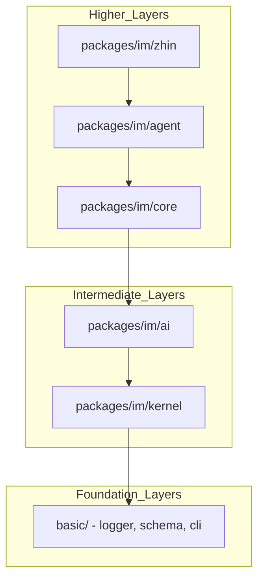
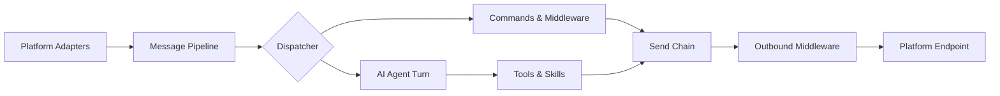

[英文原文](/en/wiki/cubic/arch-core)

::: warning 第三方生成的参考快照
[Cubic 原页面](https://www.cubic.dev/wikis/zhinjs/zhin?page=page-arch-core) · 抓取于 2026-09-23 · [源码提交](https://github.com/zhinjs/zhin/commit/368db14caa4aa91311fb090f07bd792fe4b22fe7)。本页由英文快照机器辅助翻译，尚未逐页与当前代码核验；实际开发请以[维护中的 Zhin 文档](/getting-started/)和[知识库勘误](/wiki/)为准。
:::

::: details 相关源文件

以下文件是 Cubic 生成本页时引用的上下文：

- [CLAUDE.md](https://github.com/zhinjs/zhin/blob/368db14caa4aa91311fb090f07bd792fe4b22fe7/CLAUDE.md)
- [AGENTS.md](https://github.com/zhinjs/zhin/blob/368db14caa4aa91311fb090f07bd792fe4b22fe7/AGENTS.md)
- [README.md](https://github.com/zhinjs/zhin/blob/368db14caa4aa91311fb090f07bd792fe4b22fe7/README.md)
- [packages/toolkit/create-zhin/README.md](https://github.com/zhinjs/zhin/blob/368db14caa4aa91311fb090f07bd792fe4b22fe7/packages/toolkit/create-zhin/README.md)
- [packages/toolkit/scaffold-wizard/README.md](https://github.com/zhinjs/zhin/blob/368db14caa4aa91311fb090f07bd792fe4b22fe7/packages/toolkit/scaffold-wizard/README.md)
- [packages/toolkit/create-zhin/src/workspace.ts](https://github.com/zhinjs/zhin/blob/368db14caa4aa91311fb090f07bd792fe4b22fe7/packages/toolkit/create-zhin/src/workspace.ts)
- [basic/cli/src/commands/setup.ts](https://github.com/zhinjs/zhin/blob/368db14caa4aa91311fb090f07bd792fe4b22fe7/basic/cli/src/commands/setup.ts)
:::

# 系统架构与分层

Zhin.js 将其功能组织为一个多平台、基于人工智能的聊天机器人框架，使用 TypeScript 开发。该系统采用由 **pnpm workspaces** 和 **Turborepo** 管理的Monorepo结构，以在各个功能层之间强制实施严格的依赖边界。

来源：[CLAUDE.md:16-24](https://github.com/zhinjs/zhin/blob/368db14caa4aa91311fb090f07bd792fe4b22fe7/CLAUDE.md#L16-L24), [README.md:13-20](https://github.com/zhinjs/zhin/blob/368db14caa4aa91311fb090f07bd792fe4b22fe7/README.md#L13-L20)

## 依赖层

Zhin.js 的架构遵循从底层到顶层的严格依赖层级。底层层提供基础服务，且不得导入上层层的内容。这一限制确保了系统的稳定性，并防止了循环依赖的发生。


图表展示了从高层编排到基础工具的单向依赖流。

### 层级说明

| 层级 | 包路径 | 角色与职责 |
| :--- | :--- | :--- |
| **基础层** | `basic/` | 提供日志记录、模式验证、数据库驱动以及 CLI 基础组件。 |
| **内核层** | `packages/im/kernel` | 负责任务调度、身份管理以及错误层级处理。 |
| **AI 引擎** | `packages/im/ai` | 管理模型提供商、代理（Agent）、内存压缩以及成本追踪。 |
| **核心层** | `packages/im/core` | 定义 IM 运行时、消息合约以及交互渲染机制。 |
| **代理层** | `packages/im/agent` | 统筹 ZhinAgent、安全策略以及 MCP 客户端。 |
| **主入口层** | `packages/im/zhin` | 组装标准的 IM 运行时；作为用户直接交互的入口点。 |

来源：[CLAUDE.md:41-71](https://github.com/zhinjs/zhin/blob/368db14caa4aa91311fb090f07bd792fe4b22fe7/CLAUDE.md#L41-L71), [AGENTS.md:57-75](https://github.com/zhinjs/zhin/blob/368db14caa4aa91311fb090f07bd792fe4b22fe7/AGENTS.md#L57-L75)

## 消息流水线架构

Zhin.js 通过标准化流水线处理消息。该流水线将平台特定的入站事件转换为标准的内部消息格式，随后与命令、中间件或 AI Agent 进行交互。


该图展示了消息如何从入站适配器经过处理逻辑，最终传递到出站发送链路。

### 出站发送链路约束
所有出站消息都必须遵循统一的发送链路。开发者必须使用 `Message.$reply` 或 `Adapter.sendMessage`。系统随后会将这些消息通过 `OutboundRenderer` 及出站中间件处理，最终送达平台 `Endpoint`。禁止绕过此链路，以确保消息渲染和日志记录的一致性。

来源：[README.md:53-73](https://github.com/zhinjs/zhin/blob/368db14caa4aa91311fb090f07bd792fe4b22fe7/README.md#L53-L73), [CLAUDE.md:73-76](https://github.com/zhinjs/zhin/blob/368db14caa4aa91311fb090f07bd792fe4b22fe7/CLAUDE.md#L73-L76)

## 插件系统与功能发现

插件运行时是扩展框架的唯一入口路径。Zhin.js 采用基于约定的发现机制，通过特定目录加载能力，而非通过显式注册方式。

### 插件定义
插件必须在 `plugin.ts` 文件中默认导出一个 `definePlugin()` 定义。如果缺少此导出，`PluginScopeAssembler` 将抛出错误。

```typescript
// Example plugin structure
import { definePlugin } from 'zhin.js';

export default definePlugin({
  name: 'my-plugin',
  setup(context) {
    // Lifecycle and resource provisioning
    return () => cleanup();
  },
});
```
来源：[CLAUDE.md:81-93](https://github.com/zhinjs/zhin/blob/368db14caa4aa91311fb090f07bd792fe4b22fe7/CLAUDE.md#L81-L93), [packages/toolkit/create-zhin/src/workspace.ts:257-264](https://github.com/zhinjs/zhin/blob/368db14caa4aa91311fb090f07bd792fe4b22fe7/packages/toolkit/create-zhin/src/workspace.ts#L257-L264)

### 目录约定
框架会根据插件内部文件路径自动发现功能：

| 目录 | 功能类型 | 开发 API |
| :--- | :--- | :--- |
| `commands/` | 机器人命令 | `defineCommand()` |
| `middlewares/` | 消息过滤器 | `defineMiddleware()` |
| `handlers/` | 事件监听器 | `defineHandler()` |
| `tools/` | AI Agent 工具 | `defineAgentTool()` |
| `skills/` | AI 工作流 | `SKILL.md`（Markdown） |
| `pages/` | 控制台 UI | `definePage()` |

来源：[CLAUDE.md:95-108](https://github.com/zhinjs/zhin/blob/368db14caa4aa91311fb090f07bd792fe4b22fe7/CLAUDE.md#L95-L108), [AGENTS.md:104-108](https://github.com/zhinjs/zhin/blob/368db14caa4aa91311fb090f07bd792fe4b22fe7/AGENTS.md#L104-L108)

## 项目初始化与配置

该架构支持全新项目创建和逐步配置，通过共享工具实现。

- **create-zhin-app**：生成初始的工作区文件结构，并管理 pnpm 工作区的配置。
- **scaffold-wizard**：一个被创建工具和 CLI `setup` 命令共同使用的共享库，用于处理数据库、适配器和 AI 提供商的交互式提示。
- **生成生命周期**：插件更新通过“生成”事务管理的热重载实现。下一批插件树将离线准备，并原子化发布，以确保更新失败不会导致当前运行时崩溃。

来源：[packages/toolkit/create-zhin/README.md:105-115](https://github.com/zhinjs/zhin/blob/368db14caa4aa91311fb090f07bd792fe4b22fe7/packages/toolkit/create-zhin/README.md#L105-L115), [packages/toolkit/scaffold-wizard/README.md:5-15](https://github.com/zhinjs/zhin/blob/368db14caa4aa91311fb090f07bd792fe4b22fe7/packages/toolkit/scaffold-wizard/README.md#L5-L15), [README.md:96-105](https://github.com/zhinjs/zhin/blob/368db14caa4aa91311fb090f07bd792fe4b22fe7/README.md#L96-L105)

## 架构安全机制

该框架采用“控制工程”来确保架构完整性：
1. **架构检查**：`pnpm check:architecture` 验证依赖关系的方向是否被正确遵守。
2. **发送链强制执行**：`pnpm check:harness-paths` 检测插件是否尝试绕过标准的 `Adapter.sendMessage` 路径。
3. **API 限制**：`check:no-removed-plugin-api` 阻止使用已废弃或删除的 API，如 `zhin.js/node`。

来源：[CLAUDE.md:31-40](https://github.com/zhinjs/zhin/blob/368db14caa4aa91311fb090f07bd792fe4b22fe7/CLAUDE.md#L31-L40), [AGENTS.md:120-130](https://github.com/zhinjs/zhin/blob/368db14caa4aa91311fb090f07bd792fe4b22fe7/AGENTS.md#L120-L130)

Zhin.js 架构强调基础 IM 框架与可选的 AI Agent 模块之间的清晰分离。通过强制实施分层设计和基于约定的特性发现机制，系统在开发和生产环境中均能保持高度的可操作性和安全性。
