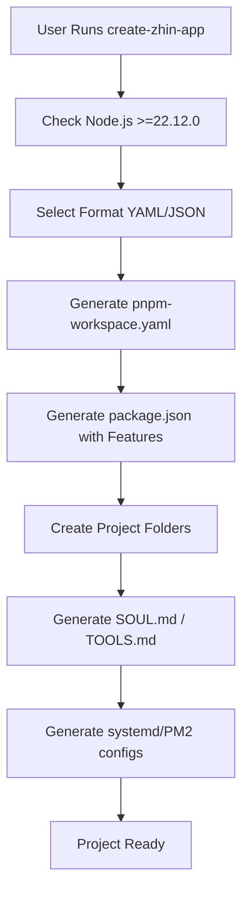
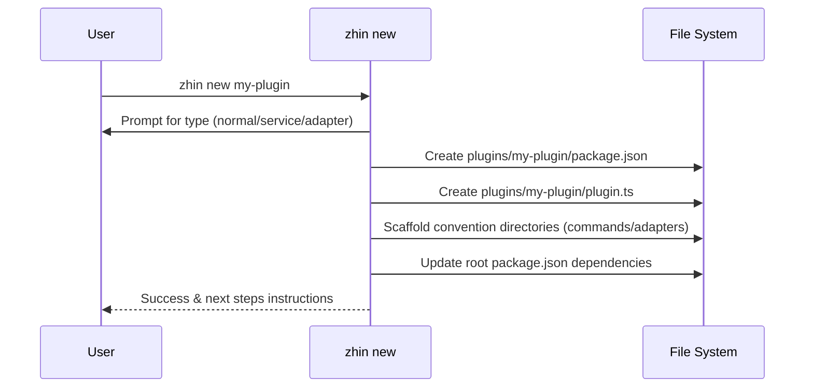

[英文原文](/en/wiki/cubic/cli-tools)

::: warning 第三方生成的参考快照
[Cubic 原页面](https://www.cubic.dev/wikis/zhinjs/zhin?page=page-cli-tools) · 抓取于 2026-09-23 · [源码提交](https://github.com/zhinjs/zhin/commit/368db14caa4aa91311fb090f07bd792fe4b22fe7)。本页由英文快照机器辅助翻译，尚未逐页与当前代码核验；实际开发请以[维护中的 Zhin 文档](/getting-started/)和[资料存档勘误](/wiki/archive)为准。
:::

::: details 相关源文件

以下文件是 Cubic 生成本页时引用的上下文：

- [basic/cli/src/commands/new.ts](https://github.com/zhinjs/zhin/blob/368db14caa4aa91311fb090f07bd792fe4b22fe7/basic/cli/src/commands/new.ts)
- [basic/cli/src/commands/migrate.ts](https://github.com/zhinjs/zhin/blob/368db14caa4aa91311fb090f07bd792fe4b22fe7/basic/cli/src/commands/migrate.ts)
- [basic/cli/src/commands/setup.ts](https://github.com/zhinjs/zhin/blob/368db14caa4aa91311fb090f07bd792fe4b22fe7/basic/cli/src/commands/setup.ts)
- [packages/toolkit/create-zhin/src/workspace.ts](https://github.com/zhinjs/zhin/blob/368db14caa4aa91311fb090f07bd792fe4b22fe7/packages/toolkit/create-zhin/src/workspace.ts)
- [packages/toolkit/create-zhin/README.md](https://github.com/zhinjs/zhin/blob/368db14caa4aa91311fb090f07bd792fe4b22fe7/packages/toolkit/create-zhin/README.md)
- [README.md](https://github.com/zhinjs/zhin/blob/368db14caa4aa91311fb090f07bd792fe4b22fe7/README.md)
- [CLAUDE.md](https://github.com/zhinjs/zhin/blob/368db14caa4aa91311fb090f07bd792fe4b22fe7/CLAUDE.md)
:::

# CLI 命令与工具

Zhin.js 提供了一套命令行工具，用于管理机器人项目的全生命周期，从初始搭建到维护和环境诊断。该工具链以 `@zhin.js/cli` 包和 `create-zhin-app` 初始化器为核心，强制实施 **插件运行时** 架构和项目规范。

## 核心工具概览

CLI 是开发者与 Zhin 框架交互的主要接口，负责项目初始化、插件搭建、交互式配置以及旧版项目的迁移。

| 命令 | 工具 / 包 | 描述 |
|:---|:---|:---|
| `npm create zhin-app` | `create-zhin-app` | 初始化一个新项目，使用标准目录结构，并配置 pnpm 项目工作区。 |
| `zhin new` | `@zhin.js/cli` | 在现有项目中搭建新的插件、服务或适配器。 |
| `zhin setup` | `@zhin.js/cli` | 提供交互式向导，用于配置数据库、AI 服务提供商和适配器。 |
| `zhin migrate` | `@zhin.js/cli` | 将旧版 Zhin 项目升级至最新的插件运行时标准。 |
| `zhin doctor` | `@zhin.js/cli` | 执行环境诊断，识别项目健康问题。 |
| `zhin runtime start` | `@zhin.js/runtime` | 启动 Zhin 机器人实例的主要入口点。 |

来源：[README.md:144-150](https://github.com/zhinjs/zhin/blob/368db14caa4aa91311fb090f07bd792fe4b22fe7/README.md#L144-L150), [packages/toolkit/create-zhin/README.md:121-128](https://github.com/zhinjs/zhin/blob/368db14caa4aa91311fb090f07bd792fe4b22fe7/packages/toolkit/create-zhin/README.md#L121-L128)

## 项目初始化与工作区搭建

`create-zhin-app` 工具生成标准化的 pnpm 工作区。该结构将根级机器人逻辑、本地插件和共享功能进行分离。

### 工作区结构生成
当你运行初始化器时，`createWorkspace` 函数将执行以下操作：
1.  **环境检测**：验证 Node.js 版本是否满足 `>=22.12.0` 要求。
2.  **文件目录创建**：生成 `commands`、`components`、`middlewares`、`tools`、`skills` 和 `agents` 目录。
3.  **依赖解析**：根据用户选择注入必要的包，如 `@zhin.js/core` 以及特定适配器。
4.  **配置文件生成**：创建 `zhin.config.yml`（或 JSON）和 `.env` 文件。
5.  **服务部署**：为生产环境生成 systemd、launchd 和 PM2 配置文件。

来源：[packages/toolkit/create-zhin/src/workspace.ts:110-385](https://github.com/zhinjs/zhin/blob/368db14caa4aa91311fb090f07bd792fe4b22fe7/packages/toolkit/create-zhin/src/workspace.ts#L110-L385), [packages/toolkit/create-zhin/README.md:162-185](https://github.com/zhinjs/zhin/blob/368db14caa4aa91311fb090f07bd792fe4b22fe7/packages/toolkit/create-zhin/README.md#L162-L185)

图表展示了工作区创建者为确保项目准备就绪以进行开发和部署而采取的逐步操作。来源：[packages/toolkit/create-zhin/src/workspace.ts:110-385](https://github.com/zhinjs/zhin/blob/368db14caa4aa91311fb090f07bd792fe4b22fe7/packages/toolkit/create-zhin/src/workspace.ts#L110-L385)

## 插件骨架生成（`zhin new`）

`zhin new` 命令实现了 `newCommand` 逻辑，用于在 `plugins/` 目录中生成单个插件包。

### 插件类型
开发者可以选择三种主要模板：
*   **普通插件**：包含一个带有动态段的示例命令（例如：`commands/echo/[text]/index.ts`）。
*   **服务插件**：配置一个 `plugin.ts` 入口，并通过 `context.lifecycle.add` 实现生命周期管理。
*   **适配器插件**：提供一个完整的自定义平台适配器骨架，包含 `Endpoint` 和 `Client` 类。

### 自动集成
在创建插件文件后，CLI 会自动更新根目录的 `package.json`，将其加入到 `dependencies` 中（使用 `workspace:*`），并提供通过 `zhin.plugins` 数组挂载插件的说明。

来源：[basic/cli/src/commands/new.ts:50-137](https://github.com/zhinjs/zhin/blob/368db14caa4aa91311fb090f07bd792fe4b22fe7/basic/cli/src/commands/new.ts#L50-L137)

序列图展示了用户与CLI在插件创建过程中的交互。来源：[basic/cli/src/commands/new.ts:50-137](https://github.com/zhinjs/zhin/blob/368db14caa4aa91311fb090f07bd792fe4b22fe7/basic/cli/src/commands/new.ts#L50-L137)

## 交互式配置向导

`zhin setup` 命令利用 `@zhin.js/scaffold-wizard` 提供逐步配置体验，并支持对现有项目进行增量式更新。

### 配置功能
*   **数据库**：支持 SQLite、MySQL、PostgreSQL、MongoDB 和 Redis。
*   **适配器**：可连接 Telegram、Discord 和 QQ 官方等平台。
*   **AI**：配置提供商（如 OpenAI）、模型及执行安全策略。
*   **启动配置**：生成 AI 人格和指令文件（`SOUL.md`、`TOOLS.md`、`AGENTS.md`）。
来源：[basic/cli/src/commands/setup.ts:145-215](https://github.com/zhinjs/zhin/blob/368db14caa4aa91311fb090f07bd792fe4b22fe7/basic/cli/src/commands/setup.ts#L145-L215)

### AI 启动模板
如果使用了 `--bootstrap` 标志，CLI 将生成标准模板以指导 AI 的行为：
*   **SOUL.md**：定义人格特质，强调行动而非讨论。
*   **TOOLS.md**：提供工具使用的准则，例如在激活后立即调用已声明的工具。
*   **AGENTS.md**：管理长期记忆、用户偏好和任务列表。

来源：[basic/cli/src/commands/setup.ts:18-125](https://github.com/zhinjs/zhin/blob/368db14caa4aa91311fb090f07bd792fe4b22fe7/basic/cli/src/commands/setup.ts#L18-L125), [packages/toolkit/create-zhin/src/workspace.ts:192-200](https://github.com/zhinjs/zhin/blob/368db14caa4aa91311fb090f07bd792fe4b22fe7/packages/toolkit/create-zhin/src/workspace.ts#L192-L200)

## 迁移与维护

`zhin migrate` 命令可自动将项目从旧版结构迁移到现代的插件运行时。

### 迁移逻辑
1. **依赖更新**：将 `zhin` 和 `@zhin.js/*` 版本替换为 `latest`。
2. **脚本标准化**：将旧版脚本（如 `zhin dev`）替换为 `zhin runtime start`。
3. **模板现代化**：检测到 `SOUL.md` 或 `AGENTS.md` 中的旧中文模板，并将其替换为新的英文语言、以动作为导向的模板，同时保留用户数据。
4. **结构验证**：确保 `data/`、`plugins/` 和 `src/plugins/` 目录的存在。

来源：[basic/cli/src/commands/migrate.ts:70-200](https://github.com/zhinjs/zhin/blob/368db14caa4aa91311fb090f07bd792fe4b22fe7/basic/cli/src/commands/migrate.ts#L70-L200)

### 诊断工具
`zhin doctor` 命令用于执行环境检查，以确保系统满足 Zhin 的要求。这包括验证 Node.js 版本、检查缺失的依赖项以及验证配置文件的完整性。

来源：[README.md:144-150](https://github.com/zhinjs/zhin/blob/368db14caa4aa91311fb090f07bd792fe4b22fe7/README.md#L144-L150)

## 维护工具与辅助检查

对于直接在 Zhin 代码库中进行开发的开发者，`CLAUDE.md` 定义了若干“辅助检查”以确保代码质量与架构完整性。

| 检查命令 | 用途 |
|:---|:---|
| `pnpm check:architecture` | 强制执行单向依赖流（基本层 → 核心层 → AI 层 → 核心层 → Agent → Zhin）。 |
| `pnpm check:harness-paths` | 检测插件是否尝试绕过 `Adapter.sendMessage` 依赖链。 |
| `pnpm check:no-removed-plugin-api` | 禁止使用已删除的旧版 API，如 `usePlugin()`。 |
| `pnpm check:plugin-capability-publish` | 确保插件在发布前包含必要的能力目录和 README 文件。 |

来源：[CLAUDE.md:27-40](https://github.com/zhinjs/zhin/blob/368db14caa4aa91311fb090f07bd792fe4b22fe7/CLAUDE.md#L27-L40)

Zhin的CLI和工具链生态系统为机器人开发提供了高度结构化的环境，确保新项目和旧项目均符合现代安全、热重载和多平台支持的标准。
