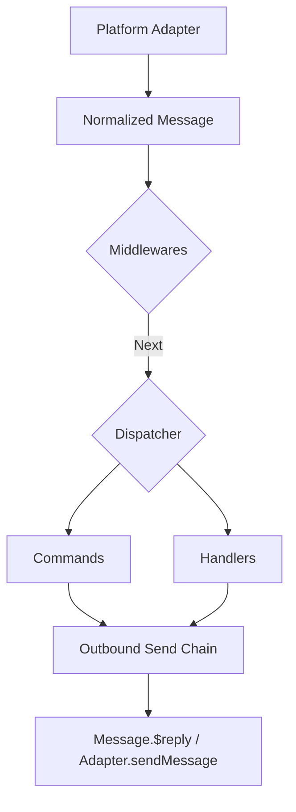

[英文原文](/en/wiki/cubic/commands)

::: warning 第三方生成的参考快照
[Cubic 原页面](https://www.cubic.dev/wikis/zhinjs/zhin?page=page-commands) · 抓取于 2026-09-23 · [源码提交](https://github.com/zhinjs/zhin/commit/368db14caa4aa91311fb090f07bd792fe4b22fe7)。本页由英文快照机器辅助翻译，尚未逐页与当前代码核验；实际开发请以[维护中的 Zhin 文档](/getting-started/)和[资料存档勘误](/wiki/archive)为准。
:::

::: danger 已确认勘误
命令使用以 `index.ts` 结尾的路由目录；Handler 使用一个具名目录，例如 `handlers/message-receive/index.ts`，并显式声明 `event: 'message.receive'`。下文嵌套 Handler 文件示例不受支持。参见[约定目录](/authoring/conventions)。
:::

::: details 相关源文件

以下文件是 Cubic 生成本页时引用的上下文：

- [packages/im/command/src/index.ts](https://github.com/zhinjs/zhin/blob/368db14caa4aa91311fb090f07bd792fe4b22fe7/packages/im/command/src/index.ts)
- [packages/im/middleware/src/index.ts](https://github.com/zhinjs/zhin/blob/368db14caa4aa91311fb090f07bd792fe4b22fe7/packages/im/middleware/src/index.ts)
- [packages/im/handler/src/index.ts](https://github.com/zhinjs/zhin/blob/368db14caa4aa91311fb090f07bd792fe4b22fe7/packages/im/handler/src/index.ts)
- [CLAUDE.md](https://github.com/zhinjs/zhin/blob/368db14caa4aa91311fb090f07bd792fe4b22fe7/CLAUDE.md)
- [README.md](https://github.com/zhinjs/zhin/blob/368db14caa4aa91311fb090f07bd792fe4b22fe7/README.md)
- [packages/toolkit/create-zhin/template/skills/plugin-develop/SKILL.md](https://github.com/zhinjs/zhin/blob/368db14caa4aa91311fb090f07bd792fe4b22fe7/packages/toolkit/create-zhin/template/skills/plugin-develop/SKILL.md)
- [packages/toolkit/create-zhin/template/skills/plugin-init/SKILL.md](https://github.com/zhinjs/zhin/blob/368db14caa4aa91311fb090f07bd792fe4b22fe7/packages/toolkit/create-zhin/template/skills/plugin-init/SKILL.md)
- [basic/cli/src/commands/new.ts](https://github.com/zhinjs/zhin/blob/368db14caa4aa91311fb090f07bd792fe4b22fe7/basic/cli/src/commands/new.ts)
:::

# 命令、Handler 与中间件

命令、处理器和中间件代表了 Zhin.js 插件系统中的主要交互层。它们处理来自平台适配器的标准化消息流，使开发者能够构建从结构化命令执行到低级别消息拦截的交互式聊天机器人功能。来源：[README.md](https://github.com/zhinjs/zhin/blob/368db14caa4aa91311fb090f07bd792fe4b22fe7/README.md)，[CLAUDE.md](https://github.com/zhinjs/zhin/blob/368db14caa4aa91311fb090f07bd792fe4b22fe7/CLAUDE.md)

该框架采用约定优于配置的目录结构来实现能力发现。当插件被放置在特定目录（如 `commands/`、`middlewares/` 和 `handlers/`）时，插件运行时会自动识别这些功能。来源：[packages/toolkit/create-zhin/template/skills/plugin-init/SKILL.md](https://github.com/zhinjs/zhin/blob/368db14caa4aa91311fb090f07bd792fe4b22fe7/packages/toolkit/create-zhin/template/skills/plugin-init/SKILL.md)

## 消息处理流程

入站消息管道将数据引导通过多个处理阶段。消息源自平台适配器，经过中间件链路处理，最终与特定的命令或处理器进行匹配。来源：[README.md](https://github.com/zhinjs/zhin/blob/368db14caa4aa91311fb090f07bd792fe4b22fe7/README.md)


此图展示了从平台入站事件到出站回复的顺序流程。来源：[README.md](https://github.com/zhinjs/zhin/blob/368db14caa4aa91311fb090f07bd792fe4b22fe7/README.md)，[CLAUDE.md](https://github.com/zhinjs/zhin/blob/368db14caa4aa91311fb090f07bd792fe4b22fe7/CLAUDE.md)

## 命令

命令提供了一种结构化的方式来处理特定的用户指令。它们通过 `defineCommand()` API 定义，并从插件包的 `commands/` 目录中发现。来源：[packages/toolkit/create-zhin/template/skills/plugin-develop/SKILL.md](https://github.com/zhinjs/zhin/blob/368db14caa4aa91311fb090f07bd792fe4b22fe7/packages/toolkit/create-zhin/template/skills/plugin-develop/SKILL.md)

### 结构与发现
- **目录路径作为路由**：`commands/` 文件夹内的文件路径决定了命令名称或路由。来源：[packages/toolkit/create-zhin/template/skills/plugin-init/SKILL.md](https://github.com/zhinjs/zhin/blob/368db14caa4aa91311fb090f07bd792fe4b22fe7/packages/toolkit/create-zhin/template/skills/plugin-init/SKILL.md)
- **Next.js 风格的动态段**：使用 `[name].ts` 表示必需参数，`[[name]].ts` 表示可选参数，`[...name].ts` 表示通配参数。来源：[CLAUDE.md:120-125](https://github.com/zhinjs/zhin/blob/368db14caa4aa91311fb090f07bd792fe4b22fe7/CLAUDE.md#L120-L125)
- **参数和参数值**：参数类型和默认值在 `defineCommand` 配置的 `params` 属性中声明。来源：[basic/cli/src/commands/new.ts:390-410](https://github.com/zhinjs/zhin/blob/368db14caa4aa91311fb090f07bd792fe4b22fe7/basic/cli/src/commands/new.ts#L390-L410)

### defineCommand 的关键组件

| 属性 | 类型 | 描述 |
| :--- | :--- | :--- |
| `description` | `string` | 对命令的可读性说明。 |
| `params` | `Record<string, ParameterDefinition>` | 定义从动态段中提取的带类型参数。 |
| `execute` | `Function` | 命令匹配时执行的核心逻辑。 |

来源：[packages/toolkit/create-zhin/template/skills/plugin-develop/SKILL.md](https://github.com/zhinjs/zhin/blob/368db14caa4aa91311fb090f07bd792fe4b22fe7/packages/toolkit/create-zhin/template/skills/plugin-develop/SKILL.md), [basic/cli/src/commands/new.ts:400](https://github.com/zhinjs/zhin/blob/368db14caa4aa91311fb090f07bd792fe4b22fe7/basic/cli/src/commands/new.ts#L400)

```typescript
// Example: commands/greet/[name]/index.ts
import { defineCommand } from 'zhin.js/command';

export default defineCommand({
  description: 'Greet a user',
  params: {
    name: { type: 'string', description: 'User name' },
  },
  execute({ params }) {
    return `Hello, ${params.name}!`;
  },
});
```
来源：[packages/toolkit/create-zhin/template/skills/plugin-develop/SKILL.md:65-75](https://github.com/zhinjs/zhin/blob/368db14caa4aa91311fb090f07bd792fe4b22fe7/packages/toolkit/create-zhin/template/skills/plugin-develop/SKILL.md#L65-L75)

## 中间件

中间件在消息到达命令或处理器之前进行拦截。它们通过 `defineMiddleware()` 定义，并放置在 `middlewares/` 目录中。来源：[packages/toolkit/create-zhin/template/skills/plugin-init/SKILL.md](https://github.com/zhinjs/zhin/blob/368db14caa4aa91311fb090f07bd792fe4b22fe7/packages/toolkit/create-zhin/template/skills/plugin-init/SKILL.md)

### 中间件链
中间件遵循洋葱式执行模式：
1. 它们接收消息上下文和一个 `next()` 函数。
2. 如果调用 `next()`，流程将继续到下一个中间件或调度器。
3. 如果未调用 `next()`，消息将被拦截并停止处理。

来源：[packages/im/middleware/src/index.ts](https://github.com/zhinjs/zhin/blob/368db14caa4aa91311fb090f07bd792fe4b22fe7/packages/im/middleware/src/index.ts), [README.zh-CN.md](https://github.com/zhinjs/zhin/blob/368db14caa4aa91311fb090f07bd792fe4b22fe7/README.zh-CN.md)

## 处理器

处理器管理基于事件的交互，通常用于比严格命令更灵活的消息处理。处理器使用 `defineHandler()` 定义，并存储在 `handlers/` 目录中。来源：[CLAUDE.md:120-125](https://github.com/zhinjs/zhin/blob/368db14caa4aa91311fb090f07bd792fe4b22fe7/CLAUDE.md#L120-L125)

### 事件映射
处理器的目录路径映射到本地事件名称。例如，位于 `handlers/message/receive.ts` 的文件如果在定义中未指定事件名称，则会响应 `message.receive` 事件。来源：[CLAUDE.md:123](https://github.com/zhinjs/zhin/blob/368db14caa4aa91311fb090f07bd792fe4b22fe7/CLAUDE.md#L123)

### 能力特性
- **提示支持**：处理器中可用 `this.prompt` API，以支持多轮交互。来源：[CLAUDE.md:124](https://github.com/zhinjs/zhin/blob/368db14caa4aa91311fb090f07bd792fe4b22fe7/CLAUDE.md#L124)
- **事件过滤**：处理器可以监听特定的生命周期或平台事件，而不仅仅是文本消息。来源：[packages/im/handler/src/index.ts](https://github.com/zhinjs/zhin/blob/368db14caa4aa91311fb090f07bd792fe4b22fe7/packages/im/handler/src/index.ts)

## 能力对比

| 特性 | 命令 | 处理器 | 中间件 |
| :--- | :--- | :--- | :--- |
| **发现机制** | `commands/` | `handlers/` | `middlewares/` |
| **触发方式** | 文本模式匹配 | 事件发射 | 每条入站消息 |
| **路由来源** | 文件路径/名称 | 事件名称 | 顺序处理 |
| **异步支持** | 是 | 是 | 是 |
| **主要用途** | 处理用户意图 | 事件编排 | 全局拦截/过滤 |

来源：[CLAUDE.md:120-125](https://github.com/zhinjs/zhin/blob/368db14caa4aa91311fb090f07bd792fe4b22fe7/CLAUDE.md#L120-L125), [packages/toolkit/create-zhin/template/skills/plugin-init/SKILL.md](https://github.com/zhinjs/zhin/blob/368db14caa4aa91311fb090f07bd792fe4b22fe7/packages/toolkit/create-zhin/template/skills/plugin-init/SKILL.md)

## 实现约束

开发人员在实现这些功能时必须遵守特定的架构约束：
- **禁止直接发送绕过**：所有出站通信必须通过 `Message.$reply` 或平台 `Endpoint` 发送链路进行。来源：[CLAUDE.md:85-88](https://github.com/zhinjs/zhin/blob/368db14caa4aa91311fb090f07bd792fe4b22fe7/CLAUDE.md#L85-L88)，[AGENTS.md:162-165](https://github.com/zhinjs/zhin/blob/368db14caa4aa91311fb090f07bd792fe4b22fe7/AGENTS.md#L162-L165)
- **本地导入需带 .js 扩展名**：在命令或中间件中导入本地文件的 TypeScript 模块必须包含 `.js` 扩展名。来源：[CLAUDE.md:158](https://github.com/zhinjs/zhin/blob/368db14caa4aa91311fb090f07bd792fe4b22fe7/CLAUDE.md#L158)
- **默认导出**：所有位于约定目录中的文件必须使用与之对应的 `define*` 函数结果的 `default export`。来源：[packages/toolkit/create-zhin/template/skills/plugin-init/SKILL.md](https://github.com/zhinjs/zhin/blob/368db14caa4aa91311fb090f07bd792fe4b22fe7/packages/toolkit/create-zhin/template/skills/plugin-init/SKILL.md)

## 概述

命令、处理器和中间件构成了 Zhin.js 交互模型的核心。命令为用户任务提供了结构化且参数感知的入口点，处理器支持灵活的事件驱动逻辑，而中间件则提供全局的消息过滤与转换流水线。通过遵循项目的目录约定并使用提供的 `define*` API，开发人员可以构建模块化且支持热重载的机器人能力。来源：[README.md](https://github.com/zhinjs/zhin/blob/368db14caa4aa91311fb090f07bd792fe4b22fe7/README.md)，[CLAUDE.md](https://github.com/zhinjs/zhin/blob/368db14caa4aa91311fb090f07bd792fe4b22fe7/CLAUDE.md)
