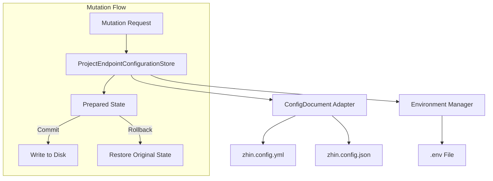
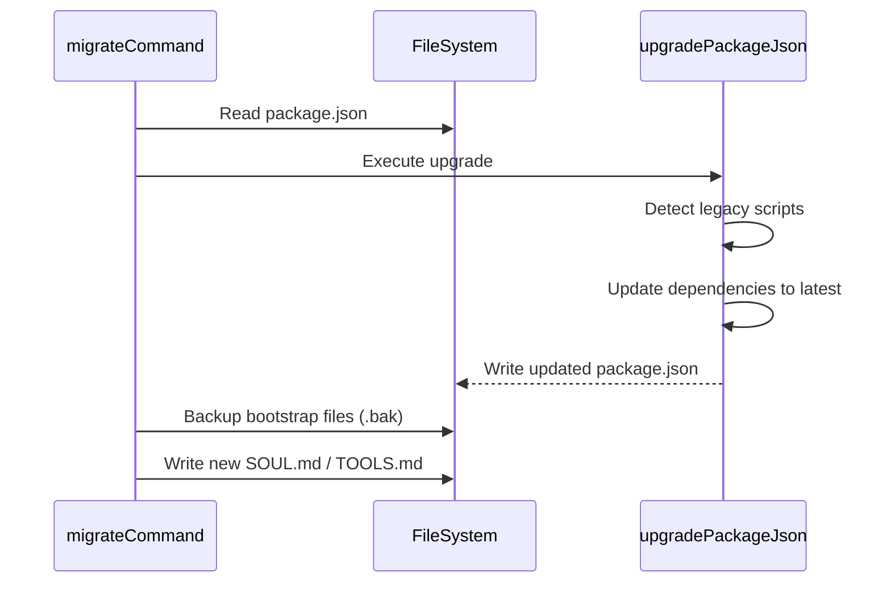

[英文原文](/en/wiki/cubic/config)

::: warning 第三方生成的参考快照
[Cubic 原页面](https://www.cubic.dev/wikis/zhinjs/zhin?page=page-config) · 抓取于 2026-09-23 · [源码提交](https://github.com/zhinjs/zhin/commit/368db14caa4aa91311fb090f07bd792fe4b22fe7)。本页由英文快照机器辅助翻译，尚未逐页与当前代码核验；实际开发请以[维护中的 Zhin 文档](/getting-started/)和[资料存档勘误](/wiki/archive)为准。
:::

::: danger 已确认勘误
`zhin migrate` 会更新包元数据、目录、引导文件和依赖，但**不会**把 `zhin.config.yml` 中的 `bots:` 改写成 `endpoints:`。请手动迁移该配置。参见[配置文档](/configuration/)。
:::

::: details 相关源文件

以下文件是 Cubic 生成本页时引用的上下文：

- [packages/im/config-file/package.json](https://github.com/zhinjs/zhin/blob/368db14caa4aa91311fb090f07bd792fe4b22fe7/packages/im/config-file/package.json)
- [basic/cli/src/commands/setup.ts](https://github.com/zhinjs/zhin/blob/368db14caa4aa91311fb090f07bd792fe4b22fe7/basic/cli/src/commands/setup.ts)
- [basic/cli/src/commands/migrate.ts](https://github.com/zhinjs/zhin/blob/368db14caa4aa91311fb090f07bd792fe4b22fe7/basic/cli/src/commands/migrate.ts)
- [packages/toolkit/scaffold-wizard/README.md](https://github.com/zhinjs/zhin/blob/368db14caa4aa91311fb090f07bd792fe4b22fe7/packages/toolkit/scaffold-wizard/README.md)
- [basic/cli/tests/plugin-runtime/endpoint-configuration-store.test.ts](https://github.com/zhinjs/zhin/blob/368db14caa4aa91311fb090f07bd792fe4b22fe7/basic/cli/tests/plugin-runtime/endpoint-configuration-store.test.ts)
- [packages/im/config-file/src/index.ts](https://github.com/zhinjs/zhin/blob/368db14caa4aa91311fb090f07bd792fe4b22fe7/packages/im/config-file/src/index.ts)
- [packages/im/config-file/src/yaml-config-document.ts](https://github.com/zhinjs/zhin/blob/368db14caa4aa91311fb090f07bd792fe4b22fe7/packages/im/config-file/src/yaml-config-document.ts)
:::

# 配置管理

Zhin.js 中的配置管理提供了一个统一的系统，用于定义、持久化和迁移框架设置。该系统能够处理项目级别的变量、插件特定选项以及不同文件格式下的敏感环境密钥。系统支持 YAML 和 JSON 文档格式，并在更新过程中保持事务完整性。

核心配置存储在 `zhin.config.yml`（或 `.json`）中，并通过 `.env` 文件补充存储密钥信息。这种设计实现了非敏感结构配置与 API 密钥等私有凭证之间的清晰分离。

## 配置架构

Zhin 采用分层架构来管理配置数据。`ProjectEndpointConfigurationStore` 作为配置变更的主要协调器，确保对适配器、端点和环境变量的修改能够在磁盘上的物理文件之间保持同步。

*该图展示了配置存储与底层文件适配器之间的关系，说明了事务性提交/回滚流程。*

来源：[basic/cli/tests/plugin-runtime/endpoint-configuration-store.test.ts:36-110](https://github.com/zhinjs/zhin/blob/368db14caa4aa91311fb090f07bd792fe4b22fe7/basic/cli/tests/plugin-runtime/endpoint-configuration-store.test.ts#L36-L110), [packages/im/config-file/package.json:1-10](https://github.com/zhinjs/zhin/blob/368db14caa4aa91311fb090f07bd792fe4b22fe7/packages/im/config-file/package.json#L1-L10)

## 交互式配置引导

`@zhin.js/scaffold-wizard` 库提供了 `create-zhin-app` 和 `zhin setup` 命令所使用的交互式逻辑。该模块负责逐步配置数据库、适配器以及 AI 提供商。

### 配置组件
*   **数据库配置器**：处理方言（如 SQLite、MySQL、PostgreSQL 等）的选择，并生成连接字符串。
*   **适配器配置器**：管理 Telegram、Discord 等 IM 协议的平台特定设置。
*   **AI 配置器**：配置 LLM 提供商、API 密钥以及 Agent 安全策略。
*   **环境管理器**：对环境变量进行转义，并将其合并到 `.env` 文件中，使用 `mergeEnvText`。

来源：[packages/toolkit/scaffold-wizard/README.md:15-35](https://github.com/zhinjs/zhin/blob/368db14caa4aa91311fb090f07bd792fe4b22fe7/packages/toolkit/scaffold-wizard/README.md#L15-L35), [basic/cli/src/commands/setup.ts:205-250](https://github.com/zhinjs/zhin/blob/368db14caa4aa91311fb090f07bd792fe4b22fe7/basic/cli/src/commands/setup.ts#L205-L250)

### 执行流程
1. 根据用户标志调用 `configureDatabaseOptions`、`configureAdapters` 或 `configureAI`。
2. 确认最终选项以满足依赖项（如 SQLite）的要求。
3. 使用 `applyWizardOptionsToConfig` 将最终选项应用到配置对象中。
4. 使用 `package.json` 更新所需功能和依赖项。
5. 通过 `appendWizardEnvVars` 将密钥持久化到 `.env`。

来源：[basic/cli/src/commands/setup.ts:246-260](https://github.com/zhinjs/zhin/blob/368db14caa4aa91311fb090f07bd792fe4b22fe7/basic/cli/src/commands/setup.ts#L246-L260), [packages/toolkit/scaffold-wizard/README.md:46-55](https://github.com/zhinjs/zhin/blob/368db14caa4aa91311fb090f07bd792fe4b22fe7/packages/toolkit/scaffold-wizard/README.md#L46-L55)

## 文档适配器和事务

`@zhin.js/config-file` 包提供了用于 YAML 和 JSON 格式的事务性适配器。这些适配器实现了 `ConfigDocumentPort` 接口，使系统能够以原子方式读取、准备和提交变更。

### 事务逻辑
当发生变更时，系统将创建一个 `ConfigDocumentSnapshot`。适配器会生成一个 `PreparedConfigDocument`。如果提交失败，`rollback()` 函数将恢复原始文件内容和环境变量，以防止部分更新。

| 特性 | YAML 适配器 | JSON 适配器 |
| :--- | :--- | :--- |
| **注释** | 保留原始 YAML 注释 | 无（JSON 标准不支持） |
| **敏感信息** | 使用 `${VAR}` 占位符 | 使用 `${VAR}` 占位符 |
| **验证** | 检查对象映射 | 检查对象映射 |
| **序列化** | 保持缩进和格式 | 采用标准 JSON stringify 方式 |

来源：[packages/im/config-file/src/yaml-config-document.ts:1-50](https://github.com/zhinjs/zhin/blob/368db14caa4aa91311fb090f07bd792fe4b22fe7/packages/im/config-file/src/yaml-config-document.ts#L1-L50), [basic/cli/tests/plugin-runtime/endpoint-configuration-store.test.ts:125-145](https://github.com/zhinjs/zhin/blob/368db14caa4aa91311fb090f07bd792fe4b22fe7/basic/cli/tests/plugin-runtime/endpoint-configuration-store.test.ts#L125-L145)

## 配置迁移

`zhin migrate` 命令可自动将旧版 Zhin 项目升级至当前标准。它会修改 `package.json` 配置，并更新引导 Markdown 文件，以确保与插件运行时的兼容性。

### 关键迁移操作
*   **脚本对齐**：将旧版命令（如 `zhin start`）替换为 `zhin runtime start`。
*   **依赖项更新**：将 `@zhin.js/*` 包版本升级至 `latest`。
*   **结构重构**：不会重写旧版的 `bots:` 配置文件；需手动将其更新为 `endpoints:` 格式。
*   **引导文件升级**：将 `SOUL.md`、`TOOLS.md` 和 `AGENTS.md` 中的旧版中文模板替换为更新后的英文版本，同时尝试保留用户数据部分（如“用户偏好”）内容。

该流程展示了迁移命令如何通过创建备份来安全地更新项目元数据和脚本。

来源：[basic/cli/src/commands/migrate.ts:70-120](https://github.com/zhinjs/zhin/blob/368db14caa4aa91311fb090f07bd792fe4b22fe7/basic/cli/src/commands/migrate.ts#L70-L120), [basic/cli/src/commands/migrate.ts:285-330](https://github.com/zhinjs/zhin/blob/368db14caa4aa91311fb090f07bd792fe4b22fe7/basic/cli/src/commands/migrate.ts#L285-L330)

## 环境变量处理

Zhin 通过外部化敏感数据来优先保障安全性。配置存储会在初始化时自动提取提供的密钥，并将其保存到 `.env` 文件中。

### 密钥映射
在 `zhin.config.yml` 文件中，敏感字段使用 `${VARIABLE_NAME}` 的语法格式。运行时会在启动时从环境变量中解析这些值。例如，名为 `demo` 的适配器，ID 为 `my-bot` 的机器人令牌通常会映射到 `.env` 文件中的 `DEMO_MY_BOT_TOKEN` 字段。

来源：[basic/cli/tests/plugin-runtime/endpoint-configuration-store.test.ts:44-55](https://github.com/zhinjs/zhin/blob/368db14caa4aa91311fb090f07bd792fe4b22fe7/basic/cli/tests/plugin-runtime/endpoint-configuration-store.test.ts#L44-L55), [packages/toolkit/scaffold-wizard/README.md:38-42](https://github.com/zhinjs/zhin/blob/368db14caa4aa91311fb090f07bd792fe4b22fe7/packages/toolkit/scaffold-wizard/README.md#L38-L42)

## 概述

Zhin 的配置管理系统以 `ProjectEndpointConfigurationStore` 为核心，提供事务性、格式无关的更新。通过结合 `@zhin.js/scaffold-wizard` 提供的交互式 scaffolding 以及 CLI 实现的自动化迁移，该框架确保项目设置始终保持安全、有序，并能够适应不断演进的运行时需求。
