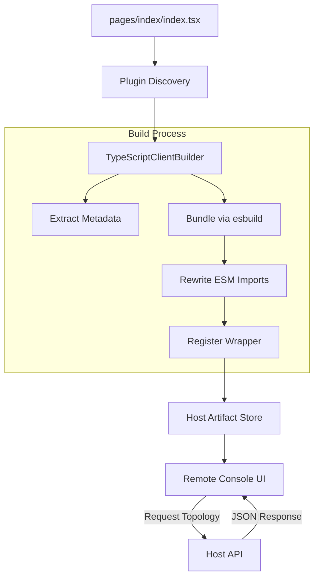
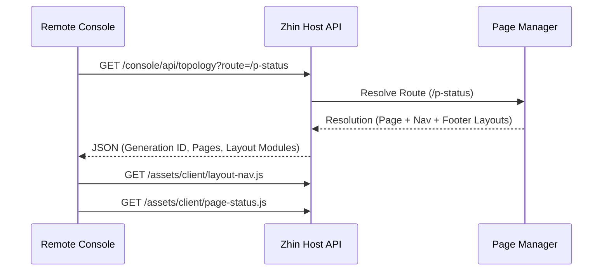

[英文原文](/en/wiki/cubic/console-arch)

::: warning 第三方生成的参考快照
[Cubic 原页面](https://www.cubic.dev/wikis/zhinjs/zhin?page=page-console-arch) · 抓取于 2026-09-23 · [源码提交](https://github.com/zhinjs/zhin/commit/368db14caa4aa91311fb090f07bd792fe4b22fe7)。本页由英文快照机器辅助翻译，尚未逐页与当前代码核验；实际开发请以[维护中的 Zhin 文档](/getting-started/)和[知识库勘误](/wiki/)为准。
:::

::: details 相关源文件

以下文件是 Cubic 生成本页时引用的上下文：

- [packages/console/pagemanager/src/client-build/typescript-builder.ts](https://github.com/zhinjs/zhin/blob/368db14caa4aa91311fb090f07bd792fe4b22fe7/packages/console/pagemanager/src/client-build/typescript-builder.ts)
- [basic/cli/src/plugin-runtime/console/page-renderer.ts](https://github.com/zhinjs/zhin/blob/368db14caa4aa91311fb090f07bd792fe4b22fe7/basic/cli/src/plugin-runtime/console/page-renderer.ts)
- [packages/im/runtime/tests/console-feature-hmr.test.ts](https://github.com/zhinjs/zhin/blob/368db14caa4aa91311fb090f07bd792fe4b22fe7/packages/im/runtime/tests/console-feature-hmr.test.ts)
- [basic/cli/tests/plugin-runtime/console/host.test.ts](https://github.com/zhinjs/zhin/blob/368db14caa4aa91311fb090f07bd792fe4b22fe7/basic/cli/tests/plugin-runtime/console/host.test.ts)
- [packages/toolkit/create-zhin/src/workspace.ts](https://github.com/zhinjs/zhin/blob/368db14caa4aa91311fb090f07bd792fe4b22fe7/packages/toolkit/create-zhin/src/workspace.ts)
- [README.md](https://github.com/zhinjs/zhin/blob/368db14caa4aa91311fb090f07bd792fe4b22fe7/README.md)
:::

# 远程 Console 架构

远程控制台是一个基于浏览器的管理界面，允许您通过浏览器监控和控制 Zhin.js 机器人。它支持在沙箱中发送消息、编辑配置、查看日志以及运行调度等操作，而无需编写代码。该架构将机器人运行时（主机）与用户界面（远程控制台）分离，并通过安全的 HTTP/WebSocket API 进行连接。

来源：[README.md:27-29](https://github.com/zhinjs/zhin/blob/368db14caa4aa91311fb090f07bd792fe4b22fe7/README.md#L27-L29), [packages/toolkit/create-zhin/src/workspace.ts:544-555](https://github.com/zhinjs/zhin/blob/368db14caa4aa91311fb090f07bd792fe4b22fe7/packages/toolkit/create-zhin/src/workspace.ts#L544-L555)

## 核心组件

远程控制台系统由三个主要层次构成：插件运行时发现、客户端构建系统和主机API。

### 插件运行时发现
`Plugin Runtime`通过约定目录发现控制台功能。位于`pages/`和`layouts/`目录中的文件将被自动识别为控制台功能组件。`RootRuntime`负责管理这些功能组件，并协调热模块替换（HMR）机制，以原子方式替换页面资源，而无需重启整个机器人进程。

来源：[packages/im/runtime/tests/console-feature-hmr.test.ts:33-55](https://github.com/zhinjs/zhin/blob/368db14caa4aa91311fb090f07bd792fe4b22fe7/packages/im/runtime/tests/console-feature-hmr.test.ts#L33-L55), [packages/toolkit/create-zhin/src/workspace.ts:503-524](https://github.com/zhinjs/zhin/blob/368db14caa4aa91311fb090f07bd792fe4b22fe7/packages/toolkit/create-zhin/src/workspace.ts#L503-L524)

### 客户端构建系统
`TypeScriptClientBuilder` 将 TSX 源文件转换为浏览器兼容的 ECMAScript 模块（ESM）。它执行以下操作：
- 使用 `extractPageMetadata` 提取静态元数据（标题、图标、排序）。
- 内联注入 `@zhin.js/console-contract` 的占位符，以便浏览器能够解析这些占位符。
- 将组件包装在 `register(api)` 函数中，以满足远程控制台挂载的合约要求。
- 将 `React` 等库的裸导入重写为指向主机服务的 ESM 端点。

来源：[packages/console/pagemanager/src/client-build/typescript-builder.ts:50-80](https://github.com/zhinjs/zhin/blob/368db14caa4aa91311fb090f07bd792fe4b22fe7/packages/console/pagemanager/src/client-build/typescript-builder.ts#L50-L80), [packages/console/pagemanager/src/client-build/typescript-builder.ts:150-180](https://github.com/zhinjs/zhin/blob/368db14caa4aa91311fb090f07bd792fe4b22fe7/packages/console/pagemanager/src/client-build/typescript-builder.ts#L150-L180)

### 主机 API 和渲染
主机负责提供初始页面外壳并提供数据端点。
- **拓扑 API**：序列化特定路由的活动页面列表、导航结构以及解析后的布局。
- **页面渲染器**：生成 HTML 外壳，包括 React 的导入映射和捆绑页面的模块脚本。
- **沙箱 WebSocket**：提供 `/sandbox` 的实时通信通道，用于测试聊天交互。

来源：[basic/cli/src/plugin-runtime/console/page-renderer.ts:25-50](https://github.com/zhinjs/zhin/blob/368db14caa4aa91311fb090f07bd792fe4b22fe7/basic/cli/src/plugin-runtime/console/page-renderer.ts#L25-L50), [basic/cli/tests/plugin-runtime/console/host.test.ts:45-70](https://github.com/zhinjs/zhin/blob/368db14caa4aa91311fb090f07bd792fe4b22fe7/basic/cli/tests/plugin-runtime/console/host.test.ts#L45-L70)

## 数据流与状态转换

以下图表展示了 TSX 页面文件如何被发现、打包，最终在远程控制台中渲染的过程。


构建过程确保项目特定组件被转换为远程管理接口可以动态挂载的标准格式。
来源：[packages/console/pagemanager/src/client-build/typescript-builder.ts:95-130](https://github.com/zhinjs/zhin/blob/368db14caa4aa91311fb090f07bd792fe4b22fe7/packages/console/pagemanager/src/client-build/typescript-builder.ts#L95-L130), [packages/im/runtime/tests/console-feature-hmr.test.ts:70-85](https://github.com/zhinjs/zhin/blob/368db14caa4aa91311fb090f07bd792fe4b22fe7/packages/im/runtime/tests/console-feature-hmr.test.ts#L70-L85)

## 注册合约

每个控制台页面必须实现特定的注册合约，以与远程控制台兼容。`register`函数接收一个系统API，使页面能够定义自身的路由和UI工具。

```typescript
// Internal wrapper generated by TypeScriptClientBuilder
import Page, * as pageNs from "./source.tsx";

export function register(api) {
  const Component = Page?.default ?? Page;
  const m = pageNs.meta || {};

  api.addRoute({
    path: "/p-status",
    name: m.title || "Status",
    element: api.React.createElement(Component),
    meta: { hideInMenu: m.hideInNav === true },
  });
}
```
来源：[packages/console/pagemanager/src/client-build/typescript-builder.ts:168-195](https://github.com/zhinjs/zhin/blob/368db14caa4aa91311fb090f07bd792fe4b22fe7/packages/console/pagemanager/src/client-build/typescript-builder.ts#L168-L195)

## 关键元数据字段

Console 页面使用 `definePage` 工具来提供用于远程控制台中导航和分类的元数据。

| 字段 | 类型 | 描述 |
| :--- | :--- | :--- |
| `title` | `string` | 导航菜单和页眉中显示的名称。 |
| `icon` | `string` | 用于导航链接的图标标识符。 |
| `order` | `number` | 决定在控制台目录中的排序顺序。 |
| `hideInNav` | `boolean` | 若为 true，则页面可通过路由访问，但不会出现在菜单中。 |
| `requiredRoles` | `string[]` | 访问该页面所需的角色列表。 |

来源：[packages/console/pagemanager/src/client-build/typescript-builder.ts:114-125](https://github.com/zhinjs/zhin/blob/368db14caa4aa91311fb090f07bd792fe4b22fe7/packages/console/pagemanager/src/client-build/typescript-builder.ts#L114-L125), [packages/console/pagemanager/tests/client-build/client-build.test.ts:20-25](https://github.com/zhinjs/zhin/blob/368db14caa4aa91311fb090f07bd792fe4b22fe7/packages/console/pagemanager/tests/client-build/client-build.test.ts#L20-L25)

## 序列：拓扑解析

远程控制台请求拓扑信息，以了解可用页面及其布局方式。


主机通过追踪`generation` ID，确保浏览器始终接收与当前插件状态一致的artifact。
来源：[basic/cli/tests/plugin-runtime/console/host.test.ts:50-80](https://github.com/zhinjs/zhin/blob/368db14caa4aa91311fb090f07bd792fe4b22fe7/basic/cli/tests/plugin-runtime/console/host.test.ts#L50-L80), [packages/im/runtime/tests/console-feature-hmr.test.ts:50-65](https://github.com/zhinjs/zhin/blob/368db14caa4aa91311fb090f07bd792fe4b22fe7/packages/im/runtime/tests/console-feature-hmr.test.ts#L50-L65)

## 概述

远程控制台架构为 Zhin.js 机器人提供了解耦且安全的管理平面。通过在 `pages/` 目录中使用基于约定的发现机制，并配合专用的 `TypeScriptClientBuilder`，系统使开发者能够构建复杂的管理界面，这些界面作为 ESM 打包模块动态提供服务。该设计确保机器人运行时保持轻量级，同时通过 Host API 和沙箱 WebSocket 提供丰富的实时管理功能。

来源：[README.md:38-50](https://github.com/zhinjs/zhin/blob/368db14caa4aa91311fb090f07bd792fe4b22fe7/README.md#L38-L50), [packages/toolkit/create-zhin/src/workspace.ts:530-560](https://github.com/zhinjs/zhin/blob/368db14caa4aa91311fb090f07bd792fe4b22fe7/packages/toolkit/create-zhin/src/workspace.ts#L530-L560)
