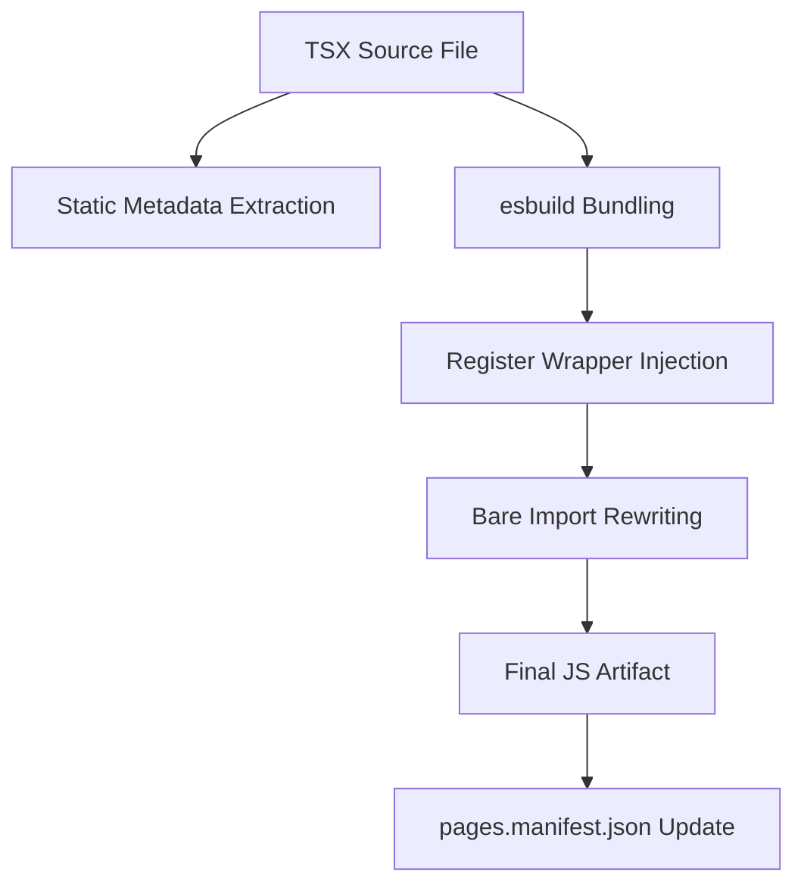
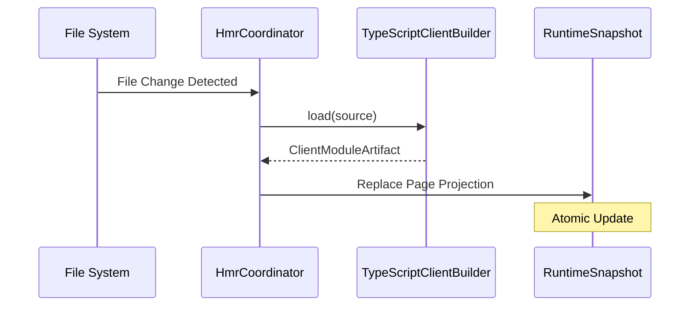

[英文原文](/en/wiki/cubic/console-pages)

::: warning 第三方生成的参考快照
[Cubic 原页面](https://www.cubic.dev/wikis/zhinjs/zhin?page=page-console-pages) · 抓取于 2026-09-23 · [源码提交](https://github.com/zhinjs/zhin/commit/368db14caa4aa91311fb090f07bd792fe4b22fe7)。本页由英文快照机器辅助翻译，尚未逐页与当前代码核验；实际开发请以[维护中的 Zhin 文档](/getting-started/)和[资料存档勘误](/wiki/archive)为准。
:::

::: details 相关源文件

以下文件是 Cubic 生成本页时引用的上下文：

- [packages/toolkit/create-zhin/src/workspace.ts](https://github.com/zhinjs/zhin/blob/368db14caa4aa91311fb090f07bd792fe4b22fe7/packages/toolkit/create-zhin/src/workspace.ts)
- [packages/console/pagemanager/src/client-build/typescript-builder.ts](https://github.com/zhinjs/zhin/blob/368db14caa4aa91311fb090f07bd792fe4b22fe7/packages/console/pagemanager/src/client-build/typescript-builder.ts)
- [packages/im/runtime/tests/console-feature-hmr.test.ts](https://github.com/zhinjs/zhin/blob/368db14caa4aa91311fb090f07bd792fe4b22fe7/packages/im/runtime/tests/console-feature-hmr.test.ts)
- [packages/toolkit/create-zhin/template/skills/plugin-develop/SKILL.md](https://github.com/zhinjs/zhin/blob/368db14caa4aa91311fb090f07bd792fe4b22fe7/packages/toolkit/create-zhin/template/skills/plugin-develop/SKILL.md)
- [basic/cli/src/plugin-runtime/console/page-renderer.ts](https://github.com/zhinjs/zhin/blob/368db14caa4aa91311fb090f07bd792fe4b22fe7/basic/cli/src/plugin-runtime/console/page-renderer.ts)
- [packages/console/pagemanager/tests/client-build/client-build.test.ts](https://github.com/zhinjs/zhin/blob/368db14caa4aa91311fb090f07bd792fe4b22fe7/packages/console/pagemanager/tests/client-build/client-build.test.ts)
- [plugins/adapters/sandbox/tests/sandbox-console.test.ts](https://github.com/zhinjs/zhin/blob/368db14caa4aa91311fb090f07bd792fe4b22fe7/plugins/adapters/sandbox/tests/sandbox-console.test.ts)
:::

# 开发 Console 页面

控制台页面允许开发者使用基于 React 的自定义用户界面扩展 Zhin.js 远程控制台。这些页面直接集成到插件运行时中，使插件能够提供管理仪表盘、交互式工具（如 Agent 沙箱）或可视化组件。

系统采用约定优于配置的模式，即位于特定目录中的页面将被自动发现、构建并服务到浏览器中。

## 项目结构与约定

你可以在插件的 `pages/` 目录下定义控制台页面。每个页面位于独立的子目录中，并包含一个 `index.tsx` 文件。

| 目录路径 | 功能类型 | 用途 |
|:---|:---|:---|
| `pages/<name>/index.tsx` | `zhin.page` | 定义一个新的导航条目和视图。 |
| `pages/nav/index.tsx` | `zhin.layout` | 重写插件作用域内的导航/布局。 |
| `pages/footer/index.tsx` | `zhin.layout` | 重写插件作用域内的页脚布局。 |

来源：[packages/toolkit/create-zhin/src/workspace.ts:741-766](https://github.com/zhinjs/zhin/blob/368db14caa4aa91311fb090f07bd792fe4b22fe7/packages/toolkit/create-zhin/src/workspace.ts#L741-L766), [packages/toolkit/create-zhin/template/skills/plugin-develop/SKILL.md:25-35](https://github.com/zhinjs/zhin/blob/368db14caa4aa91311fb090f07bd792fe4b22fe7/packages/toolkit/create-zhin/template/skills/plugin-develop/SKILL.md#L25-L35)

### 创建一个页面
一个标准页面包含使用 `definePage` 进行元数据声明，以及作为默认导出的 React 组件。

```typescript
import { definePage } from '@zhin.js/console-contract';

export const meta = definePage({
  title: 'My Custom Page',
  order: 10,
});

export default function MyPage() {
  return <div>Welcome to the Zhin Console!</div>;
}
```
来源：[packages/toolkit/create-zhin/src/workspace.ts:741-750](https://github.com/zhinjs/zhin/blob/368db14caa4aa91311fb090f07bd792fe4b22fe7/packages/toolkit/create-zhin/src/workspace.ts#L741-L750), [packages/console/pagemanager/tests/client-build/client-build.test.ts:25-29](https://github.com/zhinjs/zhin/blob/368db14caa4aa91311fb090f07bd792fe4b22fe7/packages/console/pagemanager/tests/client-build/client-build.test.ts#L25-L29)

## 页面元数据

`meta` 导出为远程控制台提供了关于如何显示和路由页面的信息。Zhin 在构建过程中**静态提取**该元数据；其中不得包含动态逻辑或进程环境变量。

### 元数据属性
| 属性 | 类型 | 描述 |
|:---|:---|:---|
| `title` | `string` | 导航菜单中页面的显示名称。 |
| `icon` | `string` | （可选）与标题一同显示的图标名称。 |
| `order` | `number` | （可选）菜单中的排序优先级。 |
| `hideInNav` | `boolean` | 若为 true，页面可通过路由访问，但不会出现在菜单中。 |
| `requiredRoles` | `string[]` | （可选）访问该页面所需的权限。 |

来源：[packages/console/pagemanager/src/client-build/typescript-builder.ts:114-125](https://github.com/zhinjs/zhin/blob/368db14caa4aa91311fb090f07bd792fe4b22fe7/packages/console/pagemanager/src/client-build/typescript-builder.ts#L114-L125), [packages/console/pagemanager/tests/client-build/client-build.test.ts:37-43](https://github.com/zhinjs/zhin/blob/368db14caa4aa91311fb090f07bd792fe4b22fe7/packages/console/pagemanager/tests/client-build/client-build.test.ts#L37-L43)

## 构建流程

`TypeScriptClientBuilder` 将 TSX 源文件编译为浏览器兼容的 JavaScript 产物。该过程包含三个主要阶段：元数据提取、打包和导入重写。


图表展示了 TSX 源文件转换为客户端构件的过程。源码：[packages/console/pagemanager/src/client-build/typescript-builder.ts:54-85](https://github.com/zhinjs/zhin/blob/368db14caa4aa91311fb090f07bd792fe4b22fe7/packages/console/pagemanager/src/client-build/typescript-builder.ts#L54-L85)

### 注册包装器
构建器将基于约定的页面包装在 `register(api)` 函数中。这使得远程控制台可以挂载该组件，并动态添加路由。
来源：[packages/console/pagemanager/src/client-build/typescript-builder.ts:153-195](https://github.com/zhinjs/zhin/blob/368db14caa4aa91311fb090f07bd792fe4b22fe7/packages/console/pagemanager/src/client-build/typescript-builder.ts#L153-L195)

### 导入重写
由于浏览器无法解析裸的 Node.js 导入（例如，`react`），构建工具会将这些导入重写为标准的 ESM 路径，通常指向控制台主机的 `/esm/` 端点，或外部 CDN（如 `esm.sh`）。
来源：[packages/console/pagemanager/src/client-build/typescript-builder.ts:74-78](https://github.com/zhinjs/zhin/blob/368db14caa4aa91311fb090f07bd792fe4b22fe7/packages/console/pagemanager/src/client-build/typescript-builder.ts#L74-L78), [basic/cli/src/plugin-runtime/console/page-renderer.ts:48-54](https://github.com/zhinjs/zhin/blob/368db14caa4aa91311fb090f07bd792fe4b22fe7/basic/cli/src/plugin-runtime/console/page-renderer.ts#L48-L54)

## 热模块替换 (HMR)

Zhin 插件运行时支持 Console 页面的 HMR。当您修改页面源代码文件时，`HmrCoordinator` 将触发该特定构件的重新构建，并原子性地将其替换到当前运行的 `RuntimeSnapshot` 中。


序列图展示了开发过程中页面构件的原子级替换。来源：[packages/im/runtime/tests/console-feature-hmr.test.ts:55-75](https://github.com/zhinjs/zhin/blob/368db14caa4aa91311fb090f07bd792fe4b22fe7/packages/im/runtime/tests/console-feature-hmr.test.ts#L55-L75)

如果构建失败（例如由于动态元数据或语法错误），运行时将保留上一个成功的快照以确保稳定性。
来源：[packages/im/runtime/tests/console-feature-hmr.test.ts:76-80](https://github.com/zhinjs/zhin/blob/368db14caa4aa91311fb090f07bd792fe4b22fe7/packages/im/runtime/tests/console-feature-hmr.test.ts#L76-L80)

## 渲染控制台外壳

控制台主机提供一个基础的HTML外壳，用于加载构建后的页面模块。对于简单的页面或内置的沙箱环境，外壳包含以下内容：

1. **导入映射**：定义了如何查找核心库（如 React）的位置。
2. **插件导航**：渲染由 `zhin.layout` 特性提供的组件。
3.  **页面根节点**：作为页面组件的挂载点。

来源：[basic/cli/src/plugin-runtime/console/page-renderer.ts:33-66](https://github.com/zhinjs/zhin/blob/368db14caa4aa91311fb090f07bd792fe4b22fe7/basic/cli/src/plugin-runtime/console/page-renderer.ts#L33-L66)

### 沙箱降级
当没有可用的 React UI 运行时，或针对特定的 `sandbox` 页面时，系统将提供一个轻量级的降级脚本，通过标准的 WebSocket 连接处理消息日志和内容编排。
来源：[basic/cli/src/plugin-runtime/console/page-renderer.ts:73-125](https://github.com/zhinjs/zhin/blob/368db14caa4aa91311fb090f07bd792fe4b22fe7/basic/cli/src/plugin-runtime/console/page-renderer.ts#L73-L125)

## 实现限制

*   **默认导出**：每个页面和布局文件**必须**包含一个默认导出，该导出是一个 React 组件。来源：[packages/console/pagemanager/tests/client-build/client-build.test.ts:117-126](https://github.com/zhinjs/zhin/blob/368db14caa4aa91311fb090f07bd792fe4b22fe7/packages/console/pagemanager/tests/client-build/client-build.test.ts#L117-L126)
*   **静态元数据**：`meta` 导出必须是一个字面量对象。动态赋值如 `const title = process.env.TITLE;` 将导致构建失败。来源：[packages/console/pagemanager/tests/client-build/client-build.test.ts:54-65](https://github.com/zhinjs/zhin/blob/368db14caa4aa91311fb090f07bd792fe4b22fe7/packages/console/pagemanager/tests/client-build/client-build.test.ts#L54-L65)
*   **TS 扩展名**：当在页面中导入本地模块时，必须在导入路径中使用 `.js` 扩展名，以保持 ESM 兼容性。来源：[packages/toolkit/create-zhin/template/skills/plugin-develop/SKILL.md:58-59](https://github.com/zhinjs/zhin/blob/368db14caa4aa91311fb090f07bd792fe4b22fe7/packages/toolkit/create-zhin/template/skills/plugin-develop/SKILL.md#L58-L59)

Console 页面通过利用一个专门的构建流水线，将 Node.js 插件代码与浏览器端的 React 组件连接起来，从而提供了一种强大的方式来可视化机器人状态并提供交互式控件。
