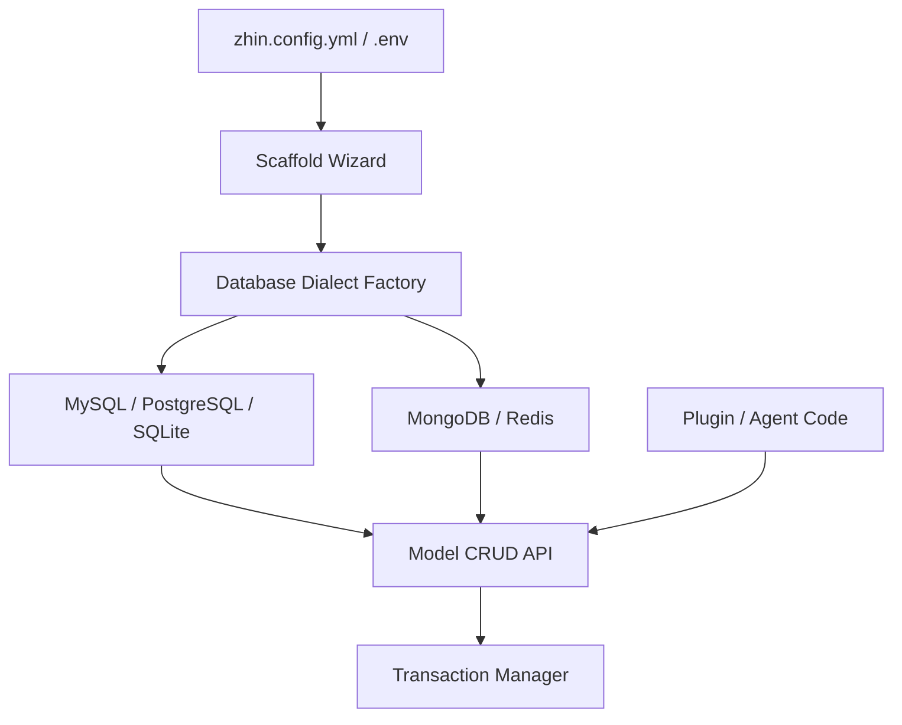

[英文原文](/en/wiki/cubic/database)

::: warning 第三方生成的参考快照
[Cubic 原页面](https://www.cubic.dev/wikis/zhinjs/zhin?page=page-database) · 抓取于 2026-09-23 · [源码提交](https://github.com/zhinjs/zhin/commit/368db14caa4aa91311fb090f07bd792fe4b22fe7)。本页由英文快照机器辅助翻译，尚未逐页与当前代码核验；实际开发请以[维护中的 Zhin 文档](/getting-started/)和[资料存档勘误](/wiki/archive)为准。
:::

::: details 相关源文件

以下文件是 Cubic 生成本页时引用的上下文：

- [basic/database/tests/live-dialects.test.ts](https://github.com/zhinjs/zhin/blob/368db14caa4aa91311fb090f07bd792fe4b22fe7/basic/database/tests/live-dialects.test.ts)
- [packages/toolkit/scaffold-wizard/README.md](https://github.com/zhinjs/zhin/blob/368db14caa4aa91311fb090f07bd792fe4b22fe7/packages/toolkit/scaffold-wizard/README.md)
- [packages/toolkit/create-zhin/README.md](https://github.com/zhinjs/zhin/blob/368db14caa4aa91311fb090f07bd792fe4b22fe7/packages/toolkit/create-zhin/README.md)
- [packages/toolkit/create-zhin/tests/config.test.ts](https://github.com/zhinjs/zhin/blob/368db14caa4aa91311fb090f07bd792fe4b22fe7/packages/toolkit/create-zhin/tests/config.test.ts)
- [basic/cli/src/commands/setup.ts](https://github.com/zhinjs/zhin/blob/368db14caa4aa91311fb090f07bd792fe4b22fe7/basic/cli/src/commands/setup.ts)
- [AGENTS.md](https://github.com/zhinjs/zhin/blob/368db14caa4aa91311fb090f07bd792fe4b22fe7/AGENTS.md)
:::

# 数据库抽象与持久化

Zhin.js 在其 `basic/` 服务中实现了一个数据库抽象层，以在不同存储引擎之间提供统一的持久化支持。该系统使开发者能够使用一致的模型 API 来操作关系型、文档型和键值型存储，从而屏蔽了核心框架对特定方言语法的依赖。

数据库层为高级功能（如统一收件箱、Agent 内存以及持久化消息日志）提供了基础支持。通过提供统一的配置向导，Zhin 确保了无论是在项目初始化时还是通过 CLI 管理工具后续配置，数据库的设置都能保持一致。
来源：[AGENTS.md:35-50](https://github.com/zhinjs/zhin/blob/368db14caa4aa91311fb090f07bd792fe4b22fe7/AGENTS.md#L35-L50), [packages/toolkit/create-zhin/README.md:120-135](https://github.com/zhinjs/zhin/blob/368db14caa4aa91311fb090f07bd792fe4b22fe7/packages/toolkit/create-zhin/README.md#L120-L135)

## 支持的方言

Zhin.js 数据库系统支持多种存储后端，根据其底层数据模型进行分类。每种方言都需要特定的连接参数和环境变量以正确初始化。

| 方言 | 类型 | 主要特性 | 配置参数 |
| :--- | :--- | :--- | :--- |
| **SQLite** | 关系型 | 无配置需求，基于文件的存储。 | `filename`，`mode`（例如 wal） |
| **MySQL** | 关系型 | 传统关系型数据库，支持连接池。 | `host`，`port`，`user`，`password`，`database` |
| **PostgreSQL** | 关系型 | 稳定的关系型数据库，支持连接池。 | `host`，`port`，`user`，`password`，`database` |
| **MongoDB** | 文档型 | 无模式的文档存储。 | `url`，`dbName` |
| **Redis** | 键值型 | 高速内存存储，原生支持 TTL（生存时间）。 | `url` 或 `socket`（主机/端口），`password`，`db` |

来源：[basic/database/tests/live-dialects.test.ts:43-200](https://github.com/zhinjs/zhin/blob/368db14caa4aa91311fb090f07bd792fe4b22fe7/basic/database/tests/live-dialects.test.ts#L43-L200), [packages/toolkit/scaffold-wizard/README.md:25-35](https://github.com/zhinjs/zhin/blob/368db14caa4aa91311fb090f07bd792fe4b22fe7/packages/toolkit/scaffold-wizard/README.md#L25-L35), [packages/toolkit/create-zhin/tests/config.test.ts:10-50](https://github.com/zhinjs/zhin/blob/368db14caa4aa91311fb090f07bd792fe4b22fe7/packages/toolkit/create-zhin/tests/config.test.ts#L10-L50)

## 架构与数据流

数据库抽象采用分层架构，其中特定方言的实现满足一个通用接口。这使得 `Model` API 可以在不依赖后端的情况下执行各种操作。


此图展示了从配置到高层API使用之间的流程，突显了模型API的方言无关特性。

### 连接生命周期
数据库连接通过启动/停止生命周期进行管理。系统会在允许操作前执行健康检查以验证连接状态。
1. **初始化**：使用配置（通常利用环境变量引用，如`${DB_HOST}`）实例化方言。
2. **启动**：`start()`方法建立连接，并针对关系型数据库进行模式同步（例如，扩展整数类型或恢复自增字段）。
3.  **操作**：`model(name)`方法为特定集合或表获取类型化的访问器。
4. **停止**：`stop()`方法安全地关闭连接或连接池。

来源：[basic/database/tests/live-dialects.test.ts:77-85](https://github.com/zhinjs/zhin/blob/368db14caa4aa91311fb090f07bd792fe4b22fe7/basic/database/tests/live-dialects.test.ts#L77-L85), [basic/database/tests/live-dialects.test.ts:153-170](https://github.com/zhinjs/zhin/blob/368db14caa4aa91311fb090f07bd792fe4b22fe7/basic/database/tests/live-dialects.test.ts#L153-L170), [packages/toolkit/create-zhin/tests/config.test.ts:85-95](https://github.com/zhinjs/zhin/blob/368db14caa4aa91311fb090f07bd792fe4b22fe7/packages/toolkit/create-zhin/tests/config.test.ts#L85-L95)

## 模型 API 与 CRUD 操作

`Model` 接口提供了标准的数据操作方法。尽管不同方言在具体行为上存在差异（例如 MongoDB 中的文档 ID 与 MySQL 中的主键），但方法签名保持一致。

### 常用操作
*   `insert(data)` / `insertMany(list)`：将新记录持久化到存储中。
*   `select()`：启动查询，支持通过 `.where()` 进行过滤，通过 `.orderBy()` 进行排序。
*   `update(data)` / `updateById(id, data)`：修改现有记录。
*   `delete(filter)` / `deleteById(id)`：从存储中删除记录。
*   `query(raw)`：在需要时执行特定方言的原始查询。

### 事务管理
关系型数据库方言支持通过 `transaction` 方法实现原子事务。如果在提供的回调函数中发生错误，系统将自动回滚该上下文内执行的所有操作。

```typescript
// Example of a transaction and CRUD operation
await db.transaction(async (trx) => {
  await trx.insert('zhin_live_users', { id: 4, name: 'admin', active: true });
  // If an error is thrown here, the insert is rolled back
});
```
来源：[basic/database/tests/live-dialects.test.ts:90-110](https://github.com/zhinjs/zhin/blob/368db14caa4aa91311fb090f07bd792fe4b22fe7/basic/database/tests/live-dialects.test.ts#L90-L110), [basic/database/tests/live-dialects.test.ts:135-145](https://github.com/zhinjs/zhin/blob/368db14caa4aa91311fb090f07bd792fe4b22fe7/basic/database/tests/live-dialects.test.ts#L135-L145)

## 配置与项目初始化

Zhin.js 采用“配置即数据”的方式，数据库凭证存储在 `.env` 文件中，而主配置文件 `zhin.config.yml` 则通过占位符引用这些信息。

### 环境变量
`generateDatabaseEnvVars` 工具会为不同数据库方言生成相应的环境变量键值。这确保了敏感信息（如密码）不会被提交到版本控制中。

| 数据库方言 | 变量模式 |
| :--- | :--- |
| **MySQL/PostgreSQL** | `DB_HOST`, `DB_PORT`, `DB_USER`, `DB_PASSWORD`, `DB_DATABASE` |
| **MongoDB** | `DB_URL`, `DB_NAME` |
| **Redis** | `REDIS_HOST`, `REDIS_PORT`, `REDIS_PASSWORD`, `REDIS_DB` |

### 设置向导
`@zhin.js/scaffold-wizard` 包提供交互式提示，用于选择数据库类型。
1. 用户选择数据库方言（例如 `sqlite` 或 `mysql`）。
2. 对于网络数据库，用户需提供连接详情。
3. 向导将占位符写入 `zhin.config.yml`，并将实际值写入 `.env` 文件。
4. 系统将识别所需依赖项（例如，SQLite 需要特定的前置条件或驱动包）。

来源：[packages/toolkit/create-zhin/tests/config.test.ts:10-75](https://github.com/zhinjs/zhin/blob/368db14caa4aa91311fb090f07bd792fe4b22fe7/packages/toolkit/create-zhin/tests/config.test.ts#L10-L75), [packages/toolkit/scaffold-wizard/README.md:20-50](https://github.com/zhinjs/zhin/blob/368db14caa4aa91311fb090f07bd792fe4b22fe7/packages/toolkit/scaffold-wizard/README.md#L20-L50), [basic/cli/src/commands/setup.ts:250-275](https://github.com/zhinjs/zhin/blob/368db14caa4aa91311fb090f07bd792fe4b22fe7/basic/cli/src/commands/setup.ts#L250-L275)

## Redis 特有语义
为了支持键值持久化，Redis 语法扩展了标准 API，增加了原生功能：
*   `set(key, value)` 和 `get(key)`：基本的键值操作。
*   `expire(key, seconds)` 和 `ttl(key)`：管理键的过期设置。
*   `keysByPattern(pattern)`：检索匹配特定通配符模式的键。
*   `persist(key)`：从键中移除过期计时器。

来源：[basic/database/tests/live-dialects.test.ts:195-220](https://github.com/zhinjs/zhin/blob/368db14caa4aa91311fb090f07bd792fe4b22fe7/basic/database/tests/live-dialects.test.ts#L195-L220)

## 概述
Zhin.js 中的数据库抽象与持久化层为所有存储需求提供了与数据库方言无关的接口。通过将 API 与实现解耦，并利用强大的骨架系统，Zhin.js 确保机器人能够在不同基础设施环境中保持可移植性和安全性。这种一致性在命令行工具（CLI）、项目模板以及运行时功能中均得到维护。
来源：[packages/toolkit/create-zhin/README.md:30-45](https://github.com/zhinjs/zhin/blob/368db14caa4aa91311fb090f07bd792fe4b22fe7/packages/toolkit/create-zhin/README.md#L30-L45), [AGENTS.md:70-85](https://github.com/zhinjs/zhin/blob/368db14caa4aa91311fb090f07bd792fe4b22fe7/AGENTS.md#L70-L85)
