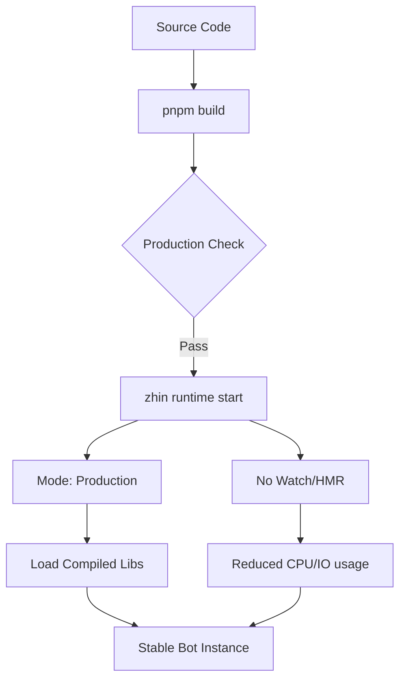
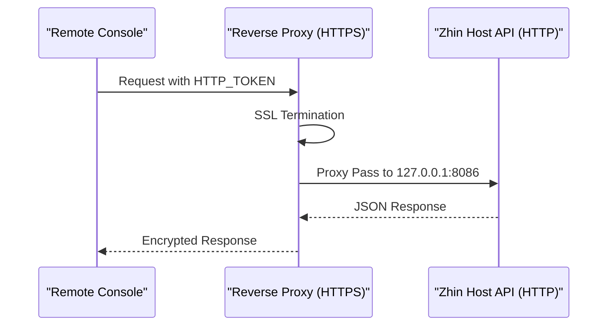

[英文原文](/en/wiki/cubic/docker-prod)

::: warning 第三方生成的参考快照
[Cubic 原页面](https://www.cubic.dev/wikis/zhinjs/zhin?page=page-docker-prod) · 抓取于 2026-09-23 · [源码提交](https://github.com/zhinjs/zhin/commit/368db14caa4aa91311fb090f07bd792fe4b22fe7)。本页由英文快照机器辅助翻译，尚未逐页与当前代码核验；实际开发请以[维护中的 Zhin 文档](/getting-started/)和[知识库勘误](/wiki/)为准。
:::

::: danger 已确认勘误
下文的 `8086` 代理示例仅适用于显式配置该端口，或 Runtime 使用未配置时的回退值。新脚手架项目使用 `8068`；`pnpm daemon` 和 `pnpm stop` 是旧项目迁移脚本，并非新脚手架默认命令。本文部分 Cubic 源码行号指向无关内容。参见[生产部署](/operations/production)。
:::

::: details 相关源文件

以下文件是 Cubic 生成本页时引用的上下文：

- [packages/toolkit/create-zhin/src/workspace.ts](https://github.com/zhinjs/zhin/blob/368db14caa4aa91311fb090f07bd792fe4b22fe7/packages/toolkit/create-zhin/src/workspace.ts)
- [packages/toolkit/create-zhin/README.md](https://github.com/zhinjs/zhin/blob/368db14caa4aa91311fb090f07bd792fe4b22fe7/packages/toolkit/create-zhin/README.md)
- [SECURITY.md](https://github.com/zhinjs/zhin/blob/368db14caa4aa91311fb090f07bd792fe4b22fe7/SECURITY.md)
- [agents/ops/system.md](https://github.com/zhinjs/zhin/blob/368db14caa4aa91311fb090f07bd792fe4b22fe7/agents/ops/system.md)
- [basic/cli/src/commands/migrate.ts](https://github.com/zhinjs/zhin/blob/368db14caa4aa91311fb090f07bd792fe4b22fe7/basic/cli/src/commands/migrate.ts)
- [CLAUDE.md](https://github.com/zhinjs/zhin/blob/368db14caa4aa91311fb090f07bd792fe4b22fe7/CLAUDE.md)
- [README.md](https://github.com/zhinjs/zhin/blob/368db14caa4aa91311fb090f07bd792fe4b22fe7/README.md)
:::

# 生产部署

在 Zhin.js 框架中进行生产部署时，会将专用的插件运行时在稳定环境中执行。系统通过切换执行模式、禁用热模块替换（HMR），并利用操作系统级别的进程管理器来保证持久性，从而实现从开发环境到生产环境的过渡。

Zhin.js 为多种生产环境提供了自动化骨架配置，包括 Linux（systemd）、macOS（launchd）、Windows（NSSM）以及跨平台进程管理器（如 PM2）。该部署架构确保消息通过统一的流水线传输，同时通过环境隔离的凭证和受限的 API 访问来保障安全性。
来源：[README.md:89-106](https://github.com/zhinjs/zhin/blob/368db14caa4aa91311fb090f07bd792fe4b22fe7/README.md#L89-L106), [packages/toolkit/create-zhin/src/workspace.ts:147-150](https://github.com/zhinjs/zhin/blob/368db14caa4aa91311fb090f07bd792fe4b22fe7/packages/toolkit/create-zhin/src/workspace.ts#L147-L150)

## 运行时执行

生产环境的主要入口是 `zhin runtime start` 命令。在生产环境中，该命令必须配合特定标志调用，以确保稳定性和性能。

### 生产执行流程

以下图表展示了从开发状态过渡到生产就绪运行时的过程。

流程从通过 `pnpm build` 进行代码编译开始，随后进行生产环境检查，最终在稳定且非监听模式下执行运行时。
来源：[CLAUDE.md:28-40](https://github.com/zhinjs/zhin/blob/368db14caa4aa91311fb090f07bd792fe4b22fe7/CLAUDE.md#L28-L40), [packages/toolkit/create-zhin/src/workspace.ts:101-103](https://github.com/zhinjs/zhin/blob/368db14caa4aa91311fb090f07bd792fe4b22fe7/packages/toolkit/create-zhin/src/workspace.ts#L101-L103)

### 生产环境 CLI 参数

CLI 提供了针对不同部署需求的标准脚本。

| 命令 | 操作 | 参数 |
| :--- | :--- | :--- |
| `pnpm start` | 生产环境启动 | `zhin runtime start --mode production --no-watch` |
| `pnpm daemon`（仅限迁移后的旧项目） | 后台执行 | `zhin runtime start --daemon` |
| `pnpm build` | 类型检查/预处理 | `tsc --noEmit` |
| `pnpm stop`（仅限迁移后的旧项目） | 平滑关闭 | N/A |

来源：[basic/cli/src/commands/migrate.ts:25-30](https://github.com/zhinjs/zhin/blob/368db14caa4aa91311fb090f07bd792fe4b22fe7/basic/cli/src/commands/migrate.ts#L25-L30), [packages/toolkit/create-zhin/src/workspace.ts:101-105](https://github.com/zhinjs/zhin/blob/368db14caa4aa91311fb090f07bd792fe4b22fe7/packages/toolkit/create-zhin/src/workspace.ts#L101-L105)

## 进程管理

Zhin.js 为各种服务管理器生成配置模板，以确保机器人在崩溃或系统重启后能够自动重新启动。

### 1. Linux（systemd）
模板生成一个 `.service` 文件，使用 `/usr/bin/env npx zhin` 避免在版本管理器（如 nvm）中硬编码特定的 Node.js 路径。
- **重启策略**：使用 `Restart=always` 配置，带有 `10s` 延迟。
- **资源限制**：设置为 `LimitNOFILE=65536` 和 `MemoryMax=2G`。
来源：[packages/toolkit/create-zhin/src/workspace.ts:147-170](https://github.com/zhinjs/zhin/blob/368db14caa4aa91311fb090f07bd792fe4b22fe7/packages/toolkit/create-zhin/src/workspace.ts#L147-L170)

### 2. Windows (NSSM)
部署使用非吸吮服务管理器（NSSM）。一个PowerShell脚本（`install-service.ps1`）实现了以下功能：
- 设置应用程序目录。
- 旋转日志文件（`AppRotateBytes 10485760`）。
- 设置环境变量为`production`。
来源：[packages/toolkit/create-zhin/src/workspace.ts:219-256](https://github.com/zhinjs/zhin/blob/368db14caa4aa91311fb090f07bd792fe4b22fe7/packages/toolkit/create-zhin/src/workspace.ts#L219-L256)

### 3. macOS (launchd)
一个 `.plist` 配置用于管理生命周期，包括 `RunAtLoad` 和 `KeepAlive` 键。
来源：[packages/toolkit/create-zhin/src/workspace.ts:175-214](https://github.com/zhinjs/zhin/blob/368db14caa4aa91311fb090f07bd792fe4b22fe7/packages/toolkit/create-zhin/src/workspace.ts#L175-L214)

### 4. PM2
提供的 `ecosystem.config.cjs` 支持集群或单实例管理，并具备内存监控功能。
来源：[packages/toolkit/create-zhin/src/workspace.ts:291-316](https://github.com/zhinjs/zhin/blob/368db14caa4aa91311fb090f07bd792fe4b22fe7/packages/toolkit/create-zhin/src/workspace.ts#L291-L316)

## 安全配置

生产环境中的安全重点在于凭证隔离和网络加固。

### 环境变量保护
如 `HTTP_TOKEN`、`AI_API_KEY` 及数据库凭证等敏感密钥必须存储在 `.env` 文件中。框架要求 `.env` 文件绝不可提交至版本控制。
来源：[SECURITY.md:39-45](https://github.com/zhinjs/zhin/blob/368db14caa4aa91311fb090f07bd792fe4b22fe7/SECURITY.md#L39-L45), [packages/toolkit/create-zhin/src/workspace.ts:335-345](https://github.com/zhinjs/zhin/blob/368db14caa4aa91311fb090f07bd792fe4b22fe7/packages/toolkit/create-zhin/src/workspace.ts#L335-L345)

### 主机 API 安全加固
- **本地绑定**：主机 API（端口 8086）应默认绑定为 `127.0.0.1`，除非明确需要通过远程控制台进行外部管理。
- **令牌使用**：在授权头中使用强密码 `HTTP_TOKEN`。
- **Nginx 反向代理**：建议使用 Nginx 进行 SSL 终止，并作为额外的安全层。
来源：[SECURITY.md:47-53](https://github.com/zhinjs/zhin/blob/368db14caa4aa91311fb090f07bd792fe4b22fe7/SECURITY.md#L47-L53), [packages/toolkit/create-zhin/README.md:120-125](https://github.com/zhinjs/zhin/blob/368db14caa4aa91311fb090f07bd792fe4b22fe7/packages/toolkit/create-zhin/README.md#L120-L125)

序列展示了 Nginx 如何作为 Zhin 主机 API 的安全缓冲层。
来源：[SECURITY.md:50-55](https://github.com/zhinjs/zhin/blob/368db14caa4aa91311fb090f07bd792fe4b22fe7/SECURITY.md#L50-L55), [packages/toolkit/create-zhin/README.md:130-135](https://github.com/zhinjs/zhin/blob/368db14caa4aa91311fb090f07bd792fe4b22fe7/packages/toolkit/create-zhin/README.md#L130-L135)

## 操作与生命周期

通过SRE/Ops代理管理的严格发布和更新策略，确保了操作的完整性。

### 发布流程
1. **CI验证**：所有工作流必须通过（类型检查、代码规范检查、测试）。
2. **版本递增**：使用`pnpm bump`和Changesets管理版本递增。
3. **回滚策略**：始终保留快速回滚的路径。
4. **产物验证**：在最终部署前，验证`npm publish`或Docker镜像。
来源：[agents/ops/system.md:20-35](https://github.com/zhinjs/zhin/blob/368db14caa4aa91311fb090f07bd792fe4b22fe7/agents/ops/system.md#L20-L35), [CLAUDE.md:120-125](https://github.com/zhinjs/zhin/blob/368db14caa4aa91311fb090f07bd792fe4b22fe7/CLAUDE.md#L120-L125)

### 依赖管理
管理员必须定期使用 `pnpm audit` 检查安全漏洞。在生产环境中，仅应监控必要的插件目录，以避免过多的文件系统 I/O 操作。
来源：[SECURITY.md:60-66](https://github.com/zhinjs/zhin/blob/368db14caa4aa91311fb090f07bd792fe4b22fe7/SECURITY.md#L60-L66), [agents/ops/system.md:40-45](https://github.com/zhinjs/zhin/blob/368db14caa4aa91311fb090f07bd792fe4b22fe7/agents/ops/system.md#L40-L45)

## 概述
Zhin.js 的生产部署依赖于 `zhin runtime start` 命令及生产环境标志。通过使用为 systemd、PM2 或 NSSM 生成的服务模板，并严格遵循基于环境的安全实践，开发者可以确保机器人运行的稳定性与数据安全。该架构将开发阶段的关切（热重载）与生产环境需求（稳定性与资源效率）进行了有效分离。
来源：[packages/toolkit/create-zhin/src/workspace.ts:365-380](https://github.com/zhinjs/zhin/blob/368db14caa4aa91311fb090f07bd792fe4b22fe7/packages/toolkit/create-zhin/src/workspace.ts#L365-L380), [SECURITY.md:180-195](https://github.com/zhinjs/zhin/blob/368db14caa4aa91311fb090f07bd792fe4b22fe7/SECURITY.md#L180-L195)
