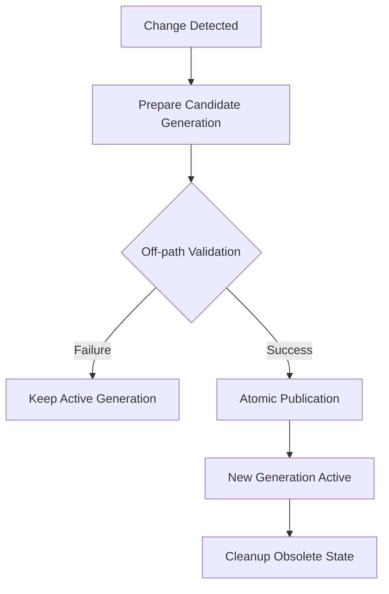
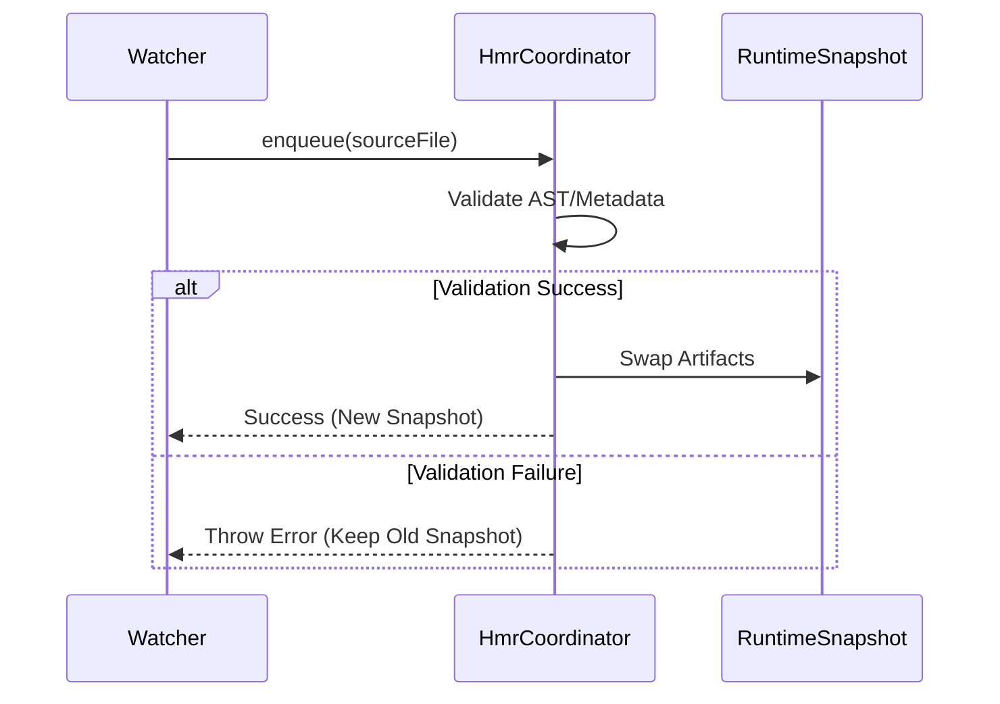

[英文原文](/en/wiki/cubic/hmr-generation)

::: warning 第三方生成的参考快照
[Cubic 原页面](https://www.cubic.dev/wikis/zhinjs/zhin?page=page-hmr-generation) · 抓取于 2026-09-23 · [源码提交](https://github.com/zhinjs/zhin/commit/368db14caa4aa91311fb090f07bd792fe4b22fe7)。本页由英文快照机器辅助翻译，尚未逐页与当前代码核验；实际开发请以[维护中的 Zhin 文档](/getting-started/)和[知识库勘误](/wiki/)为准。
:::

::: details 相关源文件

以下文件是 Cubic 生成本页时引用的上下文：

- [README.md](https://github.com/zhinjs/zhin/blob/368db14caa4aa91311fb090f07bd792fe4b22fe7/README.md)
- [AGENTS.md](https://github.com/zhinjs/zhin/blob/368db14caa4aa91311fb090f07bd792fe4b22fe7/AGENTS.md)
- [packages/im/runtime/tests/console-feature-hmr.test.ts](https://github.com/zhinjs/zhin/blob/368db14caa4aa91311fb090f07bd792fe4b22fe7/packages/im/runtime/tests/console-feature-hmr.test.ts)
- [packages/console/pagemanager/tests/client-build/client-build.test.ts](https://github.com/zhinjs/zhin/blob/368db14caa4aa91311fb090f07bd792fe4b22fe7/packages/console/pagemanager/tests/client-build/client-build.test.ts)
- [packages/im/config-file/tests/yaml-config-document.test.ts](https://github.com/zhinjs/zhin/blob/368db14caa4aa91311fb090f07bd792fe4b22fe7/packages/im/config-file/tests/yaml-config-document.test.ts)
- [CLAUDE.md](https://github.com/zhinjs/zhin/blob/368db14caa4aa91311fb090f07bd792fe4b22fe7/CLAUDE.md)
- [agents/dev/system.md](https://github.com/zhinjs/zhin/blob/368db14caa4aa91311fb090f07bd792fe4b22fe7/agents/dev/system.md)
:::

# Generation 与热重载

Zhin.js 通过基于生成的事务模型管理系统演进。该架构确保热模块替换（HMR）和配置更新以原子方式执行，而不会中断正在运行的服务。系统在发布之前，会预先准备并验证每一个新的插件树或配置状态。

来源：[README.md:104-106](https://github.com/zhinjs/zhin/blob/368db14caa4aa91311fb090f07bd792fe4b22fe7/README.md#L104-L106), [agents/dev/system.md:46-48](https://github.com/zhinjs/zhin/blob/368db14caa4aa91311fb090f07bd792fe4b22fe7/agents/dev/system.md#L46-L48)
## 生成生命周期

生成代表了运行时状态的不可变快照。当系统检测到代码或配置变更时，将启动一个新的生成事务。

### 事务性更新
其生命周期遵循严格的顺序以确保稳定性：
1.  **准备阶段**：运行时构建候选插件树或配置快照。
2.  **验证阶段**：系统对候选配置进行离线验证。若验证失败，当前活跃的生成将继续处理流量，从而避免运行时崩溃。
3.  **原子发布**：在验证成功后，系统将当前生成与候选生成进行替换。
4.  **状态解析**：运行时通过当前的 `Generation View` 或快照资源解析所有状态。
来源：[README.md:104-106](https://github.com/zhinjs/zhin/blob/368db14caa4aa91311fb090f07bd792fe4b22fe7/README.md#L104-L106), [AGENTS.md:126-128](https://github.com/zhinjs/zhin/blob/368db14caa4aa91311fb090f07bd792fe4b22fe7/AGENTS.md#L126-L128), [agents/dev/system.md:46-48](https://github.com/zhinjs/zhin/blob/368db14caa4aa91311fb090f07bd792fe4b22fe7/agents/dev/system.md#L46-L48)

上面的流程图说明了原子交换机制，该机制可以防止更新失败影响正在运行的机器人。

## 热模块替换（HMR）协调器

`HmrCoordinator` 负责模块更新的排队和执行。它特别处理远程控制台中页面（Pages）和布局（Layouts）等组件的特性槽位替换。

### 协调器功能
*   **排队**：协调器通过 `hmr.enqueue(source)` 排队特定的源文件以进行更新。
*   **原子替换**：它在不重新执行客户端代码或重新运行完整插件 `setup()` 流程的情况下，替换构件（例如页面或布局代码）。
*   **错误处理**：如果模块编译或验证失败，协调器将触发 `onError` 回调，并保持现有的稳定快照。
*   重启检测：协调器通过 `onRestartRequired` 判断变更是否需要整个进程重启。

来源：[packages/im/runtime/tests/console-feature-hmr.test.ts:47-75](https://github.com/zhinjs/zhin/blob/368db14caa4aa91311fb090f07bd792fe4b22fe7/packages/im/runtime/tests/console-feature-hmr.test.ts#L47-L75), [packages/console/pagemanager/tests/client-build/client-build.test.ts:98-105](https://github.com/zhinjs/zhin/blob/368db14caa4aa91311fb090f07bd792fe4b22fe7/packages/console/pagemanager/tests/client-build/client-build.test.ts#L98-L105)

### 实现示例：特性 HMR
当页面 artifact 被更新时，`HmrCoordinator` 会在更新 `RuntimeSnapshot` 之前验证新的元数据（如标题或路由）。

序列图展示了 `HmrCoordinator` 在更新过程中如何充当守门人。

## 基于生成的配置

在 Zhin.js 中，配置被视为由特定插件拥有的版本化数据。运行时使用 `YamlConfigDocument` 在生成事务内对系统状态进行修补。

### 配置修补逻辑
*   **乐观并发**：文档系统会在 `read()` 和 `commit()` 之间检测到底层文件发生变更时，识别出冲突。
*   **原子提交**：修补操作应用于 AST，同时保留注释和缩进。
*   **回滚能力**：如果生成过程未能成功发布，文档系统可以恢复配置文件的精确前一版本字节内容。
*   **验证**：`RootRuntime` 会根据模式对修补内容进行验证。如果子插件的 `setup()` 函数在使用新配置时失败，则保持候选配置不变。

来源：[packages/im/config-file/tests/yaml-config-document.test.ts:24-40](https://github.com/zhinjs/zhin/blob/368db14caa4aa91311fb090f07bd792fe4b22fe7/packages/im/config-file/tests/yaml-config-document.test.ts#L24-L40), [packages/im/config-file/tests/yaml-config-document.test.ts:168-185](https://github.com/zhinjs/zhin/blob/368db14caa4aa91311fb090f07bd792fe4b22fe7/packages/im/config-file/tests/yaml-config-document.test.ts#L168-L185)

### 配置事务表

| 操作 | 描述 | 失败时结果 |
| :--- | :--- | :--- |
| `read()` | 读取当前的 YAML/JSON 及修订记录 | 无影响 |
| `prepare()` | 生成候选补丁 | 事务保持未提交状态 |
| `patchConfig()` | 应用变更并触发影子环境设置 | 候选补丁被丢弃；主动生成保持不变 |
| `commit()` | 原子化将变更写入磁盘 | 通过 `rollback()` 保留文件内容 |

来源：[packages/im/config-file/tests/yaml-config-document.test.ts:100-112](https://github.com/zhinjs/zhin/blob/368db14caa4aa91311fb090f07bd792fe4b22fe7/packages/im/config-file/tests/yaml-config-document.test.ts#L100-L112), [packages/im/config-file/tests/yaml-config-document.test.ts:187-202](https://github.com/zhinjs/zhin/blob/368db14caa4aa91311fb090f07bd792fe4b22fe7/packages/im/config-file/tests/yaml-config-document.test.ts#L187-L202)

## 架构约束

HMR 和生成系统受到特定架构规则的保护，以确保一致性：

*   **禁止全局单例**：开发人员不得使用模块级别的可变单例。所有状态必须存在于快照资源中。
*   **禁止命令式注册**：不建议使用命令式注册能力（例如 `plugin.addCommand`），应优先采用基于约定的目录发现机制，该机制与生成模型更好地集成。
*   **不可变快照**：`RootRuntime` 通过 `CapabilityIngress` 将根服务注入，确保外部提供者遵循基于生成的治理规则。
*   **失效端口**：`ModuleRuntime` 提供用于生成失效和追踪受影响源的端口，以便确定 HMR 事件的范围。

来源：[AGENTS.md:126-128](https://github.com/zhinjs/zhin/blob/368db14caa4aa91311fb090f07bd792fe4b22fe7/AGENTS.md#L126-L128), [CLAUDE.md:66-70](https://github.com/zhinjs/zhin/blob/368db14caa4aa91311fb090f07bd792fe4b22fe7/CLAUDE.md#L66-L70), [packages/console/pagemanager/tests/client-build/client-build.test.ts:95-120](https://github.com/zhinjs/zhin/blob/368db14caa4aa91311fb090f07bd792fe4b22fe7/packages/console/pagemanager/tests/client-build/client-build.test.ts#L95-L120)

## 概述

Generations 为 Zhin.js 运行时提供了安全保障，使得通过 HMR 实现高频更新而不会损害系统完整性。通过将代码和配置均视为事务性单元，该框架使开发者能够快速迭代，同时确保只有经过验证的状态才会发布到活动机器人中。
