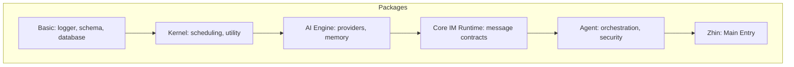
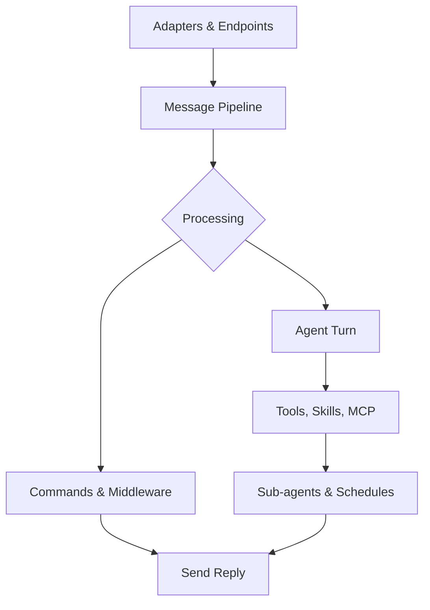
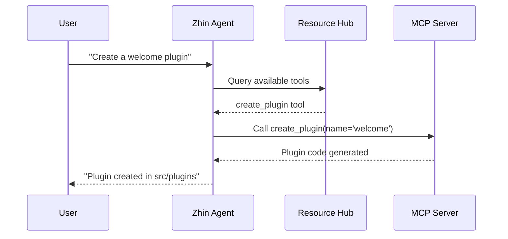

[英文原文](/en/wiki/cubic/intro)

::: warning 第三方生成的参考快照
[Cubic 原页面](https://www.cubic.dev/wikis/zhinjs/zhin?page=page-intro) · 抓取于 2026-09-23 · [源码提交](https://github.com/zhinjs/zhin/commit/368db14caa4aa91311fb090f07bd792fe4b22fe7)。本页由英文快照机器辅助翻译，尚未逐页与当前代码核验；实际开发请以[维护中的 Zhin 文档](/getting-started/)和[知识库勘误](/wiki/)为准。
:::

::: details 相关源文件

以下文件是 Cubic 生成本页时引用的上下文：

- [README.md](https://github.com/zhinjs/zhin/blob/368db14caa4aa91311fb090f07bd792fe4b22fe7/README.md)
- [AGENTS.md](https://github.com/zhinjs/zhin/blob/368db14caa4aa91311fb090f07bd792fe4b22fe7/AGENTS.md)
- [CLAUDE.md](https://github.com/zhinjs/zhin/blob/368db14caa4aa91311fb090f07bd792fe4b22fe7/CLAUDE.md)
- [packages/im/zhin/package.json](https://github.com/zhinjs/zhin/blob/368db14caa4aa91311fb090f07bd792fe4b22fe7/packages/im/zhin/package.json)
- [packages/im/core/package.json](https://github.com/zhinjs/zhin/blob/368db14caa4aa91311fb090f07bd792fe4b22fe7/packages/im/core/package.json)
- [packages/toolkit/create-zhin/src/workspace.ts](https://github.com/zhinjs/zhin/blob/368db14caa4aa91311fb090f07bd792fe4b22fe7/packages/toolkit/create-zhin/src/workspace.ts)
- [packages/host/mcp/README.md](https://github.com/zhinjs/zhin/blob/368db14caa4aa91311fb090f07bd792fe4b22fe7/packages/host/mcp/README.md)
:::

# Zhin.js 简介

Zhin.js 是一个基于 TypeScript 构建的多通道聊天机器人框架，专为开发者在聊天平台上线高质量助手而设计。它提供了一个统一的代码基础，可支持在 20 多个平台（包括 QQ、微信、Discord、Slack 和 Telegram）上运行账户。该框架内置可选的 AI Agent 系统，支持通过浏览器控制台进行远程管理，并采用“约定优于配置”的插件模型。

来源：[README.md:25-35](https://github.com/zhinjs/zhin/blob/368db14caa4aa91311fb090f07bd792fe4b22fe7/README.md#L25-L35), [AGENTS.md:7-12](https://github.com/zhinjs/zhin/blob/368db14caa4aa91311fb090f07bd792fe4b22fe7/AGENTS.md#L7-L12)

## 核心架构

Zhin.js 采用分层的Monorepo架构，使用 pnpm 和 Turborepo 进行管理。每一层都保持严格的单向依赖关系，以确保模块化和稳定性。

### 依赖层级

该框架强制实施一种层级结构，使得底层模块独立于高层模块。`basic/cli` 包作为组合根，负责整合 IM、Agent 和 Console 三大组件。

此图展示了从基础服务到主要入口点的单向依赖流。

来源：[CLAUDE.md:43-58](https://github.com/zhinjs/zhin/blob/368db14caa4aa91311fb090f07bd792fe4b22fe7/CLAUDE.md#L43-L58), [AGENTS.md:29-50](https://github.com/zhinjs/zhin/blob/368db14caa4aa91311fb090f07bd792fe4b22fe7/AGENTS.md#L29-L50)

### 关键包角色

| 包名 | 角色 | 描述 |
| :--- | :--- | :--- |
| `zhin.js` | IM 入口 | IM 核心的主入口点（1.1.x 稳定版本系列）。 |
| `@zhin.js/core` | 分发器 | 管理插件运行时、适配器和消息分发。 |
| `@zhin.js/ai` | AI 引擎 | 处理 LLM 提供商抽象、记忆管理及压缩，不包含 IM 逻辑。 |
| `@zhin.js/agent` | 协调器 | 管理Agent 循环、安全策略和 MCP 客户端。 |
| `@zhin.js/cli` | 命令行 / 模板生成工具 | 提供初始化、配置和运行时管理的命令。 |

来源：[README.md:129-136](https://github.com/zhinjs/zhin/blob/368db14caa4aa91311fb090f07bd792fe4b22fe7/README.md#L129-L136), [CLAUDE.md:60-70](https://github.com/zhinjs/zhin/blob/368db14caa4aa91311fb090f07bd792fe4b22fe7/CLAUDE.md#L60-L70)

## 消息流水线

Zhin.js 通过标准化的消息流处理所有交互。消息进入流水线后，会经过中间件或命令的处理，可能触发 AI Agent 的一轮操作，最终通过统一的发送链返回回复。

流程图展示了消息从适配器入口到最终响应的完整生命周期。

来源：[README.md:65-80](https://github.com/zhinjs/zhin/blob/368db14caa4aa91311fb090f07bd792fe4b22fe7/README.md#L65-L80), [CLAUDE.md:72-76](https://github.com/zhinjs/zhin/blob/368db14caa4aa91311fb090f07bd792fe4b22fe7/CLAUDE.md#L72-L76)

### 发送链安全
Zhin.js 禁止绕过统一的发送链。所有出站消息必须通过 `Message.$reply` 或 `Adapter.sendMessage` 流程传递。这确保所有消息在抵达平台端点前，都会经过 `OutboundRenderer` 及相关的出站中间件处理。

来源：[CLAUDE.md:72-76](https://github.com/zhinjs/zhin/blob/368db14caa4aa91311fb090f07bd792fe4b22fe7/CLAUDE.md#L72-L76), [AGENTS.md:118-120](https://github.com/zhinjs/zhin/blob/368db14caa4aa91311fb090f07bd792fe4b22fe7/AGENTS.md#L118-L120)

## 插件系统

Zhin.js 采用基于约定的插件运行时。开发者使用 `definePlugin()` 定义插件，框架会自动发现位于特定目录中的能力。

### 常规目录

| 目录 | API 参考 | 描述 |
| :--- | :--- | :--- |
| `commands/` | `defineCommand()` | 采用 Next.js 风格的聊天命令路由。 |
| `middlewares/` | `defineMiddleware()` | 全局消息处理层。 |
| `components/` | `defineComponent()` | 丰富的媒体和消息 UI 组件。 |
| `tools/` | `defineAgentTool()` | 供 AI Agent 调用的能力。 |
| `skills/` | `SKILL.md` | 以 Markdown 格式描述 Agent 的工作流。 |
| `pages/` | `definePage()` | 用于远程控制台的浏览器 UI 页面。 |

来源：[CLAUDE.md:83-110](https://github.com/zhinjs/zhin/blob/368db14caa4aa91311fb090f07bd792fe4b22fe7/CLAUDE.md#L83-L110), [packages/toolkit/create-zhin/src/workspace.ts:316-335](https://github.com/zhinjs/zhin/blob/368db14caa4aa91311fb090f07bd792fe4b22fe7/packages/toolkit/create-zhin/src/workspace.ts#L316-L335)

### 生成生命周期
Zhin.js 将热重载实现为一个“生成”事务。当代码发生变更时，运行时会准备并验证一个离线的插件树。只有在验证成功后，才会发布新的生成版本；否则，当前的生成版本将继续处理请求。

来源：[README.md:92-95](https://github.com/zhinjs/zhin/blob/368db14caa4aa91311fb090f07bd792fe4b22fe7/README.md#L92-L95), [AGENTS.md:123-125](https://github.com/zhinjs/zhin/blob/368db14caa4aa91311fb090f07bd792fe4b22fe7/AGENTS.md#L123-L125)

## 安装层级

该框架采用模块化安装策略，以保持核心库体积小巧（小于10MB）。额外功能需要特定的依赖包。

| 层级 | 所需包 | 功能 |
| :--- | :--- | :--- |
| **IM 核心** | `zhin.js` + 适配器 | 命令系统、插件运行时以及远程控制台访问。 |
| **AI Agent** | `@zhin.js/agent`、`zod`、`ai` | ZhinAgent、会话管理及工具执行。 |
| **Provider** | `@ai-sdk/openai` 等 | 针对特定厂商的LLM集成。 |
| **MCP** | `@modelcontextprotocol/sdk` | 支持模型上下文协议的服务器和客户端。 |
| **媒体** | `@zhin.js/html-renderer` | 用于聊天平台的HTML/Markdown转PNG功能。 |

来源：[README.md:108-120](https://github.com/zhinjs/zhin/blob/368db14caa4aa91311fb090f07bd792fe4b22fe7/README.md#L108-L120), [AGENTS.md:55-65](https://github.com/zhinjs/zhin/blob/368db14caa4aa91311fb090f07bd792fe4b22fe7/AGENTS.md#L55-L65)

## Agent 与 MCP 集成

Agent 系统通过工具和技能协调复杂任务。通过模型上下文协议（MCP），Zhin.js 将框架内部机制暴露给 AI 助手，实现插件的自动化生成和系统查询。

*一条序列图，展示了 Agent 如何与 Resource Hub 和 MCP 交互以执行开发任务。*

来源：[packages/host/mcp/README.md:15-30](https://github.com/zhinjs/zhin/blob/368db14caa4aa91311fb090f07bd792fe4b22fe7/packages/host/mcp/README.md#L15-L30), [packages/host/mcp/README.md:65-80](https://github.com/zhinjs/zhin/blob/368db14caa4aa91311fb090f07bd792fe4b22fe7/packages/host/mcp/README.md#L65-L80)

## 结论

Zhin.js 提供了一种强大且分层的架构，用于构建基于聊天的应用程序。通过结合简洁的即时通讯（IM）核心、灵活的AI Agent能力以及基于约定的插件模型，开发者可以将应用从简单的命令响应机器人扩展到能够调用工具的复杂自主助手，并支持多个消息平台。

来源：[README.md:40-50](https://github.com/zhinjs/zhin/blob/368db14caa4aa91311fb090f07bd792fe4b22fe7/README.md#L40-L50), [AGENTS.md:7-15](https://github.com/zhinjs/zhin/blob/368db14caa4aa91311fb090f07bd792fe4b22fe7/AGENTS.md#L7-L15)
