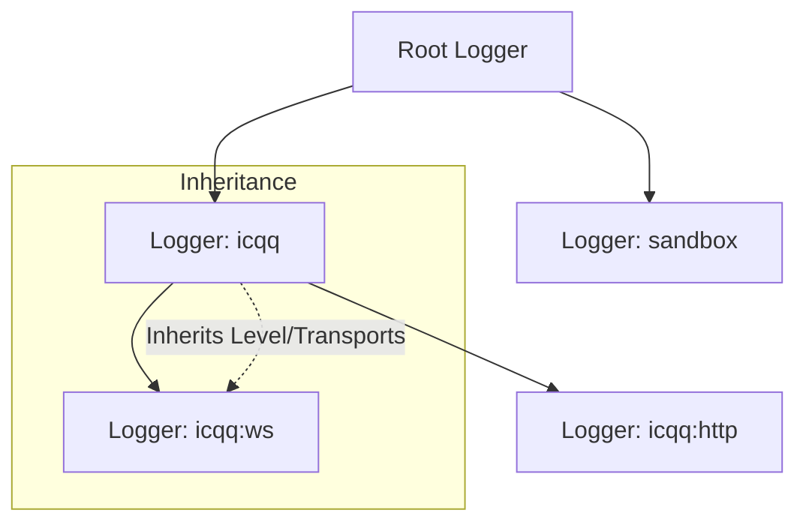
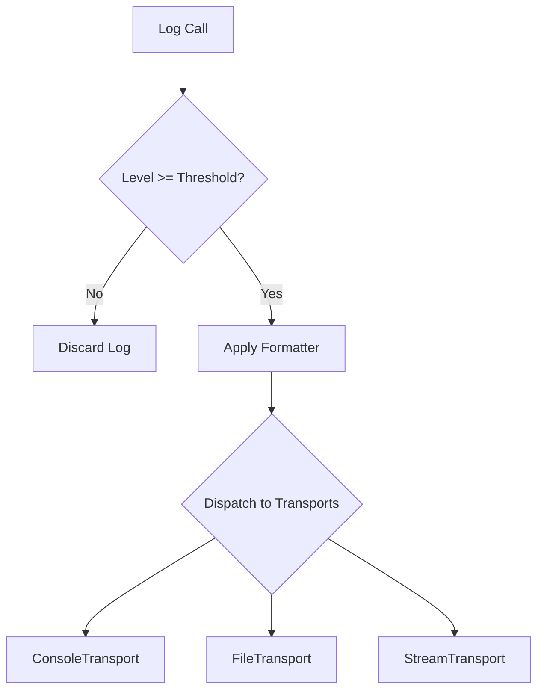

[英文原文](/en/wiki/cubic/logging)

::: warning 第三方生成的参考快照
[Cubic 原页面](https://www.cubic.dev/wikis/zhinjs/zhin?page=page-logging) · 抓取于 2026-09-23 · [源码提交](https://github.com/zhinjs/zhin/commit/368db14caa4aa91311fb090f07bd792fe4b22fe7)。本页由英文快照机器辅助翻译，尚未逐页与当前代码核验；实际开发请以[维护中的 Zhin 文档](/getting-started/)和[资料存档勘误](/wiki/archive)为准。
:::

::: details 相关源文件

以下文件是 Cubic 生成本页时引用的上下文：

- [basic/logger/src/logger.ts](https://github.com/zhinjs/zhin/blob/368db14caa4aa91311fb090f07bd792fe4b22fe7/basic/logger/src/logger.ts)
- [packages/im/plugin-runtime/src/system-log.ts](https://github.com/zhinjs/zhin/blob/368db14caa4aa91311fb090f07bd792fe4b22fe7/packages/im/plugin-runtime/src/system-log.ts)
- [basic/logger/README.md](https://github.com/zhinjs/zhin/blob/368db14caa4aa91311fb090f07bd792fe4b22fe7/basic/logger/README.md)
- [basic/logger/tests/logger.test.ts](https://github.com/zhinjs/zhin/blob/368db14caa4aa91311fb090f07bd792fe4b22fe7/basic/logger/tests/logger.test.ts)
- [basic/logger/package.json](https://github.com/zhinjs/zhin/blob/368db14caa4aa91311fb090f07bd792fe4b22fe7/basic/logger/package.json)
- [SECURITY.md](https://github.com/zhinjs/zhin/blob/368db14caa4aa91311fb090f07bd792fe4b22fe7/SECURITY.md)
- [basic/cli/src/commands/migrate.ts](https://github.com/zhinjs/zhin/blob/368db14caa4aa91311fb090f07bd792fe4b22fe7/basic/cli/src/commands/migrate.ts)
- [basic/cli/src/commands/setup.ts](https://github.com/zhinjs/zhin/blob/368db14caa4aa91311fb090f07bd792fe4b22fe7/basic/cli/src/commands/setup.ts)
:::

# 日志与遥测

Zhin 通过 `@zhin.js/logger` 包提供了一种高性能、结构化的日志系统。该系统支持分层命名空间、可定制的传输方式以及性能监控指标，用于追踪机器人活动和系统健康状况。

## 核心架构

日志系统以 `Logger` 类为核心，负责管理日志级别、格式化器以及输出传输通道。开发者可通过 `getLogger` 函数获取日志记录器，该函数根据名称字符串创建或获取作用域内的实例。

### 日志记录器层级结构
日志记录器遵循父级-子级的层级关系。子级日志记录器会自动继承父级的日志级别、格式化器和传输通道，除非被显式覆盖。命名空间通过冒号连接（例如：`App:Database`）。


图中展示了命名空间如何将日志记录器组织成树状结构，以实现配置的继承。
来源：[basic/logger/README.md:105-125](https://github.com/zhinjs/zhin/blob/368db14caa4aa91311fb090f07bd792fe4b22fe7/basic/logger/README.md#L105-L125), [basic/logger/tests/logger.test.ts:192-196](https://github.com/zhinjs/zhin/blob/368db14caa4aa91311fb090f07bd792fe4b22fe7/basic/logger/tests/logger.test.ts#L192-L196)

### 日志级别
Zhin 定义了五个标准的日志级别。系统会根据当前阈值过滤日志；优先级低于阈值的日志将不会被处理。

| 级别 | 值 | 描述 |
| :--- | :--- | :--- |
| `DEBUG` | 0 | 调试时的详细信息。 |
| `INFO` | 1 | 一般系统信息。 |
| `WARN` | 2 | 可能存在危害的情况。 |
| `ERROR` | 3 | 可能导致系统继续运行的错误事件。 |
| `SILENT` | 4 | 禁用所有日志输出。 |

来源：[basic/logger/README.md:310-316](https://github.com/zhinjs/zhin/blob/368db14caa4aa91311fb090f07bd792fe4b22fe7/basic/logger/README.md#L310-L316), [basic/logger/tests/logger.test.ts:60-70](https://github.com/zhinjs/zhin/blob/368db14caa4aa91311fb090f07bd792fe4b22fe7/basic/logger/tests/logger.test.ts#L60-L70)

## 日志数据流

当组件调用日志方法（例如 `logger.info()`）时，系统会将该条记录经过多个阶段进行处理：


此流程展示了日志消息从调用到最终输出的完整生命周期。
来源：[basic/logger/README.md:318-350](https://github.com/zhinjs/zhin/blob/368db14caa4aa91311fb090f07bd792fe4b22fe7/basic/logger/README.md#L318-L350), [basic/logger/tests/logger.test.ts:220-250](https://github.com/zhinjs/zhin/blob/368db14caa4aa91311fb090f07bd792fe4b22fe7/basic/logger/tests/logger.test.ts#L220-L250)

### 格式化
`DefaultFormatter` 将日志数据组织为可读的字符串。它采用标准模式：`[Date][Level] [Name] Message`。
- **日期**：格式化为 `HH:mm:ss.SSS`。
- **名称**：表示类别，根级别子项省略 `Zhin` 前缀。
- **级别**：在控制台终端中以颜色编码输出。

来源：[basic/logger/tests/logger.test.ts:160-185](https://github.com/zhinjs/zhin/blob/368db14caa4aa91311fb090f07bd792fe4b22fe7/basic/logger/tests/logger.test.ts#L160-L185), [basic/logger/README.md:40-50](https://github.com/zhinjs/zhin/blob/368db14caa4aa91311fb090f07bd792fe4b22fe7/basic/logger/README.md#L40-L50)

## 遥测与性能监控

`Logger` 类提供了内置方法用于测量执行时间。这些遥测数据有助于识别命令执行或插件初始化过程中的性能瓶颈。

- **`logger.time(label)`**：启动与提供的标签关联的高精度计时器。
- **`logger.timeEnd(label)`**：结束计时器，并以毫秒为单位记录持续时间。

```typescript
const timer = logger.time('data-processing');
// ... perform complex logic
timer.end(); // Outputs: data-processing took 12.45ms
```
来源：[basic/logger/tests/logger.test.ts:80-95](https://github.com/zhinjs/zhin/blob/368db14caa4aa91311fb090f07bd792fe4b22fe7/basic/logger/tests/logger.test.ts#L80-L95), [basic/logger/README.md:140-150](https://github.com/zhinjs/zhin/blob/368db14caa4aa91311fb090f07bd792fe4b22fe7/basic/logger/README.md#L140-L150)

## 安全与最佳实践

记录敏感信息存在安全风险。Zhin 项目指南建议在遥测和日志中采取以下具体防范措施：

1. **避免记录敏感数据**：不要在日志中记录 API 密钥、`.env` 内容、用户 ID 或内部 URL。
2. **输出内容脱敏**：在记录日志前，将敏感字段替换为 `<REDACTED>`。
3. **生产环境的日志级别**：在生产环境中将日志级别设置为 `INFO` 或 `WARN`，以减少开销并限制数据泄露。
4. **错误处理**：开发阶段应记录完整的错误堆栈，但向最终用户展示时应使用通用消息，以防止信息泄露。

来源：[SECURITY.md:85-95](https://github.com/zhinjs/zhin/blob/368db14caa4aa91311fb090f07bd792fe4b22fe7/SECURITY.md#L85-L95), [packages/toolkit/create-zhin/template/skills/summarize/SKILL.md:110-115](https://github.com/zhinjs/zhin/blob/368db14caa4aa91311fb090f07bd792fe4b22fe7/packages/toolkit/create-zhin/template/skills/summarize/SKILL.md#L110-L115)

## 使用示例

### 作用域插件日志
插件通常在初始化时创建一个作用域日志记录器，以将其日志与核心框架的日志区分开来。

```typescript
import { getLogger } from '@zhin.js/logger';

const logger = getLogger('plugin-my-feature');
logger.success('Feature initialized');
logger.warn('Configuration missing optional field: %s', 'api_key');
```
来源：[basic/logger/README.md:20-35](https://github.com/zhinjs/zhin/blob/368db14caa4aa91311fb090f07bd792fe4b22fe7/basic/logger/README.md#L20-L35), [basic/cli/src/commands/setup.ts:160](https://github.com/zhinjs/zhin/blob/368db14caa4aa91311fb090f07bd792fe4b22fe7/basic/cli/src/commands/setup.ts#L160)

### 全局配置
全局设置应用于默认日志记录器，并被所有新实例继承。

```typescript
import { setLevel, LogLevel, addTransport, FileTransport } from '@zhin.js/logger';
import fs from 'node:fs';

setLevel(LogLevel.INFO);
const stream = fs.createWriteStream('./bot.log');
addTransport(new FileTransport(stream));
```
来源：[basic/logger/README.md:265-285](https://github.com/zhinjs/zhin/blob/368db14caa4aa91311fb090f07bd792fe4b22fe7/basic/logger/README.md#L265-L285)

## 结论
Zhin中的日志与遥测系统通过其分层设计和性能追踪工具实现了强大的监控能力。通过使用作用域日志记录器和合适的传输方式，开发者可以在遵守安全最佳实践的同时，清晰地观察到机器人行为的运行状况。
