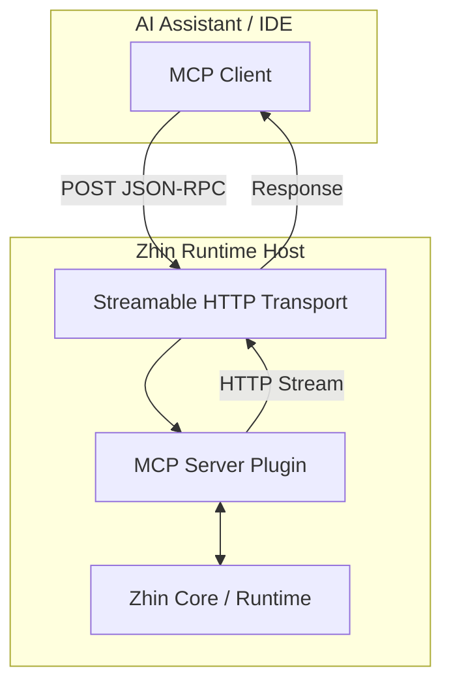
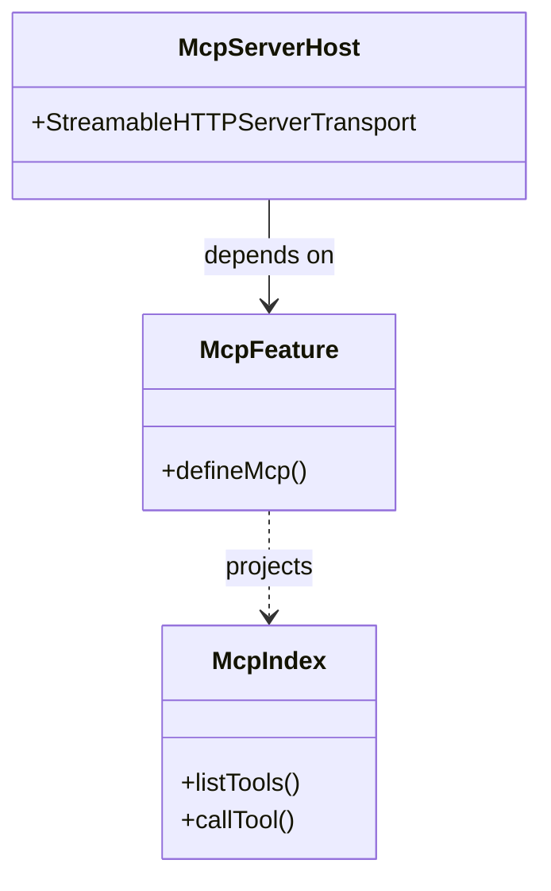

[英文原文](/en/wiki/cubic/mcp)

::: warning 第三方生成的参考快照
[Cubic 原页面](https://www.cubic.dev/wikis/zhinjs/zhin?page=page-mcp) · 抓取于 2026-09-23 · [源码提交](https://github.com/zhinjs/zhin/commit/368db14caa4aa91311fb090f07bd792fe4b22fe7)。本页由英文快照机器辅助翻译，尚未逐页与当前代码核验；实际开发请以[维护中的 Zhin 文档](/getting-started/)和[知识库勘误](/wiki/)为准。
:::

::: danger 已确认勘误
当前可选 Runtime Host **只注册 Tool**，且仅在显式配置顶层 `mcp:` 时挂载。`ai.mcpServers` 配置的是独立的 Agent MCP 客户端。下文关于生成器、Resource、Prompt 和默认启用服务端的描述已经过时。参见 [Host 实现](https://github.com/zhinjs/zhin/blob/main/packages/host/mcp/src/runtime.ts)及 [MCP 文档修正](https://github.com/zhinjs/zhin/pull/684)。
:::

::: details 相关源文件

以下文件是 Cubic 生成本页时引用的上下文：

- [packages/host/mcp/README.md](https://github.com/zhinjs/zhin/blob/368db14caa4aa91311fb090f07bd792fe4b22fe7/packages/host/mcp/README.md)
- [packages/host/mcp/package.json](https://github.com/zhinjs/zhin/blob/368db14caa4aa91311fb090f07bd792fe4b22fe7/packages/host/mcp/package.json)
- [packages/im/runtime/tests/agent-feature-hmr.test.ts](https://github.com/zhinjs/zhin/blob/368db14caa4aa91311fb090f07bd792fe4b22fe7/packages/im/runtime/tests/agent-feature-hmr.test.ts)
- [AGENTS.md](https://github.com/zhinjs/zhin/blob/368db14caa4aa91311fb090f07bd792fe4b22fe7/AGENTS.md)
- [README.md](https://github.com/zhinjs/zhin/blob/368db14caa4aa91311fb090f07bd792fe4b22fe7/README.md)
- [packages/host/mcp/tests/index.test.ts](https://github.com/zhinjs/zhin/blob/368db14caa4aa91311fb090f07bd792fe4b22fe7/packages/host/mcp/tests/index.test.ts)
:::

# 模型上下文协议（MCP）

模型上下文协议（MCP）为AI助手提供了与Zhin框架交互的服务。它使大语言模型（LLMs）能够理解、查询并生成Zhin特定的实体，例如插件、命令和适配器。来源：[packages/host/mcp/README.md:1-7](https://github.com/zhinjs/zhin/blob/368db14caa4aa91311fb090f07bd792fe4b22fe7/packages/host/mcp/README.md#L1-L7)，[README.md:110-120](https://github.com/zhinjs/zhin/blob/368db14caa4aa91311fb090f07bd792fe4b22fe7/README.md#L110-L120)

该实现主要位于`@zhin.js/mcp`包中。它利用官方的`@modelcontextprotocol/sdk`来向Claude Desktop、Cursor或自定义AI Agent等客户端暴露工具（Tools）、资源（Resources）和提示（Prompts）。来源：[packages/host/mcp/package.json:44-50](https://github.com/zhinjs/zhin/blob/368db14caa4aa91311fb090f07bd792fe4b22fe7/packages/host/mcp/package.json#L44-L50)，[packages/host/mcp/README.md:9-15](https://github.com/zhinjs/zhin/blob/368db14caa4aa91311fb090f07bd792fe4b22fe7/packages/host/mcp/README.md#L9-L15)

## 架构与传输

Zhin MCP服务器作为一个无状态服务，采用一种名为**流式HTTP**的现代传输方式运行。该传输机制通过向指定端点发送独立的POST请求来处理请求。来源：[packages/host/mcp/README.md:12](https://github.com/zhinjs/zhin/blob/368db14caa4aa91311fb090f07bd792fe4b22fe7/packages/host/mcp/README.md#L12)，[packages/host/mcp/README.md:36-40](https://github.com/zhinjs/zhin/blob/368db14caa4aa91311fb090f07bd792fe4b22fe7/packages/host/mcp/README.md#L36-L40)

### 通信流程

以下示意图展示了AI助手如何通过MCP层与Zhin运行时进行通信。


MCP 服务器作为一个主机插件，在运行时由 Zhin CLI 自动组装。来源：[packages/host/mcp/README.md:29-35](https://github.com/zhinjs/zhin/blob/368db14caa4aa91311fb090f07bd792fe4b22fe7/packages/host/mcp/README.md#L29-L35)，[AGENTS.md:100-110](https://github.com/zhinjs/zhin/blob/368db14caa4aa91311fb090f07bd792fe4b22fe7/AGENTS.md#L100-L110)

### 连接参数
客户端必须配置 HTTP URL 而非长期连接（如 `curl -N`）。默认端点通常运行在 8086 端口。来源：[packages/host/mcp/README.md:38-42](https://github.com/zhinjs/zhin/blob/368db14caa4aa91311fb090f07bd792fe4b22fe7/packages/host/mcp/README.md#L38-L42)，[packages/host/mcp/README.md:126-135](https://github.com/zhinjs/zhin/blob/368db14caa4aa91311fb090f07bd792fe4b22fe7/packages/host/mcp/README.md#L126-L135)

## 核心能力

该协议实现了三个主要能力集：工具（Tools）、资源（Resources）和提示（Prompts）。来源：[packages/host/mcp/README.md:11](https://github.com/zhinjs/zhin/blob/368db14caa4aa91311fb090f07bd792fe4b22fe7/packages/host/mcp/README.md#L11)

### 1. 工具
工具使 AI 助手能够在 Zhin 环境中执行操作。服务器提供用于生成样板代码的生成器，以及用于 introspection 的查询工具。来源：[packages/host/mcp/README.md:65-112](https://github.com/zhinjs/zhin/blob/368db14caa4aa91311fb090f07bd792fe4b22fe7/packages/host/mcp/README.md#L65-L112)

| 工具名称 | 描述 | 所需参数 |
|---------|------|---------|
| `create_plugin` | 创建新的 Zhin 插件文件结构。 | `name`, `description` |
| `create_command` | 使用 Next.js 风格模式生成命令代码片段。 | `pattern`, `description` |
| `create_component` | 生成消息组件代码。 | `name`, `props` |
| `create_adapter` | 生成平台适配器代码（例如 Telegram、Discord）。 | `name`, `description` |
| `create_model` | 生成数据库模型定义。 | `name`, `fields` |
| `query_plugin` | 获取特定已加载插件的详细信息。 | `pluginName` |
| `list_plugins` | 列出 Zhin 实例中当前所有活动的插件。 | 无 |

来源：[packages/host/mcp/README.md:67-105](https://github.com/zhinjs/zhin/blob/368db14caa4aa91311fb090f07bd792fe4b22fe7/packages/host/mcp/README.md#L67-L105)

### 2. 资源
资源为AI助手提供静态或动态的上下文数据。Zhin通过`zhin://` URI协议方案暴露其内部文档和示例。来源：[packages/host/mcp/README.md:113-125](https://github.com/zhinjs/zhin/blob/368db14caa4aa91311fb090f07bd792fe4b22fe7/packages/host/mcp/README.md#L113-L125)

*   **文档**：`zhin://docs/architecture`，`zhin://docs/plugin-development`，`zhin://docs/command-system`。
*   **示例**：`zhin://examples/basic-plugin`，`zhin://examples/adapter`。

### 3. 提示
提示定义了AI应遵循的标准工作流。来源：[packages/host/mcp/README.md:126-140](https://github.com/zhinjs/zhin/blob/368db14caa4aa91311fb090f07bd792fe4b22fe7/packages/host/mcp/README.md#L126-L140)

*   **`create-plugin-workflow`**：指导AI完成命令、中间件或组件的创建。
*   **`debug-plugin`**：提供排查Zhin错误的步骤和技巧。
*   **`best-practices`**：建议适用于Zhin框架的开发模式。

## 配置

MCP默认启用，配置文件为`zhin.config.yml`。服务器需要Zhin HTTP主机处于激活状态。来源：[packages/host/mcp/README.md:29-35](https://github.com/zhinjs/zhin/blob/368db14caa4aa91311fb090f07bd792fe4b22fe7/packages/host/mcp/README.md#L29-L35)，[packages/host/mcp/README.md:148-155](https://github.com/zhinjs/zhin/blob/368db14caa4aa91311fb090f07bd792fe4b22fe7/packages/host/mcp/README.md#L148-L155)

```yaml
mcp:
  enabled: true
  path: /mcp
http:
  port: 8086
```
来源：[packages/host/mcp/README.md:32-35](https://github.com/zhinjs/zhin/blob/368db14caa4aa91311fb090f07bd792fe4b22fe7/packages/host/mcp/README.md#L32-L35), [packages/host/mcp/README.md:164-170](https://github.com/zhinjs/zhin/blob/368db14caa4aa91311fb090f07bd792fe4b22fe7/packages/host/mcp/README.md#L164-L170)

### 依赖层级
MCP功能分为主机实现和内部特性协议两部分。来源：[packages/im/runtime/tests/agent-feature-hmr.test.ts:25-35](https://github.com/zhinjs/zhin/blob/368db14caa4aa91311fb090f07bd792fe4b22fe7/packages/im/runtime/tests/agent-feature-hmr.test.ts#L25-L35)，[packages/host/mcp/package.json:1-20](https://github.com/zhinjs/zhin/blob/368db14caa4aa91311fb090f07bd792fe4b22fe7/packages/host/mcp/package.json#L1-L20)


来源：[packages/im/runtime/tests/agent-feature-hmr.test.ts:140-150](https://github.com/zhinjs/zhin/blob/368db14caa4aa91311fb090f07bd792fe4b22fe7/packages/im/runtime/tests/agent-feature-hmr.test.ts#L140-L150), [packages/host/mcp/package.json:44-50](https://github.com/zhinjs/zhin/blob/368db14caa4aa91311fb090f07bd792fe4b22fe7/packages/host/mcp/package.json#L44-L50)

## 实现细节

MCP 服务器依赖 `McpIndex` 来管理工具的执行与发现。在热模块替换（HMR）事件期间，可以通过候选生成来投影 MCP 定义，而无需重启核心插件配置。来源：[packages/im/runtime/tests/agent-feature-hmr.test.ts:36-55](https://github.com/zhinjs/zhin/blob/368db14caa4aa91311fb090f07bd792fe4b22fe7/packages/im/runtime/tests/agent-feature-hmr.test.ts#L36-L55)

### 入口点验证
该包提供标准入口点 `src/index.ts`，并明确导出了 `adapter-tools-helper` 和 `runtime`。来源：[packages/host/mcp/package.json:7-25](https://github.com/zhinjs/zhin/blob/368db14caa4aa91311fb090f07bd792fe4b22fe7/packages/host/mcp/package.json#L7-L25)，[packages/host/mcp/tests/index.test.ts:5-15](https://github.com/zhinjs/zhin/blob/368db14caa4aa91311fb090f07bd792fe4b22fe7/packages/host/mcp/tests/index.test.ts#L5-L15)

### 手动烟雾测试
你可以通过发送 JSON-RPC `initialize` 请求来验证 MCP 服务器状态，使用 `curl`：
```bash
curl -sS -X POST http://127.0.0.1:8086/mcp \
  -H 'Content-Type: application/json' \
  -d '{"jsonrpc":"2.0","id":1,"method":"initialize","params":{"protocolVersion":"2024-11-05","capabilities":{},"clientInfo":{"name":"curl","version":"1.0"}}}'
```
来源：[packages/host/mcp/README.md:58-62](https://github.com/zhinjs/zhin/blob/368db14caa4aa91311fb090f07bd792fe4b22fe7/packages/host/mcp/README.md#L58-L62)

## 概述
Zhin MCP 实现连接了 TypeScript 框架与 AI 开发工具之间。通过提供结构化的代码生成和系统查询接口，它支持一种“以 AI 为核心”的开发体验，使助手能够自主管理 Zhin 插件和配置。来源：[packages/host/mcp/README.md:1-20](https://github.com/zhinjs/zhin/blob/368db14caa4aa91311fb090f07bd792fe4b22fe7/packages/host/mcp/README.md#L1-L20)，[README.md:65-75](https://github.com/zhinjs/zhin/blob/368db14caa4aa91311fb090f07bd792fe4b22fe7/README.md#L65-L75)
