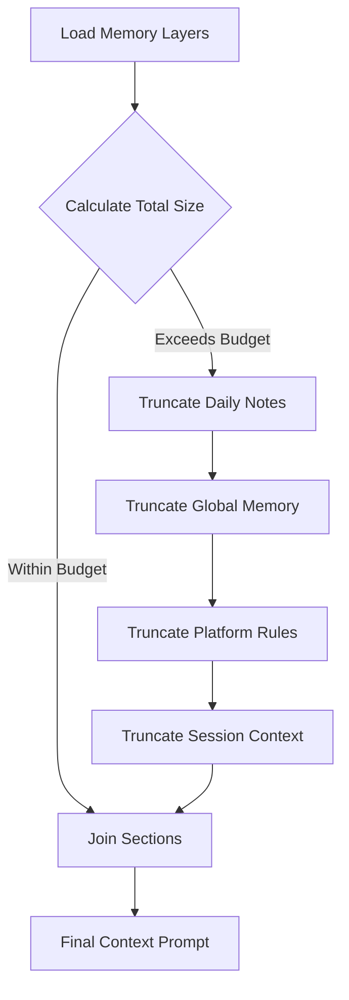
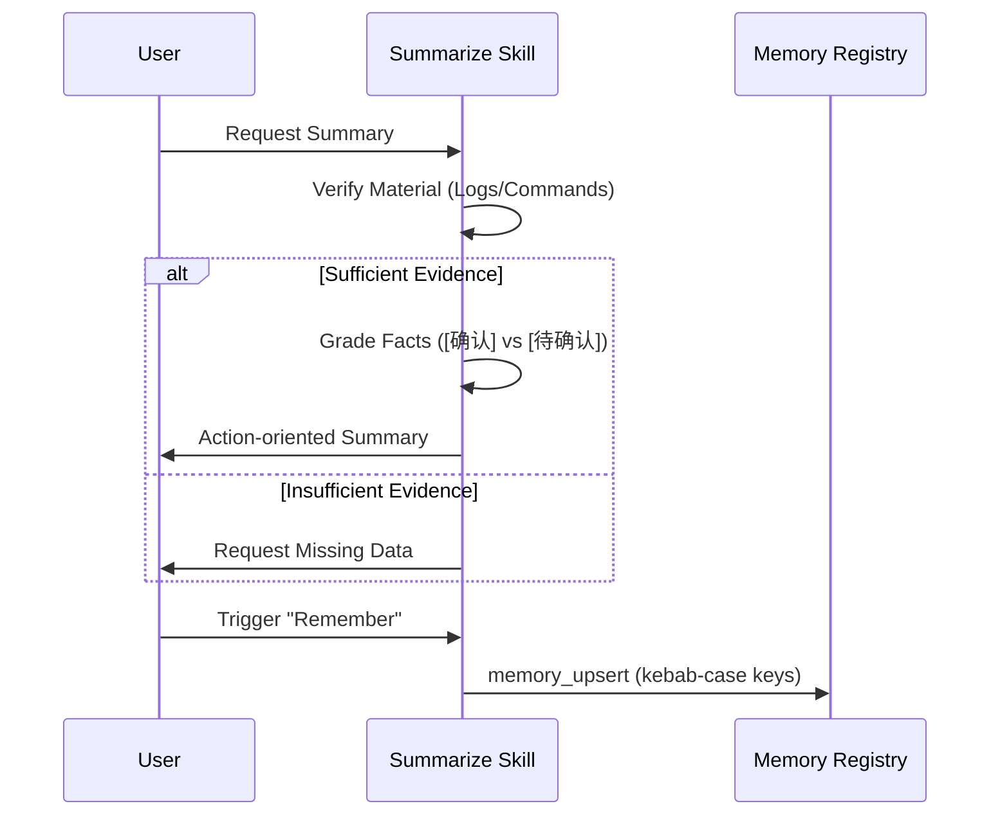

[英文原文](/en/wiki/cubic/memory)

::: warning 第三方生成的参考快照
[Cubic 原页面](https://www.cubic.dev/wikis/zhinjs/zhin?page=page-memory) · 抓取于 2026-09-23 · [源码提交](https://github.com/zhinjs/zhin/commit/368db14caa4aa91311fb090f07bd792fe4b22fe7)。本页由英文快照机器辅助翻译，尚未逐页与当前代码核验；实际开发请以[维护中的 Zhin 文档](/getting-started/)和[知识库勘误](/wiki/)为准。
:::

::: details 相关源文件

以下文件是 Cubic 生成本页时引用的上下文：

- [packages/im/agent/src/memory-layers.ts](https://github.com/zhinjs/zhin/blob/368db14caa4aa91311fb090f07bd792fe4b22fe7/packages/im/agent/src/memory-layers.ts)
- [packages/im/agent/src/bootstrap.ts](https://github.com/zhinjs/zhin/blob/368db14caa4aa91311fb090f07bd792fe4b22fe7/packages/im/agent/src/bootstrap.ts)
- [packages/toolkit/create-zhin/template/skills/summarize/SKILL.md](https://github.com/zhinjs/zhin/blob/368db14caa4aa91311fb090f07bd792fe4b22fe7/packages/toolkit/create-zhin/template/skills/summarize/SKILL.md)
- [packages/im/agent/tests/workroom/project-knowledge-registry.test.ts](https://github.com/zhinjs/zhin/blob/368db14caa4aa91311fb090f07bd792fe4b22fe7/packages/im/agent/tests/workroom/project-knowledge-registry.test.ts)
- [basic/cli/src/commands/setup.ts](https://github.com/zhinjs/zhin/blob/368db14caa4aa91311fb090f07bd792fe4b22fe7/basic/cli/src/commands/setup.ts)
- [examples/full-bot/skills/memory-consolidate/SKILL.md](https://github.com/zhinjs/zhin/blob/368db14caa4aa91311fb090f07bd792fe4b22fe7/examples/full-bot/skills/memory-consolidate/SKILL.md)
:::

# 记忆、上下文与压缩

记忆、上下文和压缩是 Zhin.js 中用于管理长期持久化、短期会话上下文以及将信息压缩为可操作摘要的系统。该架构通过分层存储和结构化摘要，使 AI Agent 能在对话中保持连贯性，同时通过分层存储机制控制在令牌限制内的运行。

该系统将数据划分为不同层级的敏感性和作用范围，从全局部署级规则到特定会话的内存信息。压缩工作流确保仅保留经过验证的事实，防止冗余或未经证实信息的不断累积。

## 分层记忆架构

Zhin.js 实现了一种基于文件的分层记忆系统，按作用范围组织信息。`loadMemoryLayers` 函数将这些层级整合为供 Agent 使用的统一提示上下文。

### 记忆层级
记忆被划分为四个主要部分：
*   **全局记忆**：部署范围内的指令和长期事实，存储于 `data/memory/global/MEMORY.md` 中。
*   **每日笔记**：与当前日期相关的临时事实，以 `YYYY-MM-DD.md` 形式存储。
*   **平台记忆**：特定平台（如 Discord、Telegram）的规则和适配器特定配置。
*   **会话记忆**：与特定 `sessionKey` 关联的对话上下文，使 Agent 能在单次对话中记住用户特定的细节。

来源：[packages/im/agent/src/memory-layers.ts:7-10](https://github.com/zhinjs/zhin/blob/368db14caa4aa91311fb090f07bd792fe4b22fe7/packages/im/agent/src/memory-layers.ts#L7-L10), [packages/im/agent/src/memory-layers.ts:114-159](https://github.com/zhinjs/zhin/blob/368db14caa4aa91311fb090f07bd792fe4b22fe7/packages/im/agent/src/memory-layers.ts#L114-L159)

### 预算管理
为防止上下文窗口溢出，系统为每个记忆层设置字符预算。若内容总量超过限制，系统将按特定顺序截断各层：`daily` → `global` → `platform` → `session`。

| 层级 | 默认预算（字符数） | 用途 |
| :--- | :--- | :--- |
| 会话层 | 8,000 | 保证近期对话的连贯性 |
| 平台层 | 4,000 | 存储平台特定的行为规则 |
| 全局层 | 4,000 | 存储跨项目常量和事实信息 |
| 日常层 | 2,000 | 提供当前日期的上下文信息 |

来源：[packages/im/agent/src/memory-layers.ts:18-30](https://github.com/zhinjs/zhin/blob/368db14caa4aa91311fb090f07bd792fe4b22fe7/packages/im/agent/src/memory-layers.ts#L18-L30), [packages/im/agent/src/memory-layers.ts:184-219](https://github.com/zhinjs/zhin/blob/368db14caa4aa91311fb090f07bd792fe4b22fe7/packages/im/agent/src/memory-layers.ts#L184-L219)

图表展示了基于优先级的截断流程，用于确保组合记忆提示符符合系统限制。来源：[packages/im/agent/src/memory-layers.ts:184-219](https://github.com/zhinjs/zhin/blob/368db14caa4aa91311fb090f07bd792fe4b22fe7/packages/im/agent/src/memory-layers.ts#L184-L219)

## 启动文件和角色设定

启动文件定义了Agent 的核心身份和操作准则。这些文件通常在项目骨架搭建或实例初始化时加载。

### 核心启动文件
*   **SOUL.md**：定义了Agent 的性格、价值观和工作方式。它强调行动导向的行为和简洁的沟通。
*   **TOOLS.md**：提供了工具使用指南，包括对shell命令和文件操作的风险评估。
*   **AGENTS.md**：作为持久化记忆、用户偏好和待办事项列表的主要入口。

来源：[packages/im/agent/src/bootstrap.ts:32-40](https://github.com/zhinjs/zhin/blob/368db14caa4aa91311fb090f07bd792fe4b22fe7/packages/im/agent/src/bootstrap.ts#L32-L40), [basic/cli/src/commands/setup.ts:24-106](https://github.com/zhinjs/zhin/blob/368db14caa4aa91311fb090f07bd792fe4b22fe7/basic/cli/src/commands/setup.ts#L24-L106)

### 加载机制
系统会在项目根目录和`data/`目录中搜索启动文件。它通过`ContextFile`接口将这些内容注入到系统提示中，并设置总最大限制（默认48KB），以防止提示注入攻击。

来源：[packages/im/agent/src/bootstrap.ts:50-70](https://github.com/zhinjs/zhin/blob/368db14caa4aa91311fb090f07bd792fe4b22fe7/packages/im/agent/src/bootstrap.ts#L50-L70), [packages/im/agent/src/bootstrap.ts:119-150](https://github.com/zhinjs/zhin/blob/368db14caa4aa91311fb090f07bd792fe4b22fe7/packages/im/agent/src/bootstrap.ts#L119-L150)

## 压缩与摘要

压缩是将大量数据（如日志、长对话或CI失败记录）压缩为带有证据标签的摘要的过程。

### 事实评级系统
摘要技能强制执行严格的评级系统，以确保技术准确性：
*   **`[确认]`（已确认）**：有命令输出、文件内容或可复现日志支持的事实，将置于“已完成”部分。
*   **`[待确认]`（待确认）**：对话中提及但尚未验证的主张，将置于“待处理”或“阻塞”部分。
*   **禁止**：在无证据支持的情况下推断因果关系是严格禁止的。

来源：[packages/toolkit/create-zhin/template/skills/summarize/SKILL.md:65-80](https://github.com/zhinjs/zhin/blob/368db14caa4aa91311fb090f07bd792fe4b22fe7/packages/toolkit/create-zhin/template/skills/summarize/SKILL.md#L65-L80)

### 总结工作流
1. **受众检查**：判断总结是用于交接、问题/拉取请求，还是用于持久化记忆。
2. **材料验证**：检查是否存在必要的日志、已执行的命令和文件路径。
3. **模式选择**：如果证据不足，使用“材料不足模式”，仅列出缺失项，而不做结论。
4. **敏感信息脱敏**：在输出总结前，自动屏蔽令牌、密钥和私有ID。

来源：[packages/toolkit/create-zhin/template/skills/summarize/SKILL.md:23-63](https://github.com/zhinjs/zhin/blob/368db14caa4aa91311fb090f07bd792fe4b22fe7/packages/toolkit/create-zhin/template/skills/summarize/SKILL.md#L23-L63), [packages/toolkit/create-zhin/template/skills/summarize/SKILL.md:129-131](https://github.com/zhinjs/zhin/blob/368db14caa4aa91311fb090f07bd792fe4b22fe7/packages/toolkit/create-zhin/template/skills/summarize/SKILL.md#L129-L131)

此流程展示了系统如何从原始对话逐步过渡到结构化摘要，最终固化为持久记忆。来源：[packages/toolkit/create-zhin/template/skills/summarize/SKILL.md:15-100](https://github.com/zhinjs/zhin/blob/368db14caa4aa91311fb090f07bd792fe4b22fe7/packages/toolkit/create-zhin/template/skills/summarize/SKILL.md#L15-L100)，[examples/full-bot/skills/memory-consolidate/SKILL.md:16-25](https://github.com/zhinjs/zhin/blob/368db14caa4aa91311fb090f07bd792fe4b22fe7/examples/full-bot/skills/memory-consolidate/SKILL.md#L16-L25)

## 项目知识注册库

`ProjectKnowledgeRegistry` 负责管理权威性的结构化知识，并将其与临时执行数据隔离。

### 知识特性
*   **仅接受权威来源**：注册库仅接受如 `acceptance_record`、`accepted_task_memory` 和 `sponsor_decision` 这类权威来源的知识。它拒绝原始对话记录或执行日志。
*   **领域隔离**：知识按 `projectId` 进行划分。注册库防止敏感数据（如个人身份信息，PII）在项目间泄露。
*   **冲突解决**：对于存在冲突的知识条目，其替换或回滚操作需获得“赞助决策”权限。

来源：[packages/im/agent/tests/workroom/project-knowledge-registry.test.ts:48-90](https://github.com/zhinjs/zhin/blob/368db14caa4aa91311fb090f07bd792fe4b22fe7/packages/im/agent/tests/workroom/project-knowledge-registry.test.ts#L48-L90)

### 数据结构
知识条目包含一个 `governedContent` 引用和一个 `schema` 引用。敏感级别（标准、受限、高）控制内容的加载和显示方式。

来源：[packages/im/agent/tests/workroom/project-knowledge-registry.test.ts:34-45](https://github.com/zhinjs/zhin/blob/368db14caa4aa91311fb090f07bd792fe4b22fe7/packages/im/agent/tests/workroom/project-knowledge-registry.test.ts#L34-L45)

## 内存整合

整合在工作间运行结束时或由用户显式触发时（例如说“记住这一点”）发生。

*   **去重**：在写入之前，系统会运行 `memory_search` 以避免重复的键值。
*   **粒度**：事实以短且可搜索的字符串形式存储（长度不超过 200 个字符）。
*   **键值格式**：键值采用 `type:identifier` 格式，例如 `capability:workroom_kernel_v1` 或 `preference:language`。

来源：[examples/full-bot/skills/memory-consolidate/SKILL.md:11-25](https://github.com/zhinjs/zhin/blob/368db14caa4aa91311fb090f07bd792fe4b22fe7/examples/full-bot/skills/memory-consolidate/SKILL.md#L11-L25)

内存、上下文与压缩系统通过严格区分已验证事实与对话噪音，并对所有上下文数据实施分层访问和大小限制，确保 Zhin.js Agent 在运行过程中具备高度的可靠性。
