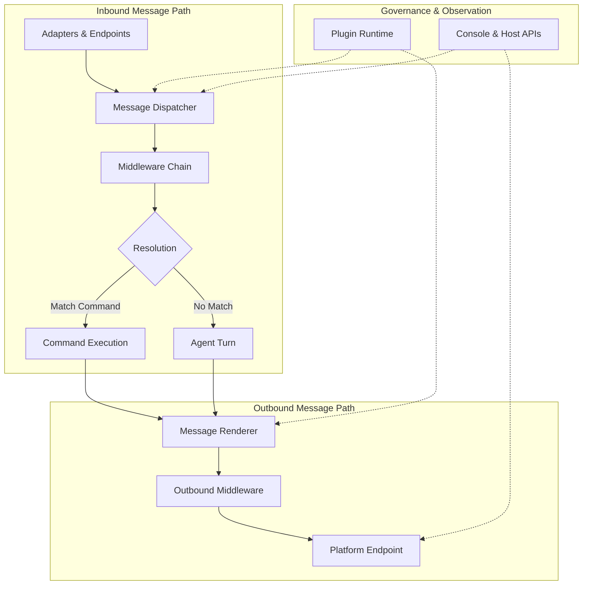
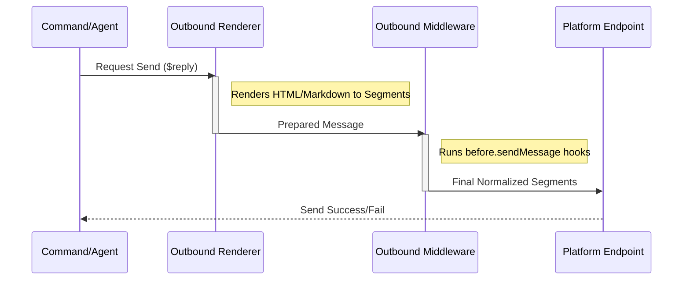

[英文原文](/en/wiki/cubic/message-flow)

::: warning 第三方生成的参考快照
[Cubic 原页面](https://www.cubic.dev/wikis/zhinjs/zhin?page=page-message-flow) · 抓取于 2026-09-23 · [源码提交](https://github.com/zhinjs/zhin/commit/368db14caa4aa91311fb090f07bd792fe4b22fe7)。本页由英文快照机器辅助翻译，尚未逐页与当前代码核验；实际开发请以[维护中的 Zhin 文档](/getting-started/)和[资料存档勘误](/wiki/archive)为准。
:::

::: details 相关源文件

以下文件是 Cubic 生成本页时引用的上下文：

- [packages/im/core/src/plugin-runtime/im/im-runtime.ts](https://github.com/zhinjs/zhin/blob/368db14caa4aa91311fb090f07bd792fe4b22fe7/packages/im/core/src/plugin-runtime/im/im-runtime.ts)
- [packages/im/core/src/plugin-runtime/im/message-dispatcher.ts](https://github.com/zhinjs/zhin/blob/368db14caa4aa91311fb090f07bd792fe4b22fe7/packages/im/core/src/plugin-runtime/im/message-dispatcher.ts)
- [packages/im/core/src/plugin-runtime/im/outbound-delivery-runtime.ts](https://github.com/zhinjs/zhin/blob/368db14caa4aa91311fb090f07bd792fe4b22fe7/packages/im/core/src/plugin-runtime/im/outbound-delivery-runtime.ts)
- [README.md](https://github.com/zhinjs/zhin/blob/368db14caa4aa91311fb090f07bd792fe4b22fe7/README.md)
- [CLAUDE.md](https://github.com/zhinjs/zhin/blob/368db14caa4aa91311fb090f07bd792fe4b22fe7/CLAUDE.md)
- [packages/README.md](https://github.com/zhinjs/zhin/blob/368db14caa4aa91311fb090f07bd792fe4b22fe7/packages/README.md)
- [AGENTS.md](https://github.com/zhinjs/zhin/blob/368db14caa4aa91311fb090f07bd792fe4b22fe7/AGENTS.md)
:::

# 入站与出站消息链路

Zhin.js 实现了一种标准化的消息流架构，以支持与 20 多个聊天平台的多通道通信。消息流水线确保无论消息来源是哪个平台（如 QQ、微信、Discord 等），消息都会经过一致且受控的分层处理流程，包括适配器、中间件和 AI Agent。

来源：[README.md](https://github.com/zhinjs/zhin/blob/368db14caa4aa91311fb090f07bd792fe4b22fe7/README.md), [CLAUDE.md](https://github.com/zhinjs/zhin/blob/368db14caa4aa91311fb090f07bd792fe4b22fe7/CLAUDE.md)

## 管道架构

该管道由多个模块化层组成，控制消息从接入到交付的全生命周期。IM 核心保持轻量化，而人工智能、语音和丰富媒体等高级功能则根据需要按需叠加。

该图展示了从平台输入到平台输出的流程，突出了调度器和渲染器的作用。
来源：[README.md:58-71](https://github.com/zhinjs/zhin/blob/368db14caa4aa91311fb090f07bd792fe4b22fe7/README.md#L58-L71), [CLAUDE.md:65-68](https://github.com/zhinjs/zhin/blob/368db14caa4aa91311fb090f07bd792fe4b22fe7/CLAUDE.md#L65-L68)

### 架构层级
管道逻辑被分布到特定的包层级中，以保持严格的依赖方向：
*   **im/core**：标准的IM运行时、消息合约及输出渲染。
*   **im/adapter**：协议特定的规范化处理。
*   **im/agent**：任务编排、安全策略和AI集成。

来源：[CLAUDE.md:37-48](https://github.com/zhinjs/zhin/blob/368db14caa4aa91311fb090f07bd792fe4b22fe7/CLAUDE.md#L37-L48), [packages/README.md:27-46](https://github.com/zhinjs/zhin/blob/368db14caa4aa91311fb090f07bd792fe4b22fe7/packages/README.md#L27-L46)

## 入站消息流

入站处理将平台特定的原始数据转换为标准化的 `Message` 对象。`MessageDispatcher` 负责处理这些入站信号的路由和生命周期事件。

### 分发阶段
1.  **标准化**：平台适配器将原始事件转换为标准格式。
2.  **入站**：`MessageDispatcher` 接收标准化的数据流。
3.  **中间件处理**：消息依次通过一系列中间件进行验证、日志记录或修改。
4. **目标解析**：系统判断该消息是否匹配已注册的命令，或应路由至 Agent Turn。

来源：[README.md:52-57](https://github.com/zhinjs/zhin/blob/368db14caa4aa91311fb090f07bd792fe4b22fe7/README.md#L52-L57), [CLAUDE.md:80-92](https://github.com/zhinjs/zhin/blob/368db14caa4aa91311fb090f07bd792fe4b22fe7/CLAUDE.md#L80-L92), [AGENTS.md:120-130](https://github.com/zhinjs/zhin/blob/368db14caa4aa91311fb090f07bd792fe4b22fe7/AGENTS.md#L120-L130)

### 入口组件
| 组件 | 责任 |
| :--- | :--- |
| **适配器** | 将外部平台事件转换为标准化的 Zhin 消息。 |
| **分发器** | 管理 inbound 消息路由到命令或代理。 |
| **中间件** | 截获消息以执行权限或过滤等横切关注点。 |

来源：[packages/README.md:30-45](https://github.com/zhinjs/zhin/blob/368db14caa4aa91311fb090f07bd792fe4b22fe7/packages/README.md#L30-L45), [CLAUDE.md:52-53](https://github.com/zhinjs/zhin/blob/368db14caa4aa91311fb090f07bd792fe4b22fe7/CLAUDE.md#L52-L53)

## 出站消息流

出站管道是一个受控的“发送链路”，不得绕过。所有传出的通信必须通过 `OutboundDeliveryRuntime` 及其关联的渲染器，以确保一致性和可观测性。

### 出站流程
1. **发起**：某个组件调用 `Message.$reply` 或 `Adapter.sendMessage`。
2. **渲染**：`OutboundRenderer` 处理内容，将抽象形式（如 Markdown 或 HTML）转换为平台特定的片段。
3. **治理中间件**：出站中间件（如 `before.sendMessage`）执行最终检查或转换操作。
4. **平台交付**：交付运行时将处理后的消息传递给具体的平台端点。

来源：[CLAUDE.md:65-68](https://github.com/zhinjs/zhin/blob/368db14caa4aa91311fb090f07bd792fe4b22fe7/CLAUDE.md#L65-L68), [AGENTS.md:120-130](https://github.com/zhinjs/zhin/blob/368db14caa4aa91311fb090f07bd792fe4b22fe7/AGENTS.md#L120-L130), [README.md:125-132](https://github.com/zhinjs/zhin/blob/368db14caa4aa91311fb090f07bd792fe4b22fe7/README.md#L125-L132)

序列图展示了所有传出消息的必经路径，确保没有组件绕过平台特定的渲染逻辑。
来源：[CLAUDE.md:65-68](https://github.com/zhinjs/zhin/blob/368db14caa4aa91311fb090f07bd792fe4b22fe7/CLAUDE.md#L65-L68), [README.md:52-57](https://github.com/zhinjs/zhin/blob/368db14caa4aa91311fb090f07bd792fe4b22fe7/README.md#L52-L57)
## 组织与限制

管道在严格的架构规则下运行，以确保稳定性和安全性。

### 关键约束
*   **不可绕过的发送链路**：所有出站消息必须通过标准路径流转：`Message.$reply` / `Adapter.sendMessage` -> `renderSendMessage` -> `before.sendMessage` -> Endpoint。
*   **依赖方向**：底层模块（内核、AI）严禁从高层模块（核心、代理、Zhin）导入。调度器和分发运行时位于 `core` 模块，作为集成的接入点。
*   **生成上下文作用域**：管道状态通过 `Generation View` 快照进行管理。这防止了在插件热重载过程中出现模块级单例泄漏问题。
来源：[CLAUDE.md:118-130](https://github.com/zhinjs/zhin/blob/368db14caa4aa91311fb090f07bd792fe4b22fe7/CLAUDE.md#L118-L130), [AGENTS.md:120-135](https://github.com/zhinjs/zhin/blob/368db14caa4aa91311fb090f07bd792fe4b22fe7/AGENTS.md#L120-L135)

### 消息功能支持
该管道根据安装的包依赖支持多种媒体层级：
*   **丰富媒体**：支持图片、文件和卡片的收发。
*   **语音**：支持语音转文本（STT）和文本转语音（TTS）。
*   **AI集成**：在涉及记忆和工具执行的对话轮次中，无缝切换至 `ZhinAgent` 处理。

来源：[README.md:125-132](https://github.com/zhinjs/zhin/blob/368db14caa4aa91311fb090f07bd792fe4b22fe7/README.md#L125-L132), [packages/README.md:41-45](https://github.com/zhinjs/zhin/blob/368db14caa4aa91311fb090f07bd792fe4b22fe7/packages/README.md#L41-L45)

## 概述

Zhin.js 的入站与出站消息管道提供了一个集中化、受控的通信路径。通过在 `MessageDispatcher` 和 `OutboundDeliveryRuntime` 中强制实施标准化流程，该框架确保了平台无关的行为、可靠的渲染效果，以及传统命令式交互和现代基于AI的交互之间一致的可观测性。
