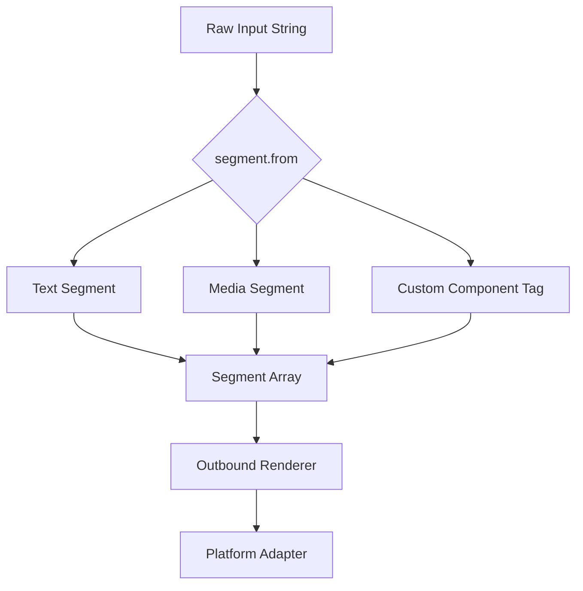
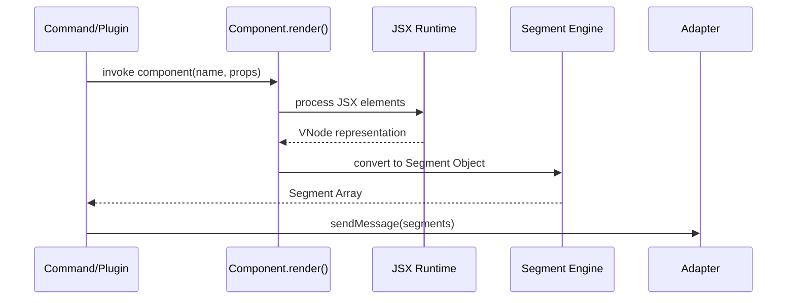

[英文原文](/en/wiki/cubic/messaging)

::: warning 第三方生成的参考快照
[Cubic 原页面](https://www.cubic.dev/wikis/zhinjs/zhin?page=page-messaging) · 抓取于 2026-09-23 · [源码提交](https://github.com/zhinjs/zhin/commit/368db14caa4aa91311fb090f07bd792fe4b22fe7)。本页由英文快照机器辅助翻译，尚未逐页与当前代码核验；实际开发请以[维护中的 Zhin 文档](/getting-started/)和[知识库勘误](/wiki/)为准。
:::

::: danger 已确认勘误
下文示例使用来自 `zhin.js/core/runtime` 的 `raw`，用于包装出站内容。另一工具 `segment.raw` 用于生成预览字符串。Cubic 原文中的工具参数类型有误，本归档已更正。参见[中间件与组件](/authoring/middleware-components)。
:::

::: details 相关源文件

以下文件是 Cubic 生成本页时引用的上下文：

- [packages/im/core/src/built/segment-contract/index.ts](https://github.com/zhinjs/zhin/blob/368db14caa4aa91311fb090f07bd792fe4b22fe7/packages/im/core/src/built/segment-contract/index.ts)
- [packages/im/core/src/component.ts](https://github.com/zhinjs/zhin/blob/368db14caa4aa91311fb090f07bd792fe4b22fe7/packages/im/core/src/component.ts)
- [packages/im/core/src/jsx.ts](https://github.com/zhinjs/zhin/blob/368db14caa4aa91311fb090f07bd792fe4b22fe7/packages/im/core/src/jsx.ts)
- [packages/im/core/tests/utils.test.ts](https://github.com/zhinjs/zhin/blob/368db14caa4aa91311fb090f07bd792fe4b22fe7/packages/im/core/tests/utils.test.ts)
- [packages/toolkit/create-zhin/src/workspace.ts](https://github.com/zhinjs/zhin/blob/368db14caa4aa91311fb090f07bd792fe4b22fe7/packages/toolkit/create-zhin/src/workspace.ts)
- [CLAUDE.md](https://github.com/zhinjs/zhin/blob/368db14caa4aa91311fb090f07bd792fe4b22fe7/CLAUDE.md)
:::

# 通用消息段与组件

通用消息段与组件提供了一种统一的抽象机制，用于在不同聊天平台中处理丰富媒体和交互元素。Zhin.js 框架将消息内容规范化为基于消息段的结构，确保同一代码库能够在 QQ、Discord、Telegram 等多个平台适配器上，一致地渲染文本、图片以及复杂的 UI 组件。

该系统依赖于自定义的 JSX 实现和声明式组件 API。开发者通过 `defineComponent` 构建可复用的 UI 模块，框架在消息发送流程中将这些组件转换为平台特定的消息段或原始文本。

## 消息段

消息段是 Zhin.js 消息中的基本构建单元。每个消息段代表一种特定类型的内容，例如纯文本、表情符号（脸）或媒体文件。`segment` 工具负责管理这些对象的全生命周期，包括转义、解析和序列化。

### 消息段类型与工具
框架提供了若干核心方法来管理消息段：
*   **escape/unescape**：转换 HTML 实体，以避免聊天客户端渲染出错。
*   **text**：创建一个简单的文本消息段。
*   **face**：使用 ID 创建表情或平台特定的表情消息段。
*   **from**：将模板字符串（如 `<image url="..." />`）解析为消息段数组。
*   **raw**：将消息段对象转换回序列化的字符串格式（如 `Hello{face}(😊)`）。
*   **toString**：将消息段序列化为兼容模板的字符串。

来源：[packages/im/core/tests/utils.test.ts:58-123](https://github.com/zhinjs/zhin/blob/368db14caa4aa91311fb090f07bd792fe4b22fe7/packages/im/core/tests/utils.test.ts#L58-L123), [packages/im/core/src/built/segment-contract/index.ts](https://github.com/zhinjs/zhin/blob/368db14caa4aa91311fb090f07bd792fe4b22fe7/packages/im/core/src/built/segment-contract/index.ts)

### 消息段处理流程


该图展示了原始输入字符串如何被解析为标准化的段数组，然后再发送到平台特定的适配器。
来源：[packages/im/core/tests/utils.test.ts:79-100](https://github.com/zhinjs/zhin/blob/368db14caa4aa91311fb090f07bd792fe4b22fe7/packages/im/core/tests/utils.test.ts#L79-L100)

## 组件架构

Zhin.js 中的组件允许开发者将逻辑和渲染封装为可复用的单元。它们特别适用于生成复杂的视觉反馈，例如状态卡片或交互式菜单。

### defineComponent API
开发者使用 `defineComponent` 函数来定义组件。每个组件接收一个 `props` 对象，并返回一个渲染片段，或多个片段的组合。

```typescript
import { raw } from 'zhin.js/core/runtime';

export default defineComponent<StatusCardProps>({
  render({ title, lines }) {
    // Component logic here
    return raw({
      type: 'html',
      data: {
        html: wrapCardHtml(body, DEFAULT_CARD_THEME.canvas),
        width: 540,
      },
    });
  },
});
```
来源：[packages/toolkit/create-zhin/src/workspace.ts:600-630](https://github.com/zhinjs/zhin/blob/368db14caa4aa91311fb090f07bd792fe4b22fe7/packages/toolkit/create-zhin/src/workspace.ts#L600-L630), [packages/im/core/src/component.ts](https://github.com/zhinjs/zhin/blob/368db14caa4aa91311fb090f07bd792fe4b22fe7/packages/im/core/src/component.ts)
### 关键组件特性
| 特性 | 描述 |
| :--- | :--- |
| **属性注入** | 组件接受类型化的属性以实现动态渲染。 |
| **JSX 支持** | 插件使用 `jsx: "react-jsx"` 和 `jsxImportSource: "zhin.js"` 用于消息模板。 |
| **自动发现** | 将组件放置在 `components/` 目录中的组件将由功能提供者自动发现。 |
| **分段集成** | 组件可以返回 `raw` HTML 分段，这些分段将由 `html-renderer` 转换为图片。 |
来源：[CLAUDE.md:120-130](https://github.com/zhinjs/zhin/blob/368db14caa4aa91311fb090f07bd792fe4b22fe7/CLAUDE.md#L120-L130), [packages/toolkit/create-zhin/src/workspace.ts:515-525](https://github.com/zhinjs/zhin/blob/368db14caa4aa91311fb090f07bd792fe4b22fe7/packages/toolkit/create-zhin/src/workspace.ts#L515-L525), [packages/toolkit/create-zhin/template/skills/plugin-develop/SKILL.md:40-55](https://github.com/zhinjs/zhin/blob/368db14caa4aa91311fb090f07bd792fe4b22fe7/packages/toolkit/create-zhin/template/skills/plugin-develop/SKILL.md#L40-L55)

## JSX 和渲染

Zhin.js 实现了一个自定义的 JSX 运行时，以促进消息段的创建。这避免了对基于浏览器的 UI 库的依赖，使 IM 核心保持轻量级。

### JSX 配置
为了让编译器识别 Zhin 特有的 JSX，`tsconfig.json` 必须配置 `jsxImportSource` 指向 `zhin.js`。Satori 卡组件特别使用 `@zhin.js/satori` 的导入源，用于专门的卡片渲染。

```json
{
  "compilerOptions": {
    "jsx": "react-jsx",
    "jsxImportSource": "zhin.js"
  }
}
```
来源：[packages/toolkit/create-zhin/src/workspace.ts:510-520](https://github.com/zhinjs/zhin/blob/368db14caa4aa91311fb090f07bd792fe4b22fe7/packages/toolkit/create-zhin/src/workspace.ts#L510-L520), [CLAUDE.md:122-125](https://github.com/zhinjs/zhin/blob/368db14caa4aa91311fb090f07bd792fe4b22fe7/CLAUDE.md#L122-L125)

### 渲染顺序


该流程展示了从命令调用组件到适配器最终段传输的全过程。
来源：[packages/toolkit/create-zhin/src/workspace.ts:575-595](https://github.com/zhinjs/zhin/blob/368db14caa4aa91311fb090f07bd792fe4b22fe7/packages/toolkit/create-zhin/src/workspace.ts#L575-L595), [packages/im/core/src/jsx.ts](https://github.com/zhinjs/zhin/blob/368db14caa4aa91311fb090f07bd792fe4b22fe7/packages/im/core/src/jsx.ts)

## 分段工具参考

| 方法 | 参数 | 返回值 | 描述 |
| :--- | :--- | :--- | :--- |
| `segment.text(content)` | `string` | `Segment` | 创建一个文本分段。 |
| `segment.face(id, text?)` | `string, string?` | `Segment` | 创建一个表情/emoji 分段。 |
| `segment.escape(text)` | `string` | `string` | 转义特殊字符，如 `<` 和 `&`。 |
| `segment.from(content)` | `SendContent` | `SendContent` | 将标签解析为分段结构。 |
| `segment.raw(content)` | `SendContent` | `string` | 将分段序列化为存储或日志格式。 |

来源：[packages/im/core/tests/utils.test.ts:58-123](https://github.com/zhinjs/zhin/blob/368db14caa4aa91311fb090f07bd792fe4b22fe7/packages/im/core/tests/utils.test.ts#L58-L123)

通用消息段与组件确保开发者能够专注于内容逻辑，而无需关心平台特定的格式化问题。通过将消息层抽象为消息段，并提供与 JSX 兼容的组件系统，Zhin.js 在多样化的聊天环境中保持了高度的互操作性，同时支持丰富、媒体密集的交互体验。
