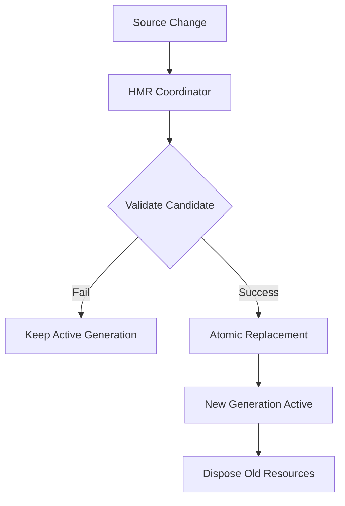
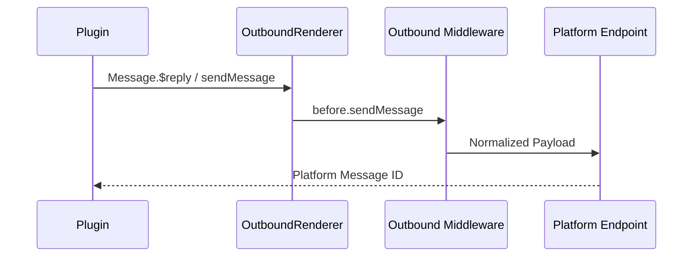

[英文原文](/en/wiki/cubic/plugin-runtime)

::: warning 第三方生成的参考快照
[Cubic 原页面](https://www.cubic.dev/wikis/zhinjs/zhin?page=page-plugin-runtime) · 抓取于 2026-09-23 · [源码提交](https://github.com/zhinjs/zhin/commit/368db14caa4aa91311fb090f07bd792fe4b22fe7)。本页由英文快照机器辅助翻译，尚未逐页与当前代码核验；实际开发请以[维护中的 Zhin 文档](/getting-started/)和[资料存档勘误](/wiki/archive)为准。
:::

::: danger 已确认勘误
代码能力使用具名目录和固定的 `index.ts` 入口：`commands/**/index.ts`，以及单层的 `handlers/<name>/index.ts`。快照中按文件直接放置的示例不会被发现。参见[约定目录](/authoring/conventions)。
:::

::: details 相关源文件

以下文件是 Cubic 生成本页时引用的上下文：

- [packages/toolkit/create-zhin/template/skills/plugin-develop/SKILL.md](https://github.com/zhinjs/zhin/blob/368db14caa4aa91311fb090f07bd792fe4b22fe7/packages/toolkit/create-zhin/template/skills/plugin-develop/SKILL.md)
- [CLAUDE.md](https://github.com/zhinjs/zhin/blob/368db14caa4aa91311fb090f07bd792fe4b22fe7/CLAUDE.md)
- [AGENTS.md](https://github.com/zhinjs/zhin/blob/368db14caa4aa91311fb090f07bd792fe4b22fe7/AGENTS.md)
- [basic/cli/src/commands/new.ts](https://github.com/zhinjs/zhin/blob/368db14caa4aa91311fb090f07bd792fe4b22fe7/basic/cli/src/commands/new.ts)
- [packages/toolkit/create-zhin/src/workspace.ts](https://github.com/zhinjs/zhin/blob/368db14caa4aa91311fb090f07bd792fe4b22fe7/packages/toolkit/create-zhin/src/workspace.ts)
- [packages/toolkit/create-zhin/template/skills/plugin-quality/SKILL.md](https://github.com/zhinjs/zhin/blob/368db14caa4aa91311fb090f07bd792fe4b22fe7/packages/toolkit/create-zhin/template/skills/plugin-quality/SKILL.md)
- [README.md](https://github.com/zhinjs/zhin/blob/368db14caa4aa91311fb090f07bd792fe4b22fe7/README.md)
- [packages/im/runtime/tests/console-feature-hmr.test.ts](https://github.com/zhinjs/zhin/blob/368db14caa4aa91311fb090f07bd792fe4b22fe7/packages/im/runtime/tests/console-feature-hmr.test.ts)
:::

# 插件 Runtime 与约定

Zhin.js 插件运行时是扩展框架的执行环境和结构标准。它采用“约定优于配置”的方式，通过特定的目录结构来发现能力，而非通过显式注册。应用的唯一入口路径为 `zhin runtime start`，该路径根据这些约定自动组装 IM 核心、代理和控制台主机。

来源：[CLAUDE.md:77-80](https://github.com/zhinjs/zhin/blob/368db14caa4aa91311fb090f07bd792fe4b22fe7/CLAUDE.md#L77-L80), [AGENTS.md:61-66](https://github.com/zhinjs/zhin/blob/368db14caa4aa91311fb090f07bd792fe4b22fe7/AGENTS.md#L61-L66)

## 核心架构

运行时基于“生成”机制实现热模块替换（HMR）。一个“生成”代表插件树的稳定快照；当代码发生变更时，运行时会准备一个新的生成版本并将其写入路径外，以原子方式发布。如果候选生成版本验证失败，当前活跃的生成将继续处理流量。


HMR 过程会原子性地替换页面和布局等构件，除非必要，否则不会重启整个系统。
来源：[README.md:126-130](https://github.com/zhinjs/zhin/blob/368db14caa4aa91311fb090f07bd792fe4b22fe7/README.md#L126-L130), [packages/im/runtime/tests/console-feature-hmr.test.ts:31-60](https://github.com/zhinjs/zhin/blob/368db14caa4aa91311fb090f07bd792fe4b22fe7/packages/im/runtime/tests/console-feature-hmr.test.ts#L31-L60)

## 插件清单和入口

每个插件必须是一个有效的 NPM 包，包含位于其 `package.json` 目录下的 `zhin` 清单文件。`plugin.ts` 文件作为组装入口，必须默认导出一个 `definePlugin()` 定义。

### 清单配置（`package.json`）

| 字段 | 描述 | 是否必需 |
|------|------|----------|
| `zhin.protocol` | 插件协议版本（目前为 1） | 必填 |
| `zhin.type` | 包的类型（`plugin` 或 `feature`） | 必填 |
| `zhin.entry` | 入口文件路径（通常为 `./plugin.ts`） | 必填 |
| `zhin.features` | 插件所需的功能依赖项列表 | 可选 |
| `zhin.plugins` | 子插件或适配器实例的列表 | 可选 |

来源：[basic/cli/src/commands/new.ts:246-254](https://github.com/zhinjs/zhin/blob/368db14caa4aa91311fb090f07bd792fe4b22fe7/basic/cli/src/commands/new.ts#L246-L254), [packages/toolkit/create-zhin/src/workspace.ts:109-122](https://github.com/zhinjs/zhin/blob/368db14caa4aa91311fb090f07bd792fe4b22fe7/packages/toolkit/create-zhin/src/workspace.ts#L109-L122)

### 入口点定义 (`plugin.ts`)

`definePlugin` 函数初始化插件作用域。它提供了对 `context` 的访问，其中包含配置、资源（依赖注入）以及生命周期管理器。

```typescript
import { definePlugin } from 'zhin.js';

export default definePlugin({
  name: 'my-plugin',
  metadata: { displayName: 'My Plugin' },
  setup(context) {
    // Provide resources
    context.resources.provide(myToken, value);
    // Register cleanup
    context.lifecycle.add(() => cleanup());
  },
});
```
来源：[CLAUDE.md:82-93](https://github.com/zhinjs/zhin/blob/368db14caa4aa91311fb090f07bd792fe4b22fe7/CLAUDE.md#L82-L93), [basic/cli/src/commands/new.ts:333-352](https://github.com/zhinjs/zhin/blob/368db14caa4aa91311fb090f07bd792fe4b22fe7/basic/cli/src/commands/new.ts#L333-L352)

## 目录约定

如果插件包中的文件位于正确的目录下，将自动发现其能力。这些目录中的每个文件应定义一个能力，并使用默认导出。

| 目录 | 编程 API | 描述 |
|------|----------|------|
| `commands/` | `defineCommand()` | 聊天命令。路径定义路由（例如，`commands/greet.ts` -> `/greet`）。 |
| `middlewares/` | `defineMiddleware()` | 请求/消息处理流水线组件。 |
| `tools/` | `defineAgentTool()` | Agent 使用的 AI 能力。 |
| `components/` | `defineComponent()` | UI 或消息渲染组件（例如，Satori 卡片）。 |
| `pages/` | `definePage()` | 远程控制台页面和布局（`nav/index.tsx`、`footer/index.tsx`）。 |
| `handlers/` | `defineHandler()` | 事件处理器（例如，`handlers/message/receive.ts`）。 |
| `skills/` | Markdown（`SKILL.md`） | AI Agent 工作流和触发器描述。 |

来源：[CLAUDE.md:95-108](https://github.com/zhinjs/zhin/blob/368db14caa4aa91311fb090f07bd792fe4b22fe7/CLAUDE.md#L95-L108), [packages/toolkit/create-zhin/template/skills/plugin-develop/SKILL.md:16-25](https://github.com/zhinjs/zhin/blob/368db14caa4aa91311fb090f07bd792fe4b22fe7/packages/toolkit/create-zhin/template/skills/plugin-develop/SKILL.md#L16-L25)

### 命令路由模式

命令目录支持 Next.js 风格的动态段用于参数解析：
- `commands/[name]/index.ts`：定义一个必需的参数 `name`。
- `commands/[[name]]/index.ts`：定义一个可选的参数 `name`。
- `commands/[...name]/index.ts`：通配参数（返回一个数组）。

来源：[packages/toolkit/create-zhin/template/skills/plugin-develop/SKILL.md:33-36](https://github.com/zhinjs/zhin/blob/368db14caa4aa91311fb090f07bd792fe4b22fe7/packages/toolkit/create-zhin/template/skills/plugin-develop/SKILL.md#L33-L36), [basic/cli/src/commands/new.ts:400-415](https://github.com/zhinjs/zhin/blob/368db14caa4aa91311fb090f07bd792fe4b22fe7/basic/cli/src/commands/new.ts#L400-L415)

## 依赖与发送链治理

运行时强制实施严格边界，以确保稳定性和安全性。

### 依赖层级
底层不得导入上层的内容。层级关系如下：
`basic` → `kernel` → `ai` → `core` → `agent` → `zhin`。
`basic/cli` 包是唯一例外，作为组合根包。
来源：[CLAUDE.md:46-56](https://github.com/zhinjs/zhin/blob/368db14caa4aa91311fb090f07bd792fe4b22fe7/CLAUDE.md#L46-L56), [AGENTS.md:78-83](https://github.com/zhinjs/zhin/blob/368db14caa4aa91311fb090f07bd792fe4b22fe7/AGENTS.md#L78-L83)

### 外发发送链路
插件不得绕过标准发送链路。所有消息必须通过 `Message.$reply` 或 `Adapter.sendMessage` 传递。禁止直接调用平台机器人或 `bot.$sendMessage`，此类操作将被 Harness 检查机制识别并拦截。


来源：[CLAUDE.md:67-70](https://github.com/zhinjs/zhin/blob/368db14caa4aa91311fb090f07bd792fe4b22fe7/CLAUDE.md#L67-L70), [AGENTS.md:143-145](https://github.com/zhinjs/zhin/blob/368db14caa4aa91311fb090f07bd792fe4b22fe7/AGENTS.md#L143-L145)

## 开发规范

1. **仅支持 ESM**：运行时要求 `"type": "module"` 且目标 Node.js 版本 ≥20.19.0。
2. **导入扩展**：所有本地 TypeScript 导入必须包含 `.js` 扩展（例如，`import { foo } from './bar.js'`）。
3. **禁用旧版 API**：如 `usePlugin()`、`getPlugin()` 和 `bootstrapNode` 等 API 已被移除，使用这些 API 将导致 `PluginScopeAssembler` 抛出错误。
4. **资源管理**：共享资源（数据库、连接等）必须通过 `context.resources.provide` 和 `context.resources.use` 进行管理，而非使用模块级别的单例。

来源：[CLAUDE.md:27-29](https://github.com/zhinjs/zhin/blob/368db14caa4aa91311fb090f07bd792fe4b22fe7/CLAUDE.md#L27-L29), [CLAUDE.md:110-113](https://github.com/zhinjs/zhin/blob/368db14caa4aa91311fb090f07bd792fe4b22fe7/CLAUDE.md#L110-L113), [packages/toolkit/create-zhin/template/skills/plugin-quality/SKILL.md:52-54](https://github.com/zhinjs/zhin/blob/368db14caa4aa91311fb090f07bd792fe4b22fe7/packages/toolkit/create-zhin/template/skills/plugin-quality/SKILL.md#L52-L54)
