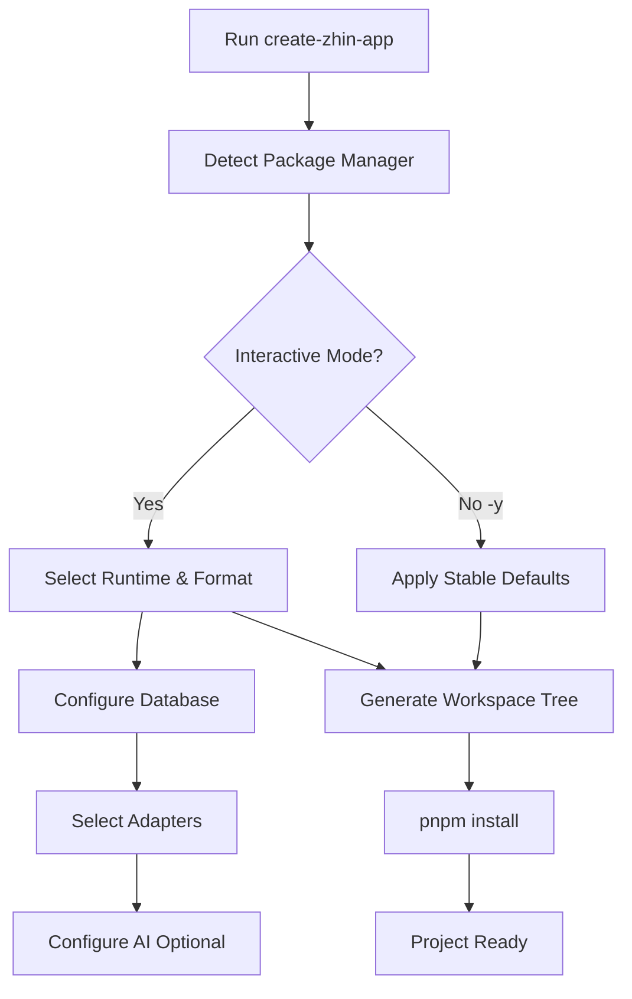
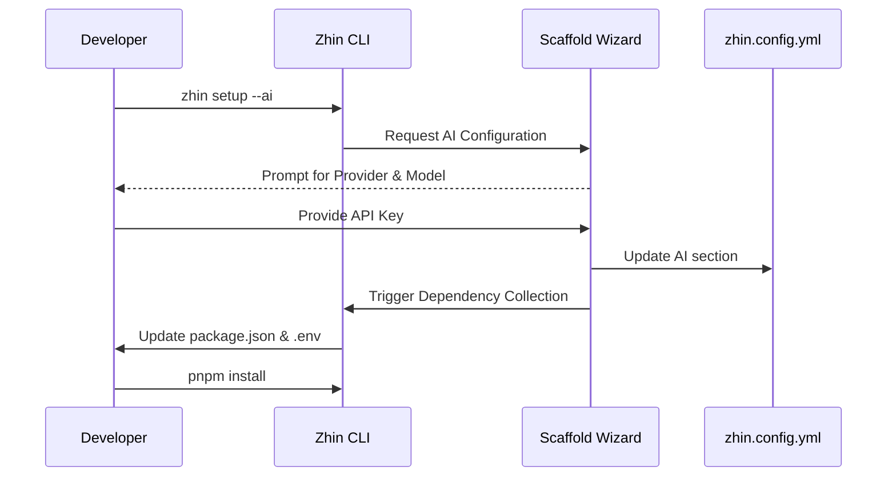

[英文原文](/en/wiki/cubic/quickstart)

::: warning 第三方生成的参考快照
[Cubic 原页面](https://www.cubic.dev/wikis/zhinjs/zhin?page=page-quickstart) · 抓取于 2026-09-23 · [源码提交](https://github.com/zhinjs/zhin/commit/368db14caa4aa91311fb090f07bd792fe4b22fe7)。本页由英文快照机器辅助翻译，尚未逐页与当前代码核验；实际开发请以[维护中的 Zhin 文档](/getting-started/)和[知识库勘误](/wiki/)为准。
:::

::: danger 已确认勘误
通过 `create-zhin-app` 创建的新项目要求 Node.js `>=22.12.0`，当前配置的 HTTP 端口为 `8068`。`zhin.js` 库更宽泛的 engine 范围不代表生成的 TypeScript 项目要求。参见[快速开始](/getting-started/)。
:::

::: details 相关源文件

以下文件是 Cubic 生成本页时引用的上下文：

- [README.md](https://github.com/zhinjs/zhin/blob/368db14caa4aa91311fb090f07bd792fe4b22fe7/README.md)
- [packages/toolkit/create-zhin/README.md](https://github.com/zhinjs/zhin/blob/368db14caa4aa91311fb090f07bd792fe4b22fe7/packages/toolkit/create-zhin/README.md)
- [packages/toolkit/scaffold-wizard/README.md](https://github.com/zhinjs/zhin/blob/368db14caa4aa91311fb090f07bd792fe4b22fe7/packages/toolkit/scaffold-wizard/README.md)
- [packages/toolkit/create-zhin/src/workspace.ts](https://github.com/zhinjs/zhin/blob/368db14caa4aa91311fb090f07bd792fe4b22fe7/packages/toolkit/create-zhin/src/workspace.ts)
- [basic/cli/src/commands/setup.ts](https://github.com/zhinjs/zhin/blob/368db14caa4aa91311fb090f07bd792fe4b22fe7/basic/cli/src/commands/setup.ts)
- [basic/cli/src/commands/new.ts](https://github.com/zhinjs/zhin/blob/368db14caa4aa91311fb090f07bd792fe4b22fe7/basic/cli/src/commands/new.ts)
- [AGENTS.md](https://github.com/zhinjs/zhin/blob/368db14caa4aa91311fb090f07bd792fe4b22fe7/AGENTS.md)
:::

# 快速开始与安装

Zhin.js 为构建多通道聊天平台机器人提供了简洁的初始化流程。该框架采用分层安装模型，初始阶段提供一个小于10MB的轻量级消息处理核心。开发者可通过交互式配置向导扩展功能，该向导负责管理数据库、平台适配器以及AI Agent。

来源：[README.md:20-30](https://github.com/zhinjs/zhin/blob/368db14caa4aa91311fb090f07bd792fe4b22fe7/README.md#L20-L30), [README.md:120-130](https://github.com/zhinjs/zhin/blob/368db14caa4aa91311fb090f07bd792fe4b22fe7/README.md#L120-L130)

## 项目初始化

启动新项目的首选方法是使用 `create-zhin-app` 模板。该工具会生成一个 pnpm 项目空间结构，并安装所需的运行时环境。

### 标准安装（“黄金路径”）
要安装包含沙箱适配器、主机（Host）和远程控制台访问功能的标准版本，请使用以下命令：

```bash
npm create zhin-app my-bot -y
cd my-bot
pnpm dev
```
来源：[README.md:50-55](https://github.com/zhinjs/zhin/blob/368db14caa4aa91311fb090f07bd792fe4b22fe7/README.md#L50-L55), [packages/toolkit/create-zhin/README.md:110-120](https://github.com/zhinjs/zhin/blob/368db14caa4aa91311fb090f07bd792fe4b22fe7/packages/toolkit/create-zhin/README.md#L110-L120)

### 设置流程
设置过程包括项目骨架搭建，随后进行交互式配置。


该图展示了从项目启动到工作区生成的过渡过程。
来源：[packages/toolkit/create-zhin/README.md:40-60](https://github.com/zhinjs/zhin/blob/368db14caa4aa91311fb090f07bd792fe4b22fe7/packages/toolkit/create-zhin/README.md#L40-L60), [packages/toolkit/create-zhin/src/workspace.ts](https://github.com/zhinjs/zhin/blob/368db14caa4aa91311fb090f07bd792fe4b22fe7/packages/toolkit/create-zhin/src/workspace.ts)

## 安装层级

Zhin.js 将功能划分为不同层级，以保持较小的生产环境占用。

| 层级 | 所需包 | 生产环境大小 | 功能特性 |
| :--- | :--- | :--- | :--- |
| **IM 核心** | `zhin.js`, `@zhin.js/adapter-sandbox` | <10MB | 插件运行时、命令、沙箱环境 |
| **AI Agent** | `+ @zhin.js/agent`, `zod`, `ai` | +15MB | ZhinAgent、会话管理、工具编排 |
| **Provider** | `+ @ai-sdk/openai`（或其他） | 按供应商不同 | LLM 通信能力 |
| **丰富媒体** | `+ @zhin.js/html-renderer` | +~3MB | HTML/Markdown 转 PNG 渲染功能 |

来源：[README.md:125-145](https://github.com/zhinjs/zhin/blob/368db14caa4aa91311fb090f07bd792fe4b22fe7/README.md#L125-L145), [AGENTS.md:75-85](https://github.com/zhinjs/zhin/blob/368db14caa4aa91311fb090f07bd792fe4b22fe7/AGENTS.md#L75-L85)

## 项目生成向导

`@zhin.js/scaffold-wizard` 作为一个共享库，既可用于项目创建，也可用于增量更新。它为系统组件的配置提供了统一的逻辑支持。

### 核心配置组件
*   **数据库：** 支持 SQLite（推荐用于零配置场景）、MySQL、PostgreSQL、MongoDB 和 Redis。
*   **适配器：** 包含 Sandbox、Telegram、Discord、GitHub、QQ 等。
*   **AI：** 管理 LLM 服务提供商、触发规则和安全设置。
*   **安全：** 自动生成 HTTP Token，并管理 `.env` 变量。

来源：[packages/toolkit/scaffold-wizard/README.md:20-40](https://github.com/zhinjs/zhin/blob/368db14caa4aa91311fb090f07bd792fe4b22fe7/packages/toolkit/scaffold-wizard/README.md#L20-L40), [packages/toolkit/create-zhin/README.md:85-100](https://github.com/zhinjs/zhin/blob/368db14caa4aa91311fb090f07bd792fe4b22fe7/packages/toolkit/create-zhin/README.md#L85-L100)

## CLI 设置与维护

项目创建完成后，开发者使用 Zhin CLI（`@zhin.js/cli`）来修改或诊断环境。

### 主要命令
| 命令 | 动作 |
| :--- | :--- |
| `zhin setup` | 启动交互式向导进行增量配置。 |
| `zhin new` | 在工作区中生成新的插件、服务或适配器。 |
| `zhin doctor` | 执行环境诊断，并识别缺失的依赖项。 |
| `zhin runtime start` | 使用插件运行时引擎启动机器人。 |

来源：[basic/cli/src/commands/setup.ts:180-200](https://github.com/zhinjs/zhin/blob/368db14caa4aa91311fb090f07bd792fe4b22fe7/basic/cli/src/commands/setup.ts#L180-L200), [basic/cli/src/commands/new.ts:40-50](https://github.com/zhinjs/zhin/blob/368db14caa4aa91311fb090f07bd792fe4b22fe7/basic/cli/src/commands/new.ts#L40-L50), [README.md:200-210](https://github.com/zhinjs/zhin/blob/368db14caa4aa91311fb090f07bd792fe4b22fe7/README.md#L200-L210)

### 递增设置序列


该流程展示了如何将 AI Agent 添加到现有的仅 IM 项目中。
来源：[basic/cli/src/commands/setup.ts:240-280](https://github.com/zhinjs/zhin/blob/368db14caa4aa91311fb090f07bd792fe4b22fe7/basic/cli/src/commands/setup.ts#L240-L280), [packages/toolkit/scaffold-wizard/README.md:45-55](https://github.com/zhinjs/zhin/blob/368db14caa4aa91311fb090f07bd792fe4b22fe7/packages/toolkit/scaffold-wizard/README.md#L45-L55)

## 生成的项目结构

执行 `create-zhin-app` 命令将生成一个标准化的 pnpm 项目工作区。

*   **`plugin.ts`**：根入口文件，使用 `definePlugin` 进行定义。
*   **`zhin.config.yml`**：HTTP、数据库和AI功能的主要配置文件。
*   **`commands/`**：用于定义消息命令的目录。
*    **`skills/`**：以 Markdown 格式存储的 `SKILL.md` 文件，用于定义AI Agent的工作流。
*   **`plugins/`**：本地工作区，用于开发自定义插件包。
*   **`.env`**：安全存储 `HTTP_TOKEN` 及数据库凭证的文件。

来源：[packages/toolkit/create-zhin/README.md:150-180](https://github.com/zhinjs/zhin/blob/368db14caa4aa91311fb090f07bd792fe4b22fe7/packages/toolkit/create-zhin/README.md#L150-L180), [packages/toolkit/create-zhin/src/workspace.ts:380-400](https://github.com/zhinjs/zhin/blob/368db14caa4aa91311fb090f07bd792fe4b22fe7/packages/toolkit/create-zhin/src/workspace.ts#L380-L400)

## 系统要求

正确的环境配置需要特定的运行条件。

*   **Node.js**：`>=22.12.0`（适用于使用 `create-zhin-app` 生成的项目）。
*   **包管理器**：强烈推荐使用 `pnpm 9+` 用于工作区管理。
*   **操作系统**：Windows 10+、macOS 10.15+ 或现代 Linux 发行版。

来源：[README.md:65-70](https://github.com/zhinjs/zhin/blob/368db14caa4aa91311fb090f07bd792fe4b22fe7/README.md#L65-L70), [packages/toolkit/create-zhin/README.md:310-315](https://github.com/zhinjs/zhin/blob/368db14caa4aa91311fb090f07bd792fe4b22fe7/packages/toolkit/create-zhin/README.md#L310-L315)

Zhin.js 强调一种“以行动为导向”的配置方式，当启用 AI 功能时，框架会自动生成如 `SOUL.md` 和 `TOOLS.md` 等功能启动文件。这些文件在项目创建之初便定义了Agent 的个性特征及工具使用规范。

来源：[basic/cli/src/commands/setup.ts:35-80](https://github.com/zhinjs/zhin/blob/368db14caa4aa91311fb090f07bd792fe4b22fe7/basic/cli/src/commands/setup.ts#L35-L80), [packages/toolkit/create-zhin/src/workspace.ts:115-125](https://github.com/zhinjs/zhin/blob/368db14caa4aa91311fb090f07bd792fe4b22fe7/packages/toolkit/create-zhin/src/workspace.ts#L115-L125)
