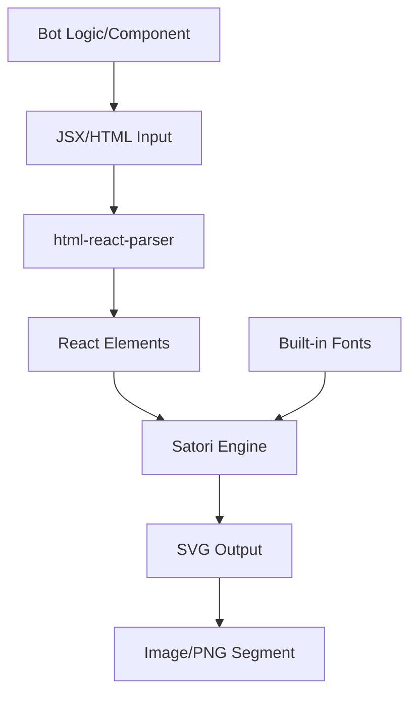
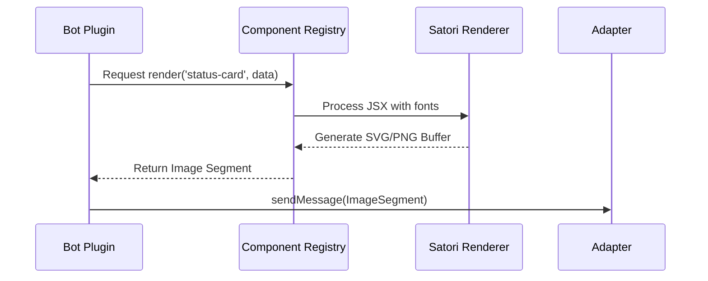

[英文原文](/en/wiki/cubic/satori)

::: warning 第三方生成的参考快照
[Cubic 原页面](https://www.cubic.dev/wikis/zhinjs/zhin?page=page-satori) · 抓取于 2026-09-23 · [源码提交](https://github.com/zhinjs/zhin/commit/368db14caa4aa91311fb090f07bd792fe4b22fe7)。本页由英文快照机器辅助翻译，尚未逐页与当前代码核验；实际开发请以[维护中的 Zhin 文档](/getting-started/)和[资料存档勘误](/wiki/archive)为准。
:::

::: danger 已确认勘误
下文的 `wrapCardHtml` 示例需要传入背景色；本归档已补上 `DEFAULT_CARD_THEME.canvas`。参见[维护中的卡片示例](/authoring/middleware-components)。
:::

::: details 相关源文件

以下文件是 Cubic 生成本页时引用的上下文：

- [packages/toolkit/satori/package.json](https://github.com/zhinjs/zhin/blob/368db14caa4aa91311fb090f07bd792fe4b22fe7/packages/toolkit/satori/package.json)
- [packages/toolkit/satori/fonts/FONTS.md](https://github.com/zhinjs/zhin/blob/368db14caa4aa91311fb090f07bd792fe4b22fe7/packages/toolkit/satori/fonts/FONTS.md)
- [packages/toolkit/satori/CHANGELOG.md](https://github.com/zhinjs/zhin/blob/368db14caa4aa91311fb090f07bd792fe4b22fe7/packages/toolkit/satori/CHANGELOG.md)
- [packages/toolkit/create-zhin/src/workspace.ts](https://github.com/zhinjs/zhin/blob/368db14caa4aa91311fb090f07bd792fe4b22fe7/packages/toolkit/create-zhin/src/workspace.ts)
- [README.md](https://github.com/zhinjs/zhin/blob/368db14caa4aa91311fb090f07bd792fe4b22fe7/README.md)
- [packages/toolkit/create-zhin/template/skills/plugin-init/SKILL.md](https://github.com/zhinjs/zhin/blob/368db14caa4aa91311fb090f07bd792fe4b22fe7/packages/toolkit/create-zhin/template/skills/plugin-init/SKILL.md)
:::

# Satori 富媒体

`@zhin.js/satori` 模块在 Zhin.js 生态系统中充当 HTML/CSS 内容与视觉图像段之间的桥梁。它利用官方 Satori 引擎将 JSX 或 HTML 字符串转换为 SVG 图形，使机器人能够向不同聊天平台传递复杂 UI 元素，如状态卡片和图表。来源：[packages/toolkit/satori/package.json](https://github.com/zhinjs/zhin/blob/368db14caa4aa91311fb090f07bd792fe4b22fe7/packages/toolkit/satori/package.json)，[README.md:163-165](https://github.com/zhinjs/zhin/blob/368db14caa4aa91311fb090f07bd792fe4b22fe7/README.md#L163-L165)

## 核心架构与渲染流程

Zhin.js 实现了一套结构化的处理流程，以支持丰富的多媒体内容。渲染过程将输入的 HTML 内容或程序生成的 HTML 内容转换为输出的图像段（通常为 PNG 格式）。若缺少丰富的多媒体模块，则系统将回退到纯文本表示。来源：[README.md:126-130](https://github.com/zhinjs/zhin/blob/368db14caa4aa91311fb090f07bd792fe4b22fe7/README.md#L126-L130)，[README.md:163-165](https://github.com/zhinjs/zhin/blob/368db14caa4aa91311fb090f07bd792fe4b22fe7/README.md#L163-L165)

### 渲染流程
1. **输入**：插件生成 `defineComponent` 结果或原始 HTML 段。
2. **解析**：`html-react-parser` 依赖组件将 HTML 字符串转换为 React 兼容的元素树。
3. **样式应用**：Satori 引擎将 CSS 规则应用于元素树。
4. **栅格化**：引擎使用内置字体渲染最终的 SVG 输出。
来源：[packages/toolkit/satori/package.json:28-32](https://github.com/zhinjs/zhin/blob/368db14caa4aa91311fb090f07bd792fe4b22fe7/packages/toolkit/satori/package.json#L28-L32), [packages/toolkit/satori/CHANGELOG.md:89-92](https://github.com/zhinjs/zhin/blob/368db14caa4aa91311fb090f07bd792fe4b22fe7/packages/toolkit/satori/CHANGELOG.md#L89-L92)



该图展示了由代码定义的 UI 组件如何转换为聊天平台可发送的图片消息段。

## 字体管理

`@zhin.js/satori` 包含一组预打包的字体，以确保在不同环境中渲染一致。这些字体覆盖拉丁文和中日韩（CJK）字符集。来源：[packages/toolkit/satori/fonts/FONTS.md:3-5](https://github.com/zhinjs/zhin/blob/368db14caa4aa91311fb090f07bd792fe4b22fe7/packages/toolkit/satori/fonts/FONTS.md#L3-L5)

### 包含的字体资源
| 字体名称 | 语言支持 | 许可协议 | 文件格式 |
| :--- | :--- | :--- | :--- |
| **Poppins** | 拉丁文（400、700粗细） | SIL OFL 1.1 | .ttf |
| **Noto Sans SC** | 简体中文 | SIL OFL 1.1 | .otf |
| **Noto Sans JP** | 日语 | SIL OFL 1.1 | .otf |
| **Noto Sans KR** | 韩语 | SIL OFL 1.1 | .otf |
| **Noto Color Emoji** | 表情符号（位图） | SIL OFL 1.1 | .ttf |

来源：[packages/toolkit/satori/fonts/FONTS.md:7-22](https://github.com/zhinjs/zhin/blob/368db14caa4aa91311fb090f07bd792fe4b22fe7/packages/toolkit/satori/fonts/FONTS.md#L7-L22)

### 字体工具函数
该模块提供了若干获取函数，用于获取 Satori 配置中的字体缓冲区和元数据：
*   `getDefaultFonts()`：返回 Poppins 常规（Regular）与粗体（Bold）两种字重的字体。
*   `getExtendedFonts()`：返回支持简体中文的 Poppins 字体。
*   `getCJKFonts()`：返回完整支持中文、日文和韩文的字体。
*   `getCompleteFonts()`：返回所有拉丁文和中日韩（CJK）字体。
来源：[packages/toolkit/satori/fonts/FONTS.md:61-75](https://github.com/zhinjs/zhin/blob/368db14caa4aa91311fb090f07bd792fe4b22fe7/packages/toolkit/satori/fonts/FONTS.md#L61-L75)

## 基于组件的渲染

开发者使用 `defineComponent` 创建丰富的媒体内容。该 API 允许通过类似 JSX 的语法或由 `@zhin.js/satori` 提供的超文本辅助函数来定义结构化的用户界面。来源：[packages/toolkit/create-zhin/src/workspace.ts:585-590](https://github.com/zhinjs/zhin/blob/368db14caa4aa91311fb090f07bd792fe4b22fe7/packages/toolkit/create-zhin/src/workspace.ts#L585-L590)

### JSX 集成
要使用 JSX 进行渲染，开发者必须在组件文件顶部将 `jsxImportSource` 设置为 `@zhin.js/satori`。来源：[packages/toolkit/create-zhin/template/skills/plugin-init/SKILL.md:126-128](https://github.com/zhinjs/zhin/blob/368db14caa4aa91311fb090f07bd792fe4b22fe7/packages/toolkit/create-zhin/template/skills/plugin-init/SKILL.md#L126-L128)

### 示例组件结构
组件利用预定义的 UI 原语来构建卡片和布局。
```typescript
import { defineComponent } from 'zhin.js/component';
import { Card, CardHeader, Row, StatChip, h, wrapCardHtml, DEFAULT_CARD_THEME } from '@zhin.js/satori';

export default defineComponent({
  render({ title, value }) {
    const body = h(Card, {
      children: [
        h(CardHeader, { title }),
        h(Row, { children: [h(StatChip, { label: 'Status', value })] })
      ],
    });
    return {
      type: 'html',
      data: { html: wrapCardHtml(body, DEFAULT_CARD_THEME.canvas), width: 540 }
    };
  },
});
```
来源：[packages/toolkit/create-zhin/src/workspace.ts:585-618](https://github.com/zhinjs/zhin/blob/368db14caa4aa91311fb090f07bd792fe4b22fe7/packages/toolkit/create-zhin/src/workspace.ts#L585-L618)

## 与 Zhin.js 的集成

丰富的媒体功能归属于“丰富媒体”安装层级。系统需要 `@zhin.js/html-renderer`（该组件依赖于 `@zhin.js/satori`）以支持完整的外部转换功能。来源：[README.md:163-165](https://github.com/zhinjs/zhin/blob/368db14caa4aa91311fb090f07bd792fe4b22fe7/README.md#L163-L165)

### 依赖关系图
| 层级 | 包名 | 用途 |
| :--- | :--- | :--- |
| **渲染** | `@zhin.js/satori` | HTML转SVG转换及字体打包。 |
| **集成** | `@zhin.js/html-renderer` | 处理 `html` 段的外部流水线功能。 |
| **标准** | `satori` | 官方渲染引擎。 |
| **解析** | `html-react-parser` | 字符串转 React 元素的转换。 |

来源：[packages/toolkit/satori/package.json:28-32](https://github.com/zhinjs/zhin/blob/368db14caa4aa91311fb090f07bd792fe4b22fe7/packages/toolkit/satori/package.json#L28-L32), [README.md:163-165](https://github.com/zhinjs/zhin/blob/368db14caa4aa91311fb090f07bd792fe4b22fe7/README.md#L163-L165)


序列图展示了 bot 插件如何请求组件渲染，而 Satori 会将该渲染过程转换为可传输的图像。来源：[packages/toolkit/create-zhin/src/workspace.ts:566-575](https://github.com/zhinjs/zhin/blob/368db14caa4aa91311fb090f07bd792fe4b22fe7/packages/toolkit/create-zhin/src/workspace.ts#L566-L575)，[README.md:126-130](https://github.com/zhinjs/zhin/blob/368db14caa4aa91311fb090f07bd792fe4b22fe7/README.md#L126-L130)

## 结论
Satori 的集成使 Zhin.js 机器人能够绕过纯文本聊天平台的限制，通过从代码定义的组件生成高质量图像。通过捆绑特定字体，并利用成熟的 HTML 到 SVG 转换技术，Zhin 确保了丰富媒体内容的一致性、可访问性，并为使用 TypeScript 和 JSX 的开发者提供了易于编辑和使用的开发体验。来源：[README.md:126-130](https://github.com/zhinjs/zhin/blob/368db14caa4aa91311fb090f07bd792fe4b22fe7/README.md#L126-L130)，[packages/toolkit/satori/fonts/FONTS.md:37-40](https://github.com/zhinjs/zhin/blob/368db14caa4aa91311fb090f07bd792fe4b22fe7/packages/toolkit/satori/fonts/FONTS.md#L37-L40)
